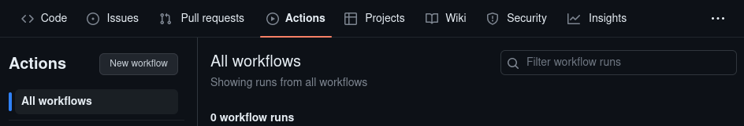
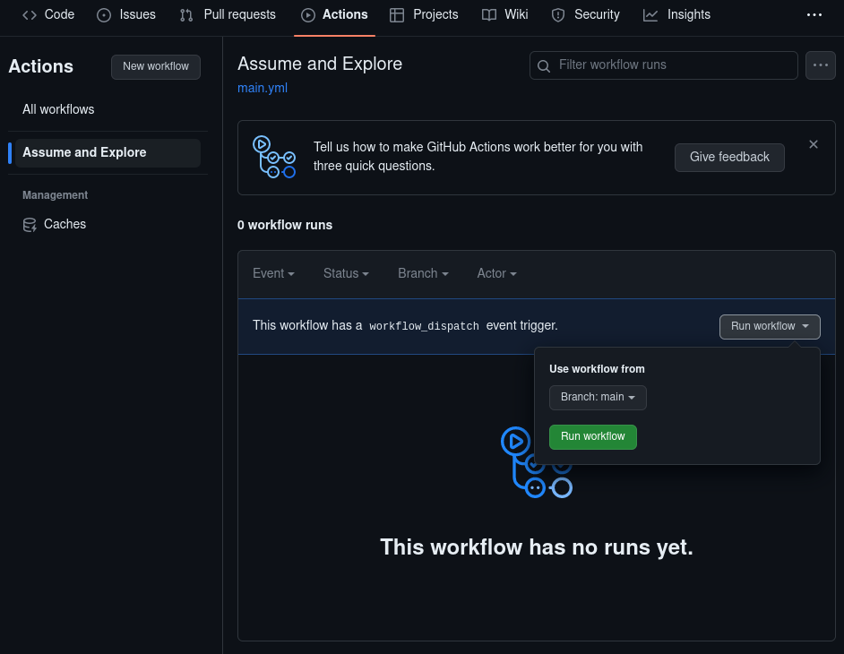
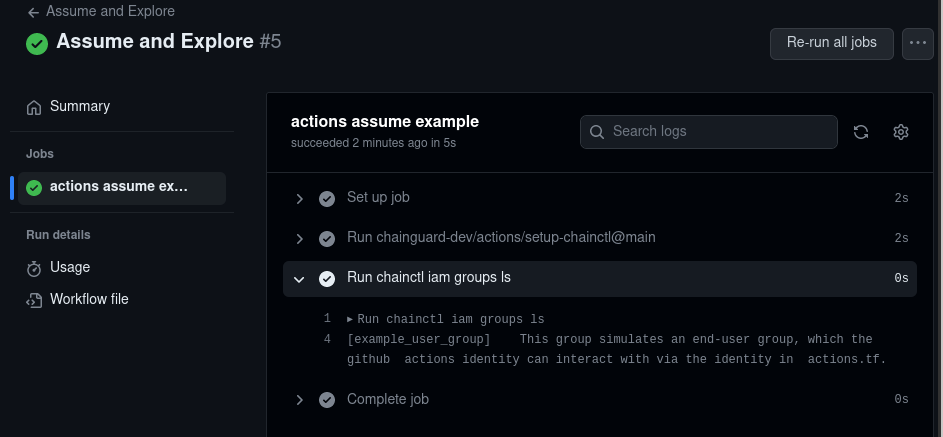

Chainguard's [*assumable identities*](/chainguard/administration/iam-organizations/assumable-ids/) are identities that can be assumed by external applications or workflows in order to perform certain tasks that would otherwise have to be done by a human.

This tutorial outlines how to create an identity, and then create a GitHub Actions workflow that will assume the identity to interact with Chainguard resources.


## Prerequisites

To complete this guide, you will need the following.

* One of:
  * `chainctl` — the Chainguard command line interface tool — installed on your local machine. Follow our guide on [How to Install `chainctl`](/chainguard/chainctl-usage/how-to-install-chainctl/) to set this up.
  * `terraform` installed on your local machine. Terraform is an open-source Infrastructure as Code tool which this guide will use to create various cloud resources. Follow [the official Terraform documentation](https://developer.hashicorp.com/terraform/tutorials/aws-get-started/install-cli) for instructions on installing the tool.
* A GitHub repository you can use for testing out GitHub identity federation. To complete this guide, you must have permissions to create GitHub Actions on this testing repo.

## Creating an Identity

### Chainctl

This command creates an identity that can be assumed by workflows that run from
the `main` branch of the `my-org/repo-name` repository. The identity is bound to
the `registry.pull` role.

```sh
chainctl iam identities create github my-identity-name \
    --github-repo=my-org/repo-name \
    --github-ref=refs/heads/main \
    --role registry.pull
```

This will return the identity's
[UIDP (unique identity path)](/chainguard/administration/cloudevents/events-reference/#uidp-identifiers).
Note this value down, as you'll need it to set up the GitHub Actions workflow.

If you need to retrieve the UIDP later on, you can always run the following
`chainctl` command to list the identity.

```sh
chainctl iam identities list --name=my-identity-name
```

### Terraform

Alternatively, you could create the identity with the [Chainguard Terraform
provider](https://registry.terraform.io/providers/chainguard-dev/chainguard/latest).

Substitute your Chainguard organization name, GitHub organization and GitHub
repository for `<org-name>`, `<github-org>` and `<github-repo>`, respectively.

```hcl
data "chainguard_group" "org" {
  name = "<org-name>"
}

resource "chainguard_identity" "my_identity_name" {
  parent_id   = data.chainguard_group.org.id
  name        = "my-identity-name"

  claim_match {
    issuer  = "https://token.actions.githubusercontent.com"
    subject = "repo:<github-org>/<github-repo>:ref:refs/heads/main"
  }
}

data "chainguard_role" "registry_pull" {
  name = "registry.pull"
}

resource "chainguard_rolebinding" "my_identity_name_registry_pull" {
  identity = chainguard_identity.my_identity_name.id
  group	= data.chainguard_group.org.id
  role 	= data.chainguard_role.registry_pull.items[0].id
}

output "my_identity_name_id" {
  value = chainguard_identity.my_identity_name.id
}
```

In this example the `chainguard_identity.my_identity_name` resource defines an
identity in your organization that can be assumed by a GitHub workflow that
matches the claims in the `claim_match` block.

The `chainguard_rolebinding.my_identity_name_registry_pull` resource binds the
`registry.pull` role to the identity.

The `my_identity_name_id` output provides the identity's [UIDP (unique identity
path)](/chainguard/administration/cloudevents/events-reference/#uidp-identifiers).
You'll need this value to set up the GitHub Actions workflow.

## Creating and Testing a GitHub Actions Workflow

To create a GitHub workflow, navigate to your repository in your browser and click the **Actions** tab. From there, find and click the **New workflow** button in the left-hand sidebar menu.



Next, you'll be prompted to choose a workflow template. Because this tutorial includes the exact code you'll need for this workflow, you can skip this step by clicking the **set up a workflow yourself ➔** link.

You can name the workflow file whatever you like, although the default — `main.yaml` — will work for the purposes of this guide.

In the **Edit** textbox, add the following. Be sure to replace `<identity-id>` with the UIDP of the identity you created in the previous step and `<org-name>` with the name of your Chainguard organization.

```
name: Assume and Explore

on:
  workflow_dispatch: {}

jobs:
  assume-and-explore:
    name: actions assume example

    permissions:
      id-token: write

    runs-on: ubuntu-latest
    steps:

    - uses: chainguard-dev/setup-chainctl@main
      with:
        identity: <identity-id>

    - run: |
        docker pull cgr.dev/<org-name>/example-image:latest
```

This workflow is named `actions assume example`. The `permissions` block grants `write` permissions to the workflow for the `id-token` scope. [Per the GitHub Actions documentation](https://docs.github.com/en/actions/deployment/security-hardening-your-deployments/about-security-hardening-with-openid-connect#adding-permissions-settings), you **must** grant this permission in order for the workflow to be able to fetch an OIDC token.

This workflow performs two actions:

* First, it assumes the identity.
* Second, the workflow runs the `docker pull` command to pull an image from the organization's Chainguard registry.

Commit the workflow to your repository, then navigate back to the **Actions** tab. The **Assume and Explore** workflow will appear in the left-hand sidebar menu. Click on this, and then click the **Run workflow** button on the resulting page to execute the workflow.



This indicates that the workflow can indeed assume the identity and interact with the organization.



If you'd like to experiment further with this identity and what the workflow can
do with it, there are a few parts of this setup that you can tweak. For
instance, if you'd like to give this identity different permissions you could
change the role that is bound to the identity.

You could also edit the workflow itself to change its behavior. For example, instead of pulling an image, you could have the workflow list available repos:

```
	- run: chainctl images repos list
```

Of course, the GitHub Actions workflow will only be able to perform certain actions on certain resources, depending on what kind of access you grant it.

## Learn more

For more information about how assumable identities work in Chainguard, check out our [conceptual overview of assumable identities](/chainguard/administration/iam-organizations/assumable-ids/). Additionally, the Terraform documentation includes a section on [recommended best practices](https://developer.hashicorp.com/terraform/cloud-docs/recommended-practices) which you can refer to if you'd like to build on the provided Terraform configuration for a production environment. Likewise, for more information on using GitHub Actions, we encourage you to check out the [official documentation on the subject](https://docs.github.com/en/actions).
