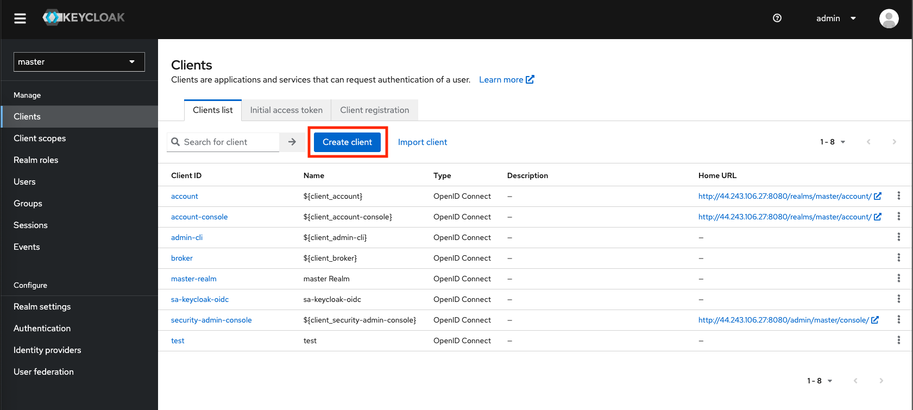
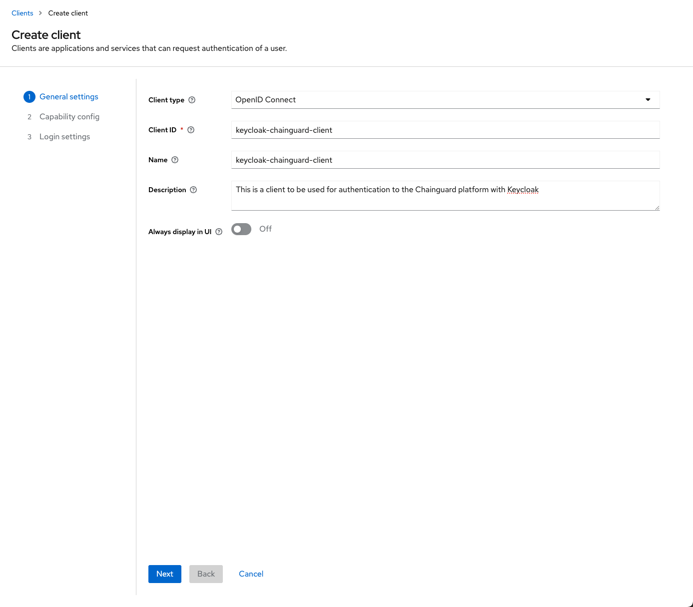
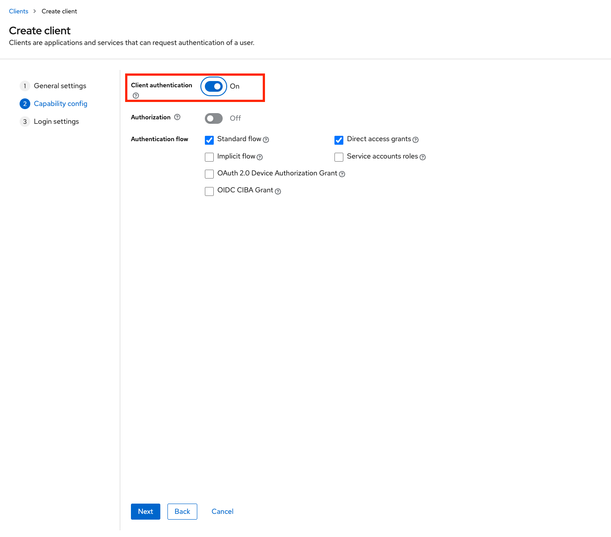
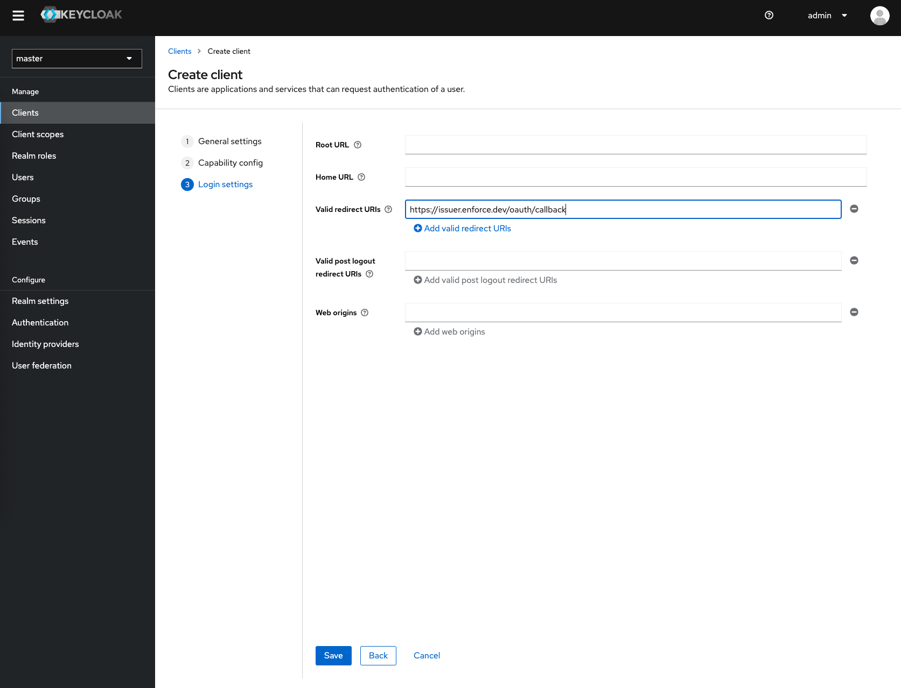
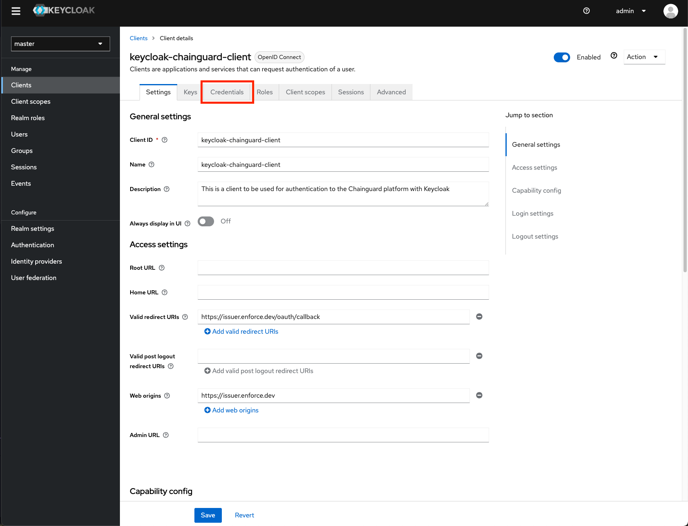
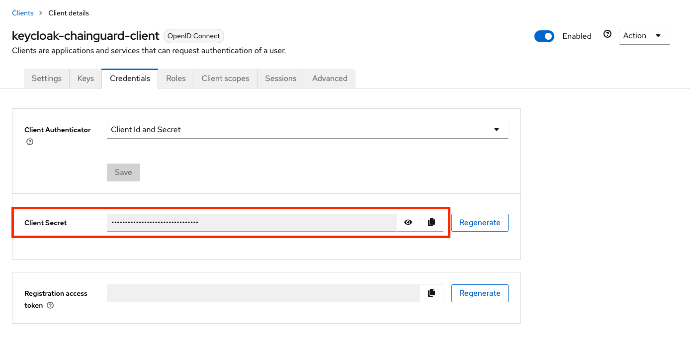

The Chainguard platform supports Single sign-on (SSO) authentication for users. By default, users can log in with GitHub, GitLab and Google, but SSO support allows users to bring their own identity provider for authentication.

This guide outlines how to create a Keycloak Client on your existing Keycloak instance and integrate it with Chainguard. After completing this guide, you'll be able to log in to Chainguard using Keycloak and will no longer be limited to the default SSO options.


## Prerequisites

To complete this guide, you will need the following.

* `chainctl` installed on your system. Follow our guide on [How To Install `chainctl`](/chainguard/administration/how-to-install-chainctl/) if you don't already have this installed.
* An existing Keycloak instance with admin access to the realm you will be using to authenticate.


## Create a Keycloak Client

To integrate Keycloak with the Chainguard platform, log in to your Keycloak admin interface. In the left-hand navigation menu, select **Create client**.

<center></center>
<br /> 

Set the **Client Type** to OIDC Connect, and set your **Client ID**. Save the **Client ID** for use later, and add a friendly **Name** and **Description** if desired. Take note of your **Client ID** value that you have set. You'll need this to configure the Chainguard platform to use this Keycloak Client. Click **Next**.

<center></center>
<br /> 

Toggle **Client Authentication** on and click **Next**.

<center></center>
<br /> 

Set the Chainguard platform redirect URI in the **Valid redirect URIs** field. Click **Save** to finalize the creation of your Keycloak Client.

<center></center>
<br />

Navigate to the **Credentials** tab of your newly created client.

<center></center>
<br />

Copy the **Client Secret** value. You'll need this to configure the Chainguard platform to use this Keycloak Client.

<center></center>
<br />

## Configuring Chainguard to use your Keycloak Client

Now that your Keycloak Client is ready, you can create the custom identity provider. 

First, log in to Chainguard with `chainctl`, using an OIDC provider like Google, GitHub, or GitLab to bootstrap your account.

```sh
chainctl auth login
```

Note that this bootstrap account can be used as a [backup account](/chainguard/administration/custom-idps/custom-idps/#backup-accounts) (that is, a backup account you can use to log in if you ever lose access to your primary account). However, if you prefer to remove this role-binding after configuring the custom IDP, you may also do so.

To configure Chainguard, make a note of the following details from your Keycloak Client:

* **Client ID**: This can be found on the **Settings** tab of the Keycloak Client.
* **Client Secret**: This can be found on the **Credentials** tab of the Keycloak Client.
* **Issuer**: Your **Issuer** url is defined by the following pattern `https://<KEYCLOAK_SERVER_ADDRESS>/realms/<REALM_NAME>`

You will also need the UIDP for the Chainguard organization under which you want to install the identity provider.  Your selection won’t affect how your users authenticate but will have implications on who has permission to modify the SSO configuration.

You can retrieve a list of all the Chainguard organizations you belong to — along with their UIDPs — with the following command.

```shell
chainctl iam organizations ls -o table
```
```output
                         	ID                         	|  	  NAME    |	DESCRIPTION
--------------------------------------------------------+-------------+---------------------
  59156e77fb23e1e5ebcb1bd9c5edae471dd85c43              | sample_org  |
  . . .                                                 | . . .       |
```

Note down the `ID` value for your chosen organization.

With this information in hand, create a new identity provider with the following commands.

```sh
export NAME=keycloak-idp
export CLIENT_ID=<your application/client id here>
export CLIENT_SECRET=<your client secret here>
export ORG=<your organization UIDP here>
export TENANT_ID=<your directory/tenant id here>
export ISSUER="https://<KEYCLOAK_SERVER_ADDRESS>/realms/<REALM_NAME>"
chainctl iam identity-provider create \
  --configuration-type=OIDC \
  --oidc-client-id=${CLIENT_ID} \
  --oidc-client-secret=${CLIENT_SECRET} \
  --oidc-issuer=${ISSUER} \
  --oidc-additional-scopes=email \
  --oidc-additional-scopes=profile \
  --parent=${ORG} \
  --default-role=viewer \
  --name=${NAME}
```

Note the `--default-role` option. This defines the default role granted to users registering with this identity provider. This example specifies the `viewer` role, but depending on your needs you might choose `editor` or `owner`. If you don't include this option, you'll be prompted to specify the role interactively. For more information, refer to the [IAM and Security section](/chainguard/administration/custom-idps/custom-idps/#iam-and-security) of our Introduction to Custom Identity Providers in Chainguard tutorial.

You can refer to our [Generic Integration Guide](/chainguard/administration/custom-idps/custom-idps/#generic-integration-guide) in our Introduction to Custom Identity Providers article for more information about the `chainctl iam identity-provider create` command and its required options.

To log in to the Chainguard Console with the new identity provider you just created, navigate to [console.chainguard.dev](https://console.chainguard.dev) and click **Use Your Identity Provider**. Next, click **Use Your Organization Name** and enter the name of the organization associated with the new identity provider. Finally, click the **Login with Provider** button. This will open up a new window with the Okta login flow, allowing you to complete the login process through there.

You can also use the custom identity provider to log in through `chainctl`. To do this, run the `chainctl auth login` command and add the `--identity-provider` option followed by the identity provider's ID value:

```sh
chainctl auth login --identity-provider <IDP-ID>
```

The ID value appears in the `ID` column of the table returned by the `chainctl iam identity-provider create` command you ran previously. You can also retrieve this table at any time by running `chainctl iam identity-provider ls -o table` when logged in.
