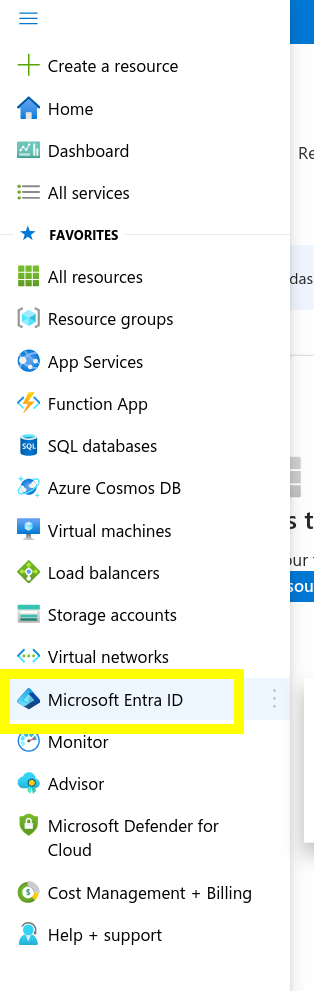
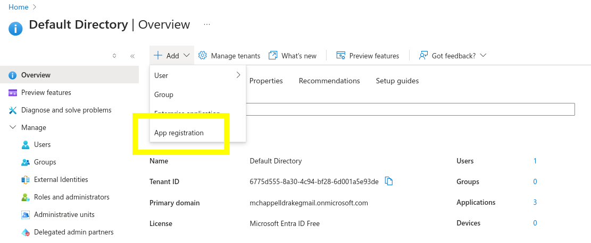
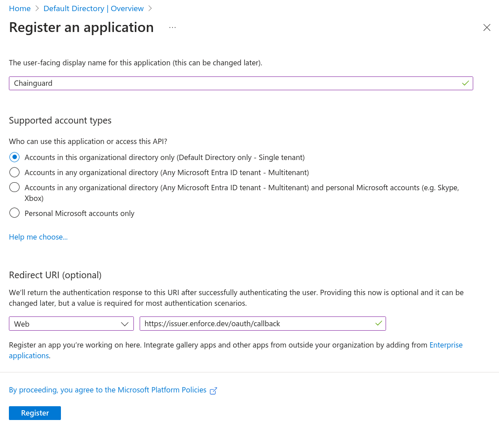
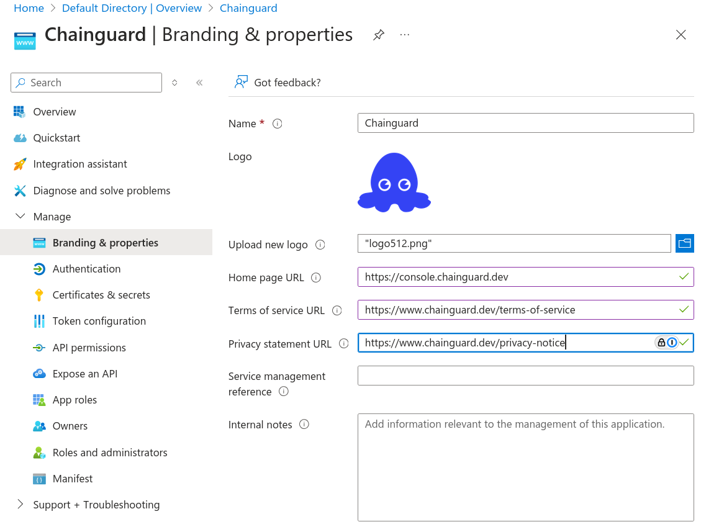
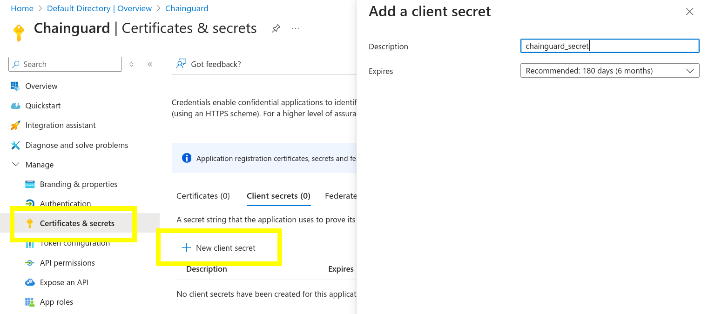
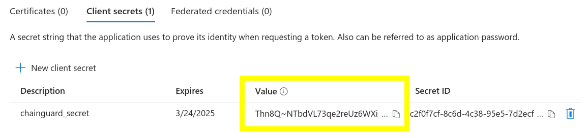
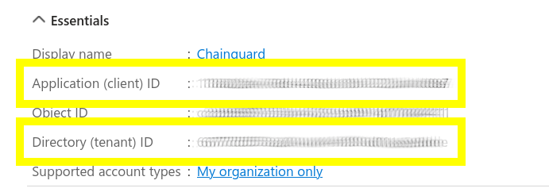

The Chainguard platform supports Single sign-on (SSO) authentication for users. By default, users can log in with GitHub, GitLab and Google, but SSO support allows users to bring their own identity provider for authentication.

This guide outlines how to create a Microsoft Entra ID (formerly Azure Active Directory) application and integrate it with Chainguard. After completing this guide, you'll be able to log in to Chainguard using Entra ID and will no longer be limited to the default SSO options.


## Prerequisites

To complete this guide, you will need the following.

* `chainctl` installed on your system. Follow our guide on [How To Install `chainctl`](/chainguard/administration/how-to-install-chainctl/) if you don't already have this installed.
* An Azure account with Admin permissions you can use to set up an Microsoft Entra ID application.

  **_NOTE:_** Without Admin permissions on your Azure account, you will not be able to assign users to the created Entra ID Application.

## Create a Microsoft Entra ID Application

To integrate Microsoft Entra ID with the Chainguard platform, log in to [Azure](https://azure.microsoft.com). In the left-hand navigation menu, select **Microsoft Entra ID**.

<center></center>
<br /> 

From the Default Directory **Overview** page, click the **➕ Add** button and select **App Registration** from the dropdown menu.

<center></center>
<br /> 

In the **Register an application** screen, configure the application as follows.

* **Name**: Set the username to "Chainguard" (or similar) to ensure users recognize this application is for authentication to the Chainguard platform.
* **Supported account types**: Select the **Single tenant** option so that only your organization can use this application to authenticate to Chainguard.
* **Redirect URI**: Set the platform to **Web** and the redirect URI to `https://issuer.enforce.dev/oauth/callback`.

<center></center>
<br /> 

Save your configuration by clicking the **Register** button.

Next, you can optionally set additional branding for the application by selecting **Branding and properties** from the **Manage** dropdown menu.

Here you can set additional metadata for the application, including a Chainguard logo icon here to help your users visually identify this integration. If you'd like, you can use the icon from the [Chainguard Console](https://console.chainguard.dev/logo512.png). The console homepage is [console.chainguard.dev](https://console.chainguard.dev), and our terms of service and private statements can be found at [chainguard.dev/terms-of-service](https://www.chainguard.dev/terms-of-service) and [chainguard.dev/privacy-notice](https://www.chainguard.dev/privacy-notice), respectively.

<center></center>
<br /> 

Finally, navigate to the **Certificates & secrets** tab in the **Manage** dropdown to create a client secret to authenticate the Chainguard platform to Microsoft Entra ID. Select **New client secret** to add a client secret. In the resulting modal window, add a description and set an expiration date.

<center></center>
<br /> 

Finally, take note of the client secret “Value” that is created. You'll need this to configure the Chainguard platform to use this Microsoft Entra ID application.

<center></center>
<br /> 

## Configuring Chainguard to use Microsoft Entra ID

Now that your Microsoft Entra ID application is ready, you can create the custom identity provider.

First, log in to Chainguard with `chainctl`, using an OIDC provider like Google, GitHub, or GitLab to bootstrap your account.

```sh
chainctl auth login
```

Note that this bootstrap account can be used as a [backup account](/chainguard/administration/custom-idps/custom-idps/#backup-accounts) (that is, a backup account you can use to log in if you ever lose access to your primary account). However, if you prefer to remove this role-binding after configuring the custom IDP, you may also do so.

To configure Chainguard, make a note of the following details from your Microsoft Entra ID application:

* **Application (client) Id**: This can be found on the **Overview** tab of the Chainguard application.
* **Client Secret**: You noted this down when you set up the client secret in the previous step.
* **Directory (tenant) Id**: This can also be found on the **Overview** tab of the Chainguard application.

<center></center>
<br /> 

You will also need the UIDP for the Chainguard organization under which you want to install the identity provider.  Your selection won’t affect how your users authenticate but will have implications on who has permission to modify the SSO configuration.

You can retrieve a list of all the Chainguard organizations you belong to — along with their UIDPs — with the following command.

```shell
chainctl iam organizations ls -o table
```
```output
                         	ID                         	|  	  NAME    |	DESCRIPTION
--------------------------------------------------------+-------------+---------------------
  59156e77fb23e1e5ebcb1bd9c5edae471dd85c43              | sample_org  |
  . . .                                                 | . . .       |
```

Note down the `ID` value for your chosen organization.

With this information in hand, create a new identity provider with the following commands.

```sh
export NAME=entra-id
export CLIENT_ID=<your application/client id here>
export CLIENT_SECRET=<your client secret here>
export ORG=<your organization UIDP here>
export TENANT_ID=<your directory/tenant id here>
export ISSUER="https://login.microsoftonline.com/${TENANT_ID}/v2.0"
chainctl iam identity-provider create \
  --configuration-type=OIDC \
  --oidc-client-id=${CLIENT_ID} \
  --oidc-client-secret=${CLIENT_SECRET} \
  --oidc-issuer=${ISSUER} \
  --oidc-additional-scopes=email \
  --oidc-additional-scopes=profile \
  --parent=${ORG} \
  --default-role=viewer \
  --name=${NAME}
```

Note the `--default-role` option. This defines the default role granted to users registering with this identity provider. This example specifies the `viewer` role, but depending on your needs you might choose `editor` or `owner`. If you don't include this option, you'll be prompted to specify the role interactively. For more information, refer to the [IAM and Security section](/chainguard/administration/custom-idps/custom-idps/#iam-and-security) of our Introduction to Custom Identity Providers in Chainguard tutorial.

You can refer to our [Generic Integration Guide](/chainguard/administration/custom-idps/custom-idps/#generic-integration-guide) in our Introduction to Custom Identity Providers doc for more information about the `chainctl iam identity-provider create` command and its required options.

To log in to the Chainguard Console with the new identity provider you just created, navigate to [console.chainguard.dev](https://console.chainguard.dev) and click **Use Your Identity Provider**. Next, click **Use Your Organization Name** and enter the name of the organization associated with the new identity provider. Finally, click the **Login with Provider** button. This will open up a new window with the Microsoft Entra ID login flow, allowing you to complete the login process through there.

You can also use the custom identity provider to log in through `chainctl`. To do this, run the `chainctl auth login` command and add the `--identity-provider` option followed by the identity provider's ID value:

```sh
chainctl auth login --identity-provider <IDP-ID>
```

The ID value appears in the `ID` column of the table returned by the `chainctl iam identity-provider create` command you ran previously. You can also retrieve this table at any time by running `chainctl iam identity-provider ls -o table` when logged in.
