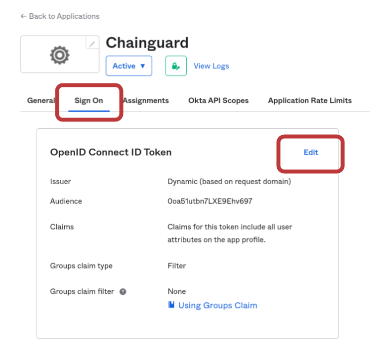

The Chainguard platform supports Single sign-on (SSO) authentication for users. By default, users can log in with GitHub, GitLab and Google, but SSO support allows users to bring their own identity provider for authentication.

This guide outlines how to create an Okta application and integrate it with Chainguard. After completing this guide, you'll be able to log in to Chainguard using Okta and will no longer be limited to the default SSO options.


## Prerequisites

To complete this guide, you will need the following.

* `chainctl` installed on your system. Follow our guide on [How To Install `chainctl`](/chainguard/administration/how-to-install-chainctl/) if you don't already have this installed.
* An Okta account over which you have administrative access.


## Create an Okta App integration

To integrate your Okta identity provider with the Chainguard platform, [log in to Okta](https://www.okta.com/login/) and navigate to the **Applications** landing page in the Admin console. There, click the **Create App Integration** button.


Select **OIDC - OpenID Connect** as the sign-in method and **Web Application** as the application type.


Next, in the **General Settings** window, configure the application as follows.

* **App integration name**: Enter a descriptive name (like "Chainguard") here.
* **Logo**: You can optionally add a Chainguard logo icon here to help your users visually identify this integration. If you'd like, you can use the icon from the [Chainguard Console](https://console.chainguard.dev/logo512.png).
* **Grant type**: Ensure that the grant type is set to **Authorization Code** only.

> **Warning**: DO NOT select other grant types as this may compromise your security.

* **Sign-in redirect URIs**: Set the redirect URI to `https://issuer.enforce.dev/oauth/callback`
* **Sign-out redirect URIs**: This will have a URI field set to `http://localhost:8080` by default. Click the **X** icon to remove the sign-out redirect entirely, leaving this field blank.


Click the **Save** button. Then, select the **Sign On** tab. Find the **OpenID Connect ID Token** section and click the **Edit** button.



Set the **Issuer** option to **Okta URL**, then click the **Save** button.


That completes our configuration of the Okta Application. Next, we need to configure the Chainguard platform to use our Okta application.


## Configuring Chainguard to use Okta SSO

Now that your Okta application is ready, you can create the custom identity provider.

First, log in to Chainguard with `chainctl`, using an OIDC provider like Google, GitHub, or GitLab to bootstrap your account.

```sh
chainctl auth login
```

Note that this bootstrap account can be used as a [backup account](/chainguard/administration/custom-idps/custom-idps/#backup-accounts) (that is, a backup account you can use to log in if you ever lose access to your primary account). However, if you prefer to remove this role-binding after configuring the custom IDP, you may also do so.

To configure the platform, make a note of the following settings from your Okta Application:

* **Client ID**: You can find this on the **General** tab under **Client Credentials**
* **Client Secret**: Find this on the **General** Tab under **Client Credentials**
* **Issuer URL**: This is found under the **Sign on** tab in the **OpenID Connect ID Token** section

You will also need the UIDP for the Chainguard organization under which you want to install the identity provider.  Your selection won’t affect how your users authenticate but will have implications on who has permission to modify the SSO configuration.

You can retrieve a list of all Chainguard organizations you belong to — along with their UIDPs — with the following command.

```shell
chainctl iam organizations ls -o table
```
```output
                         	ID                         	|  	  NAME    |	DESCRIPTION
--------------------------------------------------------+-------------+---------------------
  59156e77fb23e1e5ebcb1bd9c5edae471dd85c43              | sample_org  |
  . . .                                                 | . . .       |
```

Note down the `ID` value for your chosen organization.

With this information in hand, create a new identity provider with the following commands.

```sh
export NAME=okta
export CLIENT_ID=<your client id here>
export CLIENT_SECRET=<your client secret here>
export ISSUER=<your issuer url here>
export ORG=<your organization UIDP here>
chainctl iam identity-provider create \
  --configuration-type=OIDC \
  --oidc-client-id=${CLIENT_ID} \
  --oidc-client-secret=${CLIENT_SECRET} \
  --oidc-issuer=${ISSUER} \
  --oidc-additional-scopes=email \
  --oidc-additional-scopes=profile \
  --parent=${ORG} \
  --default-role=viewer \
  --name=${NAME}
```

Note the `--default-role` option. This defines the default role granted to users registering with this identity provider. This example specifies the `viewer` role, but depending on your needs you might choose `editor` or `owner`. If you don't include this option, you'll be prompted to specify the role interactively. For more information, refer to the [IAM and Security section](/chainguard/administration/custom-idps/custom-idps/#iam-and-security) of our Introduction to Custom Identity Providers in Chainguard tutorial.

You can refer to our [Generic Integration Guide](/chainguard/administration/custom-idps/custom-idps/#generic-integration-guide) in our Introduction to Custom Identity Providers article for more information about the `chainctl iam identity-provider create` command and its required options.
