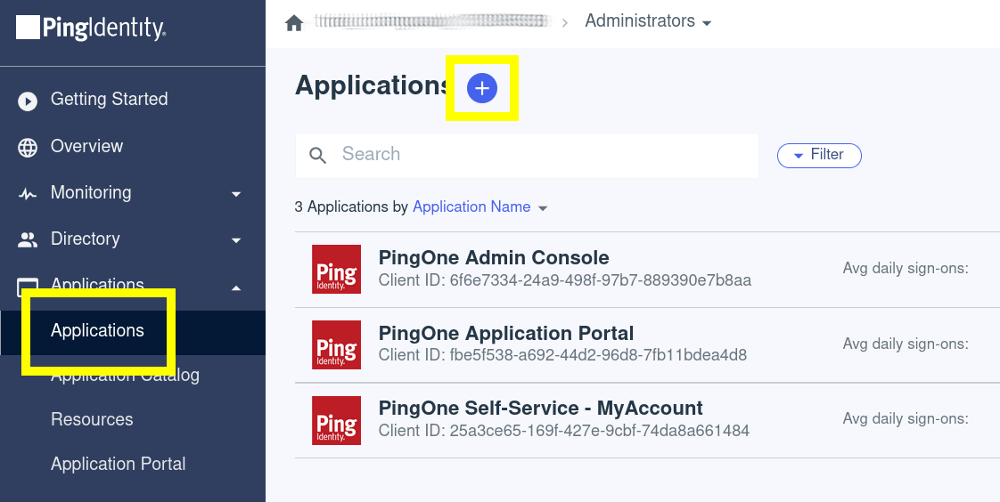
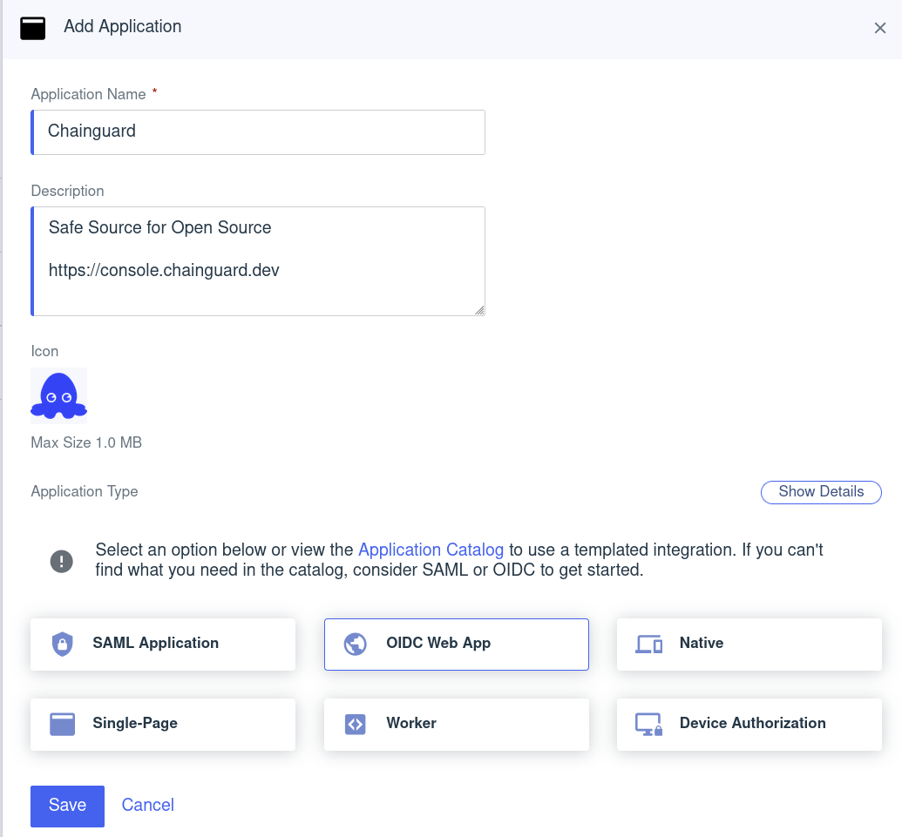
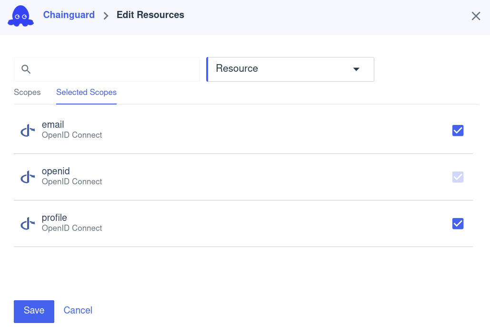
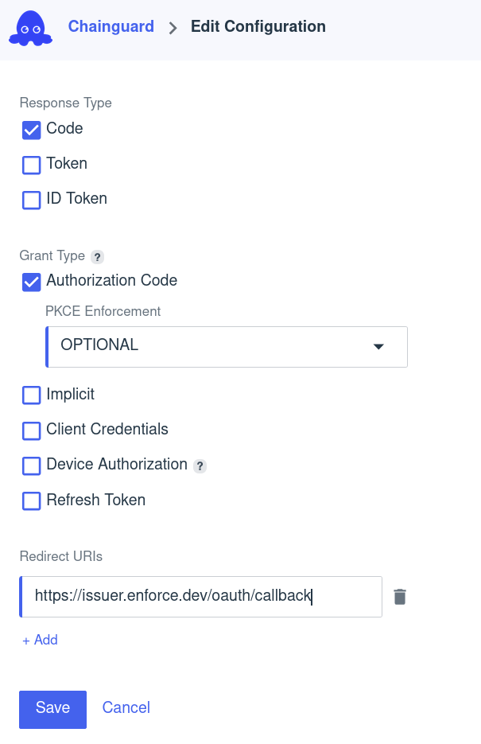
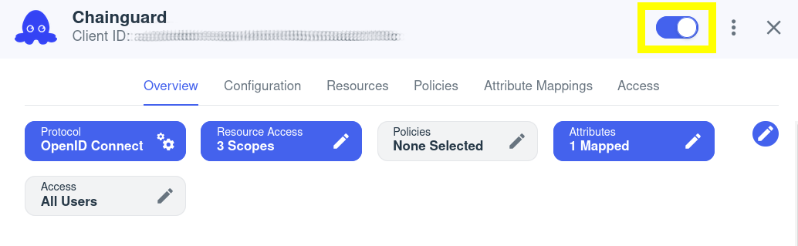

The Chainguard platform supports Single sign-on (SSO) authentication for users. By default, users can log in with GitHub, GitLab and Google, but SSO support allows users to bring their own identity provider for authentication.

This guide outlines how to create a Ping Identity Application and integrate it with Chainguard. After completing this guide, you'll be able to log in to Chainguard using Ping and will no longer be limited to the default SSO options.


## Prerequisites

To complete this guide, you will need the following.

* `chainctl` installed on your system. Follow our guide on [How To Install `chainctl`](/chainguard/administration/how-to-install-chainctl/) if you don't already have this installed.
* A Ping Identity account over which you have administrative access.


## Create a Ping Identity Application

To integrate the Ping identity provider with the Chainguard platform, [sign on to Ping Identity](https://www.pingidentity.com/en.html) and navigate to the Dashboard. Click on the **Applications** tab in the left-hand sidebar menu, and then click on **Applications** in the resulting dropdown menu. From the Applications landing page, click the plus sign (**➕**) to set up a new application.

<center></center>
<br />

Configure the application as follows:

* **Application Name**: Set a descriptive name (such as "Chainguard") and optional description to ensure users recognize this application is for authentication to the Chainguard platform.
* **Icon**: You can optionally add a Chainguard logo icon here to help your users visually identify this integration. If you'd like, you can use the icon from the [Chainguard Console](https://console.chainguard.dev/logo512.png).
* **Application Type**: Select **OIDC Web App**.

<center></center>
<br />

After setting these details, click the **Save** button.

Next, configure scopes for the application. In the **Overview** tab, click the **Resource Access** scope button.

<center></center>
<br />

Add **email** and **profile** scopes, then save.

<center></center>
<br />

Next, configure the OIDC application. Navigate to the **Configuration** tab and click the pencil-shaped "edit" icon.

To configure the application, add the following settings.

* **Response Type**: Select the **Code** checkbox.
* **Grant Type**: Select the **Authorization Code** checkbox, and set PKCE Enforcement to "Optional."

> Warning: Setting a grant type other than **Authorization Code** may compromise your security posture.

* **Redirect URIs**: Set the Redirect URI to [`https://issuer.enforce.dev/oauth/callback`](https://issuer.enforce.dev/oauth/callback).

<center></center>
<br />

Click the **Save** button to save your configuration.

Finally, enable the Chainguard application by toggling the button in the top right corner.

<center></center>
<br />

This completes configuration of the Ping application. You're now ready to configure the Chainguard platform to use it.


## Configuring Chainguard to use Ping SSO

Now that your Okta application is ready, you can create the custom identity provider.

First, log in to Chainguard with `chainctl`, using an OIDC provider like Google, GitHub, or GitLab to bootstrap your account.

```sh
chainctl auth login
```

Note that this bootstrap account can be used as a [backup account](/chainguard/administration/custom-idps/custom-idps/#backup-accounts) (that is, a backup account you can use to log in if you ever lose access to your primary account). However, if you prefer to remove this role-binding after configuring the custom IDP, you may also do so.

To configure Chainguard make a note of the following settings from your Ping application. These can be found in the Ping console under the **Configuration** tab of the **Application** page.

* Client ID
* Client Secret
* Issuer URL

You will also need the UIDP for the Chainguard organization under which you want to install the identity provider.  Your selection won’t affect how your users authenticate but will have implications on who has permission to modify the SSO configuration.

You can retrieve a list of all the Chainguard organizations you belong to — along with their UIDPs — with the following command.

```shell
chainctl iam organizations ls -o table
```
```output
                         	ID                         	|  	  NAME    |	DESCRIPTION
--------------------------------------------------------+-------------+---------------------
  59156e77fb23e1e5ebcb1bd9c5edae471dd85c43              | sample_org  |
  . . .                                                 | . . .       |
```

Note down the `ID` value for your chosen organization.

With this information in hand, create a new identity provider with the following commands.

```sh
export NAME=ping-id
export CLIENT_ID=<your client id here>
export CLIENT_SECRET=<your client secret here>
export ISSUER=<your issuer url here>
export ORG=<your organization UIDP here>
chainctl iam identity-provider create \
  --configuration-type=OIDC \
  --oidc-client-id=${CLIENT_ID} \
  --oidc-client-secret=${CLIENT_SECRET} \
  --oidc-issuer=${ISSUER} \
  --oidc-additional-scopes=email \
  --oidc-additional-scopes=profile \
  --parent=${ORG} \
  --default-role=viewer \
  --name=${NAME}
```

Note the `--default-role` option. This defines the default role granted to users registering with this identity provider. This example specifies the `viewer` role, but depending on your needs you might choose `editor` or `owner`. If you don't include this option, you'll be prompted to specify the role interactively. For more information, refer to the [IAM and Security section](/chainguard/administration/custom-idps/custom-idps/#iam-and-security) of our Introduction to Custom Identity Providers in Chainguard tutorial.

You can refer to our [Generic Integration Guide](/chainguard/administration/custom-idps/custom-idps/#generic-integration-guide) in our Introduction to Custom Identity Providers guide for more information about the `chainctl iam identity-provider create` command and its required options.

To log in to the Chainguard Console with the new identity provider you just created, navigate to [console.chainguard.dev](https://console.chainguard.dev) and click **Use Your Identity Provider**. Next, click **Use Your Organization Name** and enter the name of the organization associated with the new identity provider. Finally, click the **Login with Provider** button. This will open up a new window with the Ping Identity login flow, allowing you to complete the login process through there.

You can also use the custom identity provider to log in through `chainctl`. To do this, run the `chainctl auth login` command and add the `--identity-provider` option followed by the identity provider's ID value:

```sh
chainctl auth login --identity-provider <IDP-ID>
```

The ID value appears in the `ID` column of the table returned by the `chainctl iam identity-provider create` command you ran previously. You can also retrieve this table at any time by running `chainctl iam identity-provider ls -o table` when logged in.
