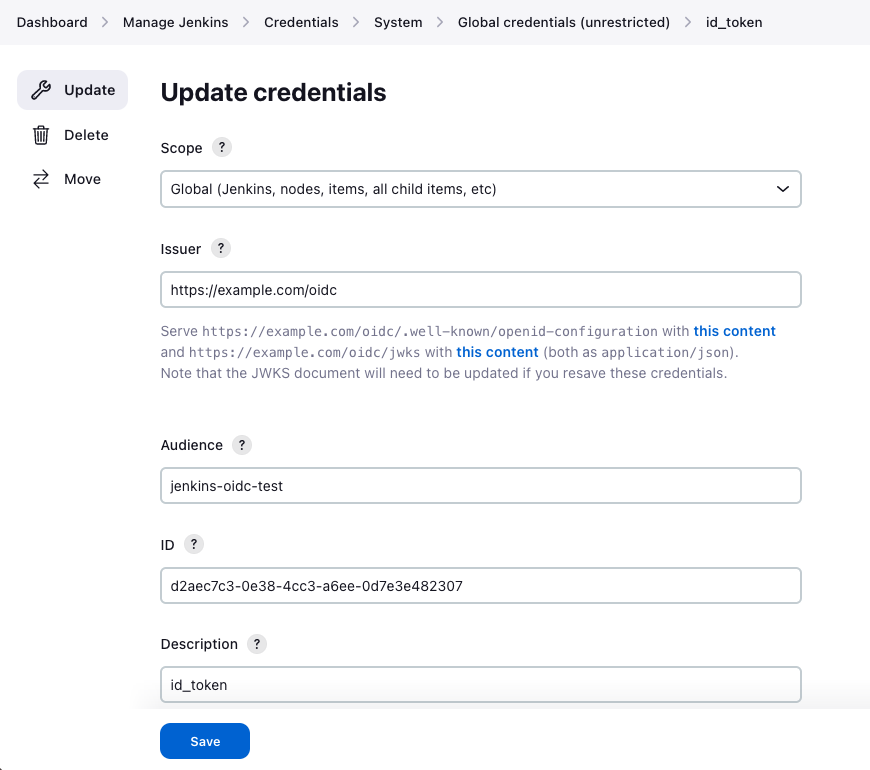
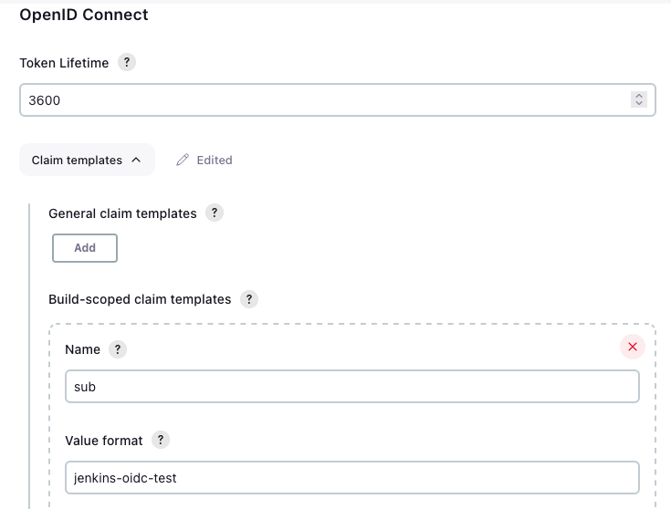
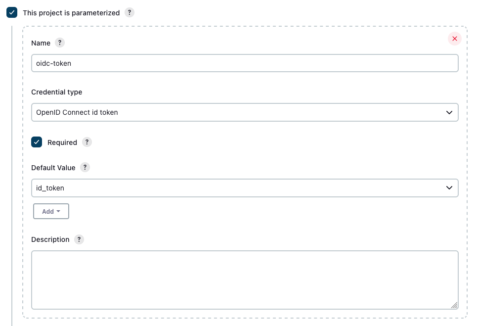

Chainguard's [*assumable identities*](/chainguard/chainguard-enforce/iam-groups/assumable-ids/) are identities that can be assumed by external applications or workflows in order to perform certain tasks that would otherwise have to be done by a human.

This procedural tutorial outlines how to create an identity using Terraform, and then how to update a Jenkins pipeline so that it can assume the identity and interact with Chainguard resources.


## Prerequisites

To complete this guide, you will need the following.

* `terraform` installed on your local machine. Terraform is an open-source Infrastructure as Code tool which this guide will use to create various cloud resources. Follow [the official Terraform documentation](https://developer.hashicorp.com/terraform/tutorials/aws-get-started/install-cli) for instructions on installing the tool.
* `chainctl` — the Chainguard command line interface tool — installed on your local machine. Follow our guide on [How to Install `chainctl`](/chainguard/chainguard-enforce/how-to-install-chainctl/) to set this up.
* A Jenkins server with the [OpenID Connect Provider plugin](https://plugins.jenkins.io/oidc-provider/) installed and configured, as well as a pipeline you can use to test out the identity you'll create.


## Creating Terraform Files

We will be using Terraform to create an identity for a Jenkins pipeline to assume. This step outlines how to create three Terraform configuration files that, together, will produce such an identity.

To help explain each configuration file's purpose, we will go over what they do and how to create each file one by one. First, though, create a directory to hold the Terraform configuration and navigate into it.

```sh
mkdir ~/jenkins-id && cd $_
```

This will help make it easier to clean up your system at the end of this guide.


### `main.tf`

The first file, which we will call `main.tf`, will serve as the scaffolding for our Terraform infrastructure.

The file will consist of the following content.

```
terraform {
  required_providers {
    chainguard = {
      source = "chainguard-dev/chainguard"
    }
  }
}
```

This is a fairly barebones Terraform configuration file, but we will define the rest of the resources in the other two files. In `main.tf`, we declare and initialize the Chainguard Terraform provider.

To create the `main.tf` file, run the following command.

```sh
cat > main.tf <<EOF
terraform {
  required_providers {
    chainguard = {
      source = "chainguard-dev/chainguard"
    }
  }
}
EOF
```

Next, you can create the `sample.tf` file.


### `sample.tf`

`sample.tf` will create a couple of structures that will help us test out the identity in a workflow.

This Terraform configuration consists of two main parts. The first part of the file will contain the following lines.

```
data "chainguard_group" "group" {
  name        = "my-customer.biz"
}
```

This section looks up a Chainguard IAM organization named `my-customer.biz`. This will contain the identity — which will be created by the `jenkins.tf` file — to access when we test it out later on.

Now you can move on to creating the last of our Terraform configuration files, `jenkins.tf`.

### `jenkins.tf`

The `jenkins.tf` file is what will actually create the identity for your Jenkins workflow to assume. The file will consist of four sections, which we'll go over one by one.

The first section creates the identity itself.

```
resource "chainguard_identity" "jenkins" {
  parent_id   = data.chainguard_group.group.id
  name        = "jenkins"
  description = <<EOF
    This is an identity that authorizes Jenkins workflows
    for this repository to assume to interact with chainctl.
  EOF

  claim_match {
    audience = "%your-audience%"
    issuer   = "https://%your-domain%/oidc"
    subject  = "%your-subject%"
  }
}
```

First, this section creates a Chainguard Identity tied to the Chainguard organization looked up in the `sample.tf` file. The identity is named `jenkins` and has a brief description.

The most important part of this section is the `claim_match`. When the Jenkins workflow tries to assume this identity later on, it must present a token matching the `audience`, `issuer` and `subject` specified here in order to do so. The `audience` is the intended recipient of the issued token, while the `issuer` is the entity that creates the token. Finally, the `subject` is the entity (here, the Jenkins pipeline build) that the token represents.

The `audience` and `issuer` fields use settings from your configured Jenkins OIDC credential. You can find these by clicking **Manage Jenkins** in the left-hand sidebar menu of your dashbaord, then click **Credentials**. Click on your **System** credentials, then click **Global credentials (unrestricted)**. This will take you to a table listing all your configured OIDC tokens. Click the wrench icon for the token you want to use to test this identity. This will take you to a screen similar to the following screenshot showing the `audience` and `issue` values you should use in your `jenkins.tf` file.



For the subject, refer to your Jenkins repository OIDC settings page. You can find these by naivgating back to the **Manage Jenkins** landing page in your dashboard and clicking on **Security**. From there, scroll to the `OpenID Connect` section on the page, click on the **Claim templates** button, and locate the `sub` field. The `subject` value you should use will be the value in the **Value format** field under the first `sub` template. In the following example, the value to use is `jenkins-oidc-test`.



For the purposes of this guide, you will need to replace `%your-audience%`, `%your-domain%`, and `%your-subject%` with the values from your Jenkins OIDC credential page, and the `OpenID Connect` administrative settings page.

The next section will output the new identity's `id` value. This is a unique value that represents the identity itself.

```
output "jenkins-identity" {
  value = chainguard_identity.jenkins.id
}
```

The section after that looks up the `viewer` role.

```
data "chainguard_role" "viewer" {
  name = "viewer"
}
```

The final section grants this role to the identity.

```
resource "chainguard_rolebinding" "view-stuff" {
  identity = chainguard_identity.jenkins.id
  group    = data.chainguard_group.group.id
  role     = data.chainguard_role.viewer.items[0].id
}
```

Following that, your Terraform configuration will be ready. Now you can run a few `terraform` commands to create the resources defined in your `.tf` files.

## Creating Your Resources

First, run `terraform init` to initialize Terraform's working directory.

```sh
terraform init
```

Then run `terraform plan`. This will produce a speculative execution plan that outlines what steps Terraform will take to create the resources defined in the files you set up in the last section.

```sh
terraform plan
```

If the plan worked successfully and you're satisfied that it will produce the resources you expect, you can apply it.

```sh
terraform apply
```

Before going through with applying the Terraform configuration, this command will prompt you to confirm that you want it to do so. Enter `yes` to apply the configuration.

```
. . .
Plan: 4 to add, 0 to change, 0 to destroy.

Changes to Outputs:
  + jenkins-identity = (known after apply)

Do you want to perform these actions?
  Terraform will perform the actions described above.
  Only 'yes' will be accepted to approve.

  Enter a value:
```

After pressing `ENTER`, the command will complete and will output an `jenkins-identity` value.

```
. . .
Apply complete! Resources: 3 added, 0 changed, 0 destroyed.

Outputs:

jenkins-identity = "<your jenkins identity>"
```

This is the identity's [UIDP (unique identity path)](/chainguard/chainguard-enforce/reference/events/#uidp-identifiers), which you configured the `jenkins.tf` file to emit in the previous section. Note this value down, as you'll need it when you test this identity using a Jenkins workflow. If you need to retrieve this UIDP later on, though, you can always run the following `chainctl` command to obtain a list of the UIDPs of all your existing identities.

```sh
chainctl iam identities ls
```

Note that you may receive a `PermissionDenied` error part way through the apply step. If so, run `chainctl auth login` once more, and then `terraform apply` again to resume creating the identity and resources.

You're now ready to create or edit a Jenkins pipeline to test out this identity.

## Testing the identity with a Jenkins pipeline

To test the identity you created with Terraform in the previous section, create or edit a pipeline job. To create a pipeline job, click the **New Item** link in the menu at the top left of your Jenkins dashboard. Give the job a title, and select **Pipeline** from the list of job types.

Once you are on the pipeline configuration page, click the **This project is parameterized** check box. Give your parameter a name like `oidc-token` and under the **Credential type** selection list, **OpenID Connect id token**. Mark the parameter as required, and select your configured OIDC credential token as the `Default Value` for the parameter per the following screenshot:



Next copy the following pipeline defintion into the `Script` body for your job:

```
pipeline {
    agent any
    stages {
        stage('oidc-test') {
            steps {
                withCredentials([string(variable: 'token', credentialsId: 'oidc-token')]) {
                    sh '''
                        wget -O chainctl "https://dl.enforce.dev/chainctl/latest/chainctl_linux_\$(uname -m)"
                        chmod +x chainctl
                        ./chainctl auth login --identity-token $token --identity <your jenkins identity>
                        ./chainctl auth configure-docker --identity-token $token --identity <your jenkins identity>
                    '''
                }
            }
        }
    }
}
```

The important line is `withCredentials` option, which maps the generated OIDC token from the `oidc-token` credential parameter to `token` variable in the pipeline step.

Now you can add the commands for testing the identity using `chainctl images repos list` in the following example:

```
sh '''
    wget -O chainctl "https://dl.enforce.dev/chainctl/latest/chainctl_linux_\$(uname -m)"
    chmod +x chainctl
    ./chainctl auth login --identity-token $token --identity <your jenkins identity>
    ./chainctl auth configure-docker --identity-token $token --identity <your jenkins identity>
    ./chainctl images repos list
    docker pull cgr.dev/<organization>/<repo>:<tag>
'''
```

Save the job, and then build it using the `Build with Parameters` option.

Assuming everything works as expected, your pipeline will be able to assume the identity and run the `chainctl images repos list` command, listing repositories available to the organization.

```
. . .
chainctl        	100%[===================>]  54.34M  6.78MB/s	in 13s

2023-05-17 13:19:45 (4.28 MB/s) - ‘chainctl’ saved [56983552/56983552]

Successfully exchanged token.
Valid! Id: 3f4ad8a9d5e63be71d631a359ba0a91dcade94ab/d3ed9c70b538a796
<list of repos>
```

If you'd like to experiment further with this identity and what the pipeline can do with it, there are a few parts of this setup that you can tweak. For instance, if you'd like to give this identity different permissions you can change the role data source to the role you would like to grant.

```
data "chainguard_role" "editor" {
  name = "editor"
}
```

You can also edit the pipeline itself to change its behavior. For example, instead of inspecting the policies the identity has access to, you could have the workflow inspect the organizations.

```
	. . .
	- './chainctl iam organizations ls'
```

Of course, the Jenkins pipeline will only be able to perform certain actions on certain resources, depending on what kind of access you grant it.

## Removing Sample Resources

To remove the resources Terraform created, you can run the `terraform destroy` command.

```sh
terraform destroy
```

This will destroy the role-binding, and the identity created in this guide. It will not delete the organization.

You can then remove the working directory to clean up your system.

```sh
rm -r ~/jenkins-id/
```

Following that, all of the example resources created in this guide will be removed from your system.


## Learn more

For more information about how assumable identities work in Chainguard, check out our [conceptual overview of assumable identities](/chainguard/chainguard-enforce/iam-groups/assumable-ids/). Additionally, the Terraform documentation includes a section on [recommended best practices](https://developer.hashicorp.com/terraform/cloud-docs/recommended-practices) which you can refer to if you'd like to build on this Terraform configuration for a production environment. Likewise, for more information on using OIDC with Jenkins pipelines, we encourage you to check out the [OpenID Connect Provider documentation](https://plugins.jenkins.io/oidc-provider/).
