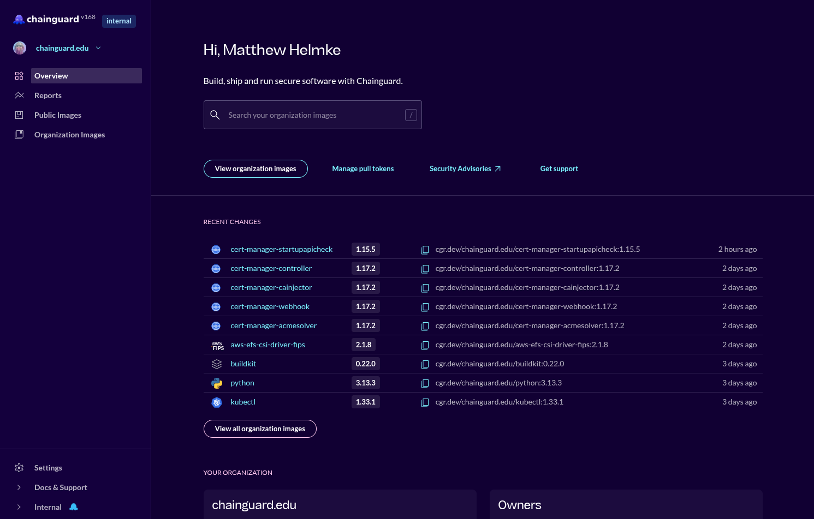
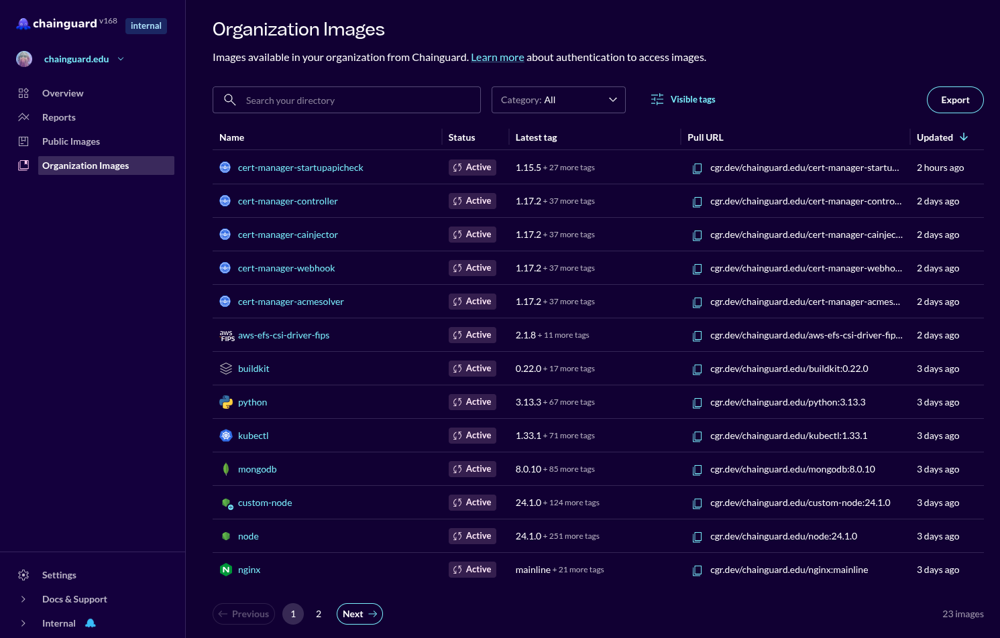
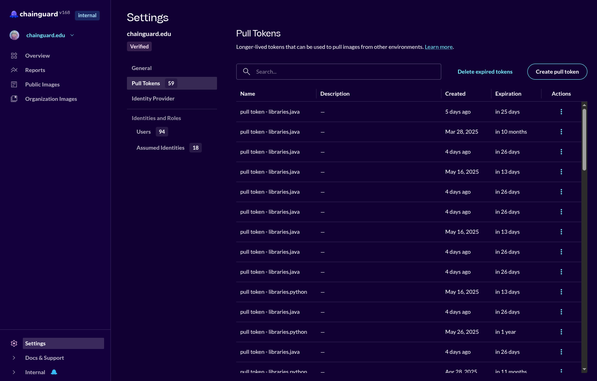
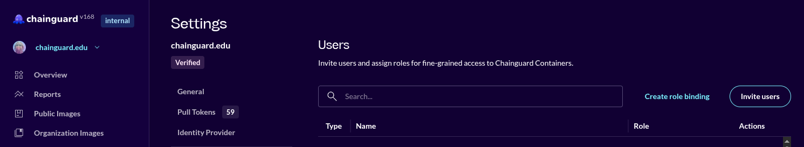
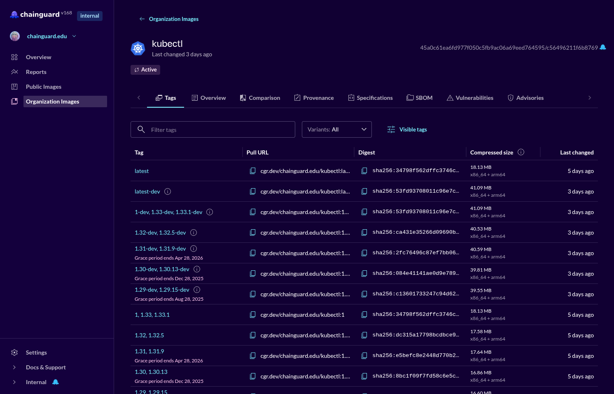

When should I use the Chainguard Console? When is it better to use `chainctl`? This page gives some guidance on the benefits of each method for managing your Chainguard Containers to help you make that decision.


## Prerequisites

To access the [Chainguard Console](/chainguard/chainguard-images/how-to-use/images-directory/) you need to [create an account and sign in](https://console.chainguard.dev/auth/login). The Console is accessible to everyone, including users who aren't Chainguard customers.

To use `chainctl`, start by [installing chainctl](/chainguard/chainctl-usage/how-to-install-chainctl/). See [Get Started with chainctl](/chainguard/chainctl-usage/getting-started-with-chainctl/) to help you begin using it; the examples on this page assume you have `chainctl` installed and are authenticated.


## High-level Comparison

The Console is especially useful for one-off information searches, such as when you don't know precisely what you want to know. It's also good at providing detailed information after a few clicks to zoom in. You can perform useful container-related query tasks from within the Console, as this page will demonstrate with some examples.

If you know specifically what you are looking for or what you want to accomplish, `chainctl` is a powerful way to do so. It can perform some additional tasks that are not yet available in the Console, such as [comparing images with a diff](/chainguard/chainctl-usage/comparing-images/).


## Example - Find Available Images

To find the images available to you in the Console, do this:

1. Open the [Console](https://console.chainguard.dev)


1. On the Overview page that opens, click **Organization Images** in the sidebar.



To find the images available to you using `chainctl`, use this command. The list of available images is likely to be long and will scroll past you quickly in the terminal.

```
chainctl images list

```


## Example - Invite Users

To invite a user using the Console, follow these steps:

1. Open the Console.

1. On the Overview page that opens, click the **Manage pull tokens** tab, just below the search box.

1. On the Settings page that opens, click **Users** in the sidebar.


1. Click **Invite users**.


1. Enter the **Email address** of the user you are inviting and use the dropdown menu to assign a **Role** for this user. Click **Invite**.


To invite a user using `chainctl`, use this command, substituting your organization name for ORGANIZATION along with setting the role, email address, length of time for the invite to be valid, and whether this invite may only be used once:

```
chainctl iam invite create ORGANIZATION
--role=viewer
--email=sample@organization.dev
--ttl=7d
--single-use

```


## Example - Learn Container Image History

To examine the history of an image using the Console:

1. Open the Console and find the image you want to examine more closely. Do this by clicking on an image in the **Recent Changes** list on this page or clicking **View all organization images** to see the full list and find the image you want.

1. On the image page you start on the **Tags** tab and see a list of tags which correspond to the release version of the image, like this one for `kubectl`.


This list contains columns with data about each image release, like the Pull URL, Digest, and when it was last changed. Click the other tabs to learn more about the *latest* release version of this image.

To examine the history of an image using `chainctl`, enter this, replacing ORGANIZATION with your organization:

```
chainctl image history kubectl:latest --parent=ORGANIZATION
```

This will return a reverse-chronological history of when a specific tag was update to point to a new manifest digest. This list can be long. Here's an excerpt:

```
- time: 2025-05-29 03:08:31 UTC
  digest: sha256:34798f562dffc3746cb69bab49b93ff83aa57bea393a07997e87c37bc83a62db
  architectures:
    amd64: sha256:a71ccfdc86cd73d395d3528ce3f8df1f4dd132b73ff03016b0ec42da23d4ec99 (18.13 MB)
    arm64: sha256:2876b0c3de431f0d7df8f888a0d40bb0c8259c47109f978237d305e7818b704b (16.43 MB)
- time: 2025-05-28 17:19:58 UTC
  digest: sha256:1f798940981573c34e1d11c8b6d266f18d06e95b81251d6880f511d55b833cfd
- time: 2025-05-27 19:53:02 UTC
  digest: sha256:81095db3adc00495fceb064e86dfd81c7ffdf081c55daf6b12be6ef1605bd18c
  architectures:
    amd64: sha256:56db73a4b66ad326a7858ca4157ded2d3b6d11ff1030cfbdf3a3bd879a5a5725 (18.13 MB)
    arm64: sha256:280160c9c422d7526169812cf89401043096f5d4ff385d1b59f3610109486aed (16.43 MB)
- time: 2025-05-23 01:09:22 UTC
  digest: sha256:c0934fc335d8b24923487cb7d0b673490bd393fd4b6cd20f6f0e156a7481ffc7
  architectures:
    amd64: sha256:46e11b8beed94d93272e5a87753f9f43f02f5f1b9d83d8ba279eeb18c114c863 (18.13 MB)
    arm64: sha256:b288bc13da78aa7b2a82d50dbca45ed2fe286f0f1f248fa2e12604ef9a109f33 (16.40 MB)

...

```

The details that are returned here and the details found in the Console vary in completeness and focus, but where the same details are provided they should match. See [Examine the History of Container Images](/chainguard/chainctl-usage/chainctl-images/#examine-the-history-of-container-images) for more information about this command.


## Learn more

To learn more about the `chainctl`, see the
[chainctl Usage](/chainguard/chainctl/chainctl-usage/) docs or the [chainctl Reference] for more detail.

To learn more about the Chainguard Console, see [Using the Chainguard Directory and Console](/chainguard/chainguard-images/how-to-use/images-directory/).


### Compare a Chainguard Container to a non-Chainguard Alternative in the Console

This is a feature unique to the Console and is described in detail in [Using CVE Visualizations](/chainguard/chainguard-images/features/cve_visualizations/).

### Compare Two Chainguard Containers With chainctl

This is a feature unique to `chainctl` and is described in detail in [How To Compare Chainguard Containers with chainctl](/chainguard/chainctl-usage/comparing-images.md).