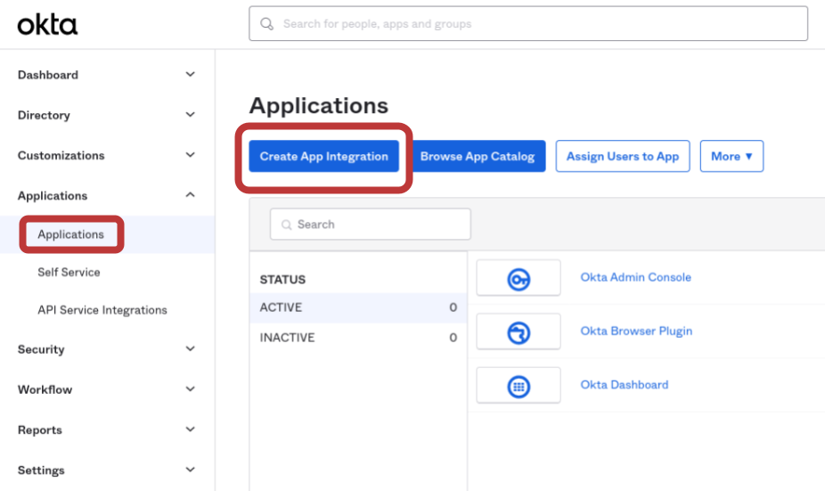
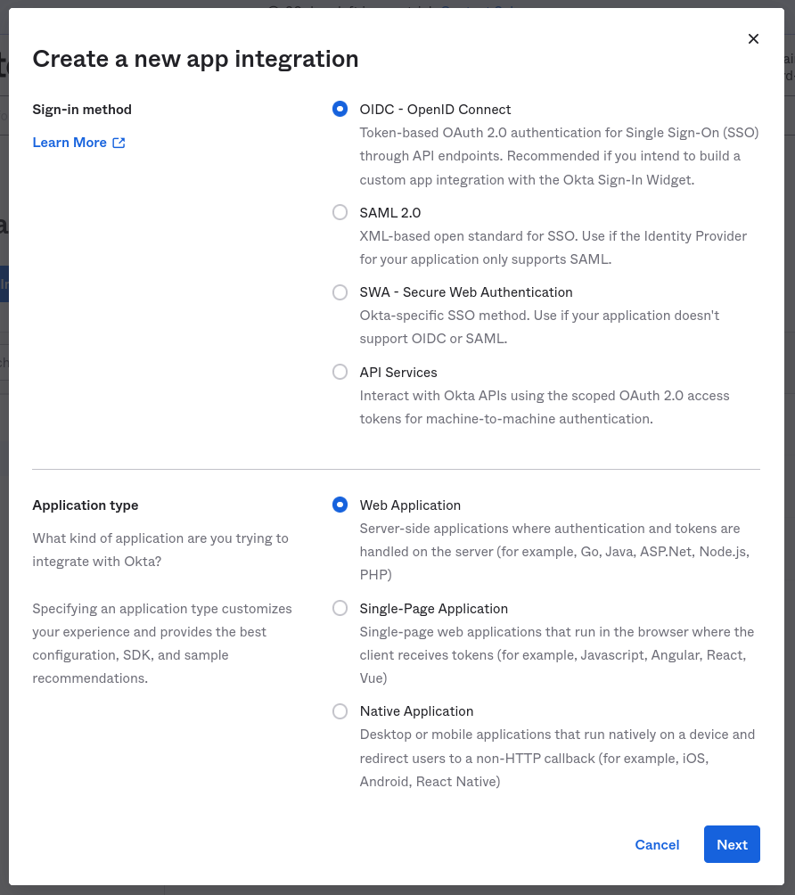
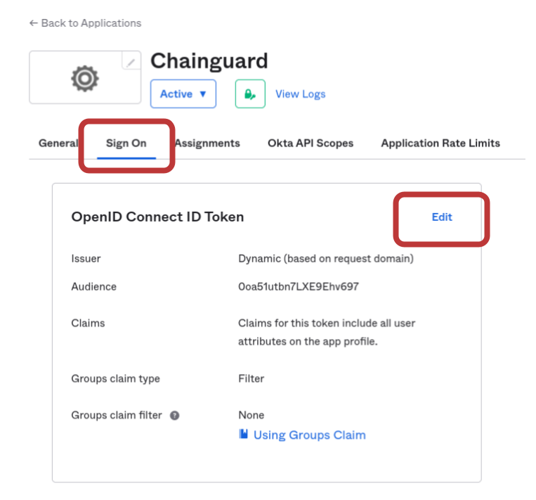
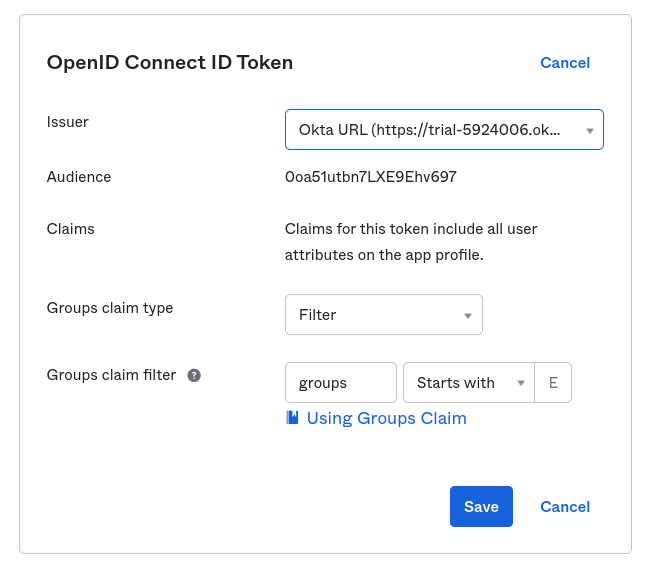

> _This documentation is related to Chainguard Enforce. You can request access to the product by selecting **Chainguard Enforce** on the [inquiry form](https://www.chainguard.dev/contact?utm_source=docs)._

The Chainguard platform supports Single Sign-on (SSO) authentication for users. By default, users can log in with GitHub, Gitlab and Google, but SSO support allows users to bring their own identity provider for authentication. 

This guide outlines how to create an Okta Application and integrate it with Chainguard Enforce. After completing this guide, you'll be able to log in to Chainguard Enforce using Okta and will no longer be limited to the default SSO options.


## Prerequisites

To complete this guide, you will need the following.

* `chainctl` installed on your system. Follow our guide on [How To Install `chainctl`](/chainguard/chainguard-enforce/how-to-install-chainctl/) if you don't already have this installed.
* An Okta account over which you have administrative access. 


## Create an Okta App integration

To integrate your Okta identity provider with the Chainguard platform, [log in to Okta](https://www.okta.com/login/) and navigate to the **Applications** landing page in the Admin console. There, click the **Create App Integration** button.



Select **OIDC - OpenID Connect** as the sign-in method and **Web Application** as the application type.



Next, in the **General Settings** window, configure the application as follows.

* **App integration name**: Enter a descriptive name (like "Chainguard") here.
* **Logo**: You can optionally add a Chainguard logo icon here to help your users visually identify this integration. If you'd like, you can use the icon from the [Chainguard Enforce Console](https://console.enforce.dev/logo512.png).
* **Grant type**: Ensure that the grant type is set to **Authorization Code** only. 

> **Warning**: DO NOT select other grant types as this may compromise your security.

* **Sign-in redirect URIs**: Set the redirect URI to `https://issuer.enforce.dev/oauth/callback`
* **Sign-out redirect URIs**: This will have a URI field set to `http://localhost:8080` by default. Click the **X** icon to remove the sign-out redirect entirely, leaving this field blank.


Click the **Save** button. Then, select the **Sign On** tab. Find the **OpenID Connect ID Token** section and click the **Edit** button.



Set the **Issuer** option to **Okta URL**, then click the **Save** button.



That completes our configuration of the Okta Application. Next, we need to configure the Chainguard platform to use our Okta application.


## Configuring Chainguard to use Okta SSO

To configure the platform, make a note of the following settings from your Okta Application:

* **Client id**: You can find this on the **General** tab under **Client Credentials**
* **Client Secret**: Find this on the **General** Tab under **Client Credentials**
** **Issuer URL**: This is found under the **Sign on** tab in the **OpenID Connect ID Token** section

Next, log in to Chaingaurd with `chainctl`, using a social provider like Google, Github, or Gitlab to bootstrap your account.

```sh
chainctl auth login
```

Note that this bootstrap account can be used as a ["break glass" account](/chainguard/chainguard-enforce/authentication/custom-idps/#break-glass-accounts) (that is, a backup account you can use to log in if you ever lose access to your primary account). However, if you prefer to remove this rolebinding after configuring the custom IDP, you may also do so.

Lastly, create a new identity provider using the Okta application details you noted previously.

```
export NAME=okta
export CLIENT_ID=<your client id here>
export CLIENT_SECRET=<your client secret here>
export ISSUER=<your issuer url here>
chainctl iam identity-provider create \
  --configuration-type=OIDC \
  --oidc-client-id=${CLIENT_ID} \
  --oidc-client-secret=${CLIENT_SECRET} \
  --oidc-issuer=${ISSUER} \
  --oidc-additional-scopes=email \
  --oidc-additional-scopes=profile \
  --name=${NAME}
```

You’ll be prompted to select a Chainguard IAM group under which to install your identity provider. Your selection won’t affect how your users authenticate but will have implications on who has permission to modify the SSO configuration. For more information, check out the [IAM and Security section](/chainguard/chainguard-enforce/authentication/custom-idps/#iam-and-security) of our Introduction to Custom Identity Providers in Chainguard. 
