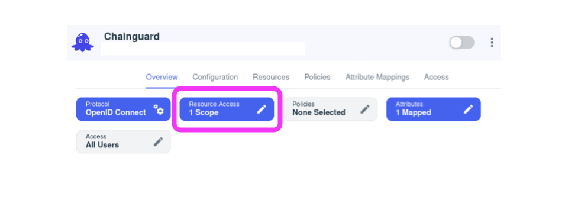
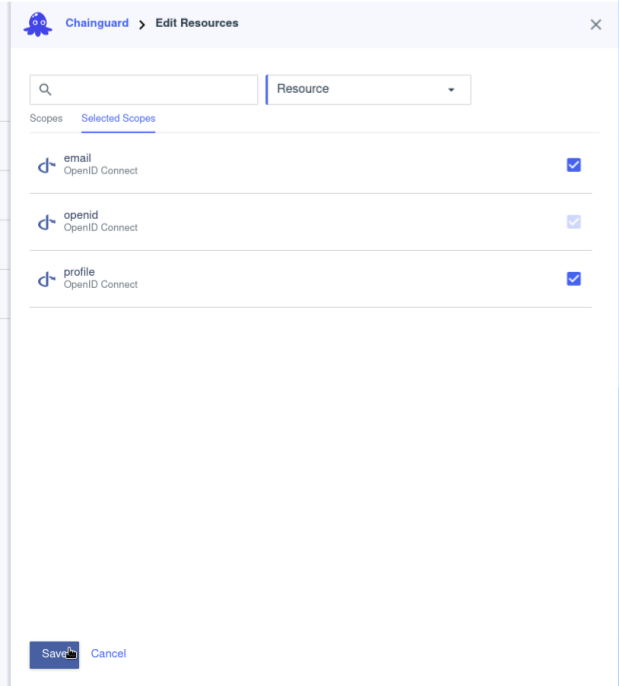
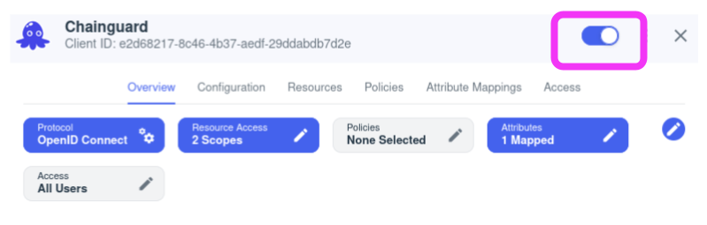

> _This documentation is related to Chainguard Enforce. You can request access to the product by selecting **Chainguard Enforce** on the [inquiry form](https://www.chainguard.dev/contact?utm_source=docs)._

The Chainguard platform supports Single Sign-on (SSO) authentication for users. By default, users can log in with GitHub, Gitlab and Google, but SSO support allows users to bring their own identity provider for authentication. 

This guide outlines how to create a Ping Identity Application and integrate it with Chainguard Enforce. After completing this guide, you'll be able to log in to Chainguard Enforce using Ping and will no longer be limited to the default SSO options.


## Prerequisites

To complete this guide, you will need the following.

* `chainctl` installed on your system. Follow our guide on [How To Install `chainctl`](/chainguard/chainguard-enforce/how-to-install-chainctl/) if you don't already have this installed.
* A Ping Identity account over which you have administrative access. 


## Create a Ping Identity Application

To integrate the Ping identity provider with the Chainguard platform, [sign on to Ping Identity](https://www.pingidentity.com/en.html) and navigate to the Dashboard. Click on the **Connections** tab in the lefthand sidebar menu, and then click on **Applications** in the resulting dropdown menu. From the Applications landing page, click the plus sign (**➕**) to set up a new application.


Configure the application as follows:

* **Application Name**: Set a name and option description (such as "Chainguard") to ensure users recognize this application is for authentication to the Chainguard platform.
* **Icon**: You can optionally add a Chainguard logo icon here to help your users visually identify this integration. If you'd like, you can use the icon from the [Chainguard Enforce Console](https://console.enforce.dev/logo512.png).
* **Application Type**: Select **OIDC Web App**.


After setting these details, click the **Save** button.

Next, configure scopes for the application. In the **Overview** tab, click the **Resource Access** scope button.



Add **email** and **profile** scopes, then save.



Next, configure the OIDC application. Navigate to the **Configuration** tab and click the "edit" icon.

To configure the application, add the following settings.

* **Response Type**: Select the **Code** checkbox.
* **Grant Type**: Select the **Authorization Code** checkbox, and set PKCE Enforcement to "Optional."

> Warning: Setting a grant type other than **Authorization Code** may compromise your security posture.

* **Redirect URIs**: Set the Redirect URI to [`https://issuer.enforce.dev/oauth/callback`](https://issuer.enforce.dev/oauth/callback).


Click the **Save** button to save your configuration. 

Finally, enable the Chainguard application by toggling the knob in the top right corner.



This completes configuration of the Ping application. You're now ready to configure the Chainguard platform to use it.


## Configuring Chainguard to use Ping SSO

To configure Chainguard make a note of the following settings from your Ping application. These can be found in the Ping console under the **Configuration** tab of the **Application** page.

* Client ID 
* Client Secret
* Issuer URL

Next, log in to Chaingaurd with `chainctl`, using a social provider like Google, Github, or Gitlab to bootstrap your account.

```sh
chainctl auth login
```

Note that this bootstrap account can be used as a ["break glass" account](/chainguard/chainguard-enforce/authentication/custom-idps/#break-glass-accounts) (that is, a backup account you can use to log in if you ever lose access to your primary account). However, if you prefer to remove this rolebinding after configuring the custom IDP, you may also do so.

Lastly, create a new identity provider using the Okta application details you noted previously.

```sh
export NAME=ping-id
export CLIENT_ID=<your client id here>
export CLIENT_SECRET=<your client secret here>
export ISSUER=<your issuer url here>
chainctl iam identity-provider create \
  --configuration-type=OIDC \
  --oidc-client-id=${CLIENT_ID} \
  --oidc-client-secret=${CLIENT_SECRET} \
  --oidc-issuer=${ISSUER} \
  --oidc-additional-scopes=email \
  --oidc-additional-scopes=profile \
  --name=${NAME}
```

You’ll be prompted to select a Chainguard IAM group under which to install your identity provider. Your selection won’t affect how your users authenticate but will have implications on who has permission to modify the SSO configuration. For more information, check out the [IAM and Security section](/chainguard/chainguard-enforce/authentication/custom-idps/#iam-and-security) of our Introduction to Custom Identity Providers in Chainguard. 