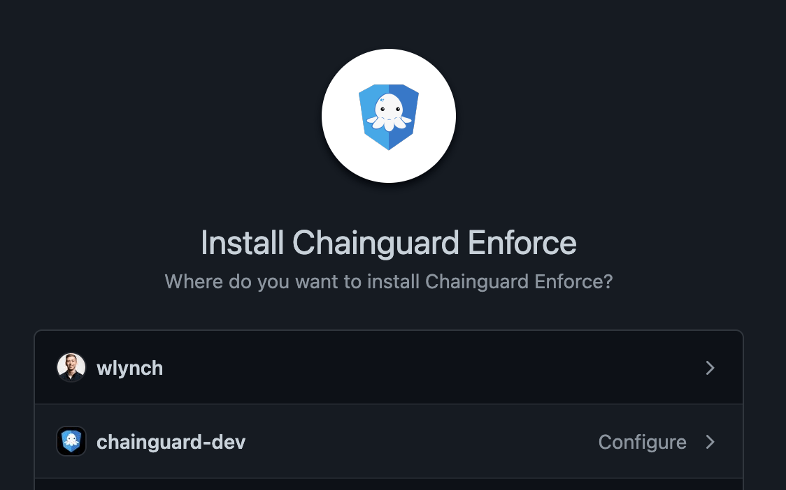
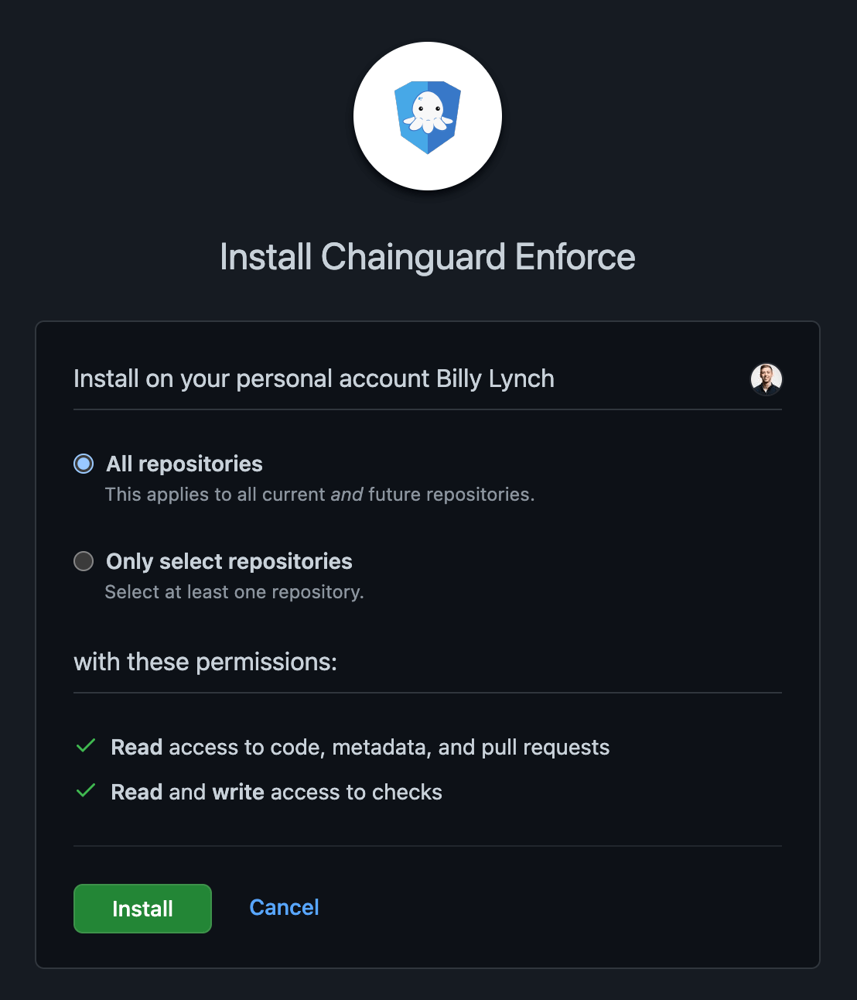

Chainguard Enforce for Git offers Git signature verification and enforcement for your GitHub repositories. With Enforce for Git, you can verify [Sigstore Gitsign](https://docs.sigstore.dev/gitsign/overview) commits and have greater trust in commits by signing commits with ephemeral keys tied to user identities.

Enforce for Git currently works with public or private repos on [github.com](https://github.com).

> **Note**: This app is currently in alpha, so permissions may change, and features may be added or removed without notice during this time.

This guide will walk you through installing and setting up Chainguard Enforce for GitHub. 

## Prerequisites

This app assumes that you have a GitHub account, and that mosty likely you are already connected to a GitHub organization and collaborating on code repositories. 

Before you can install, you'll need to register your organization for early access.

During early access, Chainguard is requiring users to manually register the organizations they wish to use with Enforce for GitHub. While skipping this step will not prevent you from installing the app on GitHub, the app will not respond to repository webhooks until you are registered.

To register, you will need to provide the following information:

- Point of contact for feedback and announcements.
- What orgs and repos you would like to enable.

## Navigate to app on GitHub 

Navigate to the GitHub app installation page available at [https://github.com/apps/chainguard-enforce](https://github.com/apps/chainguard-enforce).

From here, select the **Configure** button towards the right of the page. 

## Select user or organization

Once you click on the **Configure** button, you'll be directed to a page where you can select your desired user or orgization.

If you select your user, you will be able to install onto your personal account and will be able to select either the all of your repos or specific ones. If you select an organization, you will install Enforce for GitHub onto your GitHub organization. You will need administative access or approval to do this. Within this workflow you can also select either all of the organization's repos or specific ones. 

## Review and install

At this point, you should review your permissions. You can restrict Enforce for GitHub to only have access to certain repos within your account or organization.

The following table explains the permissions that the app is granted and why each permission is needed. 

| Permission                      | Why it's needed                                                           |
| ------------------------------- | ------------------------------------------------------------------------- |
| Read access to metadata         | Required by GitHub Apps                                                   |
| Read access to code             | Used to fetch commit signatures and receive push events.                  |
| Read access to pull requests    | Used to resolve pull requests to commits and receive pull request events. |
| Read and write access to checks | Used to write pull request status checks.                                 |

Once you are satisfied with the permissions and the location where you want the app installed, you can continue the workflow to install Chainguard Enforce for Git.

## Support

If you encounter any issues, please reach out to the team via [support@chainguard.dev](mailto:support@chainguard.dev).

Want to learn more about Chainguard Enforce? Have a feature request? Let us know at [https://www.chainguard.dev/contact](https://www.chainguard.dev/contact).