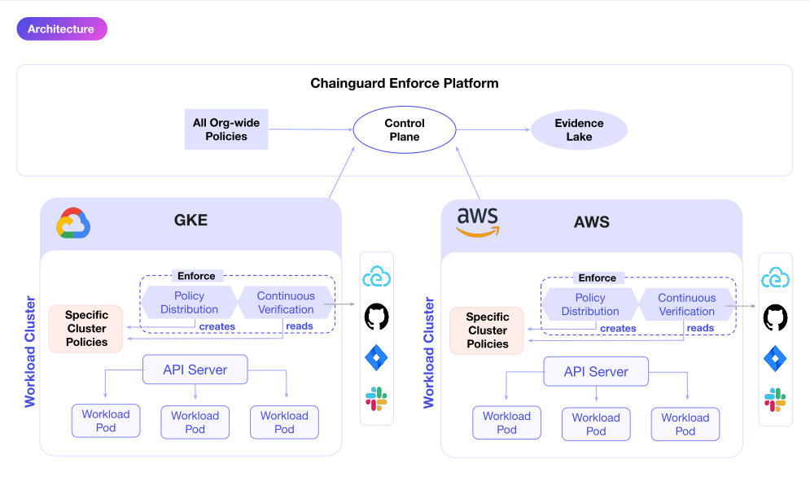
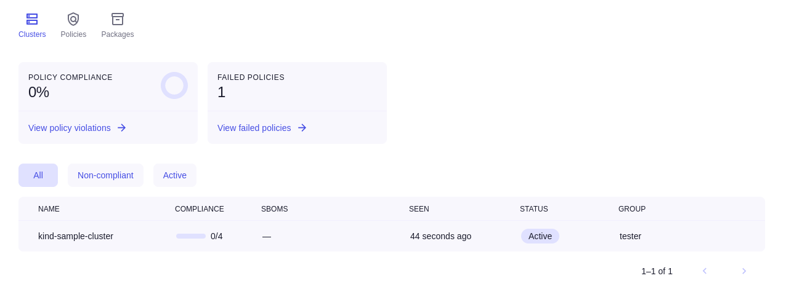
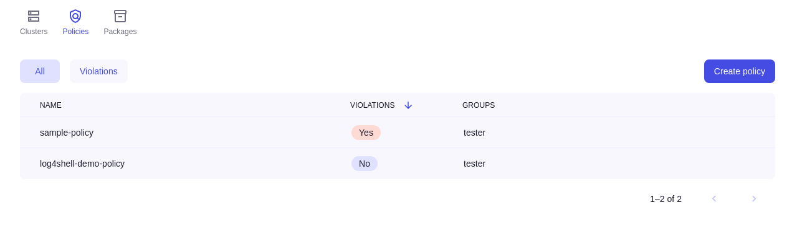

> _This document relates to Chainguard Enforce. You can request access to Chainguard Enforce through selecting **Chainguard Enforce for Kubernetes** on our [inquiry form](https://www.chainguard.dev/get-demo?utm_source=docs)._

An organization's software supply chain can contain many possible points of entry for malicious actors and lots of potential for unintended vulnerabilities. Indeed, with recent high-profile security incidents like the SolarWinds breach and the discovery of the Log4Shell vulnerability, [software supply chain security](/software-security/what-is-software-supply-chain-security/) has become a top priority for many organizations.

**Chainguard Enforce** offers a supply chain security solution for containerized workloads, which can help keep organizations' software supply chains secure by default. Enabling engineering and security teams to ensure continuous compliance, Chainguard Enforce protects organizations from supply chain threats through policy enforcement. Using open source projects and standards that are trusted by the community — like Cosign and Fulcio from the Sigstore project — Chainguard Enforce offers a robust approach to securing your workloads, allowing you to do the following:

* Discover your running workloads, top security risks, and recommended mitigations
* Define and apply supply chain security policies to your Kubernetes clusters
* Sign any software artifact — including container images, code commits, and more — with an identity-based one-time-use signature
* Meet compliance requirements such as SLSA levels, CIS benchmarks, Pod Security Standards, and more
* Ensure continuous compliance in real time of all of your organization's policies with instant notification of any violations

This article provides an overview of Chainguard Enforce and its components.

## What is Chainguard Enforce?

Chainguard Enforce is a developer platform for end-to-end software supply chain security that operates at the level of Kubernetes fleets. Once you install Enforce onto a Kubernetes cluster and apply a policy, Chainguard Enforce will immediately begin analyzing metadata associated with images running in the cluster to determine whether it satisfies the requirements defined within the policy. Specifically, it inspects the given cluster's [software artifacts](https://console.enforce.dev/policies/catalog), such as an image's software bill of materials (SBOM). Based on the details within the images' metadata, Chainguard Enforce will determine whether those images satisfy the policy.

Chainguard Enforce provides a rich [IAM model](../overview-of-enforce-iam-model/) similar to the likes of AWS and GCP, allowing you to organize policies and clusters into a hierarchy of groups through its Identity and Access Management (IAM) model. When you install Enforce onto a cluster, you associate that cluster with an existing IAM group. Likewise, when you create a policy, you associate it with a group and it is automatically applied to any clusters already associated with that group. 

One feature that makes Chainguard Enforce unique is [continuous verification](../understanding-continuous-verification/). This means that Enforce will scan the cluster on a regular cadence to ensure that it complies with any policies you've applied to it. Chainguard Enforce uses an [admission controller](https://kubernetes.io/docs/reference/access-authn-authz/admission-controllers/) to block any requests that violate a cluster's policy. 

Typically, admission controllers only check policies when Kubernetes resources are being created. If new policies are rolled out, or the state of an application’s compliance degrades over time, then admission controllers will not catch the compliance degradation. Chainguard Enforce, however, continuously scans the cluster against all of the latest policies. This means that if a deployed application violates a new policy or falls out of compliance, it will catch the policy violation before Kubernetes acts on the request. 

Violations can be sent as Cloud Events, so you can respond in the most appropriate way for your policies and applications. This might be to file a JIRA ticket, page the on-call, delete pods, or trigger a CI/CD pipeline to redeploy the application. Regardless of how you configure your response, the violation will be logged for future reference.

The following diagram outlines Chainguard Enforce's various components and how they work together. 

The Chainguard Enforce architecture contains a lightweight agent that can be installed in any Kubernetes cluster in a public or private cloud environment. The agent operates within the clusters to create, read, and apply policies. The Enforce Agent communicates with a centralized SaaS control plane where users can define, edit, and distribute policies across their fleet, as well as view information about their clusters, workloads, and policy results. The Enforce SaaS control plane also contains an Evidence Lake that allows organizations to store and retrieve information about their security posture over time. 

Enforce can also be configured to send events to external systems like Slack, JIRA, or GitHub to notify users of policy violations, configuration changes, and more.  Finally, Enforce offers a command line interface, `chainctl`, for users to interact with clusters and policies from the command line.

## Managing Chainguard Enforce with chainctl

`chainctl` — short for "Chainguard Control" — is the command line interface tool for interacting with Chainguard Enforce. It communicates with the Enforce API, allowing you to manage policies, IAM groups, and cluster connections. Assuming you've been granted access to the product, you can [install `chainctl` for Chainguard Enforce](/chainguard/chainguard-enforce/how-to-install-chainctl/) on any machine you use to manage your Kubernetes clusters.

`chainctl` uses the familiar `<context> <noun> <verb>` style of CLI interactions. For example, to list groups within the context of Chainguard IAM, you can run `chainctl iam groups list` to receive relevant output.

For more information on how to use `chainctl`, please refer to our [`chainctl` documentation](/chainguard/chainguard-enforce/chainctl-docs/chainctl/).

## The Chainguard Enforce Agent

In the context of computing, a software agent is a program that performs certain actions on behalf of a user. A software agent has the authority to make decisions on its own and doesn't necessarily require user input. Accordingly, the Chainguard Enforce Agent is able to analyze a given cluster and enforce any policies you've applied to the cluster without manual human oversight. 

You can use `chainctl` to install the Chainguard Enforce Agent as outlined in the [Chainguard Enforce User Onboarding](../chainguard-enforce-user-onboarding/). Alternatively, you can also install the Agent declaratively, either with a [helm chart](../alternative-installation-methods/#helm-chart) or by using [raw YAML](../alternative-installation-methods/#raw-yaml).

Instead of installing the Agent directly on your cluster, you can [set up a Cloud Account Association](../cloud-account-associations) to allow a remote Agent — managed by Chainguard — to access your cloud account resources on your behalf. Known as "Agentless connections" these can be useful since they don't consume any cluster resources and, because they're managed by Chainguard, issues can often be addressed more quickly than clusters using agentful connections. Additionally, Agentless connections allow for read-only access to your clusters, which some users may find desirable.

Currently, Agentless connections are limited to GKE and EKS clusters with a public API endpoint.

## The Chainguard Enforce Console

While `chainctl` provides a useful way to interact with Enforce over the command line, you can also manage it through the Chainguard Enforce Console — a web-based user interface. If you have already been granted access to Chainguard Enforce, you can access the Console at [console.enforce.dev](https://console.enforce.dev). 

The Chainguard Enforce Console provides a high-level overview of all your clusters running Chainguard Enforce. 

You can also find the policies you've applied to your clusters.

For more information on how you can use the Console as part of your policy creation workflow, follow our guide on [How to create policies in the Chainguard Enforce Console](../chainguard-policies-ui/).

## Chainguard Enforce policies

After installing Chainguard Enforce onto a Kubernetes cluster, you can create one or more policies that apply to the images running in your cluster. Policies are written in YAML, and define what images the policy applies to as well as the specifications that they must meet in order for the policy to be satisfied. Each Chainguard Policy needs to be associated with a group, and will be effective for that group as well as all the groups descending from it. Each Cluster needs to be associated with a group and will be enforced based on that group’s policies.

To better understand how policies work in Chainguard Enforce, we encourage you to review the [Sigstore Policy Controller documentation](https://docs.sigstore.dev/policy-controller/overview). In particular, you may want to review the Policy Controller [Admission of images documentation](https://docs.sigstore.dev/policy-controller/overview/#admission-of-images) to understand how to admit images through the cluster image policy. Additionally, Chainguard has assembled a [policy catalog](https://console.enforce.dev/policies/catalog) in the Chainguard Enforce Console which provides a number of sample policies you can use or edit to suit your own needs.

## Chainguard Enforce for Git

In addition to ensuring that Kubernetes clusters comply with established policies, Chainguard Enforce also supports Git signature verification for GitHub repositories. Chainguard Enforce for Git is built around [Gitsign](https://docs.sigstore.dev/gitsign/overview/), a tool that is part of [Sigstore suite](https://www.sigstore.dev/). Gitsign implements keyless Sigstore to sign Git commits with a valid OpenID Connect identity, like a GitHub or Google account. This allows users to sign their Git commits without the need for GPG keys or a complicated configuration.

After [installing the Chainguard Enforce app on a GitHub repository](/chainguard/chainguard-enforce/chainguard-enforce-github/install-enforce-github/) you can configure it to ensure that any commits to that repo must be signed by a verified Git signature before they're merged. Chainguard Enforce for Git currently works with public or private repositories on GitHub. 

> Note: Chainguard Enforce for Git is currently in alpha, so permissions may change, and features may be added or removed without notice during this time.
