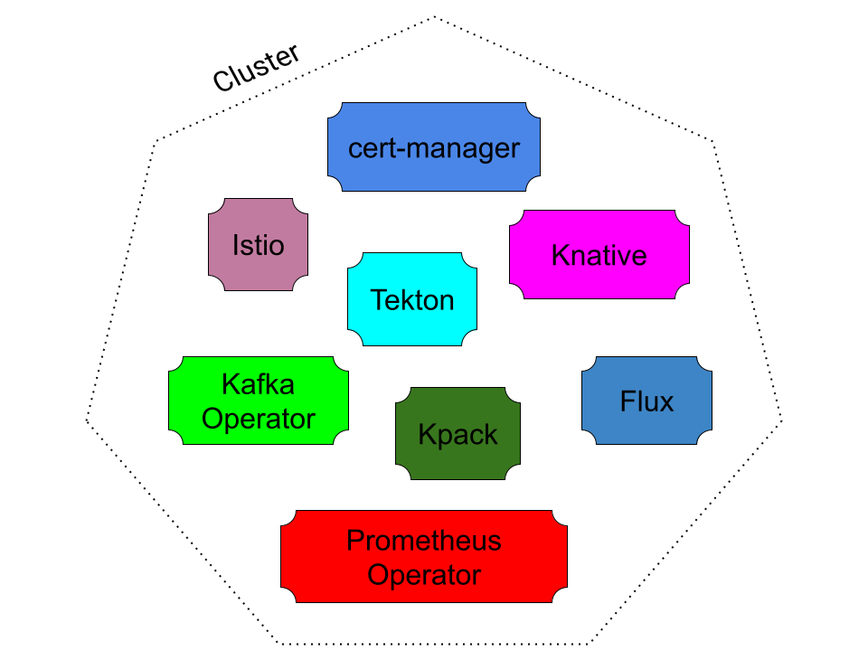

As you work with Chainguard Enforce, you're likely to come across references to the term "Gulfstream," but its meaning may not be immediately clear. Put briefly, Gulfstream is a proprietary controller infrastructure from Chainguard that can be used to build first-party SaaS-aware controllers. It can also be used to retrofit upstream controllers (like [policy-controller](/open-source/sigstore/policy-controller), [Tekton](https://tekton.dev/), or [Knative](https://knative.dev/docs/)) to run as SaaS. 

Gulfstream is a critical component of the Chainguard Enforce platform. This conceptual article provides a high-level overview of the technological problems and limitations that led to Gulfstream's development, as well as how Gulfstream overcomes them.

## Background

Gulfstream was born out of two rising trends within the Kubernetes ecosystem that, when combined, present a high level of complexity for cluster operators.

The first is the sheer proliferation of clusters. It's increasingly common for organizations to have multiple clusters per Availability Zone (AZ), as in the following diagram.

This trend is driven by a number of factors, including the following.

* A desire to further reduce the blast radius of a cluster-wide outage by segmenting rollouts within an AZ further.
* A tenancy model where each logical application gets its own cluster per AZ.
* A need for more resources per AZ than Kubernetes currently supports in a single cluster.

The second trend is the growth of extensions based on [Custom Resource Definitions](https://kubernetes.io/docs/concepts/extend-kubernetes/api-extension/custom-resources/) (CRDs) within Kubernetes. These kinds of extensions have been used for a variety of purposes, from certificate provisioning to higher level app abstractions to service mesh, as in the following diagram. The following diagram represents a cluster running a variety of common extensions.

CRDs are only made up of data — which is often schematized — but they are brought to life by controller processes and webhooks that conventionally run on the cluster itself, serving as a sort of extension to the built-in control plane processes. 

With traditional controller architectures, every cluster in a fleet runs every one of the controllers needed to run certain abstractions. This means that it's increasingly common for platform operations teams to be managing multiple extensions across many clusters, as in this diagram.

As the number of clusters grows, so does the difficulty and cost of offering managed extensions to each of them, potentially growing into a complexity nightmare.

## Understanding Controllers, Reconcilers, and Control Planes

With the spread of CRDs, it can be difficult to know how trustworthy a given extension is. When you broaden the scope of Kubernetes with extensions based on CRDs, you install additional control planes which implement the semantics of their extension. A *control plane* consists of the various APIs that control the behavior of systems; in Kubernetes, the API server and its controllers form the control plane. 

A *controller* ensures that the actual state of a given object meets its desired state through a process called *reconciliation*. The part of the code that enforces reconciliation is called a *reconciler*. The controller watches various predefined resources; events occur on these resources, prompting reconciliation.

Knative's controller architecture separates the logic of controllers and reconcilers, as the following diagram represents.

In this architecture, the controller is aware of informers and the workqueue, sets up the various relationships between event triggers and the workqueue, and hands off clients and listers to the reconciler. Reconcilers know nothing about informers, they just know about the clients and listers in order to access what they need to enable reconciliation.

## Trusting trusted control planes

[SLSA](https://slsa.dev/) makes several references to the idea of *trusted control planes*. Put simply, a trusted control plane is one that's trusted in some way that other control planes or workloads are not. For example, in the context of “[hermetic builds](https://slsa.dev/spec/v0.1/requirements#hermetic)”, the trusted control plane is trusted to fetch the build’s dependencies prior to disabling network access. Similarly, for "[non-falsifiable provenance"](https://slsa.dev/spec/v0.1/requirements#non-falsifiable) the trusted control plane is trusted with the key material to sign provenance which must not be accessible to ordinary workloads.

You can think of trusted control planes as being akin to supervisor processes: they are often adjacent to normal workloads and can support them, for example by fetching external dependencies. Trusted control planes can also audit workloads, such as by signing provenance attestations, or authorizing them to perform certain functions, as in the case of policy engines. 

Trusted control planes are a critical part of securing the software supply chain, whether it is the trusted control plane orchestrating aspects of your CI/CD pipeline or the one making policy decisions about what is allowed to run in your production cluster. 

In the context of Kubernetes, running trusted control planes presents a significant complication when it comes to the level of isolation Kubernetes provides between workloads. The weaker this isolation is, the less confidence you can have that a control plane workload has not been compromised. Strong isolation is sometimes called “hard multi-tenancy”, where the typical isolation in Kubernetes is often called “soft multi-tenancy”.

One strategy used to isolate workloads is to run them in separate node pools. This way, even with a container escape, the workloads are running on different nodes. However, if the attacker gains access to API server credentials, they can potentially move laterally and try to compromise workloads on different nodes.

So without hard multi-tenant isolation between a control plane and user workloads, can a control plane truly be considered “trusted”? In the event that a workload is compromised, you can't be certain that an attacker cannot move laterally into the trusted control plane process.

## Where Gulfstream comes in

As mentioned in the introduction, Gulfstream is a streaming controller architecture for Kubernetes. It was developed to combat the cost of control plane extensions at scale, make costs proportional to usage, and amortize the resource usage over the clusters being extended.

Gulfstream encapsulates the Controller and Webhook responsibilities into CRDs. It also has a *Meta Control Plane* (MCP) that understands how to handle these CRDs and delegate the Reconciler business logic to SaaS.

Gulfstream has two main modes of execution. Firstly, it supports users running their own MCP, also known as the "Chainguard Enforce Agent," which is useful for private clusters, or clusters behind a firewall. Chainguard also offers a fully SaaS Gulfstream, sometimes referred to as "agentless." In this case, the MCP runs on a cluster managed by Chainguard, but is pointed at your cluster to work much like “agentful”. This enables a hard multi-tenant separation between our trusted control plane and the workloads running on your cluster.

Chainguard's control plane doesn’t run alongside user code, so it can provide certain security assurances that are much harder to achieve when running on the same cluster. Chainguard Enforce speaks directly to your Kubernetes API server using your cloud provider’s IAM to monitor your cluster’s workloads, and your cluster’s API server talks directly to Chainguard Enforce for admission control decisions based on policy. So even if a workload on your cluster were to be compromised, it is no easier for the attacker to compromise a Chainguard trusted control plane than attacking us head on.

## Learn More

As mentioned previously, running Chainguard Enforce in its agentless mode allows for hard multi-tenant separation between Chainguard's trusted control plane and your workloads. You can get started with agentless connections by first [setting up a cloud account association](../cloud-account-associations/), then you can [use Discovery to discover your cloud resources](../chainguard-enforce-discovery-onboarding/), and finally install Chainguard Enforce in Agentless mode.