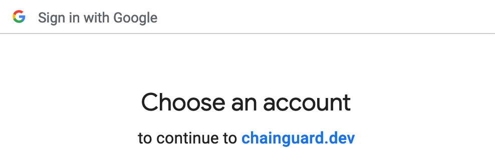
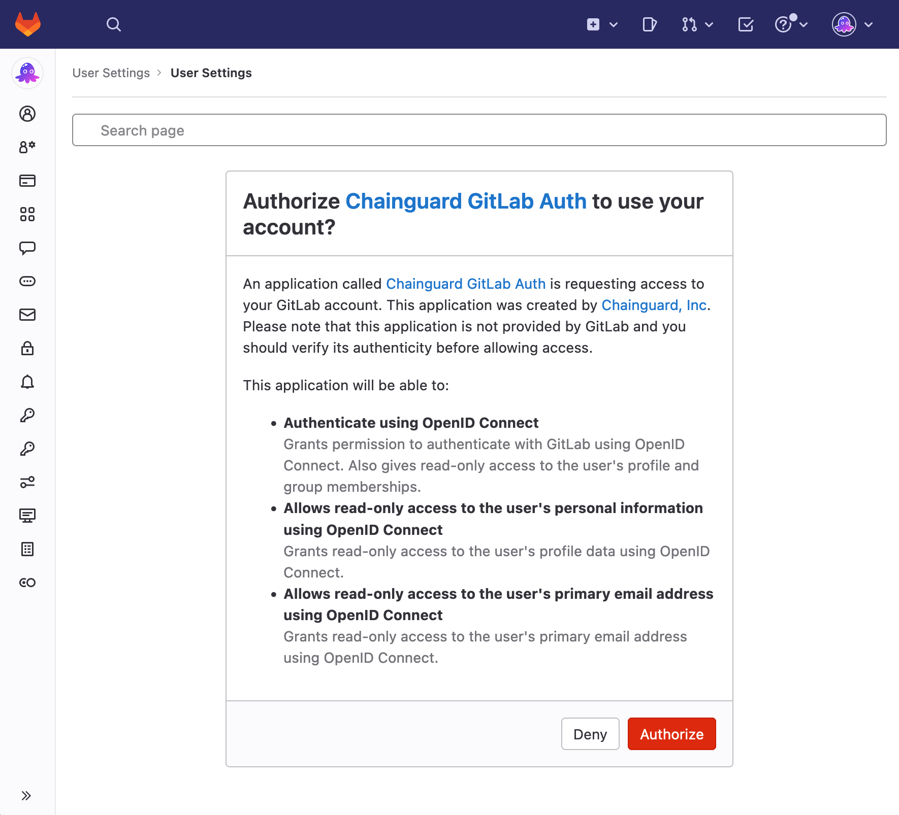
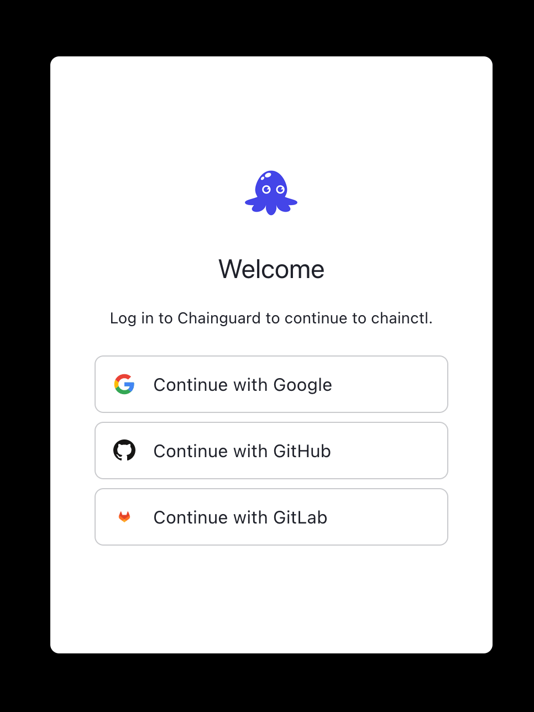

> _This document relates to Chainguard Enforce, which you will need access to in order to follow along. You can request access through selecting **Chainguard Enforce for Kubernetes** on our [inquiry form](https://www.chainguard.dev/get-demo?utm_source=docs)._

Chainguard Enforce currently offers login and authentication through three different OpenID Connect identity providers: Google, GitHub, and GitLab. [OpenID Connect](https://openid.net/connect/) (OIDC) provides an identity layer on top of the OAuth 2.0 protocol, and it is integrated with both the Chainguard Enforce Console web browser interface and `chainctl` on the command line. This document will walk through both of these workflows.

## Signing in through the Chainguard Enforce Console

Once you have access to Chainguard Enforce, you can navigate a web browser to [console.enforce.dev](https://console.enforce.dev). A sign in page will be displayed, similar to the one below. 


From here, you have three options to authenticate in to the Console via one of the following OIDC providers: 

* [Google](https://developers.google.com/identity/openid-connect/openid-connect)
* GitHub
* [GitLab](https://docs.gitlab.com/ee/integration/openid_connect_provider.html)

**To authenticate with Google** (including through a Google-based email), click the **Google** button, and then select the specific Google account you would like to use to log in to [chainguard.dev](https://chainguard.dev). Note that you may need to log in to your Google account. 



From here, you'll sign in to Chainguard Enforce through Google, and will then be brought to the Enforce Console homepage. 

**To authenticate with your GitHub username**, click the **GitHub** button. You may need to log in to your GitHub account at this point. When you are logged in, review the permissions page and confirm that you would like to authorize Chainguard Enforce.


If you are satisfied with allowing Chainguard Enforce to have the stated permissions, you'll authorize it by clicking on the **Authorize Chainguard Enforce** button, and then sign in through GitHub. You'll then be brought to the Chainguard Enforce Console homepage.

**To authenticate via GitLab**, you'll be prompted to sign in to GitLab if applicable, and then be asked to authorize Chainguard Enforce to use your GitLab account. 




As long as you are satisfied with granting Chainguard Enforce the permissions to your GitLab account, you can click on the **Authorize** button. Next, you'll be brought to the Chainguard Enforce Console homepage.


At this point, you are logged in to Chainguard Enforce and will have access to your Chainguard Enforce account through the Console. 

## Signing in through `chainctl`

When using `chainctl`, you can initiate the login flow through the [`chainctl auth login`](https://edu.chainguard.dev/chainguard/chainguard-enforce/chainctl-docs/chainctl_auth_login/) command. 

When you run this command, you'll receive output similar to the following on your command prompt.

```
Authenticating...
Your browser will now be opened to:
https://auth.chainguard.dev/authorize?access_type=online&client_id=<RELEVANT ID HERE>
```

This will trigger a page to open on your default web browser. If this does not occur, you can copy the full URL on your terminal output and paste it in to a browser address bar.

At this point, your browser will display a login page similar to the following. 



With `chainctl`, you'll have the option to log in with one of the following OIDC providers: 

* [Google](https://developers.google.com/identity/openid-connect/openid-connect)
* GitHub
* [GitLab](https://docs.gitlab.com/ee/integration/openid_connect_provider.html)

**If you will be authenticating with Google**, click the **Google** button, and then select the specific Google account you would like to use to log in to [chainguard.dev](https://chainguard.dev). Note that you may need to log in to your Google account. 


From here, you'll sign in to Chainguard Enforce through Google and then receive a confirmation page that reads `Chainguard Auth Successful`. At this point, you can close the browser window and return to the command line to continue working with `chainctl`. 

**To authenticate with your GitHub username**, click the **GitHub** button. You may need to log in to your GitHub account at this point. When you are logged in to GitHub, review the permissions page and confirm that you would like to authorize Chainguard Enforce.


If you are satisfied with allowing Chainguard Enforce to have the stated permissions, you'll authorize it by clicking on the **Authorize Chainguard Enforce** button, and then sign in through GitHub. Next, you'll receive a confirmation page in your browser that reads `Chainguard Auth Successful`, and you may now close the browser window and return to the command line. 

**To authenticate via GitLab**, you'll be prompted to sign in to GitLab if applicable, and then be asked to authorize Chainguard Enforce to use your GitLab account. 


As long as you are satisfied with granting Chainguard Enforce the permissions to your GitLab account, you can click on the **Authorize** button. Next, you'll be brought to a confirmation page that reads `Chainguard Auth Successful`. You may now close the browser window and can return to the command line to continue using `chainctl`.


Once you return to the terminal window, you'll also be able to review the output that indicates that you have successfully logged in to Chainguard Enforce via `chainctl`:

```
Successfully exchanged token.
Valid! Id: <Relevant ID here>
```

You are now logged in to Chainguard Enforce and can use `chainctl` for your account. 

## Authenticating through another device with `chainctl`

You can use another device (typically a smartphone) to authenticate and log in to Chainguard Enforce when you cannot access your present working device's browser. For instance, perhaps your present device is a container or a cloud virtual machine that doesn't have browser access.

To authenticate, you will browse to the provided URL on an alternate device.

First, authenticate with `chainctl`. In this workflow, we are assuming you are not able to access a browser, so you may be authenticating from a virtual machine or container. 

```sh
chainctl auth login
```

You'll receive output that the device's browser could not open, and be provided with a URL to authenticate.

```
Authenticating...
Error opening browser. Switching to device flow...

Enter the verification code FTFD-ZVTV in your browser at: https://auth.chainguard.dev/activate
Code will be valid for 900 seconds
```

When you navigate to [https://auth.chainguard.dev/](https://auth.chainguard.dev/) with your smartphone or other device, you'll receive a screen with a field to enter the verification you were given in the terminal output.


Once you enter the verification code and complete the workflow by pressing the **Continue** button, you'll receive terminal output that indicates that the token was successfully exchanged.

```
Token received!
Successfully exchanged token.
Valid! Id: af641...
```

You are now authenticated to Chainguard Enforce. 

## Learn more

To learn more about how to work with Chainguard Enforce, you can review our [User Onboarding tutorial](../chainguard-enforce-user-onboarding). If you would like to learn more about the Chainguard Enforce Console, you can read [How to create policies in the Chainguard Enforce Console](../chainguard-policies-ui/). You can also review the full [`chainctl` reference documentation](https://edu.chainguard.dev/chainguard/chainguard-enforce/chainctl-docs/chainctl/) to learn more about our command line tool. 