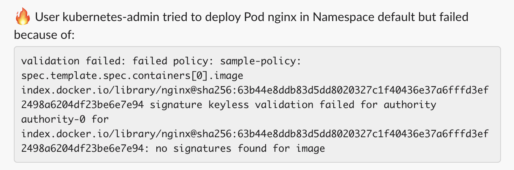

> _This documentation is related to Chainguard Enforce. You can request access to the product by selecting **Chainguard Enforce** on the [inquiry form](https://www.chainguard.dev/contact?utm_source=docs)._

Chainguard Enforce for Kubernetes can send CloudEvents as webhook requests that you can subscribe to and use to do things like generate alerts, create GitHub issues, post messages to Slack channels and more. This tutorial is meant to serve as a companion to the [Enforce Events Slack notifier](https://github.com/chainguard-dev/enforce-events/tree/main/github-issue-opener) example application. It will guide you through creating and deploying a Google Cloud Run service that will send a Slack message to a specified channel for any Enforce policy violation or admission event.

You can also opt to run the example application elsewhere. As long as it is publicly accessible to the [Enforce CIDR network ranges](/chainguard/chainguard-enforce/reference/network-requirements/#cidr-ranges), you will be able to receive Cloudevents and create Slack messages with the example application. If you opt to run the demo application outside of Cloud Run, you can skip to the [Subscribing to Enforce Cloudevents](#subscribing-to-enforce-cloudevents) section, provided you know the publicly accessible URL to your deployed instance of the demo.

## Prerequisites

To follow along with this guide, it is assumed that you have a Kubernetes cluster with Enforce enabled. If you need to set this up, follow our [Getting Started](/chainguard/chainguard-enforce/chainguard-enforce-kubernetes/chainguard-enforce-user-onboarding/) guide to create a local [kind](https://kind.sigs.k8s.io/) cluster that you can use for experimentation.

You will also need:

* The [`gcloud` CLI](https://cloud.google.com/sdk/docs/install) and a Google Cloud account if you choose to run the application using Cloud Run.
* `terraform` to configure a Google Cloud service account, IAM permissions, and deploy the Cloud Run service. If you are running the application elsewhere, you can ignore this requirement.
* A [Slack App with Incoming Webhooks](https://api.slack.com/messaging/webhooks) enabled. Create an App using the Slack UI and specify the channel where you want to receive alerts. You can also use the [legacy incoming webhook](https://api.slack.com/legacy/custom-integrations/messaging/webhooks) integration.
* `chainctl` in order to create a subscription webhook endpoint.
* An [Enforce or Sigstore policy](/chainguard/chainguard-enforce/chainguard-enforce-kubernetes/chainguard-enforce-policy-examples/) and a Kubernetes namespace that is configured with the `policy.sigstore.dev/include=true` label to use Enforce for admission control.

## Steps Overview

Deploying the demo application consists of the following steps:

1. Cloning the example repository
2. Running `terraform` to provision resources in your Google Cloud account
3. Creating a secret in your Google Cloud account to store your Slack webhook URL
4. Subscribing to Enforce Cloudevents
5. Configuring an Enforce policy
6. Deploying a pod that generates a policy violation event

## Cloning the Demo Application

To clone the demo application, `git clone` the [`enforce-events`](https://github.com/chainguard-dev/enforce-events) repository and move into the newly created directory:

```shell
cd ~
git clone https://github.com/chainguard-dev/enforce-events.git
cd enforce-events/slack-webhook/iac
```

Next you will run Terraform to deploy the demo application.

## Running Terraform

Inside the `iac` directory you will find a Terraform module that builds the demo application and configures your Google Cloud project settings.

Run the `terraform init` command to download all the required providers:

```shell
terraform init
```

```
Initializing provider plugins...
- Finding latest version of ko-build/ko...
- Finding latest version of hashicorp/google...
- Installing ko-build/ko v0.0.7...
- Installed ko-build/ko v0.0.7 (self-signed, key ID 36A8C1D1056CC508)
- Installing hashicorp/google v4.61.0...
- Installed hashicorp/google v4.61.0 (signed by HashiCorp)
. . .
```

Now you can generate an execution plan. You will need a few pieces of information to input as variables:

1. `group`: your Chainguard group ID. Use `chainctl iam groups describe <your group> -o json |jq -r '.id'` to retrieve it.

2. `project_id`: your Google Cloud project ID. Use the human readable name for the project as opposed to the numeric identifier.

Once you have all the information gathered, run the `terraform plan` command:

```shell
terraform plan \
  -var "group=<chainguard group ID>" \
  -var "project_id=<gcloud project ID>" \
  -var "name=enforce-events" \
  -out enforce-events.plan
```

You will receive output showing Terraform's execution plan like the following:

```
. . .
  # google_cloud_run_service.slack-notifier will be created
  + resource "google_cloud_run_service" "slack-notifier" {
      + autogenerate_revision_name = false
      + id                         = (known after apply)
      + location                   = "<google location>"
      + name                       = "enforce-events-slack-notifier"
      + project                    = "<gcloud project ID>"
      + status                     = (known after apply)
. . .
To perform exactly these actions, run the following command to apply:
    terraform apply "enforce-events.plan"
```

Inspect the plan to ensure that the resources that Terraform will create are in line with your Google Cloud project's settings and IAM permissions. Once you are satisfied with the plan, apply it:

```shell
terraform apply enforce-events.plan
```

Terraform will run the module and you will receive output like the following:

```
google_service_account.slack-notifier: Creating...
google_secret_manager_secret.slack-url: Creating...
. . .
Outputs:

secret-command = "echo -n YOUR SLACK WEBHOOK | gcloud --project jamon-chainguard secrets versions add enforce-events-slack-url --data-file=-"
url = "https://enforce-events-slack-notifier-ntfj7ezpja-uc.a.run.app"
```

Note down the `url`, and the `secret-command`.

## Configuring Google Cloud with your Slack Webhook URL

With the output from the `terraform apply` step, you can now run the `echo` command to configure Google Cloud with your Slack webhook URL.

Substitute your webhook URL in place of the `YOUR SLACK WEBHOOK` string and run the following command:

```shell
echo -n <YOUR SLACK WEBHOOK> | gcloud --project <google project> secrets versions add enforce-events-slack-url --data-file=-
```

This configures your Google Cloud project with your URL so that it is available to the demo application when it is invoked on Cloud Run.

### Subscribing to Enforce Cloudevents

Now that the demo application is deployed, the next step is to register it as a Cloudevents receiver using Enforce.

Run the following `chainctl` command to create an Enforce webhook subscription:

```shell
chainctl events subscriptions create \
  --group <your chainguard group> \
  https://<url from terraform>
```

You will receive output showing the ID of the subscription and the webhook endpoint like the following:

```
                    ID                   |             SINK
 ----------------------------------------+-----------------------------
  <chainguard group ID>/b17172905d2a4a44 | https://<url from terraform>
  ```

Enforce will now send events to the application that is running on Cloud Run at the specified URL.

## Configuring a Chainguard Enforce Policy

Before you can generate Slack messages for policy violations or admission events, you will need to ensure that you have Chainguard Enforce configured with a policy that you can test. Make sure you have a cluster registered with Enforce using the `chainctl clusters ls` command. If you do not, visit our [Getting Started with Enforce Guide](https://edu.chainguard.dev/chainguard/chainguard-enforce/chainguard-enforce-kubernetes/chainguard-enforce-user-onboarding/#step-3--prepare-kubernetes-cluster) to create and register a cluster.

Once you have a cluster enrolled with Enforce, create the following policy from the Getting Started guide:

```
cat > sample-policy.yaml <<EOF
apiVersion: policy.sigstore.dev/v1beta1
kind: ClusterImagePolicy
metadata:
  name: sample-policy
spec:
  images:
  - glob: "ghcr.io/chainguard-dev/*/*"
  - glob: "ghcr.io/chainguard-dev/*"
  - glob: "index.docker.io/*"
  - glob: "index.docker.io/*/*"
  - glob: "cgr.dev/chainguard/**"
  authorities:
  - keyless:
      url: https://fulcio.sigstore.dev
      identities:
        - issuerRegExp: ".*"
          subjectRegExp: ".*"
EOF
```

Apply it using `chainctl`:

```
chainctl policies apply -f sample-policy.yaml --group=<your chainguard group>
```

In the next step, you'll deploy a pod that does not match the policy and verify that it creates a Slack message.

## Generating an Event that Creates a Slack Message

Create a Kubernetes deployment using `nginx`:

```shell
kubectl create deployment nginx --image=nginx
```

You should receive a message from Enforce on the command line like the following, indicating the `nginx` image is missing a signature and was not admitted into your cluster:

```
error: failed to create deployment: admission webhook "enforcer.chainguard.dev" denied the request: validation failed: failed policy: sample-policy: spec.template.spec.containers[0].image
index.docker.io/library/nginx@sha256:63b44e8ddb83d5dd8020327c1f40436e37a6fffd3ef2498a6204df23be6e7e94 signature keyless validation failed for authority authority-0 for index.docker.io/library/nginx@sha256:63b44e8ddb83d5dd8020327c1f40436e37a6fffd3ef2498a6204df23be6e7e94: no signatures found for image
```

Now check the Slack channel that you configured to receive messages. You should have a corresponding message from Enforce that looks like the following:



## Learn More

Now that you've deployed and tested sending Slack messages with the demo application, you can continue to develop it to alert about other Enforce event types. Check out our [Chainguard Enforce Events](/chainguard/chainguard-enforce/chainguard-enforce-kubernetes/chainguard-enforce-events/) page for a complete reference of event types that Enforce emits.
