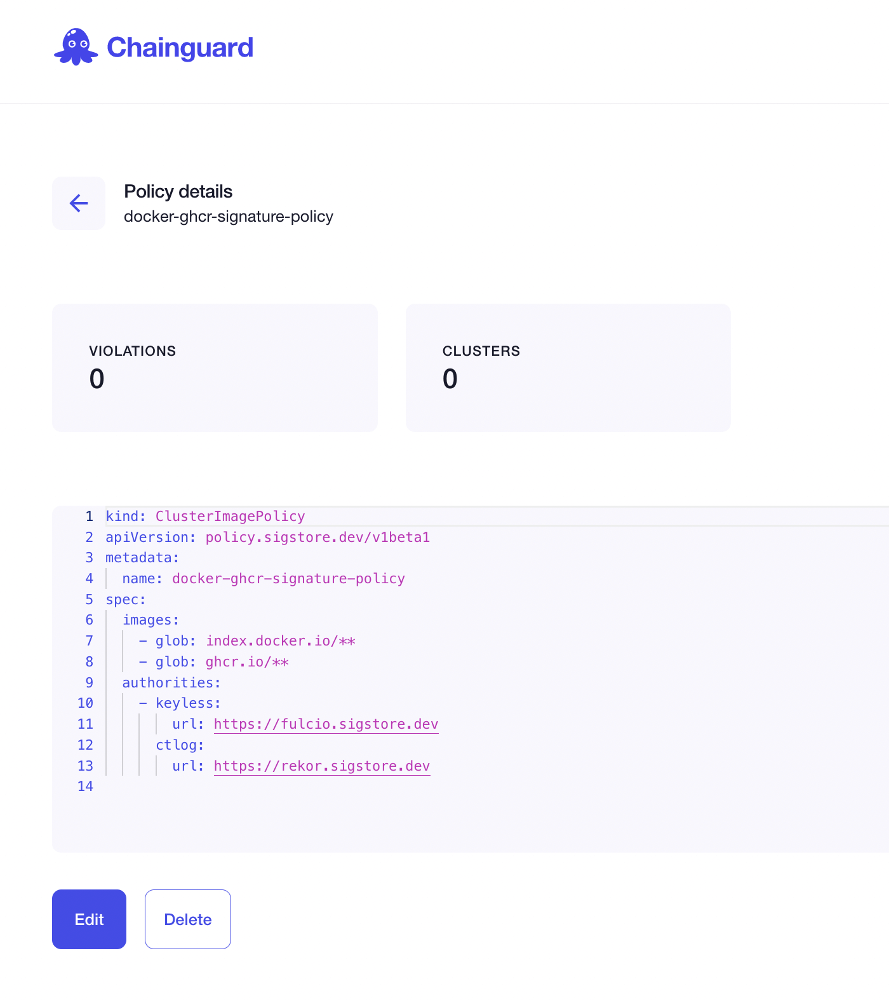
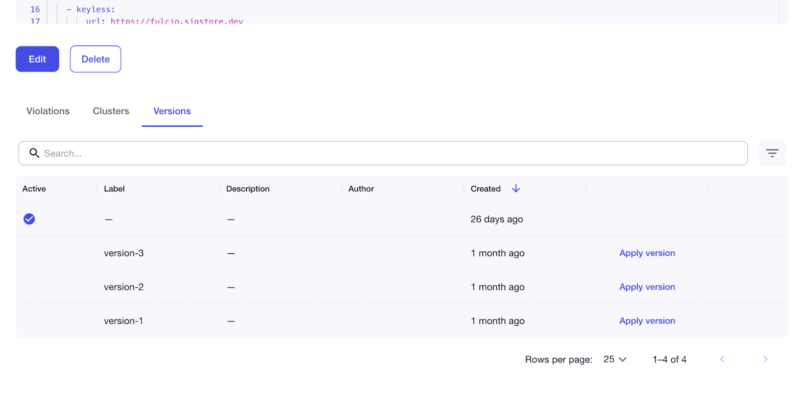
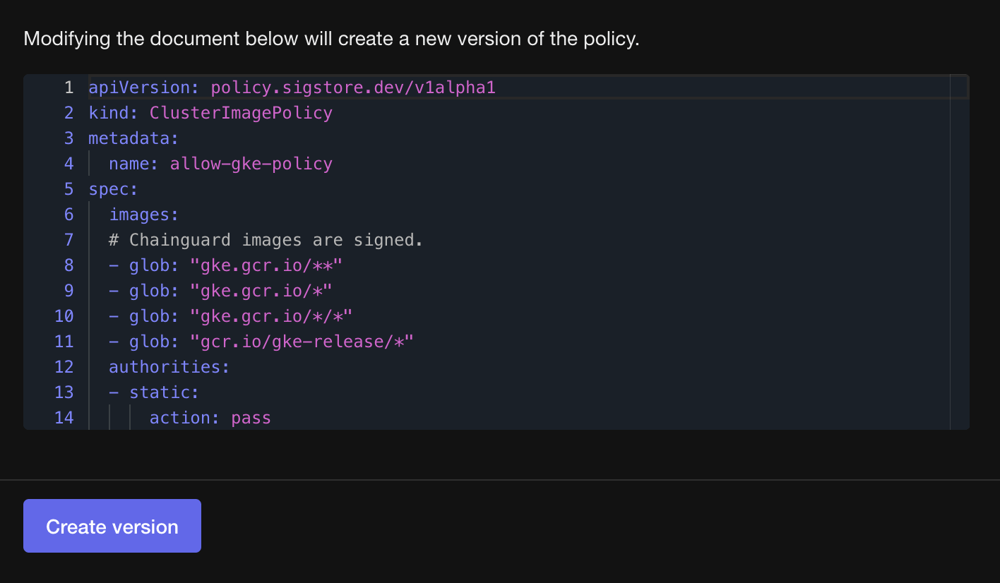


  
  


Security policies in Chainguard Enforce ensure that our development teams are deploying containers within set policies.

We can associate a policy YAML file with a given group in order to achieve our security goals. This guide will go through how to set up policies on the Chainguard Enforce user interface available to you via [console.enforce.dev](https://console.enforce.dev). You must already have an account with Chainguard to follow this guide. You can request access for **Chainguard Enforce** on the [inquiry form](https://www.chainguard.dev/contact?utm_source=docs).

In the Chainguard Enforce Console, we have a [policy catalogue](https://console.enforce.dev/policies/catalog) that provides example policies that you can use right away or modify for your use case. You may also wish to check out our page on [Chainguard Enforce Policy Examples](/chainguard/chainguard-enforce/policies/chainguard-enforce-policy-examples/). If you would like to use the CLI to work with policies, review our [`chainctl` policy docs](/chainguard/chainctl/chainctl-docs/chainctl_policies_apply/) and review our guidance on [how to manage policies with `chainctl`](/chainguard/chainguard-enforce/policies/chainguard-policies-cli/).

For additional policy guidance, you may also review the [Sigstore Policy Controller documentation](https://docs.sigstore.dev/policy-controller/overview). To learn how to admit images through the cluster image policy, review the Policy Controller documentation relating to the [Admission of images](https://docs.sigstore.dev/policy-controller/overview/#admission-of-images).

## Access the Chainguard Enforce Console

To begin, you will need to access your Chainguard Enforce Console. This is available on the web to you at [console.enforce.dev](https://console.enforce.dev). You will need to authenticate your user. Once you are logged in and authenticated, the Chainguard Enforce Console landing page will be displayed.

At the top of the page will be three icons you can click on: **Clusters**, **Policies**, and **Packages**. Click on **Policies** to pull up the policies you have available on Chainguard Enforce.

## Inspect any existing policies

If you were invited to a group, you may already have policies available. From the Policy landing page, you can review any existing policies and any existing violations of those policies.

These are displayed in a table by the policy's **Name**, **Violations** and **Groups**, similar to the following screenshot.

If your table indicates that there are current violations, you can click on the **Violations** button to learn more about these violations.

Note that the policies page also indicates whether a given policy is in **Enforce** or **Warn** mode.

You can modify whether a policy is in Enforce or Warn mode by editing the YAML file. Review our doc on [Disabling Policy Enforcement](/chainguard/chainguard-enforce/policies/how-to-disable-policy-enforcement/) for more details.

## Initialize a new policy

Let's step through creating a new policy. Click on the **Create policy** button above the policy table.

This button will take you to the [Chainguard Enfroce Policies Catalogue](https://console.enforce.dev/policies/catalog), which will provide you with a library of policies you can use right away or edit, or the option to write your own policy from scratch.

## Write and publish a policy

Whether you choose to begin with a **Custom** policy or another option from our catalogue, a new sidebar will be displayed that has fields to choose the **Group**, and write a **Description** for your new policy, and a YAML file, which you can edit.

Fill in the fields for this policy based on your policy enforcement goals. In the policy below, we are requiring signatures for all Docker and GitHub container images. We have associated it with the `chainguard-demos` group.

Once you are satisfied with the new policy, you can click the **Publish** button towards the bottom of the form.

This new policy will now appear on your policy table within the Chainguard Enforce Console.

## Edit policies

To modify an existing policy, click on the relevant policy within your Chainguard Enforce Console table. This will take you to a view allowing you to edit or delete the policy.

To edit a policy, click  on the **Edit** button will allow you to make modifications to the description or YAML file of the policy. When you are satisfied with the changes you have made, you can click on the **Publish** button once again.

## Policy versions

Policy versions enable you to gradually test and roll out policy changes to your cluster over time, without losing the historical context of how a given policy has changed. Versions also increase your visibility into when and by whom policies were updated. With policy versions, you can quickly rollback to a stable version in the event of the inevitable typo or unintended consequence discovered too late.

To create new versions of a policy in the Chainguard Console, navigate to your list of policies, under **Enforce** and **Policies**, and click on the row that includes the policy you would like to version.

This will take you to the **Policy details** page, which will provide you with the policy document in full. Below the document are a series of tabs, including a **Versions** tab. Clicking on the **Versions** tab will display a table with the versions of your policy. It will indicate which version is active, while also allowing you to activate a particular version of the policy by clicking on the **Apply version** link in that row.
‍

To create a new version of the policy, click the **Edit** button located below the policy document. Clicking on this button will open the policy editor, where you can make changes to the policy document.

Once you have finished making edits to the document, click on the **Create version** button, and a new version of the policy will be created.

You can also make edits to the description field in the policy editor, but this will not create a new policy. It will edit the description of the currently active policy.

## Delete policies

If you would like to delete a policy, click on the policy you wish to delete within your Chainguard Enforce Console table. From there, click on the **Delete** button.

You'll now have the option to delete a published policy. You will need to type in the name of the policy in order to delete it. Once you have written the name of the policy in the field, click the **Delete** button to delete the policy and return to your **Policies** page.
