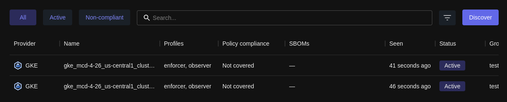

At Chainguard, we have a shared awareness of data collection and retention. This document focuses on cataloging the data captured by Chainguard Enforce. It also includes a brief Frequently Asked Questions section outlining some of Chainguard's data collection practices.

## Customer Data Collected by Chainguard Enforce

The following subsections outline the various types of data that are collected by Chainguard Enforce, grouped by category.

### IAM Data (user provided)

Data regarding tenant IAM structures:
* IAM group hierarchies
* IAM role bindings

Auxiliary metadata about a customer includes:
* User email: we collect user emails in order to allow showing ACL (access control list) audit information through `chainctl iam rolebindings list`


### Policy Data (user provided)

Information to enforce user policy, including:
* IAM group
* Container Image globs
* Signing key identifying information:
    * OIDC issuer and subject pairs
    * URL of Fulcio server
    * KMS key reference
* Event subscriptions to receive compliance-related events 

### Enforce Cluster Data

Metadata regarding tenant clusters, including:
* Chainguard IDs (cluster ID and cluster remote ID)
* IAM group the cluster belongs to
* Identity Issuer of the cluster
* Kubernetes version
* Chainguard Agent version

Chainguard Agent Activity Data:
* Chainguard controller or webhook name
* "Last seen" timestamp

Cluster Container Images Data:
* Image name
* Image hash
* Type of the workload running this Image (`Deployment`, `ReplicaSet`, `Pods`)
* Metadata of the workload running this image:
    * Name
    * Namespace

Other Cluster Data:
* Namespace labels, to allow Enforce to recognize when namespace enforcement is enabled or disabled
* Node metadata


## Compliance data
Chainguard Enforce also collects the following compliance data:
* Data regarding the packages constituting the image (SBOM), which are:
    * Package name
    * Package version
    * Package PURL
* Image compliance related to Enforce policies


## Data Collection FAQs

### How is customer data collected?

* **User-provided:** This data is provided by the users through our CLI or Terraform provider. The user interfaces call the Chainguard Console API to pass the provided data through, which is then transferred to our production database for permanent storage.
* **Through the Kubernetes control plane**: The Kubernetes control plane is queried by the Chainguard agent. This agent may run in the customer cluster, or in our hosted cluster. This data is uploaded via gRPC to the Chainguard Console API, which is then transferred to our production database.
* **Through scanning processes**: Chainguard’s container image scanning processes periodically scan customers' images to verify against their policies. Compliance data retrieved from these scans is populated to the Chainguard Datastore API and then transferred to our production database.

### Where is customer data stored?

Customer data is stored in a hosted cloud provider database, which is backed up regularly with snapshots. We may also cache this data locally.

### How long is data retained?

* IAM and Policy Data is retained until the users delete the resource
* Data regarding a cluster will be stored until Enforce is uninstalled from that cluster

We retain backups for 7 days, after which deletion will be permanent.


### What does the `LAST SEEN` value refer to?

The `chainctl clusters list` command returns information about your clusters, including a column labeled `LAST SEEN`.

```sh
chainctl clusters list
```
```
   NAME   | . . . | AGENT VERSION | LAST SEEN |   ACTIVITY
----------+ . . . +---------------+-----------+---------------
cluster-a | . . . |       aae0ee5 |       10s | observer:10s
cluster-b | . . . |       aae0ee5 |       10s | enforcer:10s
```

Likewise, if you're navigating the Chainguard Enforce Console there will be a **Seen** column in the **Clusters** table.



These values refer to the amount of time since Chainguard Enforce has "seen" the associated clusters. Chainguard Enforce will "see" a cluster under a few conditions, which will cause this value to update. 

For instance, Chainguard Enforce will see a resource any time a [Gulfstream](/chainguard/chainguard-enforce/concepts/gulfstream-overview/) event occurs on it. If, for example, you were to add a new pod or policy to a cluster that's been enrolled, Enforce will see it and update the `LAST SEEN` value.

Also, enrolled Kubernetes clusters will run an agent that will regularly poll Chainguard Enforce. For cluster-wide activity, this typically happens every few seconds. For resource-level activity, though, polling can occur up to every ten hours, the default for Kubernetes controller resyncs. 

On the other hand, for non-Kubernetes clusters Chainguard Enforce will perform the polling. Additionally, for non-Kubernetes clusters we generally configure some level of audit log watch. This allows Enforce to approximate the "watch" semantics found in Kubernetes, meaning it can react to most changes quickly.
