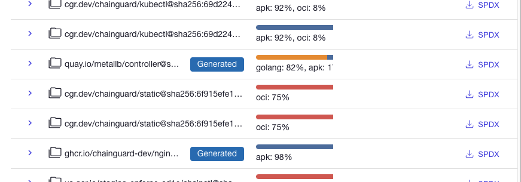
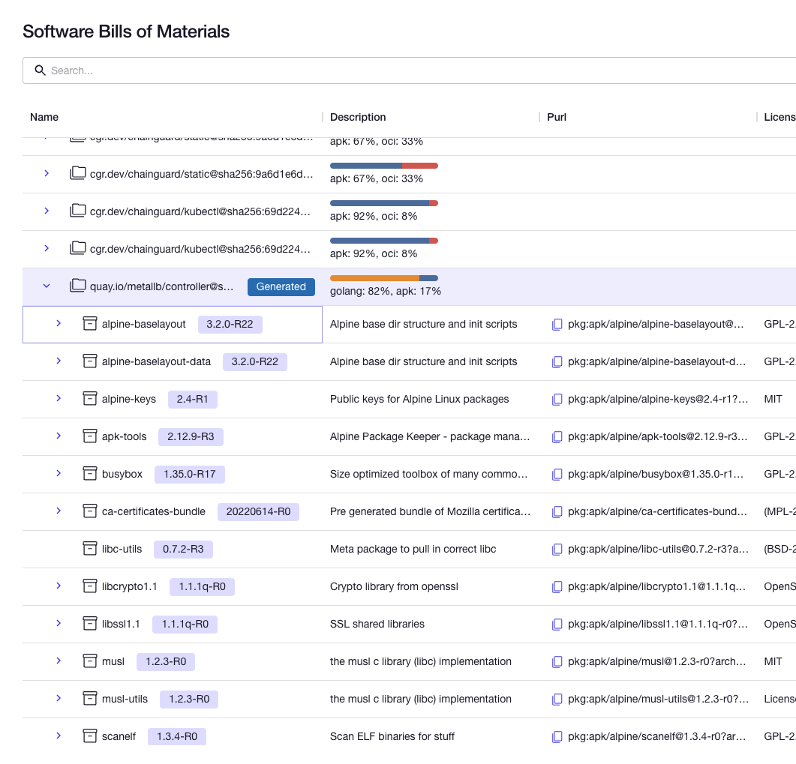
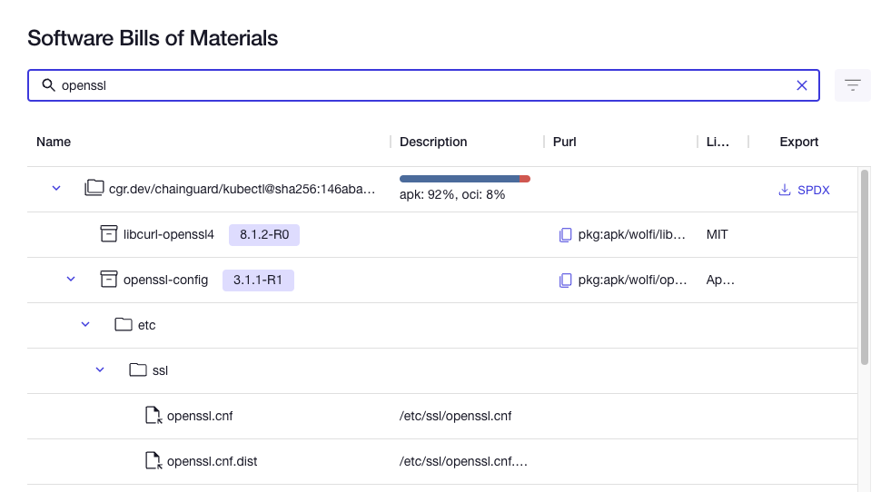
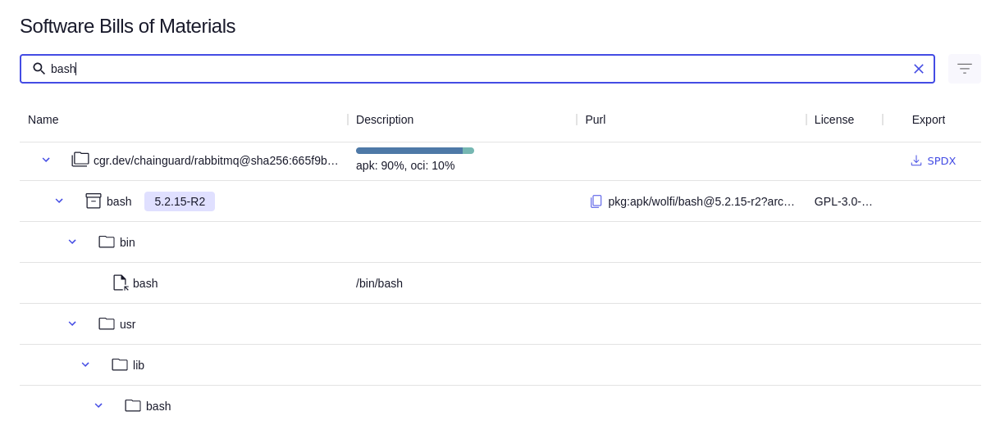
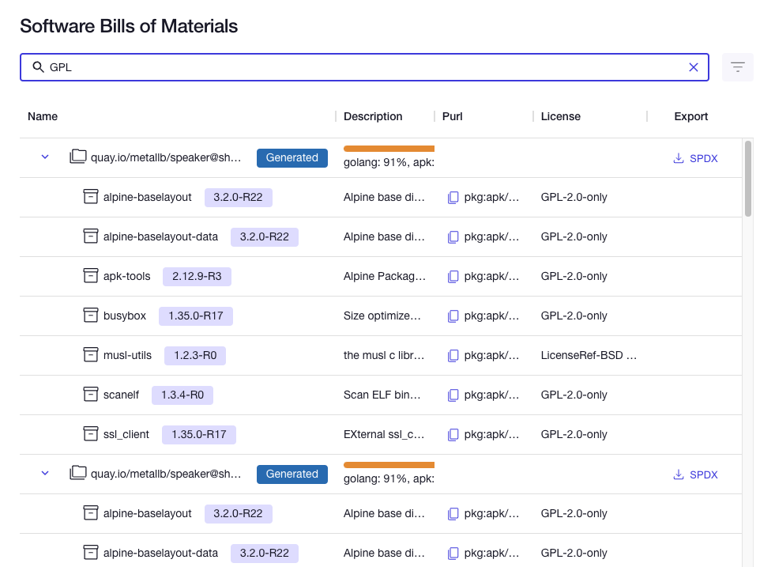

Chainguard Enforce provides a comprehensive solution for monitoring your cloud workloads and container images. In particular, its SBOM generation and ingestion features enhance your ability to manage the software components within your environment.

Chainguard Enforce will automatically generate SBOMs using Grype when an existing SBOM is not available. This ensures that you always have detailed insights into the packages included in your images, without any additional effort on your part. Additionally, the Chainguard Enforce Console provides a handy interface that allows you to find and filter the SBOMs for every package on every cluster overseen by Enforce. This guide outlines these SBOM features in Enforce.

## Chainguard Enforce automatically ingests SBOM out of the box

When you run a workload in a supported Container Runtime (including EKS, GKE, and Cloud Run) monitored by Chainguard Enforce, it will first check if there are already SBOMs included in the workload’s container images. We support both signed SBOMs (i.e. an SBOM uploaded by `cosign attest` as an in-toto attestation) as well as unsigned SBOM (i.e. an SBOM uploaded by `cosign attach sbom`). Chainguard Enforce supports both the SPDX and Cyclone DX SBOM schemas, meaning that SBOMs must conform to these standards in order for Enforce to ingest them.

## SBOM Generation in Chainguard Enforce

If there are container images without an existing SBOM, Enforce will assist by automatically creating SBOMs using [Grype](https://github.com/anchore/grype). This means that you don't have to worry about generating the SBOM yourself or performing any additional steps. Enforce takes care of it for you, ensuring that you have comprehensive package information for each image.

Generated SBOMs will be clearly indicated in the Enforce user interface. In the SBOM section of the Console, you will find a list of all the SBOMs associated with your images. The generated SBOMs will be marked with a blue **Generated** tag next to them, indicating that they were automatically created by Enforce using Grype. This helps you identify which SBOMs were generated on-demand and which ones were ingested from external sources.

To streamline this process, we don’t require any user action to enable SBOM generation. As soon as it detects a container image running in one of your clusters without an SBOM, Chainguard Enforce will generate one for you.

## SBOMs in the Chainguard Enforce Console

The Chainguard Enforce Console offers a high-level overview of SBOMs across different IAM groups, giving you a comprehensive picture of the software components used within your organization.

To navigate to this overview, visit the Chainguard Enforce Console in your web browser ([`console.enforce.dev/`](https://console.enforce.dev/), expand the **Enforce** section in the left hand sidebar, and choose the **SBOM** to find the SBOM overview.

 

This overview includes a column for the **Name** of each SBOM. It also has a **Description** column that gives a breakdown of the different types of packages and files listed in each SBOM.

When you click on an SBOM, it expands to show a list of the packages listed within it. The package names appear in the **Name** column along with the package's version number. If available, the **Description** column will include a brief description of the package.

The **Purl** colum shows each package's *purl* (short for *package URL*) — a standard URL format that can be used by package managers, APIs, programming languages, and other tools to identify software packages. To the left of each purl is a "Copy" icon; if you click this icon, the associated purl will be copied to your clipboard.

To the right of the **Purl** column is the **License** column, which shows license information for each package. Finally, the last column — **Export** — lists a button for each SBOM, allowing you to download it to your local machine.

## Searching and Filtering SBOMs in the Console

Chainguard Enforce provides a powerful search functionality. This allows you to search for specific packages, versions, licenses, or even a file within the SBOMs.

Using the search feature, you can find relevant information about a particular package or version, ensuring that you stay informed about the software components in your environment. Whether you are investigating vulnerabilities, ensuring license compliance, or tracking specific versions, the SBOM search functionality in Enforce makes the desired information more accessible.

From the SBOM overview, you can query the SBOMs to retrieve a variety of information. For example, you can search for specific packages by their name. This example shows the search results for "openssl".

The search bar will also return files with names matching the search criteria. This example shows a file named `bash` in the search results for "bash."

You can also search for packages matching a certain license type. This example shows some of the results for the phrase "GPL." 

We encourage you to use this search bar to find and filter packages in your own clusters managed by Chainguard Enforce.

## Learn more

If you'd like to learn more about how Chainguard Enforce handles SBOMs, we recommend that you check out our guide on [SBOMs and Attestations in Chainguard Enforce](/chainguard/chainguard-enforce/sboms/sboms-and-attestations/). This conceptual article digs deeper into the differences between SBOMs and attestations and how each is handled by Enforce.
