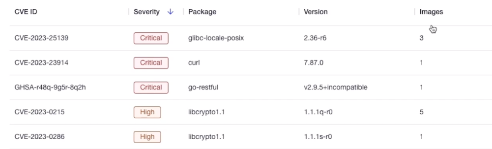
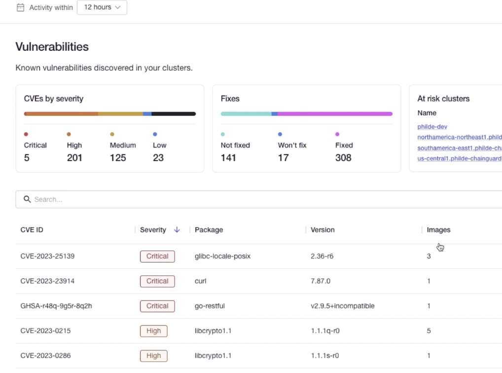
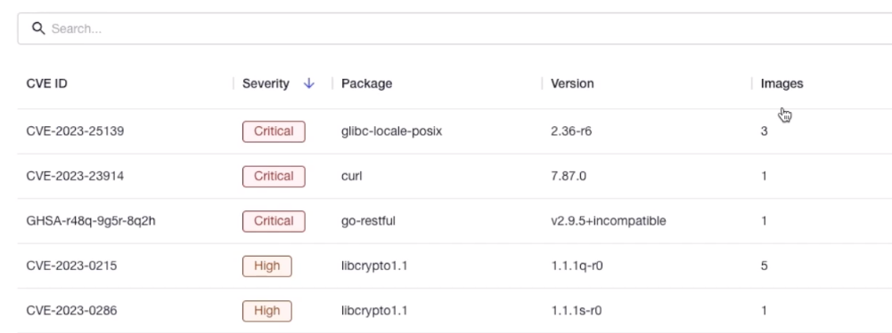

Chainguard Enforce provides a comprehensive solution for monitoring your cloud workloads and container images. In particular, its vulnerability report generation and ingestion features enhance your ability to monitor the software components within your environment.

Chainguard Enforce will automatically generate vulnerability reports using Grype on a daily basis. This ensures you are always aware of any new vulnerabilities that could affect your workloads.

Enforce uses the previously generated or ingested SBOM in Enforce to generate a vulnerability report. This ensures that you always have a detailed view of the vulnerabilities in your images, without any additional effort on your part. Additionally, the Chainguard Enforce Console provides a handy interface that allows you to find and filter the severity of the discovered vulnerabilities on every cluster overseen by Enforce. This guide outlines the vulnerability analysis features in Enforce.

## Chainguard Enforce Ingests Vulnerability Reports Automatically

When you run a workload with a supported Container Runtime (including EKS, GKE, and Cloud Run) monitored by Chainguard Enforce, it will first check if there are already vulnerability reports attached to the workload’s container images. We support signed cosign vulnerability reports, for example a vulnerability report uploaded using `cosign attest` as an [in-toto attestation](https://in-toto.io/).

Chainguard Enforce supports Grype’s custom scan report format in JSON format. The result of a Grype scanning operation is included within the cosign vulnerability attestation specification. For Enforce to use an attestion, it should be signed and include additional metadata about the scanner used to generate the vulnerability report. Enforce also checks the timestamp of the vulnerability attestation ignoring all reports whose age is older than 24 hours. If all these conditions are satisfied, Enforce will ingest that scan report.

## Vulnerability Report Generation in Chainguard Enforce

If there are container images without an existing vulnerability report, Enforce will assist by automatically creating a vulnerability report using [Grype](https://github.com/anchore/grype). This means that you don't have to worry about generating the scanning reports yourself or performing any additional steps. Enforce takes care of it for you, ensuring that you have comprehensive information about the vulnerabilities discovered for each image. To create a vulnerability report, Enforce relies on a previously generated or ingested SBOM for each image. By doing so, Enforce scanning focuses on the list of available packages used in your workloads.

Generated vulnerability reports will be clearly indicated in the Enforce user interface. In the Vulnerabilities section of the Console, you will find a list of all the discovered vulnerabilities of the packages running on every cluster overseen by Enforce. The list of vulnerabilities will be listed by CVE ID indicating its severity level and information about the package where the vulnerability has been detected. Another column `Images` indicates the number of images affected by a vulnerability on your clusters.

To streamline this process, Chainguard Enforce does not require any user action or configuration to generate Vulnerability reports. As soon as Enforce detects a container image running in one of your clusters without a Vulnerability report it will generate one for you.

## Vulnerability Analysis in the Chainguard Enforce Console

The Chainguard Enforce Console offers a high-level overview of the vulnerabilities discovered across different IAM groups, giving you a comprehensive picture of the software components used within your organization.

To navigate to this overview, visit the Chainguard Enforce Console in your web browser ([`console.enforce.dev/`](https://console.enforce.dev/), expand the **Enforce** section in the left hand sidebar, and choose **Vulnerabilities** to find the vulnerabilities overview.

This overview includes a column for the **CVE ID** of each vulnerability. It also has a **Description** column that gives a breakdown of the vulnerability.

There are two blocks highlighting the different amounts of vulnerabilities per type and the state of the vulnerabilities. The state indicates whether the vulnerabilities are already fixed, not fixed or no fix will be provided.

## Searching and Filtering Vulnerabilities in the Console

Chainguard Enforce provides a powerful search functionality. This allows you to search for specific CVE ID, packages, versions, or even the severity types of the vulnerabilities.

Using the search feature, you can find relevant information about a particular vulnerability, ensuring that you stay aware of the existence of any vulnerability in your environment. Whether you are investigating vulnerabilities, ensuring packages are not used, the vulnerabilities search functionality in Enforce makes the desired information more accessible.

From the Vulnerabilities overview page, you can query the vulnerabilities to retrieve a variety of information. For example, you can search for specific packages by their name, like in the following screenshot:

The search bar will also return the vulnerabilities with IDs, package information and severity matching the search criteria. You can also search for vulnerabilities matching a certain package version, or a severity type.

We encourage you to use this search bar to find and filter vulnerabilities in your own clusters managed by Chainguard Enforce.

