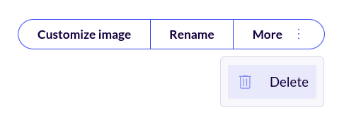

Chainguard offers Catalog Pricing for our library of secure container images, providing access to the full catalog of Chainguard Containers. Catalog Pricing enables you to add individual images from the wider Chainguard catalog to your organization's repository using the Self-Serve  Catalog Experience.

This article highlights the benefits of the Catalog Pricing plan and outlines how you can provision container images through the Self-Serve Experience.


## Catalog Pricing

The Catalog Pricing model provides a single subscription that grants unlimited access to the full catalog of container images maintained by Chainguard. This model removes the need for per-repository licensing and offers predictable monthly or annual costs. Subscriptions can include FIPS-compliant images, depending on the selected tier.

Chainguard's catalog contains more than a thousand secure-by-default container images that are continuously rebuilt and maintained under a [CVE SLA](https://www.chainguard.dev/legal/cve-policy). With Catalog Pricing, organizations can use any image in the catalog without having to manage individual licenses or track image usage.

You can also add multiple instances of the same container image to your organization. Note that, as of this writing, organizations are limited to a maximum of 2500 container image repositories.

This model is best suited for organizations that use many different Chainguard images across teams or projects. It allows platform and security teams to standardize on Chainguard images while giving developers unrestricted access to pull the images they need. Once a subscription is in place, any image from the catalog can be pulled and used without additional approvals or per-image fees.


## Self-Serve Catalog Experience

Organizations that have signed up for Catalog Pricing can add container images through [Chainguard's Self-Serve Catalog Experience](http://chainguard.dev/unchained/introducing-the-self-serve-catalog-experience). This allows customers to independently add Chainguard Containers to their organization's catalog directly within the console, without needing to file support tickets or wait for Chainguard to provision resources manually.

In order for a user to add images to their organization through the Self-Serve Experience, they must be bound to a role with the `repo (create, read list, update)` capabilities. Additionally, it may be helpful for users working with the Self-Serve Experience to have the `registry.entitlement (list)` capability in order to understand their organization's registry access entitlements.

The only built-in role with all of these capabilities is the `owner` role. Users intending to work with the Self-Serve Catalog Experience should be bound to the `owner` role or a custom role with the appropriate capabilities. Refer to our documentation [Roles and Role-bindings](/chainguard/administration/iam-organizations/roles-role-bindings/) for more details.

To add a container to your organization through the Self-Serve Experience, start by logging in to the [Chainguard Console](https://console.chainguard.dev). After logging in, click **Images** in the left-hand navigation:

<center></center>
<br /> 

By default, this will take you the **Organization** tab, where you'll find your organization's list of container images. Above the list of container images, to the right of the search box, there will be an **Add image** button. Click this button to open a window containing a list of Chainguard Containers you can add to your organization:

<center></center>
<br /> 

Within this window, you can scroll through the entire list of container images available for you to add to your organization. You can also use the search box within the window to search for a specific Chainguard Container to add.

After finding the container image you want to add to your organization, click on it. This changes the window to include a text field where you can optionally set a different name for the image:

<center></center>
<br /> 

This is the name that your users and tooling will use to refer to the container image, such as in a `docker pull` command. Note that this is required if you're adding another instance of an image already included in your organization's catalog.

Finally, click the **Add image** button in the window, and the container image will appear within your organization's catalog after a few minutes.

You can also add container images from the **Chainguard catalog** tab. This tab contains a list of every container image Chainguard has to offer, not just those that have already been added to your organization's catalog.

Within this tab, scroll or search for whatever image you want to add to your organization. At the right end of its row will be a button labeled **Add to org**:

<center></center>
<br /> 

Click the **Add to org** button to add the image to your organization; this will follow the same process as outlined previously. As before, you have the option to set a new name for the container image before clicking the **Add image** button.

After provisioning your new container image through Self-Serve, you and other members of your organization will be able to access it from the Console, with `chainctl`, or through Chainguard's API.

If there comes a point where you no longer need the image, you can remove it. Navigate to the image's page within the Console and click the **More** button in the upper-right corner:

<center></center>
<br /> 

Click **Delete** and enter the name of the container image to confirm that you want to remove it. 


### Updating container image names with `chainctl`

You can also use [`chainctl`](/chainguard/chainctl-usage/how-to-install-chainctl/), Chainguard's command-line interface, to change the name of a container image that has already been added to your organization.

To begin, run a command like the following to check whether the container image you want to add is already in your organization. This example checks whether the `php` container image is included in the `example.com` organization:

```shell
chainctl images repos list --parent=example.com --repo=php -o json | jq -r '.items[0].id'
```
```Output
b41c4dd8fa86b9f0174b2ad10133cb506778aee4/2750044fc718841c
```

Note that this example uses [`jq`](https://jqlang.org/), a lightweight command-line JSON processor, to filter the output to only show the image's unique ID within the `example.com` organization. 

Knowing that the image is included in the organization, you can rename it. This example renames the `php` container image to `php-new`:

```shell
chainctl images repo update php --parent=example.com --name=php-new
```
```Output
ID: b41c4dd8fa86b9f0174b2ad10133cb506778aee4/2750044fc718841c
Name: php-new
Tier: BASE
```

After making this change, references to the previous name will no longer work for this image. This applies to any clients referencing this image by name.

If you happen to rename an image in error, you can change it back using the same command, swapping the old name and new name:

```shell
chainctl images repo update php-new --parent=example.com --name=php
```


## Learn More

Chainguard's Catalog Pricing provides access across Chainguard's library of container images. To learn more about the Catalog Pricing model, we encourage you to [reach out for more information](https://www.chainguard.dev/contact?utm=docs). Additionally, you may find the following resources to be helpful:

- [Blog announcement: Unlock the Full Chainguard Containers Catalog – Now with a Catalog Pricing Option](https://www.chainguard.dev/unchained/unlock-the-full-chainguard-containers-catalog-now-with-a-catalog-pricing-option?utm_source=cg-academy&utm_medium=referral&utm_campaign=dev-enablement)
- [Chainguard Pricing](https://www.chainguard.dev/pricing?utm_source=cg-academy&utm_medium=referral&utm_campaign=dev-enablement)