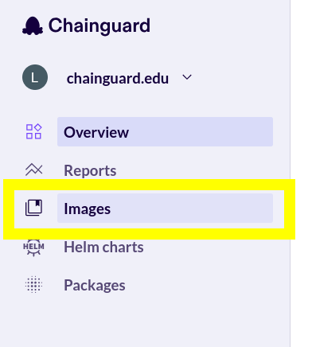
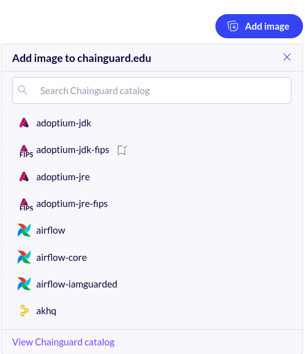
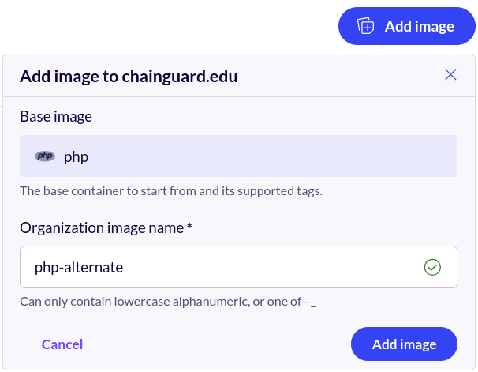
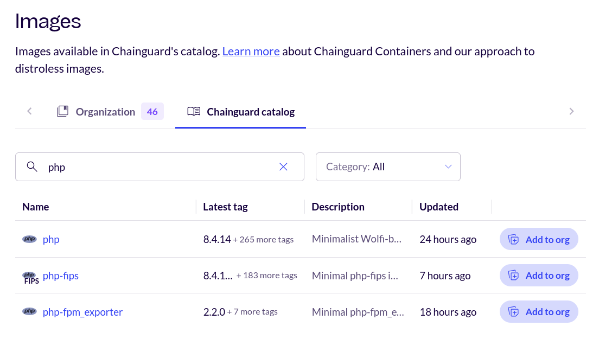

Chainguard offers catalog pricing for our catalog of container images, providing access across the Chainguard Container images catalog. This is an alternative pricing model for container usage that replaces the manual ticket process for adding images to an organization, which is how container images must be added under a per-image pricing model. Catalog pricing enables you to add individual images from the wider Chainguard catalog to your organization's repository using the Self-Serve Experience in the [Chainguard Console](https://console.chainguard.dev).

This article highlights the benefits of the Catalog Pricing plan and outlines how you can provision container images through the Console's Self-Serve Experience.

## Catalog Pricing

The Catalog Pricing model provides a single subscription that grants unlimited access to the full Chainguard-maintained container image catalog. This model removes the need for per-repository licensing and offers predictable monthly or annual costs. Subscriptions can include FIPS-compliant images, depending on the selected tier.

The catalog contains more than a thousand secure-by-default container images that are continuously rebuilt and maintained under a [CVE SLA](https://www.chainguard.dev/legal/cve-policy). With Catalog Pricing, organizations can use any image in the catalog without having to manage individual licenses or track image usage.

This model is best suited for organizations that use many different Chainguard images across teams or projects. It allows platform and security teams to standardize on Chainguard images while giving developers unrestricted access to pull the images they need. Once a subscription is in place, any image from the catalog can be pulled and used without additional approvals or per-image fees.

## Chainguard Console Self-Serve Experience

Organizations that have signed up for Catalog pricing can add container images through [Chainguard's Self-Serve Catalog Experience](). This allows customers to independently manage certain actions — like adding images to their organization’s catalog — directly through the console, without needing to file support tickets or wait for Chainguard to provision resources manually.

To add a container to your organization through the Self-Serve Experience, start by logging in to the [Chainguard Console](https://console.chainguard.dev). After logging in, click **Images** in the left-hand navigation:

  

By default, this will take you the **Organization** tab, where you'll find your organization's list of container images. Above the list of container images, to the right of the search box, there will be an **Add image** button. Click this button to open a window containing a list of Chainguard Containers you can add to your organization:

  

Within this window, you can scroll through the entire list of container images available for you to add to your organization. You can also use the search box within the window to search for a specific Chainguard Container to add.

After finding the container image you want to add to your organization, click on it. The window will change to include a text field where you can optionally choose a different name for the image:

  

This is the name that your users and tooling will use to refer to the container image, such as in a `docker pull` command. Note that this is required if you're adding another instance of an image already included in your organization's catalog.

Finally, click the **Add image** button in the window, and the container image will appear within your organization's catalog after a few minutes.

You can also add container images from the **Chainguard catalog** tab. This tab contains a list of every container image Chainguard has to offer, not just those that have already been added to your organization's catalog.

Within this tab, scroll or search for whatever image you want to add to your organization. At the right end of its row will be a button labeled **Add to org**:

  

Click the **Add to org** button to add the image to your organization; this will follow the same process as outlined previously. Again, you'll have the option to set a new name for the container image before clicking the **Add image** button.

## Learn More

Chainguard's catalog pricing provides access across the Chainguard container images catalog.

To learn more about the catalog pricing model, we encourage you to [reach out for more information](https://www.chainguard.dev/contact?utm=docs). Additionally, you may find the following resources to be helpful:

- [Blog announcement: Unlock the Full Chainguard Containers Catalog – Now with a Catalog Pricing Option](https://www.chainguard.dev/unchained/unlock-the-full-chainguard-containers-catalog-now-with-a-catalog-pricing-option?utm_source=cg-academy&utm_medium=referral&utm_campaign=dev-enablement)
- [Chainguard Pricing](https://www.chainguard.dev/pricing?utm_source=cg-academy&utm_medium=referral&utm_campaign=dev-enablement)

