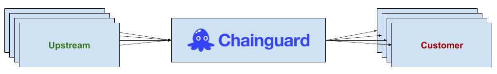
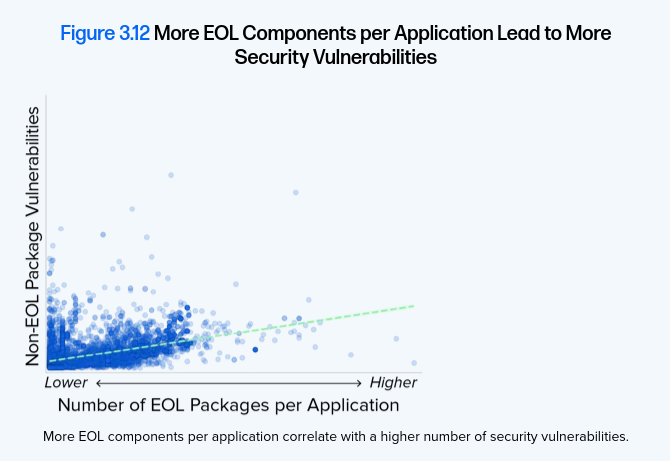
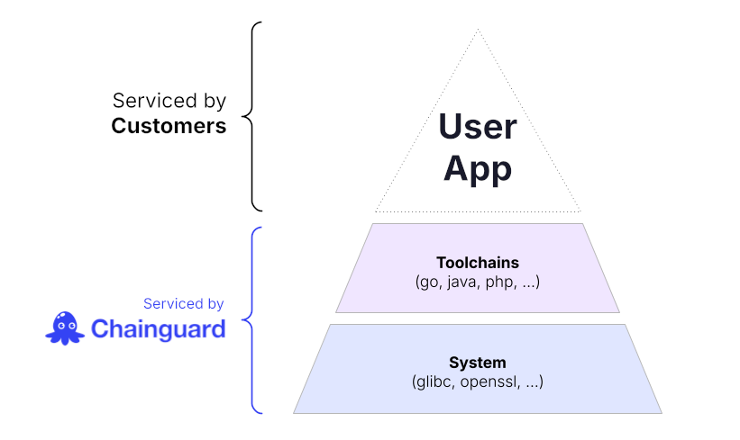

Chainguard’s mission is to be the safe source for open source. As part of this mission, Chainguard builds all of our packages and images from upstream open source code and delivers the resulting artifacts to our customers. There are three distinct parties involved here: **Upstream** projects, **Chainguard**, and **Customers**; each of these parties share some measure of responsibility across a few dimensions.

  

This guide is an overview of Chainguard's Shared Responsibility Model: a framework that outlines the security responsibilities of upstream open source software projects, Chainguard, and its customers. The dimensions of shared responsibility this guide covers are:

* **Releases**: defining and tracking what is and is not supported
* **Patching**: defining which parties are responsible for patching each element of what goes into a container image
* **Testing**: defining which parties are responsible for testing what scope of functionality

## Releases

Upstream projects are responsible for cutting releases and documenting its supported release policy, including any rules it adheres to around quality or breaking changes, and (in the case of more mature projects) a release cadence or schedule. Chainguard is responsible for building all of the upstream-supported versions of a piece of software. Customers are responsible for staying on one of the upstream-supported versions of a piece of software.

A common pitfall we see, which drives an enormous incidence of CVEs across our prospects, is the use of "end-of-life" (or "EOL") software. The following diagram, taken from the [Risk section of Sonatype's 2024 State of the Software Supply Chain report](https://www.sonatype.com/state-of-the-software-supply-chain/2024/risk), highlights how more EOL components per application tends to lead to more security vulnerabilities:

  

It is a customer’s responsibility to stay on a supported version of the software, and the responsibility of Chainguard to ensure that the customer receives builds of that version of the software to consume in their private registry on `cgr.dev`.

## Patching

Upstream projects are responsible for staying on supported releases of their own dependencies, such as with an automatic dependency update tool like [dependabot](https://github.com/dependabot) or [Renovate](https://docs.renovatebot.com/). Upstream projects are also, at a minimum, responsible for staying on an API-compatible version of libraries they depend on transitively.

Chainguard is responsible for assembling container images from fully patched upstream software. You can find more details on this in our [SLA for CVEs](https://www.chainguard.dev/cve-sla). Chainguard will also attempt to rebuild upstream software with [the latest toolchain](https://www.chainguard.dev/unchained/chainguard-patches-3-silent-golang-cves-in-under-24-hours) and their dependencies updated where that can be done without breaking changes (see the following [Testing section](#testing)).

Customers are responsible for building on or with fully patched Chainguard Container Images, and for patching any components they add to the Chainguard Container Image.

There are generally two form-factors of Chainguard Container Images: **Application** and **Base** images, so let’s go over the patching responsibilities through these respective lenses.

### Application Container Images

These are Chainguard Container Images that users generally just take and run (for example, by plugging into Helm). We created the following diagram to help customers understand where the division of responsibility is generally drawn for this class of images:

  

Upstream projects are responsible for staying on API-compatible versions of libraries. Chainguard is responsible for rebuilding the upstream project [with the latest toolchain](https://www.chainguard.dev/unchained/chainguard-patches-3-silent-golang-cves-in-under-24-hours), and patching static and dynamic dependencies where such a change is non-breaking. Customers are responsible for tracking a supported version of the Chainguard image. Please refer to our [Product Release Lifecycle documentation](/chainguard/chainguard-images/versions/) for more information on what versions are supported. 

### Base Container Images

These are Chainguard Container Images that users extend with their own packages and applications (such as with a Dockerfile). We created the following diagram to clarify where the division of responsibility is drawn for these images:

  

Upstream projects are responsible for patching supported releases in a timely manner. Chainguard is responsible for releasing fully patched toolchain and base images. Customers are responsible for patching any applications and dependencies they add to a Chainguard image. We recommend using a fully patched Chainguard toolchain image to build the application, and using a fully patched Chainguard base image to layer the final application on.

## Testing

Upstream projects are responsible for defining conformance criteria and establishing conformance benchmarks (such as [Java TCK](https://www.chainguard.dev/unchained/chainguards-openjdk-java-images-are-now-jck-conformant), [Kubernetes Conformance](https://github.com/cncf/k8s-conformance/blob/master/instructions.md), [Knative Conformance](https://github.com/knative/specs)) that clearly outline the criteria for a downstream distribution to represent itself as a "conformant" distribution of the software.

Chainguard is responsible for producing conformant distributions of upstream applications; where the upstream project does not define conformance criteria Chainguard is responsible for using its discretion in validating the functionality of the application and (within reason) accepting scenarios from Customers to run as part of the Chainguard qualification process. Refer to our conceptual article on [How Chainguard Container Images are Tested](/chainguard/chainguard-images/images-testing/) for more information.

Customers are responsible for ensuring that Chainguard-provided images cover all of their desired functionality, and partnering with Chainguard to ensure the requisite coverage is part of our qualification process if gaps are identified. Customers are responsible for testing all of their modifications to Chainguard Container Images and for responsibly rolling out Chainguard Container Images to ensure there are no regressions specific to their environment or usage.

Given the highly subjective nature of performance testing to environment and configuration, Customers are responsible for ensuring that Chainguard Container Images satisfy performance requirements as part of the responsible rollout process. Chainguard is committed to making our customers successful, and will partner with Customers (within reason) to investigate performance anomalies, but the Customer is responsible for ensuring Chainguard can reproduce the issue. Please refer to our [support policy](https://www.chainguard.dev/legal/support-policy) for more information on how Chainguard will partner with customers.

By their minimal nature, some Chainguard Container Images may not include certain functionalities by default, so it is important that Customers ensure that Chainguard Container Images drop-in to their environments safely. Again, Chainguard is committed to making our customers successful, and will partner with Customers to ensure that images support the core scenarios in which an image is used.

Following [the principle of immutability](https://www.chainguard.dev/unchained/the-principle-of-immutability), Chainguard recommends that customers pin Chainguard Container Images and make use of tooling such as [dependabot](https://github.com/dependabot), [Renovate](/chainguard/chainguard-images/working-with-images/renovate/), or [our own digestabot](https://www.chainguard.dev/unchained/keep-your-chainguard-images-up-to-date-with-digestabot) to qualify image updates through the customers’ CI/CD processes covering in-scope usage scenarios. This is key to responsibly rolling out changes because the reality is that upstream, Chainguard, and customers are all fallible and regressions can happen; but this pattern enables folks to have a clear rollback story.

## Learn More

We encourage you to check out our other resources on recommended practices to ensure that your Chainguard Container Images are effectively maximizing your organization's security posture. As example, you can read through our conceptual articles on [Strategies for Minimizing your CVE Risk](/chainguard/chainguard-images/recommended-practices/cve-risk/) or [Considerations for Keeping Container Images Up to Date](/chainguard/chainguard-images/recommended-practices/considerations-for-image-updates/).

