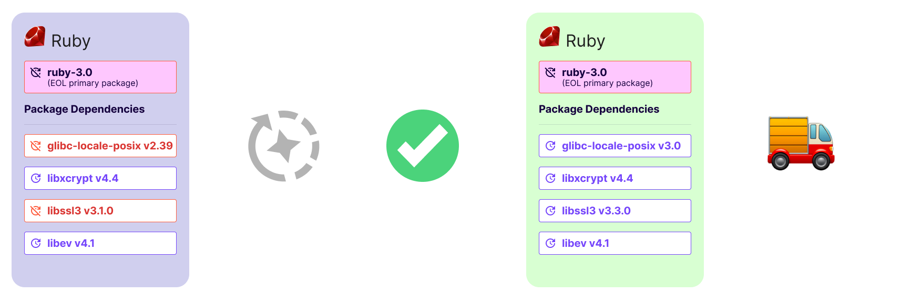

[Chainguard Containers](https://images.chainguard.dev/?utm_source=cg-academy&utm_medium=referral&utm_campaign=dev-enablement) are able to offer few-to-zero known vulnerabilities because they are updated frequently. Because of this continuous release cycle, the best way to mitigate vulnerabilities is to use the newest build of each Chainguard Container available. Chainguard keeps Containers up to date by doing one or more of the following:

* Applying new releases from upstream projects
* Rapidly applying upstream patches to current releases — you can read more about this in our blog post, “[How Chainguard fixes vulnerabilities before they're detected](https://www.chainguard.dev/unchained/how-chainguard-fixes-vulnerabilities?utm_source=cg-academy&utm_medium=referral&utm_campaign=dev-enablement)”
* Applying Chainguard patches to OSS software

Upstream projects are updated frequently for many reasons, including to combat CVEs, and Chainguard ensures that the most up-to-date software is available in all Chainguard Containers. Additionally, Chainguard often identifies CVEs and other issues before scanners can detect them, so Chainguard may offer a patch to a vulnerable dependency to support Chainguard Containers with few-to-zero vulnerabilities. 

The best way to mitigate vulnerabilities is to continually update to the latest patched releases of software, but testing and updating can take time and effort. To support flexibility and user choice, Chainguard aims to offer multiple versions of a Chainguard Container that provide the lowest number of vulnerabilities realistically possible. 

This document provides an overview of Chainguard’s approach to updates, releases, and versions within Chainguard Containers. For more specific guidance, please [contact us](https://www.chainguard.dev/contact?utm_source=cg-academy&utm_medium=referral&utm_campaign=dev-enablement). 

## Open Source Release Tracks

In order to understand how Chainguard releases Chainguard Containers, it’s first important to understand how different open source projects version and release software. This is because Chainguard Containers are built on open source software. There are generally two open source approaches: multiple releases across different versions, or a single release track. In rare cases, open source projects don’t follow a release pattern at all. 

### Multiple Releases Maintained by a Given Open Source Project

Popular open source projects often provide maintenance for a number of release tracks concurrently. For example, Java, Go, Postgres, and Kubernetes patch multiple release versions, each on their own defined maintenance schedule. For these types of projects, Chainguard will maintain every version track of the upstream software that receives updates from the project.

### Single Release Track Maintained by a Given Open Source Project 

Many open source projects support only a single stream of releases that are continuously incremented; often, this is simply the latest release. In the case of a single release track, any security fix that is published will only be applied to the most recent release of the project, and the project release tags will be updated to indicate a new version is available. For this type of project, Chainguard only warrants that the latest release of the software and its corresponding version tags have the most up-to-date patches available.

## What Chainguard Supports and Maintains for Chainguard Containers

There are several scenarios that define what Chainguard agrees to maintain regarding software versions in the [Chainguard Containers Directory](/chainguard/chainguard-images/how-to-use/images-directory/). All container images that Chainguard currently supports are those with upstream software that is still supported and maintained, and Chainguard patches and rebuilds these Containers daily. If you have purchased a container image during its lifecycle that is no longer being supported upstream, you will still be able to access this Container, _but_ Chainguard will not be patching or rebuilding this Container and it will start to accrue CVEs. It is recommended to upgrade to an actively maintained version. 

The table provides some example scenarios to help illustrate our approach. 

| **Category**	| **Example** | **Maintained Upstream Releases** | **Chainguard Patches** | **Chainguard No Longer Patches** | 
|---------------|-------------|----------------------------------|------------------------|----------------------------------|
| **Multiple Release Tracks** | [Go](https://images.chainguard.dev/directory/image/go/versions?utm_source=cg-academy&utm_medium=referral&utm_campaign=dev-enablement)       | 1.23, 1.22                 | `:latest`, 1, 1.23, 1.22 | 1.23.old, 1.22.old, 1.21 and below |
|                             | [Python](https://images.chainguard.dev/directory/image/python/versions?utm_source=cg-academy&utm_medium=referral&utm_campaign=dev-enablement)   | 3.13, 3.12, 3.11, 3.10, 3.9 | `:latest`, 3, 3.9 and above | 3.8 and below, 3.8.old, 3.9.old, 3.10.old, 3.11.old, 3.12.old | 
|                             | [Postgres](https://images.chainguard.dev/directory/image/postgres/version?utm_source=cg-academy&utm_medium=referral&utm_campaign=dev-enablement) | 17, 16, 15, 14, 13         | `:latest`, 17, 16, 15, 14, 13 | 12 (EOL November 21, 2024) and below | 
| **Single Release Track**    | [Cosign](https://images.chainguard.dev/directory/image/cosign/versions?utm_source=cg-academy&utm_medium=referral&utm_campaign=dev-enablement)   | 2                          | `:latest`, 2, 2.4 | 2.3, 2.2, 2.1, 2.0, 1.x, 0.x | 
|                             | [Bank-Vaults](https://images.chainguard.dev/directory/image/bank-vaults/versions?utm_source=cg-academy&utm_medium=referral&utm_campaign=dev-enablement) | 1 | `:latest`, 1 | Any previous version tag
| **No Release Track**        | [envoyproxy/ratelimit](https://images.chainguard.dev/directory/image/envoy-ratelimit/versions?utm_source=cg-academy&utm_medium=referral&utm_campaign=dev-enablement) | No versioned releases | `:latest` | Any previous version tag |

> **Note**: The "Maintained Upstream Releases" column is current as of December 2024.

## What Chainguard Container Versions to Expect

When you use freely-available [Chainguard Starter Containers](/chainguard/chainguard-images/about/images-categories/#starter-containers), you will have access to the `:latest` version of any Container available to the public. In some cases, you will also have access to the `:latest-dev` version, which includes a shell and package manager. For example, the Python container image has both `cgr.dev/chainguard/python:latest` and `cgr.dev/chainguard/python:latest-dev`. Many of the programming languages have these options available, including the Java JDK and JRE containers, PHP, Go, Node, Ruby, and Rust. 

If you are using our enterprise Chainguard Production Containers, you will have access to more versions. The Chainguard approach is as follows: 

* For **multiple-release track projects**, you will have access to major and minor versions that are actively maintained. 
* For **single-release track projects**, you will receive the `:latest` tag as well as every versioned tag that is released over time.

## Chainguard Patches and Maintenance

For multiple release software projects with release schedules clearly published, Chainguard will maintain every currently supported version of the software that is maintained by the upstream project. In other words, Chainguard will apply every patch that is available to every maintained version of the upstream software.

For single release track software projects, Chainguard will maintain only the `:latest` version of the software by applying patches and incrementing the version tag when a new patch is released.

Actively maintained Chainguard Containers are rebuilt on a daily cadence, so you can be sure the container image you are using is up to date.

### A note about `-r` tags

In some cases, Chainguard will fix vulnerabilities in tools without waiting for the external project to release patches. As an example, say there's a CVE in Go `1.21.3` and the Go team is uncharacteristically slow releasing a fix. In this case, Chainguard could patch a fix into `1.21.3`, and release it as `1.21.3-r2`. Chainguard would continue to make the original package available in an image tagged as `1.21.3-r1`. If Chainguard had to apply further patches to Go `1.21.3`, it would tag these later patched container images with `-r3`, `-r4`, and so on. We call this the *epoch number*. We may take steps like this in order to patch vulnerabilities, remove unnecessary bloat, rebuild the same source with newer tools, or to address bugs in our build configs and build tooling.

Bear in mind that Chainguard's Containers, although minimal, will almost always contain more than one package. At the time of writing this, the Go image has more than 60 distinct packages in it, such as bash, busybox, git, glibc, make, and zlib. When we fix a vulnerability in bash for example, we likewise ensure that fix gets rolled out to every container image that includes bash, including the `go:1.21.3` image. The image tagged `1.21.3-r2` will pull in that bash fix, and fixes for any of the other packages in the image.‍

Put simply, when you opt in to pulling `go:1.21.3-r2`, you're opting in to a consistent version of Go, and potentially floating versions of all the other packages. This means you get CVE fixes as well as patch, and minor, and even major version releases of bash, and every other package the image contains.

You can learn more about our approach by reviewing our [blog on image tagging philosophy](https://www.chainguard.dev/unchained/chainguards-image-tagging-philosophy-enabling-high-velocity-updates-pt-1-of-3?utm=docs).

## Wolfi Packages in Chainguard Containers

Chainguard Containers only contain packages that are either built and maintained internally by Chainguard or packages from the [Wolfi Project](https://github.com/wolfi-dev). These packages follow the same conventions of minimalism and rapid updates as Chainguard Containers. 

Starting in March of 2024, Chainguard will maintain one version of each Wolfi package at a time. These will track the latest version of the upstream software in the package. Chainguard will end patch support for previous versions of packages in Wolfi. Existing packages will not be removed from Wolfi and you may continue to use them, but be aware that older packages will no longer be updated and will accrue vulnerabilities over time. The tools we use to build packages and container images remain freely available and open source in Wolfi.

This change ensures that Chainguard can provide the most up-to-date patches to all packages for our Containers customers. Note that specific package versions can be made available in Production Containers. If you have a request for a specific package version, please [contact support](https://support.chainguard.dev?utm=docs).

## SLAs

A vulnerability and patch service-level agreement (SLA) is available for Chainguard Production Containers. There are no SLAs available for Chainguard's free tier of container images, but you will have access to frequently updated and patched container images with low-to-zero CVEs.

If you are a Chainguard Production Containers user, Chainguard vulnerability and patch SLAs apply only to supported and maintained versions of upstream projects as clearly published by the upstream projects or published container images that can be rebuilt using updated compilers and/or libraries. In the case of single-release track projects, this means that the Chainguard vulnerability and patch SLAs apply only to the latest version and corresponding version tags of the upstream projects. Containers that use open source applications that have reached their end of life are no longer patched.

## End of Life and End of Support Software

When an open source application version is no longer maintained by the upstream project or has otherwise met its end of life (EOL), Chainguard will generally no longer provide patches to that software. While the Chainguard Production Containers organization directory will continue to have previously purchased container images available, new builds will no longer be published and vulnerabilities are expected to accumulate in those Containers over time. It is recommended to move to an up-to-date, actively maintained version. 

For software applications that maintain multiple concurrent release tracks, Chainguard will endeavor to provide [reasonable notice](/chainguard/chainguard-images/features/eol-notifications/) when a particular software release version is expected to reach EOL status, thus no longer updated.

No EOL notice will be provided for single-release applications where the only supported release is the `:latest` or corresponding version tag.

## EOL Grace Period

There are cases where an organization may want to continue using a container image after it has reached end-of-life. This could be because an image reaches EOL before the organization's release schedule, or perhaps later image versions have one or more issues that prevent the organization from upgrading.

To help in situations like this, Chainguard offers an end-of-life grace period for eligible Containers. By purchasing a grace period, customers will get access to new builds of container images whose primary package has entered its end-of-life phase for up to six months after they have reached EOL.

During this time, Chainguard will address vulnerabilities and update any non-EOL packages within the container image (other than the image's primary package). Chainguard will continue to rebuild the image a maximum of six months after the primary package enters its EOL phase or until the build fails.

 

> **Note**: Chainguard is **not** able to offer any exceptions to the 6 month limit for the EOL grace period.

Once your organization has opted into the EOL grace period, you will be able to find the end date of a given container image version's grace period in the [Chainguard Console](https://console.chainguard.dev/). From the **Organization Images** tab, select an image. You'll be taken to that container image's **Versions** page, and the end date of each grace period will be listed under the respective version:

  

As of this writing, the EOL grace period covers approximately 575 container images. To be eligible, images must meet two key requirements:

1. Have [multiple release tracks](/chainguard/chainguard-images/about/versions/#multiple-releases-maintained-by-a-given-open-source-project)
2. Be within six months of their official EOL date (as declared by upstream project maintainers)

Be aware that the following are not covered by Chainguard's EOL Grace Period:

* Updating an image’s EOL primary package.
* Backporting or cherry-picking individual commits or patches to the EOL primary package.
* Any package labeled end-of-life for more than 6 months by its open-source creators or maintainers.

Additionally, if a container image fails to build because underlying dependencies conflict with the primary package, it will no longer be supported. A failed build signals the end of support for that image. 

 

If a dependency conflict prevents an image version from building successfully, the grace period will end immediately for that version. Chainguard will not attempt further updates or CVE remediations after a build failure. Additionally, If a container image fails to build due to dependency conflicts, its grace period ends immediately. This means no further updates or CVE remediations will be provided for that image version.

For more information on the EOL grace period, [please contact us](https://www.chainguard.dev/contact?utm_source=cg-academy&utm_medium=referral&utm_campaign=dev-enablement).