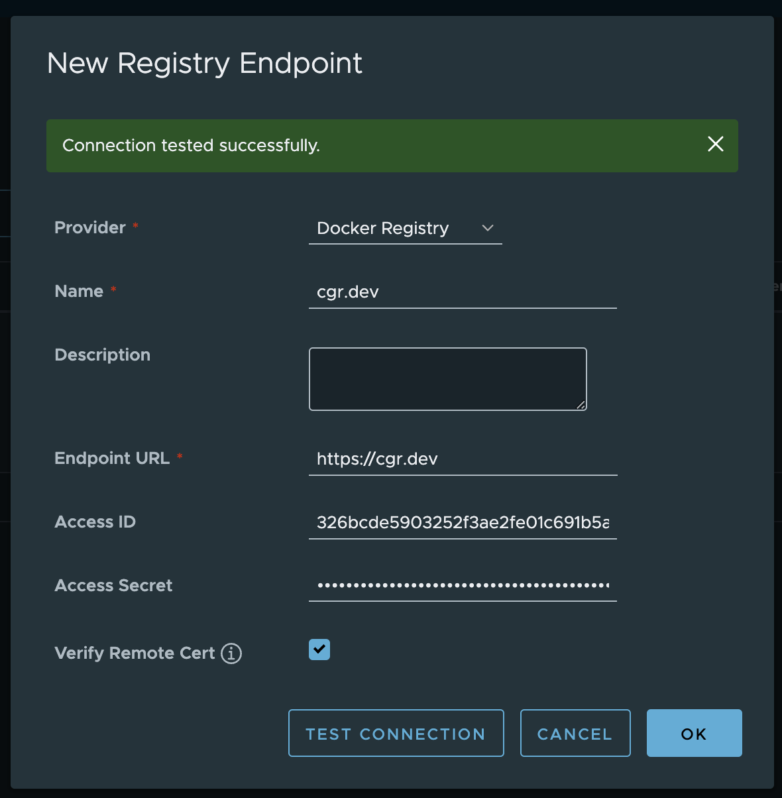
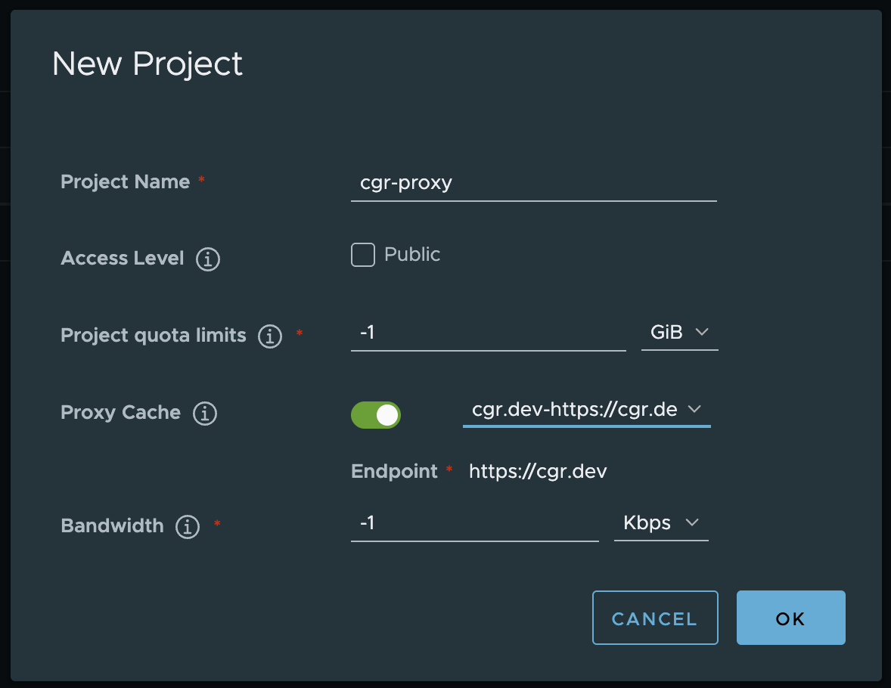
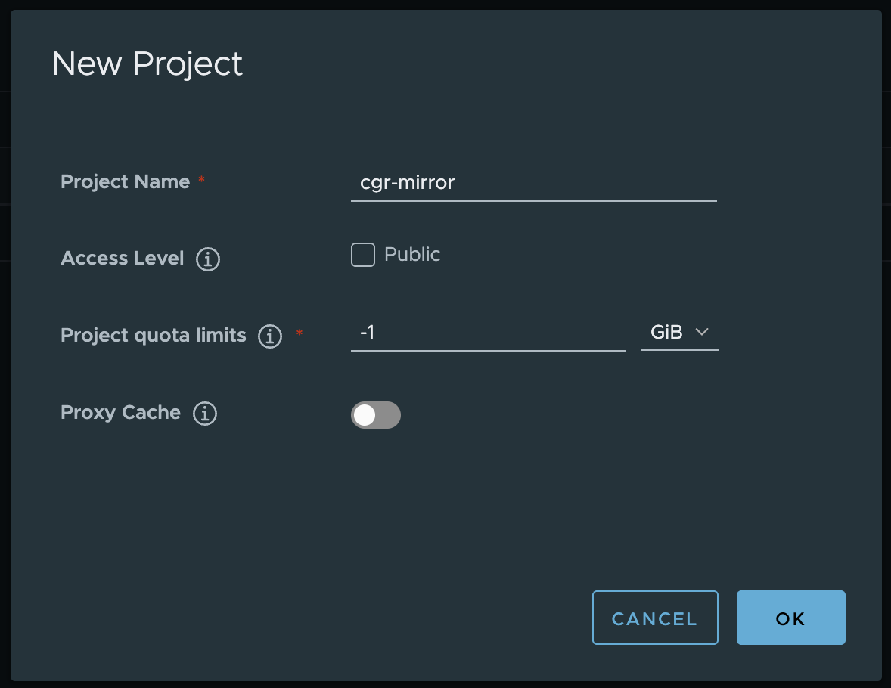
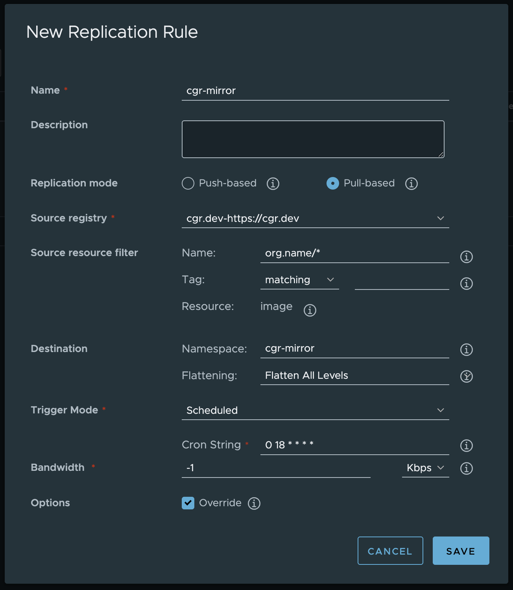
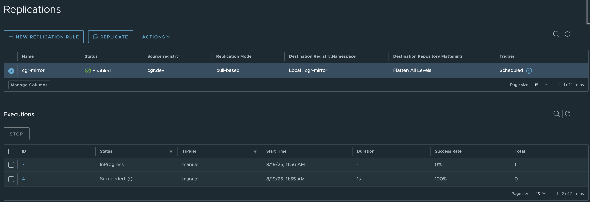

This tutorial outlines how to sync images from Chainguard's registry to an
instance of [Harbor](https://goharbor.io/).

It describes two approaches:

1. A [Proxy
Cache](https://goharbor.io/docs/2.1.0/administration/configure-proxy-cache/),
   which configures a Harbor project as a pull through cache.
2. A [Replication
Rule](https://goharbor.io/docs/2.1.0/administration/configuring-replication/create-replication-rules/),
   which copies images to a Harbor project.

## Prerequisites

In order to complete this tutorial, you will need the following:

* Administrative privileges over a Harbor instance.
* Privileges to create a pull token on a Chainguard registry.

## Create a Registry Endpoint

Before configuring a Proxy Cache or Replication Rule, you must create a
registry endpoint for the Chainguard registry.

Firstly, if you don't already have one, generate a pull token in your
organization. Make a note of the username and password.

```shell
chainctl auth configure-docker --parent <org-name> --pull-token
```

Then, from the Harbor UI, navigate to `Administraion > Registries` and select
`+ NEW ENDPOINT`.

Configure the endpoint with these details:

* `Name` — This is used to refer to your repository. You can choose whatever
  name you like here, but this guide's examples will use the name `cgr.dev`.
* `Endpoint URL` - Must be `https://cgr.dev`.
* `Access ID` - The username of the pull token.
* `Access Secret` - The password of the pull token.

Select `TEST CONNECTION` to ensure that Harbor can reach `cgr.dev` successfully.
Then press `OK` to create the endpoint.



## Create a Proxy Cache

A [Proxy
Cache](https://goharbor.io/docs/2.1.0/administration/configure-proxy-cache/)
allows Harbor to proxy and cache images from a Chainguard registry.

To configure a cache, navigate to `Projects` and select `+ NEW PROJECT`.

Create the project with these details:

* `Project Name` - This can be whatever you like. This guide will use the name
  `cgr-proxy`.
* `Proxy Cache` - Toggle this on.
* `Endpoint` - Choose the endpoint you created in the previous step.



You should be able to pull images from the project like this:

```shell
docker pull <harbor-url>/cgr-proxy/<org-name>/<image-name>:latest
```

## Create a Replication Rule

A [Replication
Rule](https://goharbor.io/docs/2.1.0/administration/configuring-replication/create-replication-rules/)
is an alternative approach to a Proxy Cache that copies images from
Chainguard's registry to a Harbor project. This is how to configure one.

Firstly, create a project. From the Harbor UI, navigate to
`Projects` and select `+ NEW PROJECT`.

Give the project a name. This guide will use the name `cgr-mirror`.



Then, navigate to `Administration > Replications` and select `+ NEW REPLICATION
RULE`.

Create a new rule with these details:

* `Name` - This can be whatever you like. This guide will use the name
  `cgr-mirror`.
* `Replication mode` - Must be `Pull-based`.
* `Source registry` - The `cgr.dev` endpoint.
* `Source resource filter > Name` - Optional. Ensure you only select images in
  your organization by setting this to `<org-name>/*`.
* `Destination > Namespace` - This should be the project you created before.
* `Destination > Flattening` - Set to `Flatten All Levels`. This will remove the
  organization name from the path.
* `Trigger Mode` - Set to `Scheduled` to run the replication regularly. Or
  `Manual` to trigger on an ad-hoc basis.
* `Override` - Ensure this is enabled so that tags in the destination project
  are replaced when they change.



To trigger the replication manually, select the `cgr-mirror` rule in the table
and hit `REPLICATE`. Navigate to `Projects > cgr-mirror` and observe images populating.




You should be able to pull images from the project like this:

```shell
docker pull <harbor-url>/cgr-mirror/<image-name>:latest
```

## Learn More

If you haven't already done so, you may find it useful to review our
[Registry Overview](/chainguard/chainguard-registry/overview/) to learn more
about Chainguard's registry.

You can also learn more about Chainguard
Containers by checking out our
[Containers documentation](/chainguard/chainguard-images/overview/).

If you'd like to learn more about Harbor, we encourage you to refer to the
[official Harbor documentation](https://goharbor.io/docs).
