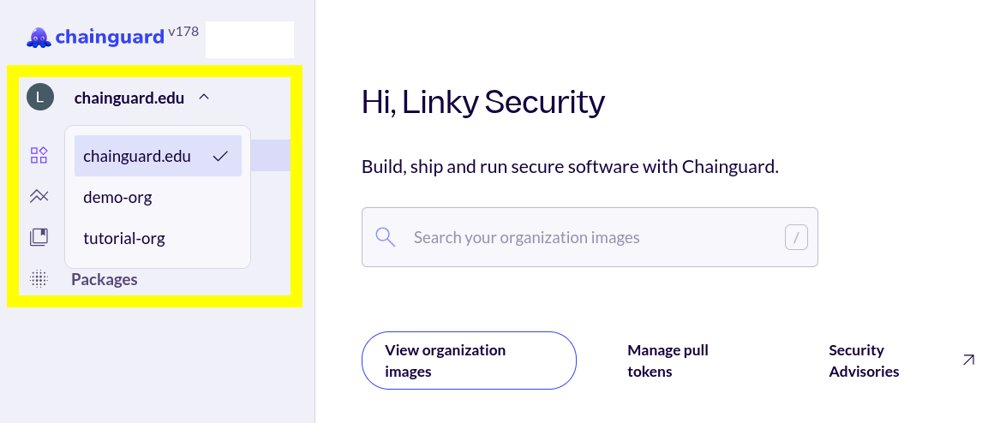

Chainguard's [Custom Assembly feature](/chainguard/chainguard-images/features/ca-docs/custom-assembly/) allows you to build customized container images that include only the packages your application needs. This tutorial will walk you through using the Chainguard console's web interface to manage Custom Assembly resources, including selecting packages, building customized containers, and monitoring build status.

By the end of this guide, you'll be able to create, customize, and manage your own container images through the Chainguard console, giving you full control over your container dependencies while maintaining Chainguard's security and compliance standards.

> **Note**: This overview highlights using the Chainguard console's UI to interact with Custom Assembly resources. However, you can also interact with Custom Assembly using [`chainctl`, Chainguard's command-line interface tool](/chainguard/chainguard-images/features/ca-docs/custom-assembly-chainctl/), as well as [the Chainguard API](/chainguard/chainguard-images/features/ca-docs/custom-assembly-api-demo/).

## Selecting Packages and Building a Customized Container

After logging in to the [Chainguard console](https://console.chainguard.dev/auth/login), you will be greeted with your account overview page. If you belong to more than one organization, be sure to select an organization with access to Custom Assembly from the drop-down menu in the top-left corner:

  

Click on **Images** and scroll or search for the container image that you want to customize. Note that you can customize any Chainguard Container that your organization has access to with Custom Assembly.

Clicking on the Custom Assembly container image will take you to its entry in the console. In the upper right corner of this page, you'll find a button that says **Customize Containers**: 

  

Click on this button to open a window displaying a list of all of the packages available to be added or removed from your selected container image. This list of packages includes all the packages your organization is entitled to. If there's a package you'd like to include in your image but it isn't available in this list, please open a Chainguard support ticket.

You can scroll through the list and select or deselect packages to tailor the image to your needs by checking their respective boxes. Alternatively, you can use the search box to filter for the packages you're looking for.

After selecting your chosen packages, click the **Preview changes** button to view all the packages you've selected for the customized image:

  

If you'd like to make further changes, click the **Back** button to return to the package selection.

If you're satisfied with the selection of packages, click the **Apply changes** button to build the new customized image. You will receive a confirmation message at the top of the Customize Container display letting you know that the image was successfully customized.

If a build fails, you'll need to make the appropriate changes before attempting another build. You can check their logs for information about what went wrong and what to fix.

## Listing Builds and Viewing Logs

You can view a list of all the available builds of your customized container image by clicking the customized image's **Builds** tab in the console:

  

The table in the Builds tab has six columns:

* **Status**: The status of the given build. When a build is successful, this column will show a green check inside of a circle. When a build has failed, this column will display a red exclamation mark in a triangle.
* **ID**: A unique identifier representing a specific customized container image build.
* **Tag**: The container image version the build represents.
* **Digest**: A unique, content-based hash representing the given container image build. 
* **Duration**: The amount of time it took to build the container image.
* **Created**: How long it's been since the build was created. 

Note that if you only recently customized the container image it may take a few minutes for the latest builds to populate.

Additionally, builds will only stay listed in the console for 24 hours. This is because Chainguard Containers, including Custom Assembly container images, are rebuilt frequently and would quickly congest the user interface.

You can click on the row of any build listed in the Builds tab to access its logs. This will cause a window to appear from the right where you can get more details about the build, including build failures:

  

## Undoing Changes to a Customized Container Image

If you've made modifications to a customized image and need to revert them, you can do so with just a few clicks in the Chainguard console.

Going back to the container image you just customized, click once again on the **Customize Image**. In the panel where you added packages, there will be a list of the packages added to the customized image below the **Filter packages** search box:

  

You can remove these packages from the container image by clicking their respective **⮿** symbols. Removing all the added packages will return the image to its original state.

Note that you can also edit the packages in a customized image [using the `chainctl image repo build edit` command](/chainguard/chainguard-images/features/ca-docs/custom-assembly-chainctl/#editing-a-customized-container-image). 

## Learn More

You now have the knowledge to effectively manage Custom Assembly resources through the Chainguard console. This web interface provides a user-friendly way to customize container images by adding or removing packages, monitor build status, and review build logs without needing to use command-line tools.

Remember that customized images are rebuilt frequently, and build history is retained for 24 hours. For more advanced workflows or automation, consider exploring the [`chainctl` CLI tool](/chainguard/chainguard-images/features/ca-docs/custom-assembly-chainctl/) or the [Chainguard API](/chainguard/chainguard-images/features/ca-docs/custom-assembly-api-demo/) for programmatic access to Custom Assembly features.