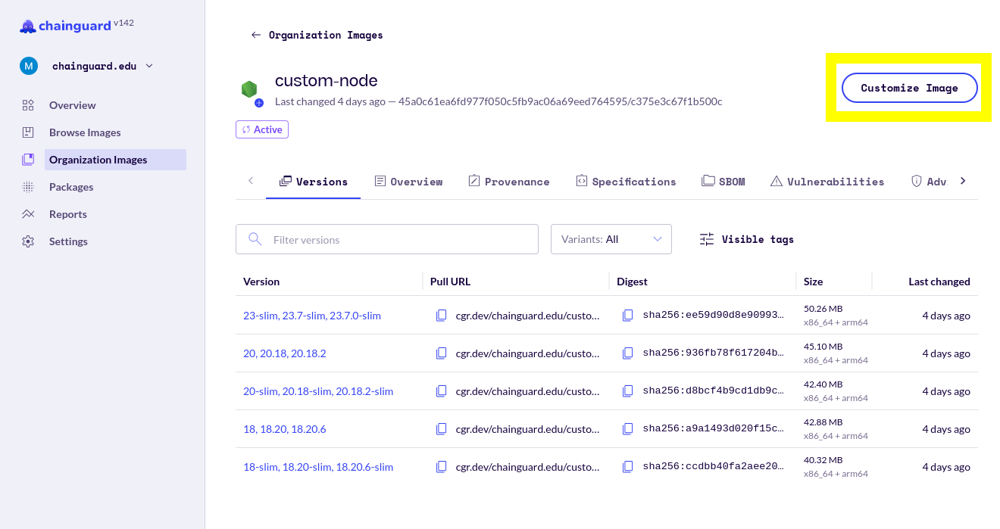
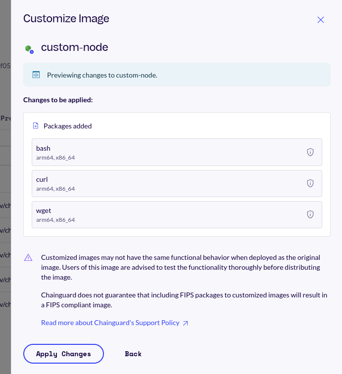
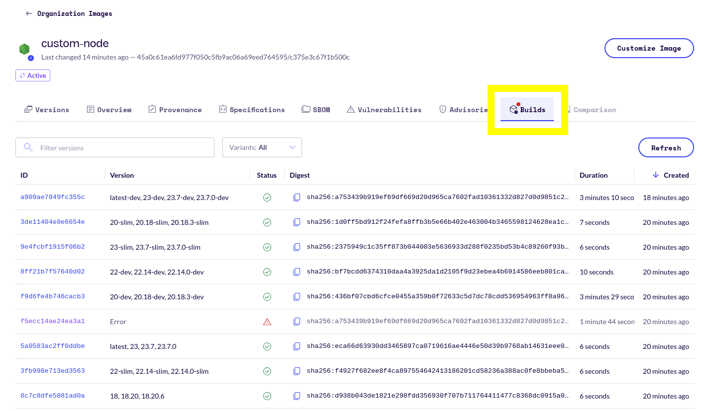
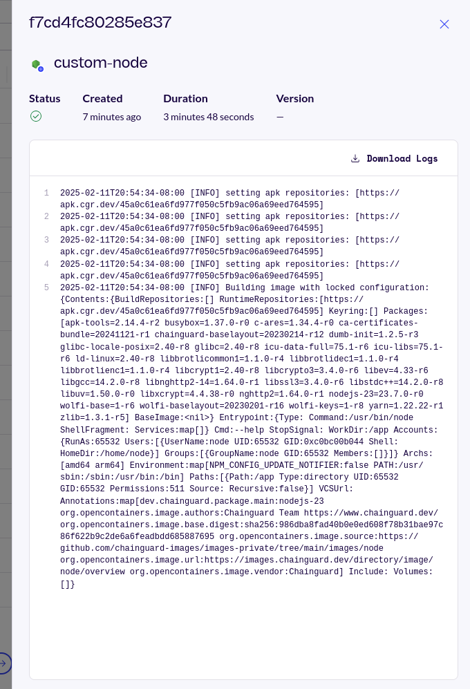

Chainguard has created Custom Assembly, a tool that allows users to create customized container images with extra packages added. This enables customers to reduce their risk exposure by creating container images that are tailored to their internal organization and application requirements while still having few-to-zero CVEs.

This guide outlines how to build customized Chainguard Containers using Custom Assembly in the Chainguard Console. It includes a brief overview of how Custom Assembly works, as well as its limitations.

> **NOTE**: The Custom Assembly tool is currently in its beta phase and it is likely to go through changes before it becomes generally available.


## About Custom Assembly

Custom Assembly is only available to customers that have access to Production Chainguard Containers. Additionally, your account team must enable Custom Assembly before you will be able to begin using it. Contact your account team directly to start the process.

When you enable the Custom Assembly tool for your organization, you must select at least one of Chainguard's application images to serve as the source for your customized container image. For example, if you want to build a custom base for a Python application, you would likely elect to use the [Python Chainguard Container](https://images.chainguard.dev/directory/image/python/versions) as the source for your customized image.

After selecting the packages for your customized container image, Chainguard will kick off a build on Chainguard's infrastructure. Once a customized image is built successfully, Chainguard will take care of its maintenance and rebuild it as necessary, such as when any of the packages in the image are updated.


### Limitations

Custom Assembly only allows you to add packages into a given container image; you cannot remove the packages included in the source application image by default. For example, Chainguard's Node.js container image comes with packages like `nodejs-23`, `npm`, and `glibc` by default. These packages can't be removed from a Node.js image using the Custom Assembly tool but you can add other packages into it, and you can remove these added packages in later builds.

The packages you can add to a container image are those that your organization already has access to based on the Chainguard Containers you have already purchased. Additionally, you can only add supported versions of packages to a customized image.

The changes you make to your customized container image may affect its functional behavior when deployed. Chainguard doesn’t test your final customized image and therefore doesn't guarantee its functional behavior. Please test your customized images extensively to ensure they meet your requirements.

Lastly, while Custom Assembly is in its beta phase it can only be configured from the Chainguard Console.


## Accessing Customized Containers in the Console

To provision a customized container image, reach out to your account team who will configure one for you.

> **Note**: This overview highlights using the Chainguard Console's UI to interact with Custom Assembly Resources. However, you can also interact with Custom Assembly using [`chainctl`, Chainguard's command-line interface tool](/chainguard/chainguard-images/features/ca-docs/custom-assembly-chainctl/), as well as [the Chainguard API](/chainguard/chainguard-images/features/ca-docs/custom-assembly-api-demo/).

After logging in to the [Chainguard Console](https://console.chainguard.dev/auth/login), you will be greeted with your account overview page. If you belong to more than one organization, be sure to select the organization which has Custom Assembly enabled from the drop-down menu in the top-left corner.

Click on **Organization Containers** and scroll or search for the customized container image that was set up by your account team. This will typically have a name that specifies the source container image while also highlighting that it is a customized image, such as `python-custom` or `node-custom`. Once you've found it, click on the container image.


## Selecting Packages and Building a Customized Container

Clicking on the Custom Assembly container image will take you to its entry in the Console. In the upper right corner of this page, you'll find a button that says **Customize Containers**: 

<center></center>
<br /> 

Click on this button to open a window displaying a list of all of the packages available to be added or removed from your selected container image. This list of packages includes all the packages your organization is entitled to. If there's a package you'd like to include in your image but it isn't available in this list, reach out to your account team for access.

You can scroll through the list and select or deselect packages to tailor the image to your needs by checking their respective boxes. Alternatively, you can use the search box to filter for the packages you're looking for.

After selecting your chosen packages, click the **Preview Changes** button to view all the packages you've selected for the customized image:

<center></center>
<br /> 

If you'd like to make further changes, click the **Back** button to return to the package selection.

If you're satisfied with the selection of packages, click the **Apply Changes** button to build the new customized image. You will receive a confirmation message at the top of the Customize Container display letting you know that the image was successfully customized.

If a build fails, you'll need to make the appropriate changes before attempting another build. You can check their logs for information about what went wrong and what to fix.


## Listing Builds and Viewing Logs

You can view a list of all the available builds of your customized container image by clicking the customized image's **Builds** tab in the Console:

<center></center>
<br /> 

The table in the Builds tab has six columns:

* **ID**: A unique identifier representing a specific customized container image build.
* **Version**: The container image version the build represents.
* **Status**: The status of the given build. When a build is successful, this column will show a green check inside of a circle. When a build has failed, this column will display a red exclamation mark in a triangle.
* **Digest**: A unique, content-based hash representing the given container image build. 
* **Duration**: The amount of time it took to build the container image.
* **Created**: How long it's been since the build was created. 

Note that if you only recently customized the container image it may take a few minutes for the latest builds to populate.

Additionally, builds will only stay listed in the Console for 24 hours. This is because Chainguard Containers, including Custom Assembly container images, are rebuilt frequently and would quickly congest the user interface.

You can click on the row of any build listed in the Builds tab to access its logs. This will cause a window to appear from the right where you can get more details about the build, including build failures:

<center></center>
<br /> 


## Using Customized Containers

You can use Docker to download the customized container image for testing or use, like this:

```shell
docker pull cgr.dev/$ORGANIZATION/$CUSTOMIZED-CONTAINER:latest
```

Be sure to change `$ORGANIZATION` to reflect the name used for your organization's private repository within the Chainguard registry and replace `$CUSTOMIZED-CONTAINER` with the actual name of your container image. 

Additionally, replace `latest` with your chosen tag, if different. You can find a list of all the available tags for your customized container in its **Versions** tab in the Console.

Note that you can also download specific builds of an container image by referencing the build's unique digest, as in this example:

```shell
docker pull cgr.dev/$ORGANIZATION/$CUSTOMIZED-CONTAINER@sha256:e24d3X4MPL338cb75b3X4MPL3674bd908681fca3X4MPL31e3d0321b892b9611d
```

Pulling container images by digest can [improve reproducibility](/chainguard/chainguard-images/how-to-use/container-image-digests/). 

> If you run into any issues with your customized container images or with using the Custom Assembly tool, please reach out to your account team for assistance.


### Installing packages from a Chainguard private APK repository

Chainguard offers [Private APK Repositories](/chainguard/chainguard-images/features/private-apk-repos/) which you can use to access the apk packages available to your organization. You can use your organization's private APK repository to further customize your Custom Assembly containers.

As an example, run a container with a Custom Assembly container image that has a shell and package manager, such as a `-dev` variant of a customized container image:

```shell
docker run -it --entrypoint /bin/sh --user root  \
-e "HTTP_AUTH=basic:apk.cgr.dev:user:$(chainctl auth token --audience apk.cgr.dev)" \
cgr.dev/$ORGANIZATION/$CUSTOMIZED-CONTAINER:latest-dev
```

Note that this command injects an `HTTP_AUTH` environment variable directly into the container by calling `chainctl` from the host machine to obtain an ephemeral token. This is necessary to authenticate to the private repository.

By default, your organization's private APK repository will be listed in the container's list of APK repositories:

```container
cat /etc/apk/repositories
```
```Output
https://apk.cgr.dev/45a0c3X4MPL3977f03X4MPL3ac06a63X4MPL3595
```

The repository address in this file (which includes a long unpronounceable string) will differ from the one shown in the Console (which reflects the organization name). The string shown in the `repositories` file is the ID number of the organization. You can confirm this by running the `chainctl iam organizations ls -o table` command.

To search for and install packages from the private APK repository, first the package index:

```container
apk update
```
```Output
fetch https://apk.cgr.dev/45a0c3X4MPL3977f03X4MPL3ac06a63X4MPL3595/x86_64/APKINDEX.tar.gz
 [https://apk.cgr.dev/45a0c3X4MPL3977f03X4MPL3ac06a63X4MPL3595]
OK: 1019 distinct packages available
```

Then you can search for packages available in your private repo. The following example searches for packages named "mongo":

```container
apk search mongo
```
```Output
mongo-5.0-5.0.31-r0
mongo-6.0-6.0.20-r0
mongo-7.0-7.0.16-r0
mongo-8.0-8.0.4-r1
mongod-5.0-5.0.31-r0
mongod-6.0-6.0.20-r0
mongod-7.0-7.0.16-r0
mongod-8.0-8.0.4-r1
```

Finally, you can install a package with `apk`:

```container
apk add mongo
```
```Output
(1/1) Installing mongo-8.0 (8.0.4-r1)
Executing busybox-1.37.0-r0.trigger
OK: 719 MiB in 78 packages
```

To learn more, refer to our [Private APK Repositories documentation](/chainguard/chainguard-images/features/private-apk-repos/).


## Troubleshooting

Build failures can occur for a number of reason, including the following:

* It's possible for users to select packages that conflict with each other. For example, if two packages install the same files, Custom Assembly may not be able to resolve the conflict and result in a failed build.
* Large images taking longer than 1 hour to build will fail with a timeout error.
* There is a known bug where container images will not be rebuilt if their source image is more than 48 hours 

In any case, you won't know whether a container image build fails until after it's complete. If you need assistance troubleshooting, please [reach out to our Customer Support team](https://www.chainguard.dev/contact?utm=docs).


## Conclusion

Custom Assembly allows customers to leverage Chainguard’s build infrastructure to produce container images tailored to their requirements. That means customers no longer have to stand up and maintain their own builds, saving costs in the form of infrastructure, engineering overhead, and complexity.

This overview focused on managing Custom Assembly resources through the Chaiguard Console. You can also interact with Custom Assembly using [`chainctl`](/chainguard/chainguard-images/features/ca-docs/custom-assembly-chainctl/) as well as [the Chainguard API](/chainguard/chainguard-images/features/ca-docs/custom-assembly-api-demo/).

We encourage you to check out our resources on our other [Chainguard Containers features](/chainguard/chainguard-images/features/), including the following:

* [Unique Tags](/chainguard/chainguard-images/features/unique-tags/)
* [CVE Visualizations](/chainguard/chainguard-images/features/cve_visualizations/)
* [Custom Certificates](/chainguard/chainguard-images/features/incert-custom-certs/)

Additionally, for more information on working with Chainguard Containers, refer to our docs on [How to Use Chainguard Containers](/chainguard/chainguard-images/how-to-use/).
