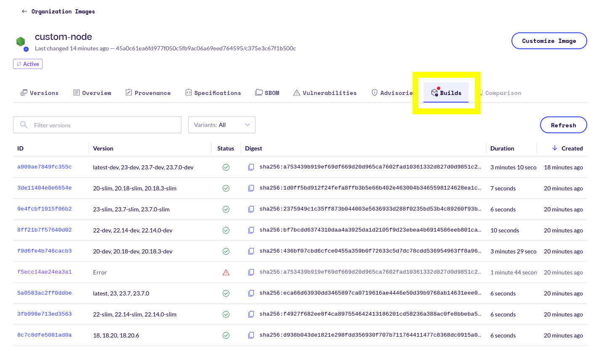
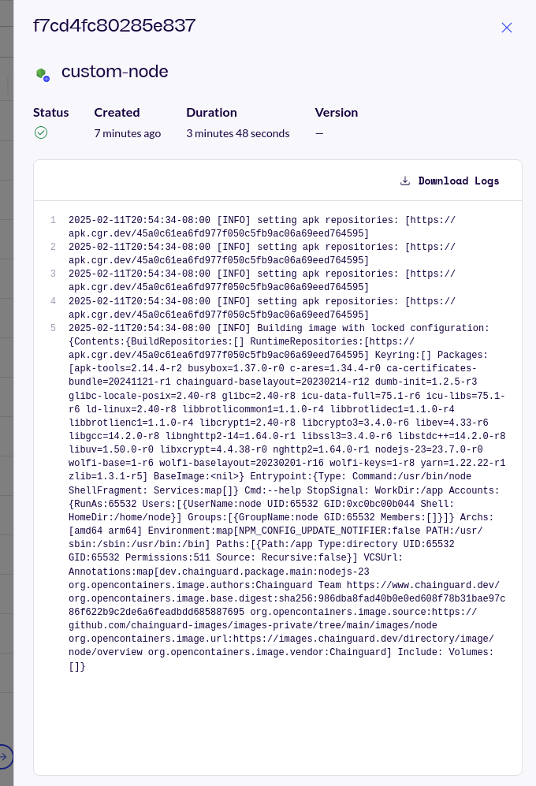

Oftentimes, organizations need to customize container images to suit the needs of their applications or enterprise requirements. This can result in complex build processes that are difficult to maintain and introduce development friction, overhead, and security risk.

Chainguard has created a Custom Assembly feature that allows users to create customized images. This enables users to reduce your risk exposure by distributing container images that are tailored to your internal organization and application requirements while still having few-to-zero CVEs.

This guide outlines how to build customized Chainguard Images using Custom Assembly in the Chainguard Console. It includes a brief overview of how Custom Assembly works, as well as its limitations.

> **NOTE**: This is a beta feature and it is likely to go through changes before it becomes generally available.


## About Custom Assembly

Custom Assembly is only available to customers that have access to Production Chainguard Images. Additionally, your account team must enable the Custom Assembly platform before you will be able to begin. Contact your account teams directly to start the process.

When you enable the Custom Assembly platform for your organization, you must select at least one of Chainguard's application images to serve as the base for your customized image. For example, if you know your organization wants to use a customized Python image you would likely elect to use the [Python Chainguard Image](https://images.chainguard.dev/directory/image/python/versions) as the base for your customized image.

After selecting the packages for your customized image, Chainguard will handle the image's initial build on our infrastructure. Once a customized image is built successfully, Chainguard will take care of its maintenance and rebuild it as necessary, such as when the base application image has been updated.

You are only able to use packages that you are entitled to as a customer based on the Chainguard Images you have purchased.

### Limitations

Custom Assembly only allows you to add packages into a given image; you cannot remove the default package included in the base application image. For example, Chainguard's Node.js image comes with packages like `nodejs-23`, `npm`, and `glibc` by default. These packages can't be removed from a Node.js image in the Custom Assembly platform but you can add other packages into it, though you can remove these added packages in later builds.

The packages you can add to an image are those that your organization already has access to. Additionally, you can only add supported versions of packages to a customized image.

The changes you make to your customized image may affect its functional behavior when deployed. Chainguard doesn’t test your final customized image and therefore doesn't guarantee its functional behavior. Please test your customized images extensively to ensure they meet your requirements.

Lastly, while the feature is in its beta phase, it is only available in the Chainguard Console.


## Accessing Customized Images in the Console

To provision a customized image, reach out to your account team who will configure one for you. You can then navigate to the [`Chainguard Console`](https://console.chainguard.dev/auth/login) and log in, and your Custom Assembly image will appear shortly after.

Once you are logged in you will be greeted with your account overview page. If you belong to more than one organization, be sure to select the organization which has Custom Assembly enabled from the drop-down menu in the top-left corner.

Click on **Organization Images** and scroll or search for the customized image that was set up by your account team. This will typically have a name that specifies the base image while also highlighting that it is a customized image, such as `python-custom` or `node-custom`. Once you've found it, click on the image.


## Selecting Packages and Building a Customized Image

Clicking on the Custom Assembly image will take you to its entry in the Console. In the upper right corner of this page, you'll find a button that says **Customize Image**: 

<center></center>
<br /> 

Click on this button to open a window displaying a list of all of the packages available to be added or removed from your selected image. This list of packages includes all the packages your organization is entitled to. If there's a package you'd like to include in your image but it isn't available in this list, reach out to your account team for access.

You can scroll through the list and select or deselect packages to tailor the image to your needs by checking their respective boxes. Alternatively, you can use the search box to filter for the packages you're looking for.

After selecting your chosen packages, click the **Preview Changes** button to view all the packages you've selected for the customized image:

<center></center>
<br /> 

If you'd like to make further changes, click the **Back** button to return to the package selection.

If you're satisfied with the selection of packages, click the **Apply Changes** button to build the new customized image. You will receive a confirmation message at the top of the Customize Image display letting you know that the image was successfully customized.

If a build fails, it will be automatically retired and you'll need to make the appropriate changes before attempting another build. For failed builds, you can check their logs for information about what went wrong.


## Listing Builds and Viewing Logs

You can view a list of all the available builds of your customized image by clicking the customized image's **Builds** tab in the Console.

<center></center>
<br /> 

The table in the Builds tab has six columns:

* **ID**: A unique identifier representing a specific customized image build.
* **Version**: The image version the build represents.
* **Status**: The status of the given build. When a build is successful, this column will show a green check. When a build has failed, this column will display a red exclamation mark in a triangle.
* **Digest**: A unique, content-based hash representing the given image build. 
* **Duration**: The amount of time it took to build the image.
* **Created**: How long it's been since the build was created. 

From the Builds tab, you can view the logs for every one of your customized image builds. Note that if you only recently customized the image it may take a few minutes for the latest builds to populate.

Additionally, builds will only stay listed in the Console for 24 hours. This is because Chainguard Images, including Custom Assembly images, are rebuilt frequently and would quickly congest the user interface.

You can click on the row of any build listed in the Builds tab to access its logs. This will cause a window to appear from the right where you can get more details about the build, including build failures. 

<center></center>
<br /> 

Build failures can occur for a number of reasons. For example, the Custom Assembly platform will attempt to build in both the `arm64` and `amd64`, and if you attempt to build the image it will fail. Additionally, there is a known bug where builds will fail if the source image's signatures are more than 24 hours old. In either case, you won't know whether an image build fails until after it's complete.


## Using Customized Images

You can use Docker to download the customized image for testing or use, like this:

```shell
docker pull cgr.dev/$ORGANIZATION/$CUSTOMIZED-IMAGE:latest
```

Be sure to change `$ORGANIZATION` to reflect the name used for your organization's private repository within the Chainguard registry and replace `$CUSTOMIZED-IMAGE` with the actual name of your image. 

Additionally, replace `latest` with your chosen tag, if different. You can find a list of all the available tags for your customized image in the **Versions** tab.

Note that you can also download specific builds of an image by referencing the build's unique digest, as in this example:

```shell
docker pull cgr.dev/$ORGANIZATION/$CUSTOMIZED-IMAGE@sha256:e24d3X4MPL338cb75b3X4MPL3674bd908681fca3X4MPL31e3d0321b892b9611d
```

Pulling images by digest can [improve reproducibility](/chainguard/chainguard-images/how-to-use/container-image-digests/). 

> If you run into any issues with your customized images or with using the Custom Assembly platform, please reach out to your account team for assistance.


## Conclusion

Custom Assembly allows customers to leverage Chainguard’s build infrastructure to produce container images tailored to their requirements. That means customers no longer have to stand up and maintain their own builds, saving costs in the form of infrastructure, engineering overhead, and complexity.

We encourage you to check out our resources on our other [Chainguard Images features](/chainguard/chainguard-images/features/), including the following:

* [Unique Tags](/chainguard/chainguard-images/features/unique-tags/)
* [CVE Visualizations](/chainguard/chainguard-images/features/cve_visualizations/)
* [Custom Certificates](/chainguard/chainguard-images/features/incert-custom-certs/)

Additionally, for more information on working with Chainguard images, refer to our docs on [How to Use Chainguard Images](/chainguard/chainguard-images/how-to-use/).
