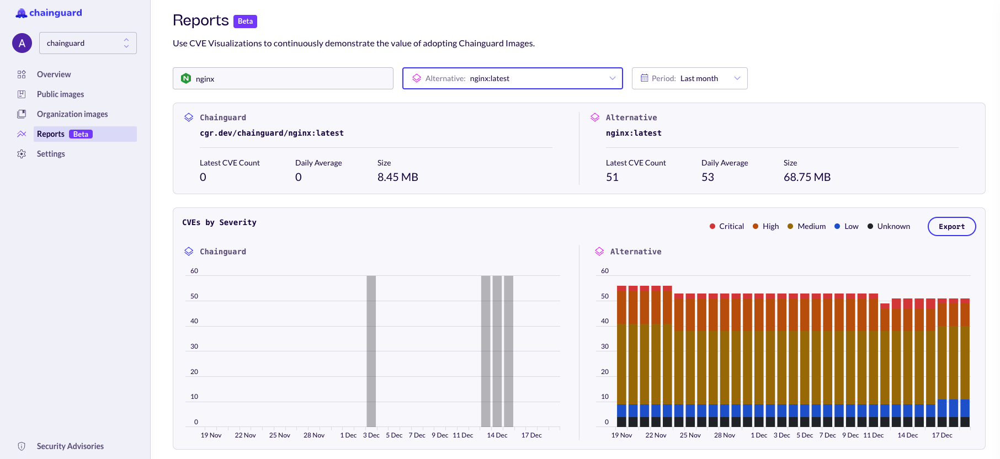
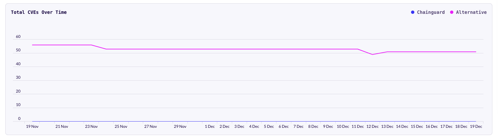

CVE Visualizations provide insight into image health and can help teams measure the engineering,
security, and economic benefits gained from using Chainguard Images. The feature creates reports
with CVE comparisons between Chainguard Images and popular alternatives, as well as historical CVE
remediation metrics.

> **NOTE**: This is a beta feature and changes should be expected. In particular, we plan to add more
metrics in the near future.

## Accessing CVE Visualizations

Visualizations can be found under the [Reports](https://console.chainguard.dev/reports) section
on the left-hand navigation bar.

The reports page should look similar to the following:

The top left drop down in the main page is used to select the Chainguard image you want to compare.
Once an image is selected, a second drop down will be populated with data on "alternative" images,
if available. In some cases there will be more than one alternative available, in which case you can
select between them using the drop down.

The period drop down is used to select a time-period for the report.

Below the controls, you will find several boxes with statistics and graphs:
  - An overview section showing the current and average CVE counts as well as image size for the images.
  - A "CVEs by Severity" section holding bar graphs with the CVE count per day for both
    images, broken down by severity. Any grey bars indicate we are missing data for that day.
  - A "Total CVEs over time" section showing a line graph with the total number of CVEs for any
    given day for each image. This gives a simple visual comparison of the difference in CVE
    count between the images.

You will also see the same comparison data when navigating to a specific image in your Organization
images, under the "Comparison" tab.

## Limitations

We only have data for a limited subset of alternative images. We will expand this set over time, but
please let us know of any particular comparison data you are looking for.

## Learn More

The CVE data used in these reports is from the [Grype vulnerability
scanner](https://github.com/anchore/grype). Vulnerability data is constantly evolving, so we scan
images each day and store the results. The results shown are the vulnerabilities found on the day in
question; scanning the images again with a newer database will show different results.

For more information on CVEs see [What Are Software Vulnerabilities and CVEs](/software-security/cves/cve-intro/).
