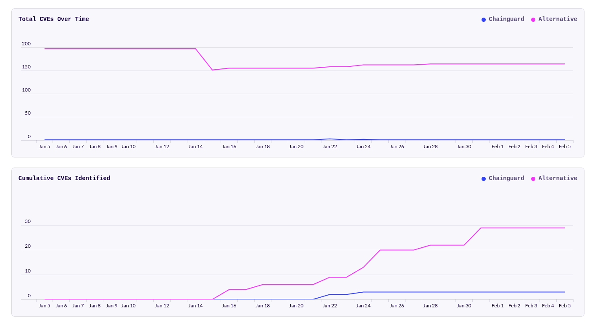

Chainguard provides CVE Visualizations for all of its images. This feature creates reports with CVE comparisons between Chainguard Images and popular alternatives, as well as historical CVE remediation metrics. CVE Visualizations provide insight into image health and can help teams measure the engineering, security, and economic benefits gained from using Chainguard Images

This guide outlines how you can access an image's CVE Visualization in both the Chainguard Console and in the Images Directory. 

## Accessing CVE Visualizations in the Console

You can find CVE Visualizations and reports in two places in the [Chainguard Console](https://console.chainguard.dev): in the **Reports** section of the left-hand navigation menu and in the **Comparison** tab of an individual Image's overview.

### Reports section

Visualizations can be found under the [**Reports**](https://console.chainguard.dev/reports) section in the left-hand navigation bar.

The Reports page will look similar to the following:

  

At the top of the Reports page will be two tabs: **Compare Images** and **Historical CVEs**. Let's first review the Compare Images tab.

At the top left of the Compare Images tab is a drop-down menu which you can use to select the Chainguard image you want to compare. The contents of this menu are organized in alphabetical order, starting with Organization Images at the top (if your selected organization has access to any private Chainguard images) followed by Public images.

  

After you select an image, a second drop-down will appear. If available, this menu will be populated with data on "alternative" images against which you can compare the selected Chainguard Image. In some cases there will be more than one alternative available, in which case you can select between them using the drop-down.

To the right of the alternatives menu are two calendar menus you can use to select a time range for the report.

Below the controls, you will find several boxes with statistics and graphs:

* An overview section showing the current and average CVE counts as well as image size for the images.
* A **CVEs by Severity** section with bar graphs showing the CVE count per day for both images, broken down by severity. Any grey bars indicate we are missing data for that day.

> **Note**: Be aware that this section also includes an **Export** button you can use to download this data as a JSON file. 

* A "Total CVEs over time" section showing a line graph with the total number of CVEs for any given day for each image. This provides a visual comparison of the difference in CVE count between the images.

  

The **Historical CVEs** tab shows data relating to CVEs that have appeared over the past three months in images that your organization has access to. Be aware that the totals shown only represent your Organization Images, and not Public images. 

> **Note**: If you are a member of more than one organization you can switch to another organization by clicking the drop-down menu in the top left corner of the Console. 

The **Historical CVEs** tab has two boxes. The first box is labeled **Resolved CVEs in Organization Images** and shows a bar chart displaying the number of resolved CVEs by date over the last three months. The second box is labeled **Total Resolved CVEs by Severity** and shows a horizontal bar chart showing all the resolved CVEs from the past three months. In both graphs, the CVEs are color-coded by severity.

  

### Comparison tab

You can find this same comparison data when navigating to a specific image in either the **Browse Images** section or in your **Organization Images**. After navigating to either of these sections, click on or search for any image you like.

By default, you will be taken to the image's **Versions** tab. Click on the **Comparison** tab at the far right. There, you'll be presented with the same comparison information found in the **Reports** section. At the top are some control menus, allowing you to select the date range for the comparison and, if available, the alternative you'd like to compare the Chainguard Image against. This example shows the PHP image:

  

## Accessing CVE Visualizations in the Images Directory

Similar to the CVE reports found in the **Browse Images** and **Organization Images** section of the Chainguard Console, you can find CVE reports for every one of Chainguard's container images in the [Images Directory](https://images.chainguard.dev/).

After navigating to the directory, click on or search for any image you like. Again, you will be taken to the image's **Versions** tab by default. Click on the **Comparison** tab at the right to view the CVE Comparison data. This example shows the nginx image:

  

## Limitations

Some images do not currently have a comparative alternative. In these cases, the Comparison report will only show data for the Chainguard image. 

## Learn More

The CVE data used in these reports is from the [Grype vulnerability scanner](https://github.com/anchore/grype). Vulnerability data is constantly evolving, so we scan images each day and store the results. The results shown are the vulnerabilities found on the day in question; scanning the images again with a newer database will show different results.

For more information on CVEs see [What Are Software Vulnerabilities and CVEs](/software-security/cves/cve-intro/). You may also find our guide on [Using the Chainguard Directory and Console](/chainguard/chainguard-images/how-to-use/images-directory/) to be of interest.