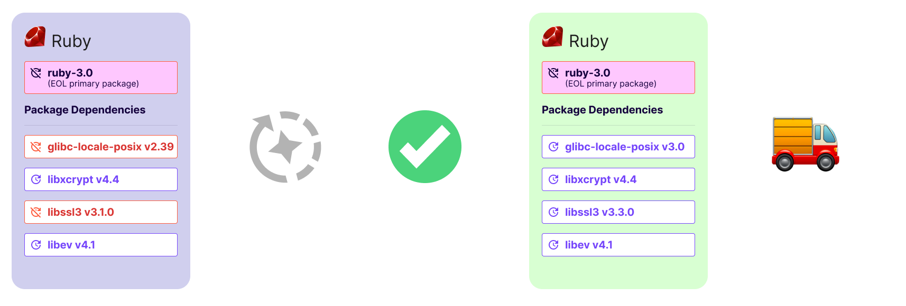
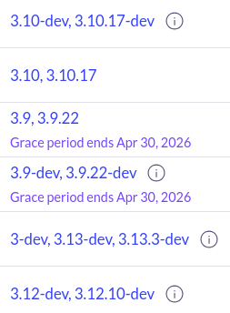
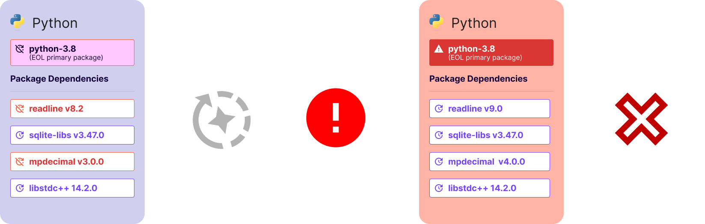

Typically, specific versions of software receive updates on a schedule for a set amount of time. Eventually, though, every version of software will stop receiving support. When project maintainers stop providing updates, it's known as the *End-of-Life* (EOL) stage.

It's recommended that when a software version reaches the EOL phase, users should migrate their projects to a later version, as [EOL software is known to accumulate vulnerabilities](/chainguard/chainguard-images/staying-secure/updating-images/how-eol-software-accumulates-cves/). However, there are cases where an organization may want to continue using a container image after it has reached end-of-life. This could be because an image reaches EOL before the organization's release schedule, or perhaps later image versions have one or more issues that prevent the organization from upgrading.

To help in situations like this, Chainguard offers an end-of-life grace period for eligible Containers. This article provides an overview of Chainguard's EOL grace period, and also includes a brief introduction to using Chainguard's API to retrieve information about an image's EOL grace period status. 


## Understanding Chainguard's EOL Grace Period

Chainguard's EOL grace period gives customers access to new builds of container images whose primary package has entered its end-of-life phase for up to six months after they have reached EOL. During this time, Chainguard will address vulnerabilities and update any non-EOL packages within the container image (other than the image's primary package). Chainguard will continue to rebuild the image a maximum of six months after the primary package enters its EOL phase or until the build fails.

<center></center>
<br />

> **Note**: Chainguard is **not** able to offer any exceptions to the 6 month limit for the EOL grace period.

You will be able to find the end date of a given container image version's grace period in the [Chainguard Console](https://console.chainguard.dev/). From the **Organization Images** tab, select an image. You'll be taken to that container image's **Versions** page, and the end date of each grace period will be listed under the respective version:

<center></center>
<br /> 

As of this writing, a container image must meet two key requirements to be eligible for coverage under the EOL grace period:

1. It is listed as part of the current available or eol versions for a version stream package present in our catalog
2. Has [multiple release tracks](/chainguard/chainguard-images/about/versions/#multiple-releases-maintained-by-a-given-open-source-project)
3. Is within six months of their official EOL date (as declared by upstream project maintainers)
4. Its release and EOL dates are available on the [`endoflife.date`](https://endoflife.date/) website. Otherwise, the package will require manual updates to track new releases and EOL dates for supported versions

Be aware that the following are not covered by Chainguard's EOL grace period:

* Updating an image’s EOL primary package.
* Backporting or cherry-picking individual commits or patches to the EOL primary package.
* Any package labeled end-of-life for more than 6 months by its open-source creators or maintainers.

Additionally, if a container image fails to build because underlying dependencies conflict with the primary package, it will no longer be supported. A failed build signals the end of support for that image. 

<center></center>
<br />

If a dependency conflict prevents an image version from building successfully, the grace period will end immediately for that version. Chainguard will not attempt further updates or CVE remediations after a build failure. Additionally, If a container image fails to build due to dependency conflicts, its grace period ends immediately. This means no further updates or CVE remediations will be provided for that image version.

After a grace period ends, your organization will retain access to the last successful build of the image. Chainguard will stop providing updates and CVE remediations; although the image will remain usable, it won't receive any ongoing security maintenance. Once an image's grace period has ended, we strongly recommend upgrading to a supported version as soon as possible.

### Planning for and managing an EOL grace period lifecycle

To maximize the value of a grace period, we recommend the following:

* **Before the grace period starts**:
    * Identify all dependent applications and services using the container image
    * Create an upgrade plan with realistic timelines
    * Document any known issues or compatibility requirements
    * Set up monitoring for the container images
* **During the grace period**:
    * Test newer versions of the image in a development environment
    * Track and resolve any compatibility issues
    * Begin deploying updated versions to non-critical environments
    * Monitor for any build failures or dependency conflicts
* **Before expiration**:
    * Complete all necessary testing of the new version
    * Schedule the production upgrade
    * Document any configuration changes needed
    * Prepare rollback procedures if needed


## Using the EOL Grace Period API

Although the Chainguard Console is a useful interface, many customers would prefer to integrate EOL data with their preferred tools for faster, more convenient monitoring. For this reason, Chainguard has developed an API to serve customers with EOL data sufficient for monitoring the lifecycle of their images.

The API endpoint you can reach for EOL data is [`Registry_ListEolTags`](/chainguard/administration/api/#/operations/Registry_ListEolTags). This section outlines how you can use `curl` to make a call to this API endpoint.

To follow along, you'll need to know the UIDP of the container image repository you'd like to retrieve end-of-life data for. You can find this with the following `chainctl` command:

```shell
chainctl images repos list --parent $ORGANIZATION -o wide
```

Replace `$ORGANIZATION` with the name of your organization.

This command will return a table showing the UIDPs of every Chainguard Container the specified organization has access to:

```
                ID                 |      REGISTRY       |   REPO   |        BUNDLES        |    TIER 	 
-----------------------------------+------------------------+----------+-----------------------+--------------
  ORGANIZATION_ID/165aEXAMPLE5b7ae | cgr.dev/example.com | nginx    | application, featured | APPLICATION  
  ORGANIZATION_ID/4408EXAMPLE4131a | cgr.dev/example.com | node     | base                  | UNKNOWN 	 
  ORGANIZATION_ID/37a2EXAMPLE0d419 | cgr.dev/example.com | python   | base, featured        | UNKNOWN 	 

```

With the image repository ID, you can make a request to the API endpoint with a command like the following. Make sure to replace `$ORGANIZATION_ID/4408EXAMPLE4131a` with the container image repository UIDP you just found:

```shell
curl -H "Authorization: Bearer $(chainctl auth token)" https://console-api.enforce.dev/registry/v1/eoltags?uidp.childrenOf=$ORGANIZATION_ID/4408EXAMPLE4131a | jq .
```

Note that this example includes the `-H` argument to pass an authorization header to the API. This header is constructed with the `chainctl auth token` command which prints the local Chainguard token, allowing you to authenticate to the API. 

It also pipes the `curl` command's output into `jq`, a lightweight JSON processor, in order to make it easier to read.

This command will return EOL data for each image within the repository, which will be delivered in the following format:

```
{
  "items": [

. . .

  {
    "id": "ORGANIZATION_ID/4408EXAMPLE4131a/9ef6EXAMPLE6265c",
    "name": "18.20.8-slim",
    "mainPackageName": "nodejs",
    "mainPackageVersion": "18",
    "graceStatus": "ACTIVE",
    "gracePeriodExpiryDate": "2025-10-30T00:00:00Z",
    "mainPackage": {
      "eolDate": "2025-04-30",
      "exists": true,
      "fips": false,
      "lts": "2022-10-25",
      "releaseDate": "2022-04-19",
      "version": "18",
      "eolBroken": false
    }
  },

. . .

  ]
}
```

This example output is derived from an API call made on a `node` image repository, and the data returned presents a lot of useful information, some of which is highlighted here:

* `id`: this is the UID of the specific image this block of data represents
* `name`: the given container image's tag
* `graceStatus`: the status of whether or not the given container image is in an active grace period
    * `ACTIVE`, as shown in this example, indicates the image is in an active grace period
    * any images not currently in a grace period would show `INACTIVE`
* `gracePeriodExpiryDate`: the date on which the image's grace period will end
* `eolDate`: the date on which the image's main package reached EOL
* `lts`: the date on which this version of the main package entered its long-term support period
* `releaseDate`: the date on which the main package's version was released

Of course, you won't use `curl` to interact with the Chainguard API in most scenarios. Instead, you'll likely have some kind of application that can ingest and process this EOL data. For example, your organization could create a Slackbot that fetches data from the Chainguard EOL grace period API and posts messages about EOL tags approaching their grace period expiration to a specified Slack channel. Chainguard's [API documentation](/chainguard/administration/api/) includes request samples for many languages and platforms, including Go, Python, and Java.


## Learn More

Chainguard's EOL grace period gives customers the opportunity to continue to receive best-effort CVE remediated updates on EOL images, while they work on transitioning to a newer upstream version.

For more information on the EOL grace period, [please contact us](https://www.chainguard.dev/contact?utm_source=cg-academy&utm_medium=referral&utm_campaign=dev-enablement). Additionally, our doc outlining the [Chainguard Containers Product Release Lifecycle](/chainguard/chainguard-images/about/versions/) can be helpful for understanding Chainguard’s approach to updates, releases, and versions within Chainguard Containers. Finally, our conceptual article on [How End-of-Life Software Accumulates Vulnerabilities](/chainguard/chainguard-images/staying-secure/updating-images/how-eol-software-accumulates-cves/) is helpful for understanding the risk involved with using end-of-life software by outlining how EOL images accrue vulnerabilities and where they accumulate.

