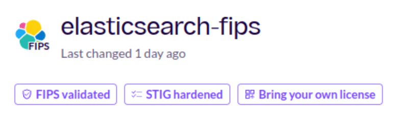

Answers to your questions about Chainguard FIPS Container Images.

## Is there a way to enable or disable the FIPS mode in a FIPS image?

All Chainguard FIPS Images are configured in approved-only mode as noted in our [FIPS commitment](https://www.chainguard.dev/legal/fips-commitment).

For non-approved mode, our recommendation is to purchase and use a non-FIPS Chainguard Image.

Because it is error prone, difficult to support, and fragile, Chainguard does not provide the ability to switch to non-FIPS from a FIPS Image. If you require that, please contact a [NIST-approved security lab](https://csrc.nist.gov/projects/testing-laboratories) to help you achieve your certification needs when using our FIPS modules. 

## Does a given Chainguard FIPS Image require me to “bring my own license”?

From the Images Directory or Images Console, search for the Image you would like to know more about, and check if it has the "Bring Your Own License" badge. If it does, one can or must (depending on the Image) bring their own license keys for the product. Review the Overview documentation (for example, the [`elasticsearch-fips` Overview](https://images.chainguard.dev/directory/image/elasticsearch-fips/overview)) for the given image, and review the application’s documentation for further guidance.

## Which Chainguard Images tags have kernel-independent FIPS?

For Chainguard Images built from November 7, 2024 onward, the minimum requirements for kernel-independent FIPS are based on the package listings in their relevant SBOMs. The SBOMs must contain:

* `libcrypto3>=3.4.0-r2`
* `openssl-config-fipshardened>=3.4.0-r3`

This enables the use of a user-space entropy source with the ESV (Entropy Source Validation) certificate as listed on our (FIPS commitment)[https://www.chainguard.dev/legal/fips-commitment] page.

Note there is no change to the CMVP (Cryptographic Module Validation Program) certificate, as the entropy source is outside of the FIPS boundary. The ESV certificate satisfies the entropy requirements caveat of the CMVP certificate.

The following packages are excluded:

* `bouncycastle-fips`
* `bouncycastle-fips-1.0`
* Any with `-cni-` in the name

You can read more about [kernel-independent FIPS Image in our blog announcement](https://www.chainguard.dev/unchained/kernel-independent-fips-images). 

## How can I block SHA-1 in OpenSSL or FIPS?

Right now, there are limitations on blocking specific algorithms. 

OpenSSL currently only offers a limited set of policies that can be applied to block generic algorithms. It has better runtime configuration options for TLS (with regard to CipherSuite selection and ECDH Curves), but nothing that can be more specific (like blocking RSA signatures with SHA2-224).

Chainguard engineering is actively working with the relevant upstream groups to offer more solutions in the future.

## How long does it take to develop and submit a new module for FIPS certification?

FIPS submission requirements continuously evolve. No project is always compliant with all the latest requirements, and typically requires testing by a certification lab followed by patching and fixing.

Once the testing and patching are done, a project moves onto getting entropy certifications. Once the certifications and relevant code changes are in order, the project can submit to FIPS. Once submitted, it must move through several states: pending review, coordination, finalization, and if everything is in order a certificate will be issued.

The current average wait time from submission to certificate received is 590 days.

## Many popular applications use Mozilla NSS, and have no alternative (that is, they cannot switch to use OpenSSL or Bouncy Castle). Can these applications get Chainguard FIPS Images?

Given [Mozilla NSS](https://firefox-source-docs.mozilla.org/security/nss/index.html)’s [rapid release cycles](https://wiki.mozilla.org/NSS:Release_Versions) that quickly reach EOL (end-of-life), coupled with the length of time necessary for FIPS certification, the likely scenarios where NSS could become FIPS certified would not be compatible with Chainguard’s product commitments. Because Chainguard provides up-to-date software with zero-to-limited CVEs, it is not currently feasible for us to offer FIPS Images of software that use NSS.

NSS does not have a stable API/ABI as it is a collection of low-level libraries, which typically are tightly coupled with the application that uses them. 

This is in contrast to OpenSSL, which presents one application facing API-ABI, and has an internal provider (plugin) architecture allowing the use of a separately built FIPS provider. For example, OpenSSL v3.4 released in 2024 is using the FIPS provider v3.0 released in 2021 due to strong API-ABI stability commitments.

## Can Chainguard provide FIPS versions of Rust applications or toolchains to build FIPS compliant Rust applications?

Not yet, but we are working with upstream groups to fix this.

Many compilers and interpreters provide cryptography and TLS functionality as part of their standard libraries. Most of them already use OpenSSL on Linux (such as Python, Node, .NET, and Ruby) or can be made to use OpenSSL (such as Go).

The [Rust standard library](https://doc.rust-lang.org/std/) does not implement or provide any cryptography or TLS. This creates a challenge to FIPS compliance, as there is no default cryptographic implementation.

The cryptography of an individual application written in Rust depends on which [crates](https://doc.rust-lang.org/book/ch07-01-packages-and-crates.html) it leverages. The vast majority of crates that are listed under the “crypto” or “cryptography keywords have not been certified and do not have plans to complete certifications. This includes the most popular crates such as rustcrypto and ring.

The most popular crate for TLS is [rustls](https://github.com/rustls/rustls) (many higher-level crates ultimately depend on rustls), which supports multiple alternative providers. As examples, rustls can use aws-lc-rs, ring, OpenSSL, and BoringCrypto implementations of the underlying (and in some cases FIPS certifiable) cryptography.

However, if you run a default build of the rustls crate alone with the FIPS feature turned on today, it will pull in both FIPS and non-FIPS implementations. This is due to the dependency resolution of crates and the additive nature of features. If an application itself, and some of its dependencies, require rustls, each one of them will bring in a non-FIPS version of rustls into the binary despite a FIPS provider already present and linked into the binary. Even the most minimal applications like rustls-ffi (rustls compiled as a shared library with nothing else) and ztunnel (which uses just a single TLS mode and nothing else) link in non-FIPS cryptographic implementations in addition to the FIPS ones. In practice, this doubles the amount of dependencies in the binary, increases its size, and portions of the application end up using non-FIPS cryptography when it shouldn't.

We detected this at Chainguard because we compile all rust binaries with [cargo-auditable](https://github.com/rust-secure-code/cargo-auditable) and thus can observe which crates a given binary is linked with through [rust-audit-info](https://crates.io/crates/rust-audit-info).

Chainguard is currently exploring upstream methods for ensuring FIPS compliance given these challenges. Until then, it is not practical to build any Rust applications in FIPS mode that use TLS.

## Are Go binaries compiled with the upstream Golang provided `GOEXPERIMENT=boringcrypto` covered by the Chainguard FIPS commitment?

The short answer is no.

Google and Golang upstream do not provide any support for `GOEXPERIMENT=boringcrypto` compiled binaries. The security policy for those modules contains many unapproved algorithms. The Golang upstream toolchain does not indicate missbuilt binaries that do not use boringcrypto (at all or partially) at runtime, and correctly compiled binaries allow using unapproved algorithms without restriction. Using the Golang upstream GOEXPERIMENT=boringcrypto requires strict adherence to the security policy, manual code audits of all source code, and all go.sum vendored copies of code.

Due to these caveats, we strongly recommend using the [go-fips](https://images.chainguard.dev/directory/image/go-fips/versions), [go-msft-fips](https://images.chainguard.dev/directory/image/go-msft-fips/versions), and [go-openssl](https://images.chainguard.dev/directory/image/go-openssl/versions) Chainguard Container Images.

These Chainguard Container Images: 

* Use system OpenSSL as the cryptographic module in approved mode
* Are covered by the [Chainguard FIPS Commitment](https://www.chainguard.dev/legal/fips-commitment)
* Are in scope for [Kernel-Independent FIPS Images](https://www.chainguard.dev/unchained/kernel-independent-fips-images)

## Can WireGuard with Tailscale or Shadowsocks be used for Chainguard FIPS Images?

No, the WireGuard protocol, and popular ways to use it with Tailscale and Shadowsocks cannot use approved cryptography, because the [protocol](https://www.wireguard.com/protocol/) requires unapproved algorithms.

As it stands today, the WireGuard protocol is not customizable (like TLS), and it is not possible to replace any of the unapproved cryptographic primitives with approved equivalents as it will not be a WireGuard protocol anymore.

For approved cryptography and similar functionality, please consider using OpenVPN or Strongswan, both of which can be configured to use approved cryptography only, with a FIPS cryptographic module.

