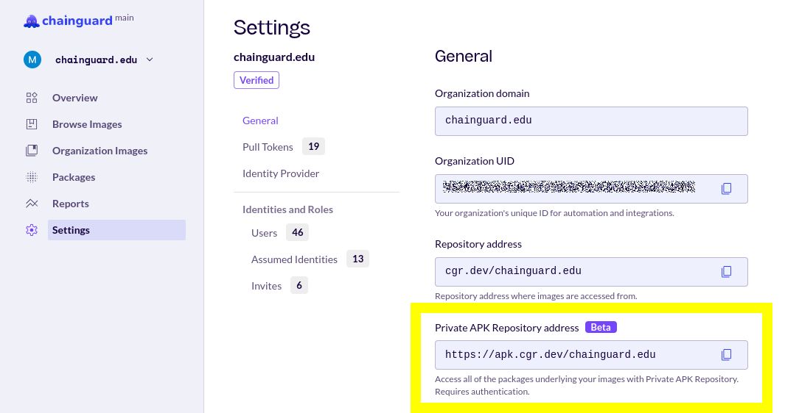

With Chainguard's Private APK Repositories, you can access packages that are included within your organization's container image entitlements. This allows you to build custom images based on components that are already part of your organization catalog.

This guide provides a brief overview of Chainguard's private APK repositories and outlines different ways you can incorporate them into your organization's workflows.

> **NOTE**: Chainguard's private APK repositories feature is currently in the beta phase and it will likely go through changes before becoming generally available.


## About Private APK Repositories

Chainguard's private APK repos allow customers to pull secure apk packages from Chainguard. The list of packages available in an organization's private repository is based on the apk repositories that the organization already has access to.

For example, say your organization has access to the [Chainguard MySQL container image](https://images.chainguard.dev/directory/image/mysql/versions). Along with `mysql`, this image comes with other apk packages, including `bash`, `openssl`, and `pwgen`. This means that you'll have access to these apk packages through your organization's private APK repository, along with any others that appear in Chainguard container images that your organization has access to. 

Chainguard's private APK repositories are available to all Chainguard Containers customers.


## Your Repository Address

Your private APK repository will be available at a URL like the following:

`https://apk.cgr.dev/$ORGANIZATION`

You will need to replace `$ORGANIZATION` with the name of your organization as it appears in the Chainguard Console. 

You can always find your private APK repository's address by logging into the [Chainguard Console](https://console.chainguard.dev/) and navigating to the **Settings** tab in the left-hand navigation menu. This will take you the **General** section where you can copy the repository address:

<center></center>
<br /> 

In order to use your private repository, you must add this URL to the list of apk repositories found in an `/etc/apk/repositories` file, and you'll also need to provide credentials to have access to this repo. To set this up, you must follow these general steps:

1. Set up an `HTTP_AUTH` environment variable with appropriate credentials
2. Add `https://apk.cgr.dev/ORGANIZATION` to `/etc/apk/repositories`
3. Update your apk cache
4. Install your desired packages

In the following sections, this guide will outline how to implement this process in a live container and also when building container images from a Dockerfile or using apko.


## Authenticating to your Private APK Repository

To access the apk packages in your private repository, you'll first need to authenticate. You can do so by setting up an `HTTP_AUTH` environment variable with an authentication string that uses `chainctl` to obtain an ephemeral token to access the registry.

The `HTTP_AUTH` environment variable expects a string in the following format:

```example
HTTP_AUTH=basic:apk.cgr.dev:user:password
```

You will need to replace `password` with an apk token which you can obtain using the following `chainctl` command:

```shell
chainctl auth token --audience apk.cgr.dev
```

The following `docker run` command injects the `HTTP_AUTH` environment variable directly into the container by calling `chainctl` from the host machine:

```shell
docker run -ti --rm \
   -e "HTTP_AUTH=basic:apk.cgr.dev:user:$(chainctl auth token --audience apk.cgr.dev)" \
   cgr.dev/$ORGANIZATION/$IMAGE
```

In this command and throughout the rest of this guide, be sure to change `$ORGANIZATION` to reflect the name of your organization's repository within Chainguard's registry. Additionally, this guide was validated using the [chainguard-base](https://images.chainguard.dev/directory/image/chainguard-base/overview) image, but you can use any container image that is part of your organization's image catalog. However, to follow along with every example this guide, you should use a container image that includes a shell, such as an image's `-dev` variant.

Also, you can initialize these placeholder values by setting them as environment variables as in the following examples. This will make it easier to follow along:

```shell
ORGANIZATION="chainguard.edu"
IMAGE="chainguard-base"
```

This command will start an interactive container and open up a shell interface. From there, you can add your organization's private APK repository to the list of apk repositories in `/etc/apk/repositories`. 

First, you'll need to retrieve your organization's private repository address. Recall that you can find this in the **Settings** tab in the Chainguard Console.

From the interactive container's shell, add the repository address to your list of apk repositories with a command like the following:

```container
echo https://apk.cgr.dev/$ORGANIZATION > /etc/apk/repositories
```

Note that this command uses `>` to overwrite the contents of the `/etc/apk/repositories` file. You could instead append the private APK repository's address with `>>`, but here we overwrite the file to ensure that we're only installing packages from the private repo.

Then update the apk cache to include the newly-added private repository:

```container
apk update
```

Following that, you can proceed to search and install packages from your private APK repository.


## Searching for and Installing Packages

As an example of how you can search for and install packages from these private repositories, this section will install `wget`. However, you could also try this out with any apk package that is included in any of the Chainguard container images your organization has access to.

First, search for the `wget` package from the interactive container's shell:

```container
apk search wget
```

You will receive output similar to the following:

```Output
wget-1.25.0-r0
```

You can call `apk policy` to find which repositories contains the package:

```container
apk policy wget
```

This example output shows that it's available from the private APK repository:

```Output
wget policy:
wget policy:
  1.24.5-r4:
    https://apk.cgr.dev/$ORGANIZATION
  1.24.5-r5:
    https://apk.cgr.dev/$ORGANIZATION
  1.25.0-r0:
    https://apk.cgr.dev/$ORGANIZATION

```

Install the package with `apk add`:

```container
apk add wget
```

Finally,run the same `apk policy` command you ran previously:

```container
apk policy wget
```
```Output
wget policy:
  1.24.5-r4:
    https://apk.cgr.dev/$ORGANIZATION
  1.24.5-r5:
    https://apk.cgr.dev/$ORGANIZATION
  1.25.0-r0:
    lib/apk/db/installed
    https://apk.cgr.dev/$ORGANIZATION

```

This output shows that the `wget` package is now installed.


## Using Private APK Repositories with Dockerfiles

So far, this guide has outlined how to manually fetch apk packages from a private repository. We'll now go over how to use a private APK repo within a Dockerfile workflow. We'll be using the same organization, container image, and private package used in the previous examples.

If you haven't already done so, close the container you were running in the previous section. Then run the following command to create a Dockerfile. This Dockerfile uses [Docker Build Secrets](https://docs.docker.com/build/building/secrets/#using-build-secrets) to inject the credentials into a `RUN` command that will update the apk cache and another that will install the `wget` apk package:

```shell
cat > Dockerfile <<EOF
FROM cgr.dev/$ORGANIZATION/$IMAGE

USER root
RUN echo https://apk.cgr.dev/chainguard.edu > /etc/apk/repositories
RUN --mount=type=secret,id=cgr-token sh -c "export HTTP_AUTH=basic:apk.cgr.dev:user:\$(cat /run/secrets/cgr-token) apk update && apk add wget"
USER nonroot
EOF
```

Again, this Dockerfile overwrites the contents of the `/etc/apk/repositories` file. This isn't necessary, but will force Docker to build the image and install the `wget` package without falling back to the default repositories.

Now you can build the image while passing along credentials obtained with `chainctl`. The following example builds an image named `my-custom-image`:

```shell
CGR_TOKEN=$(chainctl auth token --audience apk.cgr.dev) \
   docker build --secret id=cgr-token,env=CGR_TOKEN . -t my-custom-image
```

Following that, you can verify that the image has access to the private repository and contains the apk package that was installed at build time:

```shell
docker run --rm my-custom-image apk policy wget
```
```Output
wget policy:
  1.24.5-r4:
    https://apk.cgr.dev/$ORGANIZATION
  1.24.5-r5:
    https://apk.cgr.dev/$ORGANIZATION
  1.25.0-r0:
    lib/apk/db/installed
    https://apk.cgr.dev/$ORGANIZATION
```

As this output shows, the `wget` apk package is installed in the container.


## Using Private APK Repositories with Apko Builds

You can also use your private APK repository with [apko](/open-source/build-tools/apko/overview/) builds. One of the advantages of this method is that you can build distroless images that include only the apk packages you need in the final image. 

As with the previous examples, you'll need to provide the `HTTP_AUTH` environment variable containing your Chainguard token to the apko runtime building the image. 

The following Dockerfile includes the private APK repository used in previous examples and installs a single package (`wget`) in the image:

```shell
cat > apko.yaml <<EOF
contents:
  repositories:
  - https://apk.cgr.dev/$ORGANIZATION
  packages:
  - wget

archs:
- x86_64
- aarch64
EOF
```

The following `docker run` command will inject the `HTTP_AUTH` environment variable within an `apko` runtime and build the image:

```shell
docker run --rm \
  -e "HTTP_AUTH=basic:apk.cgr.dev:user:$(chainctl auth token --audience apk.cgr.dev)" \
  --workdir /work -v ${PWD}:/work \
  cgr.dev/chainguard/apko build apko.yaml test-apk test-apk.tar
```

You'll get output similar to the following, indicating that the `wget` package was installed using the private APK repo:

```shell
2025/02/20 21:23:48 INFO Building images for 1 architectures: [amd64]
2025/02/20 21:23:48 INFO setting apk repositories: [https://apk.cgr.dev/$ORGANIZATION]
2025/02/20 21:23:50 INFO installing ca-certificates-bundle (20241121-r1)
2025/02/20 21:23:50 INFO installing wolfi-baselayout (20230201-r16)
2025/02/20 21:23:50 INFO installing ld-linux (2.40-r8)
2025/02/20 21:23:50 INFO installing glibc (2.40-r8)
2025/02/20 21:23:50 INFO installing libgcc (14.2.0-r8)
2025/02/20 21:23:50 INFO installing glibc-locale-posix (2.40-r8)
2025/02/20 21:23:50 INFO installing libcrypto3 (3.4.1-r0)
2025/02/20 21:23:50 INFO installing libssl3 (3.4.1-r0)
2025/02/20 21:23:50 INFO installing wget (1.25.0-r0)
2025/02/20 21:23:50 INFO setting apk repositories: [https://apk.cgr.dev/$ORGANIZATION]
2025/02/20 21:23:50 INFO built image layer tarball as /tmp/apko-temp-2854430999/apko-x86_64.tar.gz

. . .
```

## Troubleshooting

You may receive a 403 error when pulling down a package:

`403 FORBIDDEN caller does not have the required capabilities`

This error may mean that your Chainguard identity doesn't have the proper capabilities to download the image. To pull an image, the identity will need a role with the `apk (list)` capability. The least privileged role with this capability is `apk.role`, though more privileged roles like `owner`, `editor`, and `viewer` also have this capability. 

You can check this and fix it by following these steps:

1. Run `chainctl auth status` and check the `Capabilities` field in the output. If you don't find the `apk.pull` role (or a more privileged role) for the organization you're trying to pull from, you will need to add the role.
2. Create the `apk.pull` role using the steps outlined in our [Overview of Roles and Role-bindings](/chainguard/administration/iam-organizations/roles-role-bindings/roles-role-bindings/) resource.
3. Try pulling the package again.

As this feature is still in its beta phase, we invite feedback. If you would like to provide feedback or need further assistance troubleshooting, please [reach out to our Customer Support team](https://www.chainguard.dev/contact?utm=docs).


## Conclusion

Private APK repositories offer customers a convenient way to make use of the packages their organization has access to. By following this guide, you should have a good understanding of how you can use them in your particular workflows.

Be aware that you can use private APK repositories to install packages within container images customized with Chainguard's Custom Assembly tool. Refer to our [Custom Assembly documentation](/chainguard/chainguard-images/features/custom-assembly/#installing-packages-from-a-chainguard-private-apk-repository) for more information.
