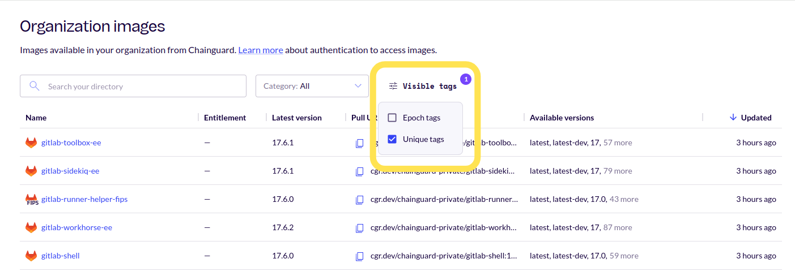
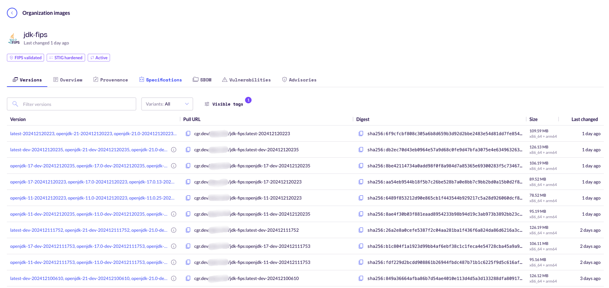

Some organizations use image tags as an indication that there is a new container image available in a registry. Oftentimes, these organizations' internal automation and policies expect each new build to have its own distinct tag.

To help with cases like this, Chainguard offers Unique Tags for private registries. Unique Tags are ideal for organizations that require a strict tag per release or update of their images. They benefit teams looking for precise tracking and management of container images.

Unique Tags are an opt-in feature that is only available for private registries. If your organization is interested in using Unique Tags, please [contact support](https://support.chainguard.dev/hc/en-us) and we will enable this feature for you.

This guide provides an overview of what these Unique Tags are, the kinds of problems they aim to solve, and how you can access them in the Chainguard Console.

## Chainguard's Unique Tags

Unique Tags are only available for private registries, as the public Chainguard Registry only has the `:latest` or, in some cases, the `:latest-dev` tags available. Unique Tags feature an opt-in feature, which allows customers the flexibility to enable it based on their specific operational and security requirements.

Chainguard's Unique Tags end in a timestamp, such as `20240229`, which indicates the date when the Container was built. Because Chainguard Containers are rebuilt whenever there is a change to an included package, the timestamp ensures that the specific tag will always represent that specific container image build and not another.

One benefit of using this timestamp scheme with Unique Tags is that it can help users to quickly identify when a given version of an container image was built. It also helps to make them human-readable, as opposed to the long, unpronounceable strings that make up container image digests.

Unique Tags also allow for individual image repositories within a registry to be included or excluded as needed. For example, if you have an application that requires a specific tagging scheme to be compatible with an existing Helm chart, you can enable Unique Tags for your registry, but exclude that specific repository so that its container images only receive the standard tags.

This granular level of control ensures that organizations can implement unique tagging in a way that best suits their organization's specific needs. It offers a tailored approach to image management, allowing for precise and efficient tracking of image versions and builds across different environments.

Additionally, the Unique Tags feature is integrated with Chainguard's [Tag History API](/chainguard/chainguard-images/using-the-tag-history-api/) and [event notifications](/chainguard/administration/cloudevents/events-reference/). These integrations allow you to track changes over time.

## How do I find Unique Tags?

After signing into the Chainguard Console, click on **Organization images** in the left-hand navigation. This will take you to your organization's container images directory where you'll be presented with a list of all the Chainguard Production container images you can access.

To the right of the search box and **Category** drop-down menu there's a filter button labeled **Visible tags**. Click on that button, and you'll see a drop-down menu with two options: **Epoch tags** and **Unique tags**. Toggle **Unique tags** to see the Unique Tags available for your organization's container images.

By toggling this button on, each individual container image's details page will show the Unique Tags available for it.

To illustrate, toggle this button on and then click on any paid Production container image listed in your organization's directory. The "Version" column will now show the Unique Tags available for that container image. These tags include a timestamp in the format `YYYYMMDDHHMM`, and may include a prefix to help identify and parse the tag name programmatically.

Here there are a number of container image versions with tags similar to `:openjdk-17-202412120223`. This means that this particular version of the container image was last updated on December 12, 2024, at 2:23 AM. You can use this version's **Pull URL** (`cgr.dev/$ORGANIZATION/jdk-fips:openjdk-17-202412120223`) to download this container image, and you can be confident that this Pull URL will always refer to the same container image.

## Learn More

It should be noted that by their design, container image tags are mutable, meaning that they can change over time. Although Unique Tags are meant to serve as a secure solution for teams whose internal workflows assume tag immutability, we still recommend that users pull container images by their digests whenever possible. Check out the ["Pulling by Digest" section](/chainguard/chainguard-images/how-to-use-chainguard-images/#pulling-by-digest) of our guide on How to Use Chainguard Containers for more information. You may also find our video on [How to Use Container Image Digests to Improve Reproducibility](/chainguard/chainguard-images/videos/container-image-digests/) to be useful.

Additionally, you may find our three-part blog series on Chainguard's image tagging philosophy to be of interest.

* [Part 1](https://www.chainguard.dev/unchained/chainguards-image-tagging-philosophy-enabling-high-velocity-updates-pt-1-of-3?utm_source=cg-academy&utm_medium=referral&utm_campaign=dev-enablement)
* [Part 2](https://www.chainguard.dev/unchained/chainguards-image-tagging-philosophy-enabling-high-velocity-updates-pt-2-of-3)
* [Part 3](https://www.chainguard.dev/unchained/chainguards-image-tagging-philosophy-enabling-high-velocity-updates-pt-3-of-3)
