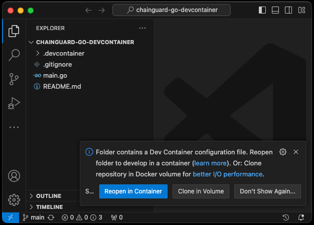
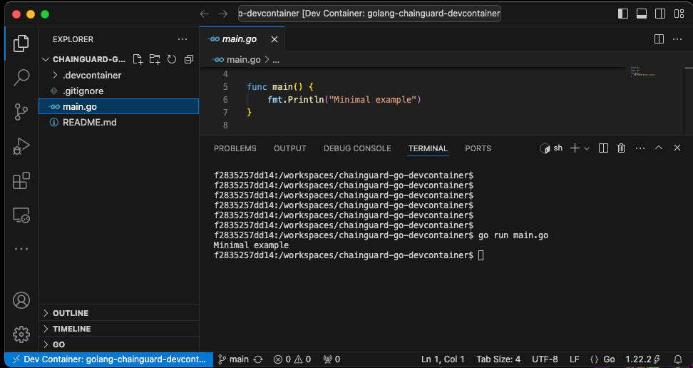
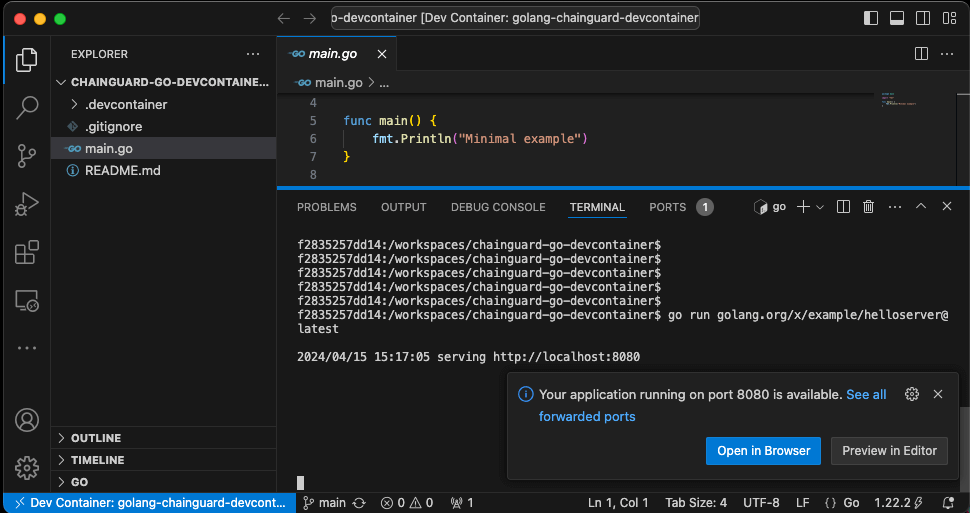

# Dev Containers with Chainguard Images
The images based on Wolfi and maintained by Chainguard provide distroless images that can be used as Dev Containers with a few changes.

Chainguard offers minimal runtime images designed for running production workloads, and development images that contain a shell and some development tooling. But both development and production images are slimmed down and updated regularly to be CVE free.

Whilst it is obvious why production images should be secure, you may be wondering "why do I worry if my dev env gets hacked, there is no data in it?". The answer is simple. Your code goes into the production environment. If you have been hacked during development, then perhaps the hackers code goes into production as well. This is a "supply chain" attack.

Hopefully you would notice a chunk of rogue code being added to your source. What you might not notice is a change to a dependency, that looks like an update, but is actually malware using a typo-squat. For example updating `color:1.1` to `co1or:1.2`. Especially in a huge list of dependency updates that you maybe don't even check. As long as your app works!

We'll go through the changes you need to use a Chainguard development image as a Dev Container in VS Code.

If you would like to build and use a Dev Container you will need a compatible Integrated Development Environment (IDE) or other tool. Here is list of [supported tools](https://containers.dev/supporting).

To keep it simple, this guide is written for [Visual Studio Code (VS Code)](https://code.visualstudio.com/)

You will also need a Docker server to connect to. Usually a local install of Docker Desktop, but full instructions can be found [here](https://code.visualstudio.com/docs/devcontainers/containers)














## Simple setup

You can get see a simple example if you take the content of the `chainguard-go-devcontainer` directory in our demo repository and push it to the root of an empty repository.

For example:
``` sh
git clone https://github.com/chainguard-dev/edu-images-demos.git
cd edu-images-demos/chainguard-go-devcontainer
git init .
git add * .??*
git commit -am "Initial Commit"
git remote add origin https://github.com/<my github profile>/empty.git
git push -fu origin main
```

If you open VS Code on this directory now, you will be prompted to open the project in a Dev Container.



If you go ahead and reopen in a Dev Container it may take a minute or so to build the first time you use it. Open a terminal and you can run the sample project, even if you don't have Go installed on your local machine.



If you run a webserver in your Dev Container you will be asked if you want to open the port in a local browser. Exactly as if you were running in a local container.




## Building a Dev Container in other languages

If you want to develop in languages other than Go, you'll need to use a different base image. To do that, you need some understanding of what the Dev Container does.

To understand what we're doing, you'll need a basic knowledge of `Dockerfile`, Docker builds, JSON, and probably will need to know how your language installs libraries or packages. 

NB There are a couple of different ways to set things up, this particular setup is not required as long as the various requirements are met. The example project uses a `Dockerfile` and `devcontainer.json` in a `.devcontainer` directory. This has the advantage of keeping the "real" code separate from the Dev Container config.

Lets walk through an example for Python

### Create the skeleton structure
Assuming you're starting from a project with no Dev Container you'll want to create the files/folders you need.
```
mkdir .devcontainer
touch .devcontainer/{Dockerfile,devcontainer.json}
```

### Create Dev Container config file
Add this to the `devcontainer.json` config file:
``` json
{
    "name": "my-devcontainer",
    "build": {
        "dockerfile": "Dockerfile",
        "args": {}
    },
    "customizations": {
        "vscode": {
            "extensions": [ "ms-python.python" ]
        }
    },
    "postCreateCommand": "pip install -r requirements.txt",
    "remoteUser": "nonroot"
}
```

Because this is for a Python app, we are installing the VS Code python extension and using `pip` to install project dependencies.

The postCreateCommand runs in the root of your project after it has been cloned into the Container. If you don't have a `requirements.txt` file with your project the command will fail and you will need to remove the command to use the Dev Container.

### Find a base image and customize the Dockerfile
Chainguard offer a wide range of images for different languages and ecosystems. To search, use [the images directory](https://images.chainguard.dev/directory?category=languages).

For this example, we need Python. Many Chainguard images are available at Docker Hub now meaning we can set the `FROM` line in the `Dockerfile` to 

```dockerfile
FROM chainguard/python:latest-dev
```
It is important to use the latest-dev version of the image to get tools like apk (the package manager) and a shell.

Depending on the image, you may need a line:
```dockerfile
USER root
```

So that the next commands run as root instead of the unprivileged user. You can check by running your image locally and using the id command
``` shell
docker run -it --entrypoint id chainguard/python:latest-dev
uid=65532(nonroot) gid=65532(nonroot) groups=65532(nonroot)
docker run -it --entrypoint id chainguard/go:latest-dev
uid=0(root) gid=0(root) groups=0(root),1(bin),2(daemon),3(sys),4(adm),6(disk),10(wheel),11(floppy),20(dialout),26(tape),27(video)
```

Python, you need `USER root`. Go, you are already root.

Next, you need to install the posix utils from which Dev Containers uses the `getent` command. And then update the library links with `ldconfig`.
``` dockerfile
RUN apk update && apk add posix-libc-utils && ldconfig
```

The `ldconfig` and `getent` are needed to allow the container start scripts from VS Code to run. They may already be run in some base images.

If your language needs any other packages installing as `root` now is the time to add them.

Otherwise, continue the Dockerfile as nonroot and install any packages the language or VSCode extension might need. The Python plugin uses `pylance` and `debugpy`. (You don't have to install them now, the plugin can install them later.)

``` dockerfile
USER nonroot
RUN pip install pylance debugpy
```

NB Do NOT install packages your project needs here. The image build happens before the source code is cloned. So you'd need to somehow duplicate listing your dependencies into this file as
well as wherever they are already listed. Instead, use the `postCreateCommand`.

If you save those 2 files into an existing python repository you should then be able to reopen in a Dev Container.

### Customising the image
You can add more customisation to the `Dockerfile`. But sometimes you may find you need to run commands as root. The stripped down, distroless, images do not include sudo and there is no root password to use.

To add sudo, you can add this to the `Dockerfile` in the section running as `root`
``` dockerfile
RUN apk add sudo-rs shadow && echo "nonroot ALL = (ALL:ALL) NOPASSWD:ALL" >> /etc/sudoers && echo y | pwck -q || true
```

## GitHub Codespaces

CodeSpaces support Dev Containers. But at present they only work when the config is stored at the root directory (This is why our demo repo can't be loaded with Codespaces).

## SSH/GPG keys
The IDE should pass your keys through to the Dev Container using ssh-agent and gpg-agent. However you may need to install gpg/ssh tools inside the container.

See the VS Code page on [advanced usage](https://code.visualstudio.com/remote/advancedcontainers/sharing-git-credentials) for more information.

# Conclusion
You should now have a development environment that does not need packages installing on your local machine and that will run the same for anyone editing your project.

You may want to add things like linting rules or other components to your Dev Container config. The [VS Code website](https://code.visualstudio.com/docs/devcontainers/containers) has a lot more information about Dev Containers in general.