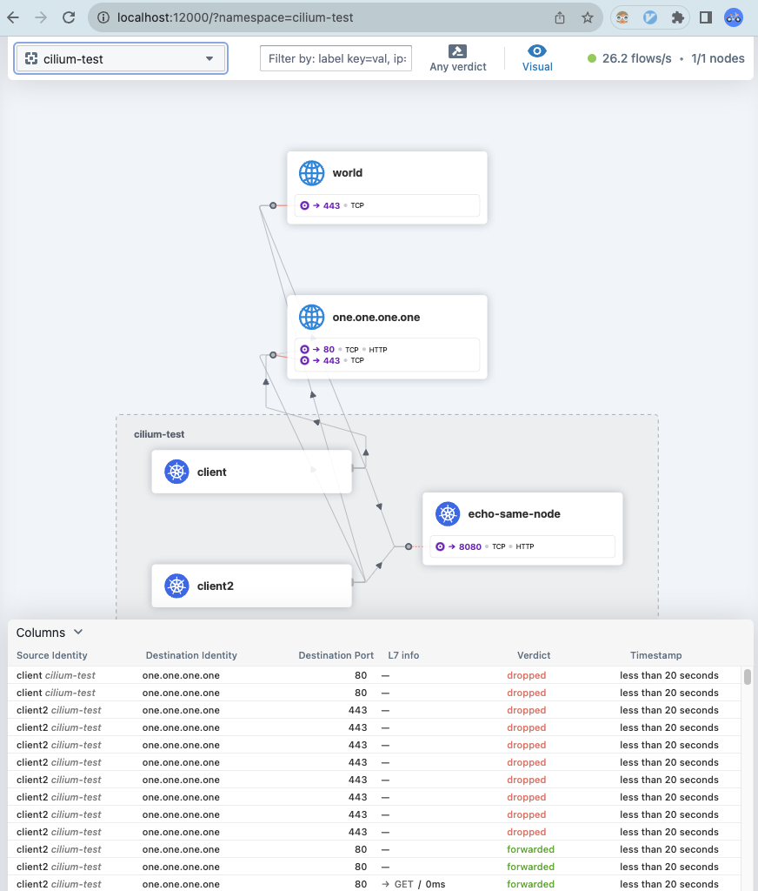

Cilium is open source software for transparently securing the network connectivity between application services deployed using Linux container management platforms like Docker and Kubernetes. At the foundation of Cilium is a new Linux kernel technology called eBPF, which enables the dynamic insertion of powerful security visibility and control logic within Linux itself. Because eBPF runs inside the Linux kernel, Cilium security policies can be applied and updated without any changes to the application code or container configuration.

Chainguard offers a set of minimal, security-hardened Cilium images, built on top the Wolfi OS.

We will demonstrate how to get started with the Chainguard Cilium images on an example K3s cluster. To get started, you'll need Docker, `k3d` (a CLI tool to install `k3s`), `kubectl`, and the `cilium` CLI installed.

* [Docker](https://docs.docker.com/get-docker/)
* [k3d](https://k3d.io/#installation)
* [kubectl](https://kubernetes.io/docs/tasks/tools/install-kubectl/)
* [cilium CLI](https://docs.cilium.io/en/stable/gettingstarted/k8s-install-default/#install-the-cilium-cli)









## Start up a K3s cluster

Cilium does not work with the default Container Network Interface (CNI) plugin in K3s, so we'll start up a K3s cluster CNI and network policy disabled.

To do so, create a YAML manifest named `k3d.yaml` with the following command:

```sh
cat > k3d.yaml <<EOF
apiVersion: k3d.io/v1alpha5
kind: Simple
image: cgr.dev/chainguard/k3s:latest
servers: 1
options:
  k3s:
    extraArgs:
      # Cilium requires network policy and CNI to be turned off
      - arg: --disable-network-policy
        nodeFilters:
          - server:*
      - arg: --flannel-backend=none
        nodeFilters:
          - server:*
EOF
```

Then, we'll start up the cluster:
```sh
k3d cluster create --config k3d.yaml
```

Also, Cilium requires some system mounts the nodes. Run the following command to configure the mounts:

```sh
for node in $(kubectl get nodes -o jsonpath='{.items[*].metadata.name}'); do
    echo "Configuring mounts for $node"
    docker exec -i $node /bin/sh <<-EOF
        mount bpffs -t bpf /sys/fs/bpf
        mount --make-shared /sys/fs/bpf
        mkdir -p /run/cilium/cgroupv2
        mount -t cgroup2 none /run/cilium/cgroupv2
        mount --make-shared /run/cilium/cgroupv2/
EOF
done
```

For more information, refer to the settings suggested in the [Cilium documentation](https://docs.cilium.io/en/latest/installation/rancher-desktop/#configure-rancher-desktop).

With that, you're ready to install Cilium.

## Install Cilium using Chainguard Images

We will use the Cilium CLI to install Cilium. In order to use Chainguard Images, we will need to set the following values:

```sh
export AGENT_IMAGE=cgr.dev/chainguard/cilium-agent:latest
export HUBBLE_RELAY_IMAGE=cgr.dev/chainguard/cilium-hubble-relay:latest
export HUBBLE_UI_IMAGE=cgr.dev/chainguard/cilium-hubble-ui:latest
export HUBBLE_UI_BACKEND_IMAGE=cgr.dev/chainguard/cilium-hubble-ui-backend:latest
export OPERATOR_IMAGE=cgr.dev/chainguard/cilium-operator-generic:latest
```

After that, you can install Cilium using the following command:

```sh
cilium install \
    --helm-set hubble.relay.enabled=true \
    --helm-set hubble.ui.enabled=true \
    --helm-set image.override=$AGENT_IMAGE \
    --helm-set hubble.relay.image.override=$HUBBLE_RELAY_IMAGE \
    --helm-set hubble.ui.frontend.image.override=$HUBBLE_UI_IMAGE \
    --helm-set hubble.ui.backend.image.override=$HUBBLE_UI_BACKEND_IMAGE \
    --helm-set operator.image.override=$OPERATOR_IMAGE
```

This will return output similar to the following:
```
🔮 Auto-detected Kubernetes kind: K3s
ℹ️  Using Cilium version 1.14.2
🔮 Auto-detected cluster name: k3d-k3s-default
```

Now that your cluster has a CNI plugin installed, the Pods will start to transition to the `Running` state. This may take a few minutes. Run the following command to check the status of the Pods:

```sh
watch kubectl get pods --all-namespaces
```

When all the Pods have have a status of `Running` or `Completed`, press `Ctrl+C` to exit the watch.


## Verify that the Cilium installation is successful

Cilium comes with the `connectivity test` command, which is useful for verifying whether the Cilium installation was successful. Run the following command to run the connectivity test:

```sh
cilium connectivity test \
    --external-cidr 8.0.0.0/8 \
    --external-ip 8.8.8.8 \
    --external-other-ip 8.8.4.4
```

This should takes about 5 minutes to complete. It will return output similar to the following:

```
ℹ️  Single-node environment detected, enabling single-node connectivity test
ℹ️  Monitor aggregation detected, will skip some flow validation steps
✨ [k3d-k3s-default] Creating namespace cilium-test for connectivity check...
✨ [k3d-k3s-default] Deploying echo-same-node service...
✨ [k3d-k3s-default] Deploying DNS test server configmap...
✨ [k3d-k3s-default] Deploying same-node deployment...
✨ [k3d-k3s-default] Deploying client deployment...
✨ [k3d-k3s-default] Deploying client2 deployment...
⌛ [k3d-k3s-default] Waiting for deployment cilium-test/client to become ready...
⌛ [k3d-k3s-default] Waiting for deployment cilium-test/client2 to become ready...
...

✅ All 32 tests (263 actions) successful, 2 tests skipped, 1 scenarios skipped.
```

Note that the exact output and results of individual tests may differ based on your local machine's configuration.


## Exploring the Cilium Hubble UI

Before you can explore the Hubble user interface, you will need to enable it with the `cilium` command:

```sh
cilium hubble enable --ui
```

Then run the following command to bring up the Hubble UI:

```sh
cilium hubble ui
```

A new browser window will open showing the Hubble UI. You can explore the Hubble UI to see the network traffic in your cluster. If you are running this during the connectivity test, it will show a visualization of the test traffic.



## Clean up your K3s cluster

Once you are done exploring Cilium, you can clean up your K3s cluster by running the following command:

```sh
k3d cluster delete
```

## Advanced Usage

