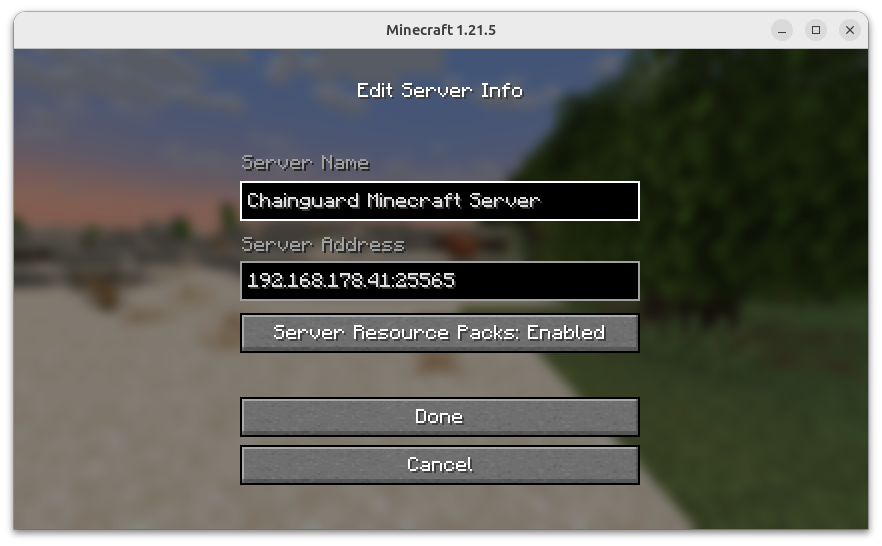
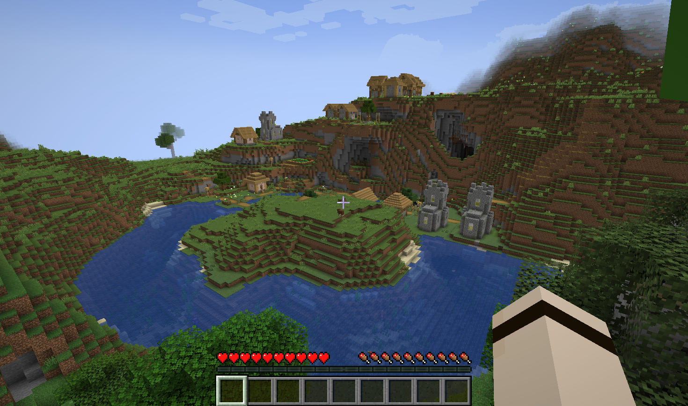
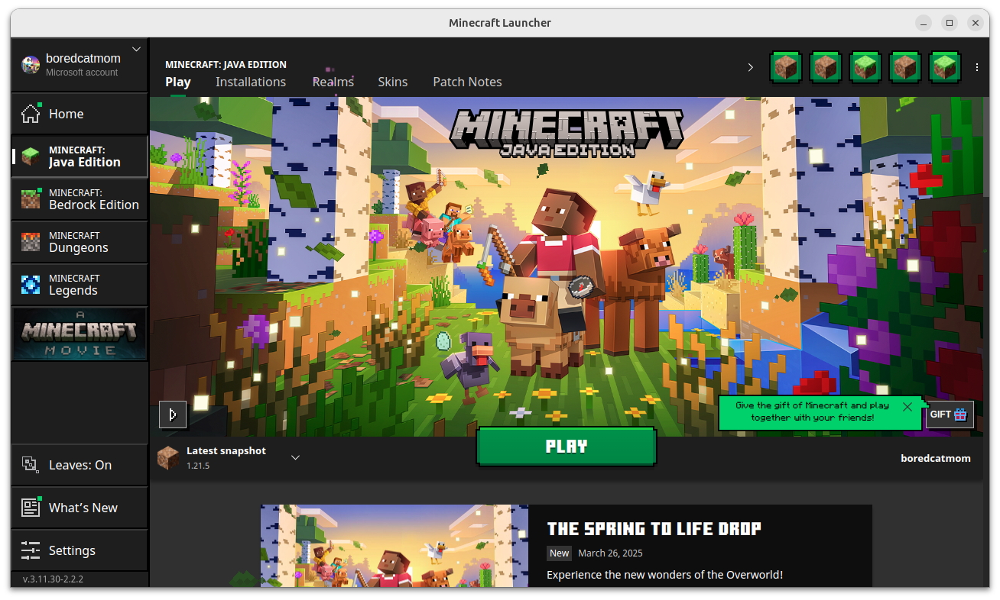

## Introduction

Minecraft is an open-world game where players can build, explore, and adventure in a procedurally generated world. First released in 2011, it is the [best-selling video game of all times](https://en.wikipedia.org/wiki/List_of_best-selling_video_games), with a massive active userbase of 170 million monthly players as of 2024\.

Although single player mode is common, many players prefer to play together in multiplayer mode where they can join forces to tackle more complex projects. This typically requires setting up a remote server with the Minecraft server software, which runs on top of a Java runtime environment (JRE).

In this guide, we’ll set up a Minecraft Java server using [Chainguard’s JRE image](https://www.google.com/url?q=https://images.chainguard.dev/directory/image/jre/overview&sa=D&source=docs&ust=1743006600467730&usg=AOvVaw3AB57sQAuyDQsE7PS-Q9LF) for a low-to-zero CVE runtime environment. We’ll start with a basic setup that we’ll improve as we go through the guide. This guide will also explore a few different strategies to secure your containerized Minecraft server setup.

## Prerequisites

To follow along, you will need [Docker](https://docs.docker.com/get-started/get-docker/) installed on the system where you want to run your Minecraft server. This can be a machine from your local network or a remote server.

The Minecraft server software does not require a paid license or subscription, so you can download it for free. To test the server, however, you’ll need a copy of [Minecraft Java edition](https://www.minecraft.net/en-us/store/minecraft-java-bedrock-edition-pc?tabs=%7B%22details%22%3A0%7D), which is compatible with macOS, Linux, and Windows systems. Please note there are two versions of Minecraft: Java and Bedrock. In this tutorial we’ll be focusing on the Java version, which runs on all operating systems but doesn’t run on consoles.

Create a new folder in your home directory where you’ll be working on your Minecraft server project:

```shell
mkdir ~/minecraft-server
cd ~/minecraft-server
```

Unless otherwise specified, all commands from this guide should be executed from this folder.

## 1 – Creating a Basic Setup with Docker and Docker Compose

We’ll start with a basic setup that we’ll improve in the next steps. Our first task is to set up a basic Dockerfile that is able to run the Minecraft Java server with default options, using `cgr.dev/chainguard/jre:latest-dev` as base image. This Dockerfile will:

1. Install system dependencies as needed (`curl`, `libudev`)
2. Add a regular system user named `minecraft`
3. Set up the `WORKDIR` to `/usr/share/minecrat`
4. Download the Minecraft Java server file
5. Unpack the `server.jar` file
6. Set up the `eula.txt` file using `sed`
7. Configure the workdir permissions
8. Change to the `minecraft` user
9. Run the server

Run the following command to create a `Dockerfile` containing all the steps previously described.

```shell
cat > Dockerfile <<EOF
FROM cgr.dev/chainguard/jre:latest-dev

USER root
RUN apk update && apk add curl libudev
RUN adduser --system minecraft
WORKDIR /usr/share/minecraft

RUN curl -O https://piston-data.mojang.com/v1/objects/e6ec2f64e6080b9b5d9b471b291c33cc7f509733/server.jar
RUN java -jar server.jar nogui
RUN sed -i 's/false/true/' eula.txt
RUN chown -R minecraft /usr/share/minecraft
USER minecraft

ENTRYPOINT ["java", "-jar", "/usr/share/minecraft/server.jar", "nogui"]

EOF
```

*This command uses a [heredoc](https://en.wikipedia.org/wiki/Here_document) input stream to create the described file without the need to use a text editor.*

We’ll also create a `docker-compose.yaml` file to facilitate running the container with additional settings, such as port forwarding. The following command will set up this file for you:

```shell
cat > docker-compose.yaml <<EOF
services:
  minecraft-java:
    image: cg-minecraft-server
    build:
      context: .
    restart: unless-stopped
    ports:
      - 25565:25565

EOF
```

With both files set up, you are ready to run a test server. Start by building the image with:

```shell
docker compose build
```

```
[+] Building 0.1s (12/12) FINISHED                               docker:default
 => [minecraft-java internal] load build definition from Dockerfile        0.0s
 => => transferring dockerfile: 493B                                       0.0s
 => [minecraft-java internal] load metadata for cgr.dev/chainguard/jre:la  0.0s
 => [minecraft-java internal] load .dockerignore                           0.0s
 => => transferring context: 2B                                            0.0s
 => [minecraft-java 1/8] FROM cgr.dev/chainguard/jre:latest-dev            0.0s
 => CACHED [minecraft-java 2/8] RUN apk update && apk add curl libudev     0.0s
 => CACHED [minecraft-java 3/8] RUN adduser --system minecraft             0.0s
 => CACHED [minecraft-java 4/8] WORKDIR /usr/share/minecraft               0.0s
 => CACHED [minecraft-java 5/8] RUN curl -O https://piston-data.mojang.co  0.0s
 => CACHED [minecraft-java 6/8] RUN java -jar server.jar nogui             0.0s
 => CACHED [minecraft-java 7/8] RUN sed -i 's/false/true/' eula.txt        0.0s
 => CACHED [minecraft-java 8/8] RUN chown -R minecraft /usr/share/minecra  0.0s
 => [minecraft-java] exporting to image                                    0.0s
 => => exporting layers                                                    0.0s
 => => writing image sha256:80ff613188679a08b6c440d56e84689dd7a7b2b30535c  0.0s
 => => naming to docker.io/library/cg-minecraft-server                     0.0s
```

You can now run the server with:

```shell
docker compose up
```

You’ll get output with details of the server setup, such as the server version (1.21.5), game mode (`survival`), and port (`25565`). By default, this will spin up a new Minecraft world in survival mode with difficulty set to “normal”, and a random world seed, which means the world’s spawn area (where players first start when joining a new game) will be set by random.

```
[+] Running 2/2
 ✔ Network minecraft-server_default             Created                                                             0.1s
 ✔ Container minecraft-server-minecraft-java-1  Created                                                             0.1s
Attaching to minecraft-java-1
minecraft-java-1  | Starting net.minecraft.server.Main
minecraft-java-1  | [13:58:04] [ServerMain/INFO]: Environment: Environment[sessionHost=https://sessionserver.mojang.com, servicesHost=https://api.minecraftservices.com, name=PROD]
minecraft-java-1  | [13:58:05] [ServerMain/INFO]: No existing world data, creating new world
minecraft-java-1  | [13:58:05] [ServerMain/INFO]: Loaded 1370 recipes
minecraft-java-1  | [13:58:05] [ServerMain/INFO]: Loaded 1481 advancements
minecraft-java-1  | [13:58:05] [Server thread/INFO]: Starting minecraft server version 1.21.5
minecraft-java-1  | [13:58:05] [Server thread/INFO]: Loading properties
minecraft-java-1  | [13:58:05] [Server thread/INFO]: Default game type: SURVIVAL
minecraft-java-1  | [13:58:05] [Server thread/INFO]: Generating keypair
minecraft-java-1  | [13:58:05] [Server thread/INFO]: Starting Minecraft server on *:25565
minecraft-java-1  | [13:58:06] [Server thread/INFO]: Using epoll channel type
minecraft-java-1  | [13:58:06] [Server thread/INFO]: Preparing level "world"
minecraft-java-1  | [13:58:08] [Server thread/INFO]: Preparing start region for dimension minecraft:overworld
minecraft-java-1  | [13:58:08] [Worker-Main-11/INFO]: Preparing spawn area: 2%
minecraft-java-1  | [13:58:08] [Worker-Main-5/INFO]: Preparing spawn area: 2%
minecraft-java-1  | [13:58:09] [Worker-Main-15/INFO]: Preparing spawn area: 18%
minecraft-java-1  | [13:58:09] [Worker-Main-6/INFO]: Preparing spawn area: 51%
minecraft-java-1  | [13:58:10] [Worker-Main-15/INFO]: Preparing spawn area: 51%
minecraft-java-1  | [13:58:10] [Server thread/INFO]: Time elapsed: 2189 ms
minecraft-java-1  | [13:58:10] [Server thread/INFO]: Done (4.333s)! For help, type "help"

```

Now, from a Java Minecraft client running on the same local network as your server, access the **Multiplayer** menu and add a new server using your server’s local IP address and port `25565`. If you are running the client on the same machine as the server, you can use `localhost` or `127.0.0.1` as server address:



**Tip:** On Linux systems, you can use the following command to obtain your local IP address: `ip -o route get to 8.8.8.8 | sed -n 's/.*src \([0-9.]\+\).*/\1/p'`

Click **Done** and select the new server from the list to connect. Your Docker Compose logs should indicate that a user has joined the game:

```
minecraft-java-1  | [18:20:29] [User Authenticator #1/INFO]: UUID of player boredcatmom is xxxx-xxxx-xxxx-xxxx-xxxx
minecraft-java-1  | [18:20:30] [Server thread/INFO]: boredcatmom[/192.168.178.41:37810] logged in with entity id 27 at (-184.5, 69.0, 67.5)
minecraft-java-1  | [18:20:30] [Server thread/INFO]: boredcatmom joined the game
```

Go around and explore, but keep in mind that because this setup is isolated and there are no volumes set, all changes will be lost when the containers are removed, and a new `docker compose up` would give you an entirely new world with a random initial spawn area.

When you’re ready to continue, hit `CTRL+C` to stop the server. In the next step, we’ll improve your setup to facilitate server customization.

## 2 – Configuring the Server

You now have a server that runs with default options, but we need to be able to customize some settings. Minecraft servers use a [configuration file](https://minecraft.wiki/w/Server.properties) called `server.properties`, located in the root of the server directory (where you unpacked the original `.jar` file). In our setup, this file lives in the `/usr/share/minecraft` folder.

One way to customize the server is by replacing the default `server.properties` file with one of your own at build time. The downside of this method is that whenever you change a setting, you’ll need to rebuild the image.

Another method is to use environment variables at runtime to replace values in the configuration file using `sed`. This is more complex as it requires an entrypoint bash script in order to work, but it allows you to make changes to your configuration without rebuilding the image.

We have implemented this method in the [GuardCraft demo](https://github.com/chainguard-dev/guardcraft-server/blob/main/build-config.sh), so we’ll reuse the same script here. This bash script will:

1. Look for any environment variables that start with the `MC_` prefix
2. Clear up the variable name in order to infer the configuration key in the `server.properties` file
3. Obtain the value of the environment variable and use `sed` to replace original values with new values
4. Finally, run the entrypoint command that should be passed as argument to the script (`$0`)

For your reference, this is the script we’ll download from the GuardCraft demo repository:

```shell
#!/usr/bin/env bash

SERVER_PATH=/usr/share/minecraft

# If MC_* ENV variables are set, update the server.properties file
mcEnvs=( "${!MC_@}" )
if [ "${#mcEnvs[@]}" -gt 0 ]; then
  for mcConfig in "${mcEnvs[@]}"; do
    IFS='_' read -ra CONFIG <<< "${mcConfig}"
    key=${CONFIG[1]}
    if [ "${#CONFIG[@]}" -gt 2 ]; then
      for ((i=2; i<${#CONFIG[@]}; i++)); do
        key="${key}-${CONFIG[i]}"
      done
    fi
    value=${!mcConfig}
    echo "Setting $key=$value"
    sed -i "s~^$key=.*~$key=${value}~" $SERVER_PATH/server.properties
  done
fi

exec "$@"
```

Now run the following command to download the script to your project folder:

```shell
curl -O https://raw.githubusercontent.com/chainguard-dev/guardcraft-server/refs/heads/main/build-config.sh
```

You’ll now edit your `Dockerfile` to copy the script to the image and replace the image’s entrypoint command. The script will run before the actual Java command that starts the server. Using a text editor of your choice, edit your `Dockerfile` so that it contains the following content:

```Dockerfile
FROM cgr.dev/chainguard/jre:latest-dev

USER root
RUN apk update && apk add curl libudev
RUN adduser --system minecraft
WORKDIR /usr/share/minecraft
COPY build-config.sh /usr/share/minecraft/
RUN chmod +x /usr/share/minecraft/build-config.sh
RUN curl -O https://piston-data.mojang.com/v1/objects/e6ec2f64e6080b9b5d9b471b291c33cc7f509733/server.jar
RUN java -jar server.jar nogui
RUN sed -i 's/false/true/' eula.txt
RUN chown -R minecraft /usr/share/minecraft
USER minecraft

ENTRYPOINT ["/usr/share/minecraft/build-config.sh", "java", "-jar" , "/usr/share/minecraft/server.jar", "nogui"]
```

This adds a `COPY` statement to copy the new bash script we just created to the container’s `WORKDIR`, and changes the image’s entrypoint to use the script as a proxy to the Java command. This is a common Docker strategy for leveraging environment variables to configure containers at runtime.

You’ll now edit your `docker-compose.yaml` file to include the environment variables that will customize your Minecraft server. You can refer to the [official docs](https://minecraft.wiki/w/Server.properties) for all available options.

In order to test the script, we’ll set some basic information and a [level seed](https://www.pcgamesn.com/minecraft/30-best-minecraft-seeds) to choose the area in which players initially start the game. Open your `docker-compose.yaml` file and edit its contents so that it looks like this, with an additional `environment` section where you’ll set up your `MC_` variables:

```yaml
services:
  minecraft-java:
    image: cg-minecraft-server
    build:
      context: .
    restart: unless-stopped
    ports:
      - 25565:25565
    environment:
      # Server properties Set Up
      # MC_* variables will be replaced in the server.properties file
      # Hyphens must be replaced with underscores
      MC_gamemode: "survival"
      MC_difficulty: "easy"
      MC_motd: "Welcome to GuardCraft!"
      MC_level_name: "GuardCraft"
      MC_level_seed: "69420018030897796"
```


Before rebuilding your image, run the following command to remove the containers created in the last run:

```shell
docker compose down
```

Next, run the following command to rebuild the image and start a new environment with Docker Compose:

```shell
docker compose up --build
```

After the image is built and the container starts running, you should get output from the entrypoint script indicating which variables were set:

```
...
minecraft-java-1  | Setting difficulty=easy
minecraft-java-1  | Setting gamemode=survival
minecraft-java-1  | Setting level-name=GuardCraft
minecraft-java-1  | Setting level-seed=69420018030897796
minecraft-java-1  | Setting motd=Welcome to GuardCraft!
...
minecraft-java-1  | [19:20:01] [Server thread/INFO]: Preparing level "GuardCraft"
...
```

If you join the server now, you should spawn close to a nice village.



## 3 – Setting Up Automatic Updates
Your server is now fully customizable through environment variables, but we're still something important: updates. The Minecraft server download is statically defined in the Dockerfile, so it will go stale pretty quickly. We need a programmatic way to fetch the latest version of the server so that we don’t need to update the Dockerfile each time a new version of the server is out.

Mojang (the company that makes Minecraft) has [a few API endpoints](https://gaming.stackexchange.com/a/123443/386461) that can be used to fetch available versions and their respective download artifacts. In the GuardCraft demo, we have implemented [a bash script](https://github.com/chainguard-dev/guardcraft-server/blob/main/server-install.sh) that fetches the latest version of the server .jar file, verifies its SHA-1 signature, and only then unpacks the file. We’ll implement the same script here.

For your reference, this is the bash script we’ll download from the GuardCraft demo depository:

```shell
#!/usr/bin/env bash

# Script to download and install the Minecraft Java Server
# Usage: server-download.sh [version]
# If no version is provided, the latest version is used

if [ -n "$1" ] && [ "$1" != "latest" ]; then
  version=$1
else
  version=$(curl -s https://launchermeta.mojang.com/mc/game/version_manifest.json | jq -r '.versions | first | .id')
fi

echo "Selected version $version..."
version_url=$(curl -s https://launchermeta.mojang.com/mc/game/version_manifest.json | jq -r '.versions | map(select(.id == "'$version'")) | .[0] | .url')

if [ -z "$version_url" ]; then
  echo "Version $version not found"
  exit 1
fi

downloads=$(curl -s "$version_url" | jq -r '.downloads.server')
server_url=$(echo "$downloads" | jq -r '.url')
expected_sha1=$(echo "$downloads" | jq -r '.sha1')

# Download the server jar
curl -s -o server.jar "$server_url"

# Verify the SHA-1 checksum
downloaded_sha1=$(sha1sum server.jar | awk '{ print $1 }')

if [ "$downloaded_sha1" == "$expected_sha1" ]; then
  echo "SHA-1 checksum verification passed."
else
  echo "SHA-1 checksum verification failed."
  exit 1
fi

# Unpacks the JAR and sets up eula.txt file
java -jar server.jar nogui
sed -i 's/false/true/' eula.txt
```

Run the following command to download the script:

```shell
curl -O https://raw.githubusercontent.com/chainguard-dev/guardcraft-server/refs/heads/main/server-install.sh
```

Next, update the Dockerfile to use this script. You’ll need to make three changes:

* add an `ARG` to define the version of the server, using “latest” as default value
* include `jq` in the list of apks to install
* copy the `server-install.sh` file to the container and make it executable
* replace the installation section with a call to the `server-install.sh` script, passing `$VERSION` as argument

Open the `Dockerfile` with an editor of your choice and replace its content with this updated version:

```Dockerfile
FROM cgr.dev/chainguard/jre:latest-dev

ARG VERSION="latest"
USER root
RUN apk update && apk add curl libudev jq
RUN adduser --system minecraft
WORKDIR /usr/share/minecraft

COPY build-config.sh server-install.sh /usr/share/minecraft/
RUN chmod +x /usr/share/minecraft/build-config.sh /usr/share/minecraft/server-install.sh
RUN /usr/share/minecraft/server-install.sh ${VERSION}
RUN chown -R minecraft /usr/share/minecraft
USER minecraft

ENTRYPOINT ["/usr/share/minecraft/build-config.sh", "java", "-jar" , "/usr/share/minecraft/server.jar", "nogui"]
```

With the argument in place, you can now choose at build time which version of the server you want to install. This is useful if you want to stick to a specific version due to compatibility with your Minecraft client.

Now it’s time to test your upgraded setup. Stop any running containers and bring the environment down with the following command:

```shell
docker compose down
```

Then, execute the following to rebuild and run the environment:

```shell
docker compose up --build
```

You should be able to identify the server version in the output. At the time of this writing, the latest version is the stable release `1.21.5`:

```
...
minecraft-java-1  | [11:56:29] [ServerMain/INFO]: No existing world data, creating new world
minecraft-java-1  | [11:56:30] [ServerMain/INFO]: Loaded 1373 recipes
minecraft-java-1  | [11:56:30] [ServerMain/INFO]: Loaded 1484 advancements
minecraft-java-1  | [11:56:30] [Server thread/INFO]: Starting minecraft server version 1.21.5
...
```

To join the server, a client must be running the same version (in this case, 1.21.5) of the game. If you run into issues, make sure you select “Latest Snapshot” in the Minecraft launcher before opening the game:



If you want to specify the version of the Minecraft server, you can pass the `VERSION` argument at build time. For instance, this will install version `1.21.4`:

```shell
docker build --build-arg VERSION=1.21.4 . -t guardcraft-java
```

You now have a containerized setup that automatically downloads the latest version of the Minecraft Java server (or a version of your choice), fully customizable through environment variables. There’s one last thing to take care of now: persisting world data. We’ll see how to go about that in the next step.

## 4 – Persisting World Data

So far, we’ve run a Minecraft server with an ephemeral world: anytime you remove the containers and recreate the environment, a new world is created, so you’ll lose any progress you have made, such as builds and achievements.

Minecraft servers have a special directory where the world data is stored. We’ll need to set up a volume for persisting that data. This way, even if you remove all containers and rebuild your image, your world will be reinstated when you run `docker compose up` again, and you won’t lose your progress.

If you haven’t yet, stop any running containers and bring your environment down:

```shell
docker compose down
```

Next, create a [named volume](https://docs.docker.com/engine/storage/volumes/#named-and-anonymous-volumes) to store your world data:

```shell
docker volume create guardcraft-world
```

This volume will be set in a location that can be obtained with a `docker volume inspect` command:

```shell
docker inspect guardcraft-world
```

```
[
    {
        "CreatedAt": "2025-02-14T12:20:08Z",
        "Driver": "local",
        "Labels": null,
        "Mountpoint": "/var/lib/docker/volumes/guardcraft-world/_data",
        "Name": "guardcraft-world",
        "Options": null,
        "Scope": "local"
    }
]
```

The `Mountpoint` indicates where your world data will be persisted in the host machine.

Next, open your `docker-compose.yaml` file using an editor of your choice and configure the `minecraft-java` service to use the named volume. You can replace the contents of the file with the following updated version:

```yaml
services:
  minecraft-java:
    image: cg-minecraft-server
    build:
      context: .
    restart: unless-stopped
    ports:
      - 25565:25565
    environment:
      # Server properties Set Up
      # MC_* variables will be replaced in the server.properties file
      # Hyphens must be replaced with underscores
      MC_gamemode: "survival"
      MC_difficulty: "easy"
      MC_motd: "Welcome to GuardCraft!"
      MC_level_name: "GuardCraft"
      MC_level_seed: "-3930782522362688416"
    volumes:
      - guardcraft-world:/usr/share/minecraft

volumes:
    guardcraft-world:
      external: true
```


The `external: true` option tells Docker Compose that this volume is managed outside of the Compose lifecycle.

You can now run the following command to bring your environment up and put the changes into effect. You don’t need to rebuild the image, since there are no changes to the Dockerfile:

```shell
docker compose up
```

This will start a new environment that uses the `guardcraft-world` volume to persist world data. If you check the volume mount now, it will be populated with the new world data:

```shell
sudo ls /var/lib/docker/volumes/guardcraft-world/_data/GuardCraft
```

```
advancements  data  datapacks  DIM-1  DIM1  entities  level.dat  level.dat_old	playerdata  poi  region  session.lock  stats
```

You can now destroy and recreate your environment multiple times, but your world will be kept intact.

## 5 – Securing your Minecraft Server

You now have a flexible containerized setup for your Minecraft server, using a low-to-zero CVE image from Chainguard. To keep your server secure, there are a few additional strategies you should consider, even if you're running the server in a local network. Let’s go through each of them.

### Keep your image up-to-date

It is important to always keep your image always up to date with the most recent version of system dependencies and the Minecraft server software. Outdated images accumulate vulnerabilities over time, becoming a target for exploitation by malicious actors. The [Image Update Considerations](https://edu.chainguard.dev/chainguard/chainguard-images/staying-secure/updating-images/considerations-for-image-updates/) article on Chainguard Academy has more guidance on what you should take into account when deciding on an update strategy.

If you followed all steps in this guide so far, you should have set up an installation script that automatically downloads the latest version available for the server software. However, this happens at build time, which means you’ll need to rebuild the container in order to update.

A good strategy is to set up a repository with your server setup and use a GitHub Action (or CI equivalent) to build and publish your image to a container registry. The [GitHub documentation](https://docs.github.com/en/actions/use-cases-and-examples/publishing-packages/publishing-docker-images) has more details on how to implement this action, and you can also check the [GuardCraft repository](https://github.com/chainguard-dev/guardcraft-server/blob/main/.github/workflows/docker-publish.yml) for an example.

### Pin to a digest and set up Digestabot

A digest is a unique identifier for a specific image build. When you pin your Dockerfile to a digest instead of a mutable tag, you make your build reproducible, because anyone building your Dockerfile will be using the exact same version of the base image. [This section](https://edu.chainguard.dev/chainguard/chainguard-images/staying-secure/updating-images/considerations-for-image-updates/#be-mindful-about-tagging-practices) of our Image Update Considerations article on Academy has details on recommended practices for pinning images to a specific version. You can also refer to [this video](https://edu.chainguard.dev/chainguard/chainguard-images/how-to-use/container-image-digests/) for a demonstration on how to use image digests.

The downside of pinning your base image to a digest is that you’ll need to update your Dockerfile each time a new version of the image is available. You can automate most of this process with our [Digestabot GitHub action](https://github.com/chainguard-dev/digestabot), which will open a pull request with the updated digest each time a new image build becomes available.

### Change the default port

Changing the default port is another recommended practice to mitigate exposure. To change the default port where your Minecraft server is running, you’ll need to set up the `server-port` property at the `server.properties` file. If you followed all steps in this guide, you should be able to set this as an environment variable called `MC_server_port` on your `docker-compose.yaml` file. Don’t forget to update your port redirection settings to reflect this change. For example, the following will spin  up a server with default settings running on port `25567`.

```yaml
services:
  java-server:
    image: guardcraft-java
    restart: unless-stopped
    ports:
      - 25567:25567
    environment:
      MC_server_port: 25567
```

### Set up an access list

Minecraft servers have an access list feature that allows you to specify who can join your world. The [Minecraft wiki](https://minecraft.wiki/w/Server#Whitelist) has more details on how to set up this file within your server, but it’s essentially a JSON file containing the users who are allowed access to the server. This file should be included in the container image at build time. You must also change the `white-list` property on `server.properties` to `true` — in case you are using our Docker Compose setup, include a `MC_white_list` property set to true in your environment variables.

### Use online mode

It is not mandatory to have your server connecting to Mojang online services. However, keeping your server online guarantees that only users with genuine Minecraft accounts can connect. You’ll also have the ability to identify users by their real usernames when they join the game.

The [online-mode](https://minecraft.wiki/w/Server.properties#online-mode) property is set to `true` by default, so you don’t need to do anything — just keep it that way. Only change this to `false` for local network games, otherwise you’ll risk your server being raided by users with fake accounts. Servers in offline mode are referred to as “cracked servers” since it allows players with unlicensed copies of Minecraft to join.

## Conclusion

In this tutorial, you learned how to set up a low-to-zero CVE Minecraft server using Chainguard’s Java runtime (JRE) container image. We started with a basic setup that we improved with bash scripts for installing and configuring the Java server. We also discussed some strategies for making your server more secure.

Our [Staying Secure](https://edu.chainguard.dev/chainguard/chainguard-images/staying-secure/) section on Chainguard Academy has more resources on container security and CVEs. For more details about Java and other Chainguard Images, please refer to our [Images Directory](https://images.chainguard.dev).
