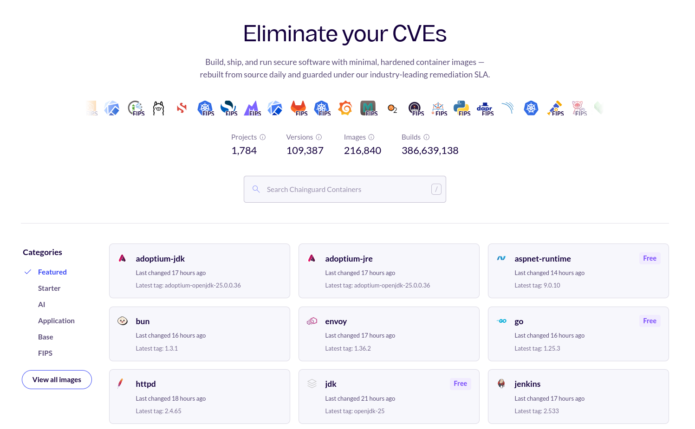

There are hundreds of Chainguard Containers available for use. To help users explore and better understand all of these container images, we've developed the Chainguard Directory. This is a free to access web portal that does not require signing in from which you can view information about container images in the Chainguard catalog. This is great for quick searches or while exploring Chainguard's offerings.

If you want more specific information about what is available to your organization, take a look at the Chainguard Console. You'll first need to [create an account and log in](https://console.chainguard.dev/auth/login) but there you can interact in a clearer, organization-specific way. If you use the *Sign In* link in the directory, it brings you to the console. Learn more about the [Chainguard Console](/chainguard/chainguard-images/how-to-use/images-directory/) in the related docs page.

## Accessing the Chainguard Directory

This guide is primarily framed around the Chainguard Directory and the Chainguard Console. The Directory is public facing and doesn't require any authentication to access it. The Console is also accessible to anyone, including users who aren't Chainguard customers. However, to access the Console, you'll first need to [create an account and log in](https://console.chainguard.dev/auth/login).

## Browse container images and details in the directory

The [Chainguard Containers Directory](https://images.chainguard.dev/) landing page has a card-based layout of container images:

  

Each card represents a container image available from Chainguard, and shows the image's name and logo, when it was last changed, the latest tag available. These cards include other details when relevant, like whether the image is part of Chainguard's Free tier of containers, if there is a FIPS-enabled version of the container image available, or if it's a STIG-hardened image.

By default, the Directory shows a paginated list of container images. You can select categories of container images to view from the menu to the left of the cards. This menu has the following options:

* **Featured**
* **Free**
* **Helm charts**
* **AI**
* **Application**
* **Base** 
* **FIPS**

Above the cards is a search box you can use to search for specific Chainguard Containers. Clicking on any card or search result takes you to that container image's details page.

## Learn More

The Chainguard Containers Directory is a useful tools for understanding what Chainguard Containers are available. To better understand how to work with individual container images, you can see if we have a [getting started guide](/chainguard/chainguard-images/getting-started/) available. We also provide a guide on [how to view security advisories](/chainguard/chainguard-images/security-advisories/) through our [self-service public Security Advisories page](https://images.chainguard.dev/security?utm_source=cg-academy&utm_medium=referral&utm_campaign=dev-enablement&utm_content=edu-content-chainguard-chainguard-images-working-with-images-images-directory).