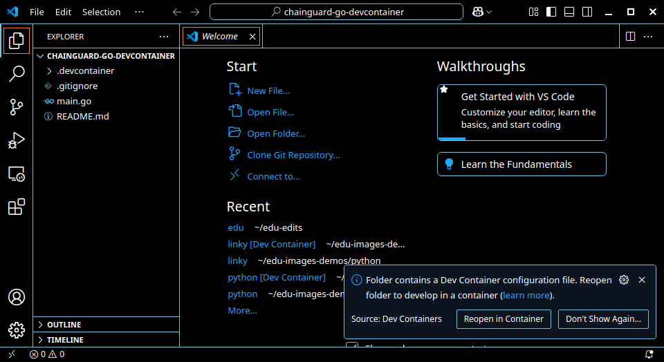
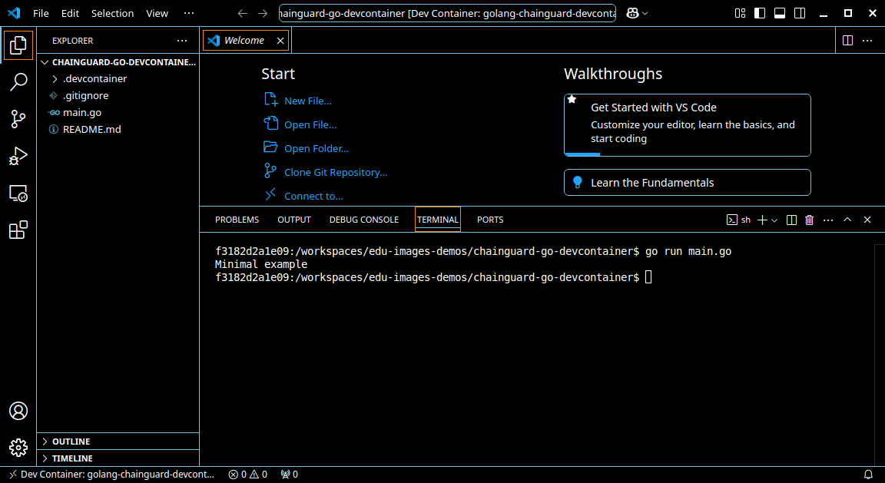

[Development Containers](https://containers.dev/) — sometimes known as "dev containers" — allow you to use a container as a development environment where you can run applications and separate tools, libraries, or runtimes. Dev containers can also help with testing and continuous integration. 

With a few changes, the images based on Wolfi and maintained by Chainguard provide distroless images that can be used as dev containers. This guide outlines how you can set up a Chainguard image as a dev container in VS Code.














## Prerequisites

To follow along with this guide, you will need to have the following:

* A compatible Integrated Development Environment (IDE) or other tool. Here is a list of [supported editors and tools](https://containers.dev/supporting).
    * Note that this guide was validated using [Visual Studio Code (VS Code)](https://code.visualstudio.com/).
* A Docker server to connect to. A local installation of Docker Desktop will usually suffice for demonstration purposes, but you can find full instructions in this guide on [Developing inside a Container](https://code.visualstudio.com/docs/devcontainers/containers) in the VS Code documentation.
* This guide's first example assumes that you have a GitHub repository named `empty`. You can follow GitHub's [Quickstart for repositories](https://docs.github.com/en/repositories/creating-and-managing-repositories/quickstart-for-repositories) for information on setting this up.


## What are Dev Containers?

A development container is a container in which a user can develop an application. Development containers are isolated environments that allow developers to work on applications with all the necessary dependencies, tools, and configurations pre-packaged. These containers ensure that the development environment is consistent across different systems, avoiding the "works on my machine" problem.

In order to run a dev container, the given project must contain a file named `devcontainer.json`. This is a special file defined by the [Development Container Specification](https://containers.dev/implementors/json_reference/) which holds all the metadata necessary to configure the dev container.

Although there are many reasons why production images should be secure, the reasons for concern about the security of development environments are less clear. Put briefly: the code you've written and tested in your development environment will eventually make it into your production environment. If you've been hacked during development, then perhaps the hackers' code goes into production as well.

Chainguard offers minimal runtime images designed for running production workloads, and development images that contain a shell and some development tooling. With that said, both development and production images are slimmed down and updated regularly to be free of CVEs. Because of their minimal and secure-by-default nature, Chainguard Containers are ideal for use in a secure development process. 


## Building a Go Dev Container using an Example Repository

The following is an example of how to set up a dev container using a Go project. Here, we will take the content of the `chainguard-go-devcontainer` directory in [Chainguard's demo GitHub repository](https://github.com/chainguard-dev/edu-images-demos) and push it to the root of an empty repository.

Start by cloning the repository:

```shell
git clone https://github.com/chainguard-dev/edu-images-demos.git
```

Then navigate into the `chainguard-go-devcontainer` example directory:

```shell
cd edu-images-demos/chainguard-go-devcontainer
```

From there, Initialize a Git repository:

```shell
git init .
```

Then add all the files there, including any hidden files:

```shell
git add * .??*
```

Commit the changes:

```shell
git commit -am "Initial Commit"
```

Add a GitHub repository that you have control over as a remote named `origin`. This example assumes that the repository is named `empty` but you can use any empty GitHub repository you have created:

```shell
git remote add origin https://github.com/$YOUR-GITHUB-PROFILE/empty.git
```

Be sure to change `$YOUR-GITHUB-PROFILE` to reflect the name of your GitHub profile.

Finally, push the commit to the remote repository you just configured:

```shell
git push -fu origin main
```

Following that, if you open VS Code on this directory you will be prompted to open the project in a dev container.

<center></center>
<br /> 

If you do reopen the project in a dev container it may take a minute or so to build the first time you use it. Open a terminal and you can run the sample project, even if you don't have Go installed on your local machine:

<center></center>
<br /> 

If you run a webserver in your dev container you will be asked if you want to open the port in a local browser. Exactly as if you were running in a local container:

<center></center>
<br /> 


## Building a Dev Container in other languages

If you want to develop in languages other than Go, you'll need to use a different base image. Note that to do this, you'll need a working knowledge of Dockerfiles, Docker builds, JSON, as well as how your chosen language installs libraries or packages.

There are a couple of different ways to set this up, and the exact configuration used in the following example is not strictly required as long as certain requirements are met. This example sets up a Python project and uses a `Dockerfile` and `devcontainer.json` in a `.devcontainer` directory. This has the advantage of keeping the code separate from the dev container configuration.

Assuming you're starting from a project with no dev container, you'll first need to create the requisite files and folders.

Start by creating a directory named `.devcontainer` and navigate into it:

```shell
mkdir .devcontainer && cd $_
```

Next, create a dev container configuration file named `devcontainer.json` with the following command:

```shell
cat > devcontainer.json <<EOF
{
	"name": "my-devcontainer",
	"build": {
    	"dockerfile": "Dockerfile",
    	"args": {}
	},
	"customizations": {
    	"vscode": {
        	"extensions": [ "ms-python.python" ]
    	}
	},
	"postCreateCommand": "pip install -r requirements.txt",
	"remoteUser": "nonroot"
}

EOF
```

Because this is for a Python app, we are installing the VS Code `python` extension and using `pip` to install project dependencies.

The `postCreateCommand` runs in the root of your project after it has been cloned into the container. If you don't have a `requirements.txt` file with your project the command will fail and you will need to remove the command to use the dev container.

Following that, you'll need to find a base image. Chainguard offers a wide range of images for different languages and ecosystems. To search, use [the images directory](https://images.chainguard.dev/directory?category=languages). For this example, Chainguard's Python image will suffice.

Create a Dockerfile with the following command:

```shell
cat > Dockerfile <<EOF
FROM chainguard/python:latest-dev

USER root
RUN apk update && apk add posix-libc-utils && ldconfig
USER nonroot
RUN pip install pylance debugpy

EOF
```

Here's what each line of this Dockerfile does:

* `FROM`: Many Chainguard images are available at Docker Hub, meaning you can set the `FROM` line in the `Dockerfile` like this example. Alternatively, you could set this with `cgr.dev/chainguard/python` or, if your Chainguard organization has access to a Production Python image, `cgr.dev/$ORGANIZATION/python:$TAG`.
* `USER root`: Including this line forces the next commands to run as root instead of the unprivileged user. Whether you need to include this line or not will depend on what image you're using.
    * You can check by running your image locally and using the `id` command. The following example shows that the Python image uses the nonroot user by default while the Go image uses root by default:

        ```shell
        docker run -it --entrypoint id chainguard/python:latest-dev
        ```
        ```Output
        uid=65532(nonroot) gid=65532(nonroot) groups=65532(nonroot)
        docker run -it --entrypoint id chainguard/go:latest-dev
        uid=0(root) gid=0(root) groups=0(root),1(bin),2(daemon),3(sys),4(adm),6(disk),10(wheel),11(floppy),20(dialout),26(tape),27(video)
        ```

* `RUN apk update …`: This line installs the POSIX utilities (from which dev containers can use the `getent` command) and then updates the library links with `ldconfig`. `ldconfig` and `getent` are needed to allow the container start scripts from VS Code to run, though they may already be included in some base images.
    * If your language needs any other packages that must be installed by the root user, now is the time to add them.
* `USER nonroot`: This continues the Dockerfile as the unprivileged user to install any other packages the language or VSCode extension might need.
* `RUN pip install pylance debugpy`: Finally, this line installs the `pylance` and `debugpy` packages — both used by the Python plugin — with `pip`. This is more for illustration purposes; you don't have to install them now, since the plugin can install them later.
    * **Do not** install packages your project needs here. The image build happens before the source code is cloned. So you'd need to somehow duplicate listing your dependencies into this file as well as wherever they are already listed. Instead, use the `postCreateCommand`.

If you save those 2 files into an existing Python repository you will be able to reopen the project in a dev container.

### Customizing the image

You can further customize the `Dockerfile`, but in some cases you may need to run commands as root. Chainguard's minimal, distroless images do not include `sudo` and there is no root password to use.

To add `sudo`, you can add the following line to the `Dockerfile` in the section running as the root user:

```dockerfile
RUN apk add sudo-rs shadow && echo "nonroot ALL = (ALL:ALL) NOPASSWD:ALL" >> /etc/sudoers && echo y | pwck -q || true
```

## Usage Notes

[GitHub CodeSpaces](https://github.com/features/codespaces) support dev containers. However, at present they only work when the config is stored at the root directory. 

The IDE should pass your keys through to the dev container using `ssh-agent` and `gpg-agent`. For this reason, you may need to install GPG or SSH tools inside the container.

Please refer to the VS Code page on [advanced usage](https://code.visualstudio.com/remote/advancedcontainers/sharing-git-credentials) for more information.


## Conclusion
You should now have a development environment that does not require packages to be installed on your local machine and will run the same for anyone working on your project.

You may want to add things like linting rules or other components to your dev container config. The [VS Code website](https://code.visualstudio.com/docs/devcontainers/containers) has many resources on working with dev containers which you may find useful.
