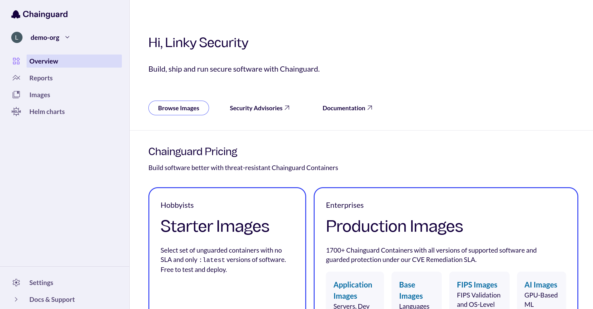
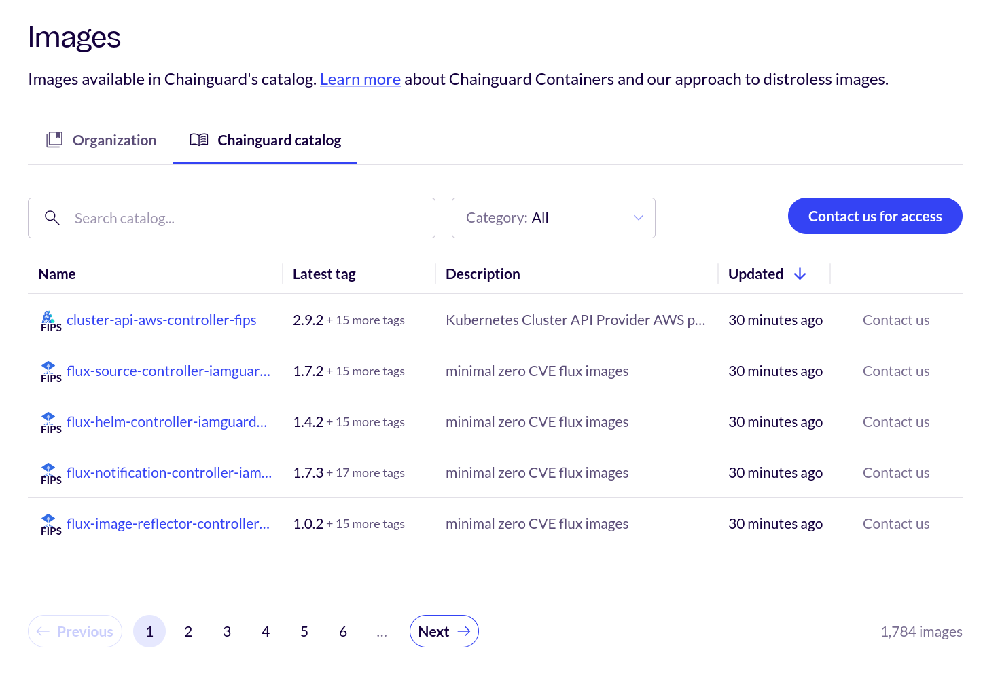
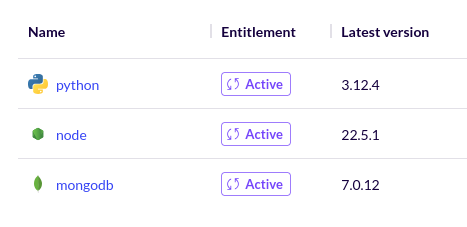
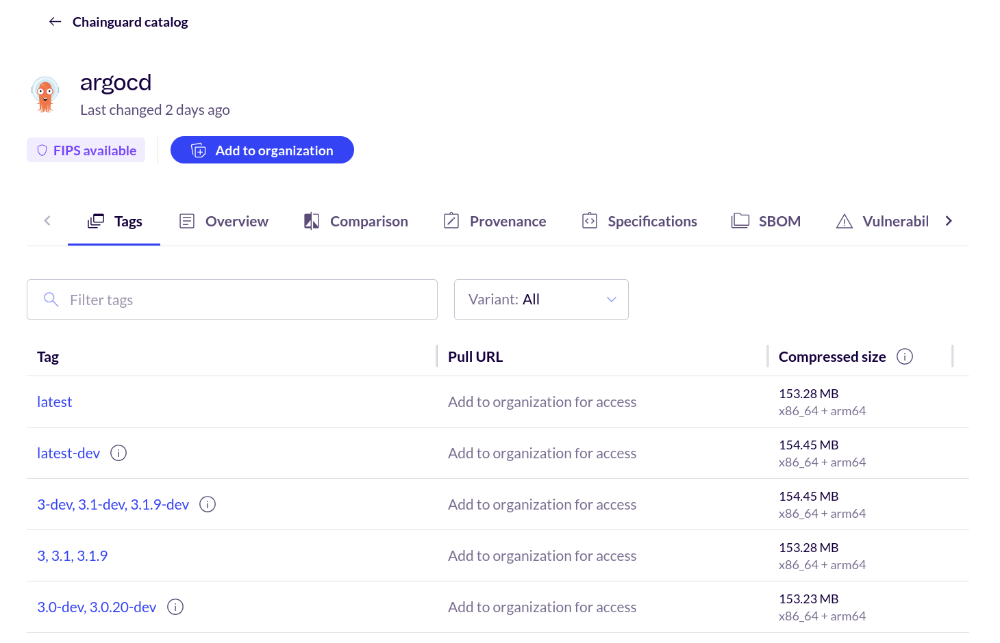
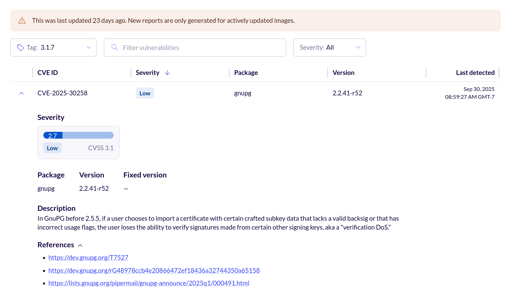
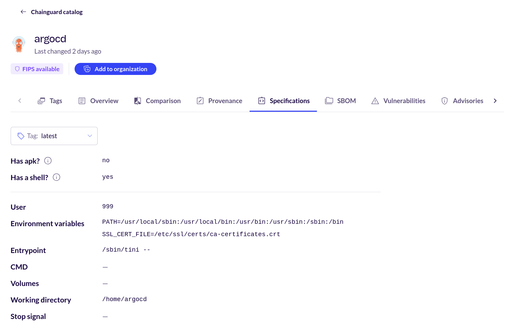
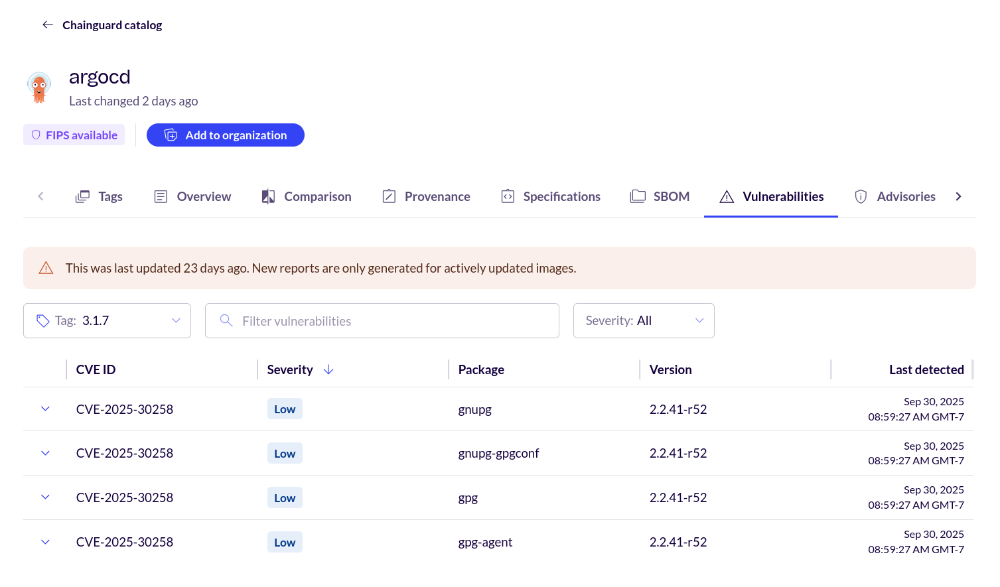

There are hundreds of Chainguard Containers available for use. To help users explore and better understand all of these container images, we've developed the Chainguard Directory. This guide serves as a walkthrough of the browsing experience for Chainguard Containers in the Directory and Console, including how to access it and get the most out of its features.


## Accessing the Chainguard Directory and Console

This guide is primarily framed around the Chainguard Directory and the Chainguard Console. The Console is accessible to anyone, including users who aren't Chainguard customers. To access the Console, you'll first need to [create an account and sign in](https://console.chainguard.dev/auth/login).

If you would like to open the console with your Organization already selected, you can use (and bookmark) a link like this, replacing ORGANIZATION with your organization's name:

```html
https://console.chainguard.dev/auth/login?org=ORGANIZATION
```

If you're not ready to create a Chainguard account, you can follow along with the public [Chainguard Directory](https://images.chainguard.dev/?utm_source=cg-academy&utm_medium=referral&utm_campaign=dev-enablement&utm_content=edu-content-chainguard-chainguard-images-working-with-images-images-directory). As of this writing, there are some differences between the two websites, but both should provide a similar Chainguard Containers browsing experience.


## Browse Chainguard Containers

After signing in to the Chainguard Console, your browser will take you to a landing page like the following.



Click **Browse Containers** in the left-hand navigation. There, you'll be presented with a list of all of Chainguard's available images.



> **Note**: If you are part of an organization, you may have access to resources in the **Organization images** tab. If so, you explore the images there as you would with the **Browse Containers** tab.

The table view above has five columns:

* **Name**: the name of each given container image.
* **Latest version**: the latest available version of the image. Note that this column's value could be a version number or it may read `latest`. In the former case, this means that the latest version Chainguard offers is a different, later version than the one the publicly available image tagged with `:latest`.
* **URI**: the registry URI you can use in a `docker pull` command to download the container image. Production containers, which are not publicly available, will instead have a message reading "Contact us for access to this image" with a link to Chainguard's [contact form](https://www.chainguard.dev/contact?utm_source=cg-academy&utm_medium=referral&utm_campaign=dev-enablement).
* **Available versions**: a list of what versions are available for this container image. Each container image will have a `latest` version, and most will also have a `latest-dev` version. 
* **Updated**: how long it's been since the container image was last updated. 

Note that container images listed in the Organization container images tab have an extra column labeled **Entitlement**. This column specifies what resources an organization has purchased and has access to. This column can show one of two possible values: **Active**, meaning that your organization is able to download and use the container image, or **Expired**, meaning that your organization had access to the container image in the past but not anymore.



You can click on any of these column names to sort the list of container images in ascending or descending order based on the values in these columns.

Above the table is a search box you can use to find specific container images by their name or latest version number. To the right of this box is a drop-down menu labeled **Category**. You can use this to filter the images listed based on what category they belong to.


## Container image information

Next, let's inspect an individual container image. Click on any container image you'd like. This example shows the page for the `argocd` image.



Each container image page has eight tabs that provide information about various facets of the given image.


### Versions tab

The default page for each image is the **Versions** tab which contains information about the versions available for each image. This contains a table with columns:

* **Version**: this column lists each version tag available for the container image.
* **Pull URL**: the URL you can use to download each version of the image. As with the main Containers Directory page, Production containers will have a message reading "Contact us for access to this image" with a link to Chainguard's [contact form](https://www.chainguard.dev/contact?utm_source=cg-academy&utm_medium=referral&utm_campaign=dev-enablement).
* **Size**: the size of the image, in megabytes. 
* **Last changed**: when each version of the image was last updated.

Above the table is a search box which you can use to filter the different versions available for the image. There is also a **Variants** drop-down menu you can use to filter for all images or only `-dev` variants.

### Overview tab

The **Overview** tab contains the container image's README. Typically, this will include instructions on how to download the container image, any relevant compatibility notes, and instructions on how to get started with using the image.

### Provenance tab

All Chainguard Containers contain verifiable signatures and high-quality [software bills of materials](/open-source/sbom/what-is-an-sbom/) (SBOMs). These features allow you to confirm the origin of each image and provide you with a detailed list of everything included in the container image.

The **Provenance** tab outlines how you can verify container signatures and download and verify image Attestations, all with examples using [`cosign`](/open-source/sigstore/cosign/an-introduction-to-cosign/).

### Specifications tab

The **Specifications** tab is where you can find a number of important details about a given container image, such as whether the image ships with the `apk` package manager or a shell. It also includes information like the image's default user ID, environment variables, and its entrypoint.



### SBOM tab

The **SBOM** tab contains a list of packages in the image. Chainguard Containers are built so that everything contained in the image is a package, meaning that this package list gives a complete view of what's in the container image. You won't find anything hidden in the image that isn't listed in its SBOM tab.



The table listing an image's packages has four columns.

* **Package**: the name of each package included in the image's SBOM.
* **Version**: the version of the listed package.
* **Repository**: every package found in Chainguard Containers is either built and managed by the Chainguard team or sourced from [Wolfi](/open-source/wolfi/overview/). For packages falling into the latter category, this column will include a link to the Wolfi GitHub repository showing the package source.
* **License**: the license under which each package is published.

Above the table is a search box you can use to find and filter the packages listed. To the left of this search box is a drop-down menu you can use to select which version of the image you want to find the SBOM for as well as what architecture (either x86_64 or arm64). 

Finally, to the right of the search box is a button labeled **Download SBOM**. You can click this button to download the SBOM (in the SPDX format) to your machine.

Note that Chainguard began generating SBOMs for its images on November 15, 2023. For this reason, any versions of a given container image that were released before that date will not have any SBOM data to show. 

### Vulnerabilities tab

The **Vulnerabilities** tab contains a list of every CVE one can find within the image.

As with the SBOMs tab, the Vulnerabilities tab has a search box you can use to find and filter specific vulnerabilities within the image. There is also a drop-down menu to the left allowing you to select different versions of the container image.

Below these is a table listing the vulnerabilities. However, most Chainguard Containers won't show any vulnerabilities for the `latest` version. This isn't an error, as we aim to remove vulnerabilities from images as soon as they arise.

To illustrate how this table appears when vulnerabilities are actually present, you can select different versions in the drop-down until you find one with a vulnerability. This example shows the `latest` version of the `argocd` image.


The Vulnerabilities table has five columns.

* **CVE ID**: the official identification number of each vulnerability present in the table.
* **Severity**: the severity of each given vulnerability. This can either read **Critical**, **High**, **Medium**, **Low**, or **Unknown**
* **Package**: showing the package where the vulnerability was found
* **Version**: the version of the package containing the vulnerability
* **Last detected**: the date and time when the vulnerability last appeared in a scan of the container image

To the left of each row in the table is down-pointing chevron (**˅**). If you click on this symbol, more information about the given vulnerability will appear below the vulnerability's row.



Specifically, this will highlight the **Package** name and **Version** number of the package associated with the Vulnerability. It also shows the **Fixed version** of the package, a brief **Description** of the vulnerability, and one or more **References** you can review to learn more about the vulnerability.

Please be aware that, as with SBOM data, Chainguard began generating vulnerability information for its images on November 15, 2023. For this reason, any versions of a given image that were released before that date will not have any vulnerability data to show. 

### Advisories tab

The next tab is the **Advisories** tab. When you scan a newly-built Chainguard Container with a vulnerability scanner, typically, no CVEs will be reported. However, as software packages age, more vulnerabilities are reported and CVEs will begin to accumulate in images. When this happens, Chainguard releases security advisories to communicate these vulnerabilities to downstream container image users. You can find all the advisories issued for a given image in its Advisories tab. 

To learn more about Chainguard security advisories, we encourage you to read our article on [How Chainguard Issues Security Advisories](/chainguard/chainguard-images/staying-secure/security-advisories/how-chainguard-issues/) as well as our guide on [How to Use Chainguard Security Advisories](/chainguard/chainguard-images/staying-secure/security-advisories/how-to-use/). You an also find every security advisory published for Chainguard Containers by exploring our self-service [Security Advisories page](https://images.chainguard.dev/security?utm_source=cg-academy&utm_medium=referral&utm_campaign=dev-enablement&utm_content=edu-content-chainguard-chainguard-images-working-with-images-images-directory).

### Comparisons tab

The last tab is the **Comparisons** tab. This tab includes useful data that shows how a given Chainguard Container compares against a non-Chainguard alternative in terms of CVE count. It also includes helpful visualizations of these comparisons. For more information, check out our guide on [CVE Visualizations](/chainguard/chainguard-images/features/cve_visualizations/).


## Learn more

The Chainguard Containers Directory is a useful tool for understanding what Chainguard Containers are available. To better understand how to work with individual container images, you can see if we have a [getting started guide](/chainguard/chainguard-images/getting-started/) available. We also provide a guide on [how to view security advisories](/chainguard/chainguard-images/security-advisories/) through our [self-service public Security Advisories page](https://images.chainguard.dev/security?utm_source=cg-academy&utm_medium=referral&utm_campaign=dev-enablement&utm_content=edu-content-chainguard-chainguard-images-working-with-images-images-directory).
