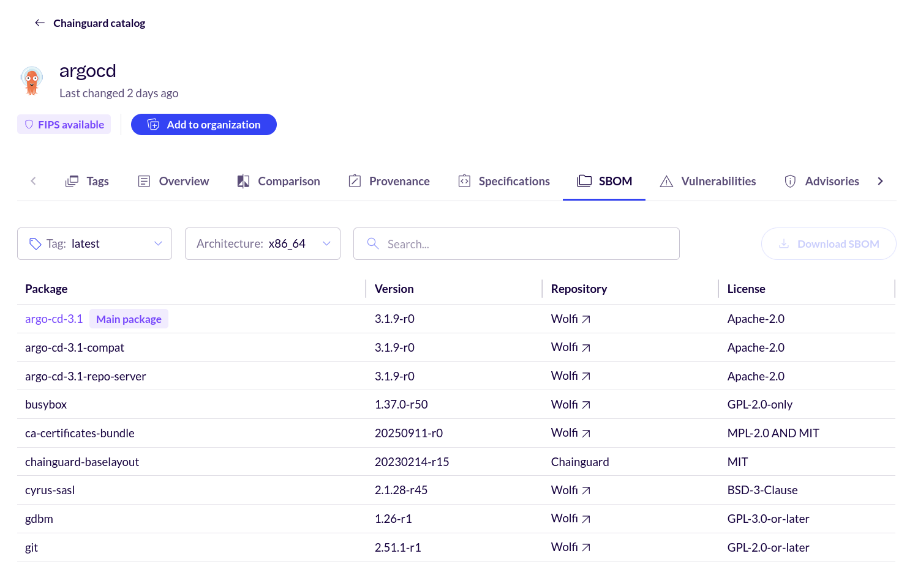

This guide serves as a walkthrough of the Chainguard Console, which is accessible to anyone, but you'll first need to [create an account and log in](https://console.chainguard.dev/auth/login).

If you're not ready to create a Chainguard account, you can follow along with the public [Chainguard Directory](/chainguard/chainguard-images/how-to-use/chainguard-directory/) which offers similar information, but is only informative as it is not connected to your organization or account. If you use the *Sign In* link in the directory, it brings you to the console.


## Accessing the Chainguard Console

Log in to access the [Chainguard Console](https://console.chainguard.dev/auth/login).

If you would like to open the console with your Organization already selected, you can use (and bookmark) a link like this, replacing `ORGANIZATION` with your organization's name:

```URL
https://console.chainguard.dev/auth/login?org=ORGANIZATION
```


## Browse container images and details in the console

After signing in to the [Chainguard Console](https://console.chainguard.dev), your browser will take you to the Overview page. The following screenshot shows the Overview Page for an organization that hasn't paid for access to any container images:

<center></center>
<br /> 

If your organization and account have [Chainguard Notifications](/chainguard/chainguard-images/how-to-use/use-chainguard-notifications) enabled, you will see a box like this on the page where notifications from Chainguard will occasionally be shown.

<center></center>
<br />

Click **Images** in the left-hand navigation. By default, takes you to the **Organization** images tab. If you're part of an organization, you may have access to private Chainguard Containers (or *Production Containers*) that can be found here. 

Navigate to the **Chainguard catalog** tab. There, you'll be presented with a list of all of Chainguard's available images:

<center></center>
<br /> 

The **Chainguard catalog** tab has a table with four columns:

* **Name**: the name of each given container image
* **Latest tag**: the latest available version of the image
* **Description**: a brief description of each container image
* **Updated**: how long it's been since the container image was last updated

Note that if your organization has signed up for catalog pricing, there will be another column containing buttons labeled **Add to org**, allowing you to provision Chainguard Containers independently without having to reach out to Chainguard. Check out our doc on [Chainguard Container Catalog Pricing](/chainguard/chainguard-images/about/pricing/) for more information.

The **Organization** tab doesn't have a **Description** column, but has two additional columns. The first of these, labeled **Status** specifies what resources an organization has purchased and has access to. This column can show one of two possible values: **Active**, meaning that your organization is able to download and use the container image, or **Expired**, meaning that your organization had access to the container image in the past but not anymore:

<center></center>
<br /> 

The other additional column is labeled **Pull URL**, and contains a URL you can use to pull the given image, as in a `docker pull` command.

You can click on any of these column names to sort the list of container images in ascending or descending order based on the values in these columns.

Above the table is a search box you can use to find specific container images by their name or latest version number. To the right of this box is a drop-down menu labeled **Category**. You can use this to filter the images listed based on which of [Chainguard's Container Image categories](/chainguard/chainguard-images/about/images-categories/) they belong to.


## Container image information

Next, let's inspect an individual container image. Click on any container image you'd like:

<center></center>
<br /> 

This example shows the details page for `argocd` in the Console.

Each container image details page has several tabs that provide information about various facets of the given image.


### Tags

The default page for each image is the **Tags** tab which contains information about the version tags available for each image. This contains a table with columns:

* **Tag**: this column lists each tag available for the container image
* **Pull URL**: the URL you can use to download each version of the image. In the Console, Production containers you don't already have access to will show a message reading `Add to organization for access` if you're logged in under an organization with access to Production Containers; if you're logged in under an unverified organization, the message reads `Request image for access`.
* **Compressed size**: the size of the image, in megabytes
* **Last changed**: when each version of the image was last updated

Above the table is a search box which you can use to filter the different versions available for the image. There is also a **Variant** drop-down menu you can use to filter for all images, only development variants, or only non-development variants.

### Overview

The **Overview** tab contains the container image's README. Typically, READMEs include instructions on how to download the container image, any relevant compatibility notes, and instructions on how to get started with using the image.

### Comparison

The **Comparisons** tab includes useful data that shows how a given Chainguard Container compares against a non-Chainguard alternative in terms of CVE count. It also includes helpful visualizations of these comparisons. For more information, check out our guide on [CVE Visualizations](/chainguard/chainguard-images/features/cve_visualizations/).

### Provenance

All Chainguard Containers contain verifiable signatures and high-quality [software bills of materials](/open-source/sbom/what-is-an-sbom/) (SBOMs). These features allow you to confirm the origin of each image and provide you with a detailed list of everything included in the container image.

The **Provenance** tab outlines how you can verify container signatures and download and verify container image attestations, all with examples using [`cosign`](/open-source/sigstore/cosign/an-introduction-to-cosign/).

### Specifications

The **Specifications** tab is where you can find a number of important details about a given container image, such as whether it ships with the `apk` package manager or a shell. It also includes information like the image's default user ID, environment variables, and its entrypoint.

It also shows the container image's **Raw configuration**, which includes many of these details as well as its OCI labels (similar to [annotations](/chainguard/chainguard-images/overview/#annotations)). 

<center></center>
<br />

### SBOM

The **SBOM** tab contains a list of packages in the image. Chainguard Containers are built so that everything contained in the image is a package, meaning that this package list gives a complete view of what's in the container image. You won't find anything hidden in the image that isn't listed in its SBOM tab.

<center></center>
<br />

The table listing an image's packages has four columns.

* **Package**: the name of each package included in the image's SBOM
* **Version**: the version of the listed package
* **Repository**: every package found in Chainguard Containers is either built and managed by the Chainguard team or sourced from [Wolfi](/open-source/wolfi/overview/). For packages falling into the latter category, this column will include a link to the [Wolfi GitHub repository](https://github.com/wolfi-dev/os) showing the package source
* **License**: the license under which each package is published

Above the table is a search box you can use to find and filter the packages listed. To the left of this search box is a drop-down menu you can use to select which version of the image you want to find the SBOM for as well as what architecture (either x86_64 or arm64). 

Finally, to the right of the search box is a button labeled **Download SBOM**. If the image is a Free Container or a container image your organization has access to, you can click this button to download the SBOM (in the SPDX format) to your machine.

Note that Chainguard began generating SBOMs for its images on November 15, 2023. For this reason, any versions of a given container image that were released before that date will not have any SBOM data to show. 

### Vulnerabilities

The **Vulnerabilities** tab contains a list of every CVE one can find within the image. As with the SBOMs tab, the Vulnerabilities tab has a search box you can use to find and filter specific vulnerabilities within the image. There is also a drop-down menu to the left allowing you to select different versions of the container image.

Below these is a table listing the vulnerabilities. However, most Chainguard Containers won't show any vulnerabilities for the `latest` version. This isn't an error, as we aim to remove vulnerabilities from images as soon as they arise.

To illustrate how this table appears when vulnerabilities are actually present, you can select different versions in the drop-down until you find one with a vulnerability. This example shows the vulnerabilities in version `3.1.7` of the `argocd` image.

<center></center>
<br />

The Vulnerabilities table has five columns.

* **CVE ID**: the official identification number of each vulnerability present in the table
* **Severity**: the severity of each given vulnerability. This can either read **Critical**, **High**, **Medium**, **Low**, or **Unknown**
* **Package**: the package where the vulnerability was found
* **Version**: the version of the package containing the vulnerability
* **Last detected**: the date and time when the vulnerability last appeared in a scan of the container image

To the left of each row in the table is down-pointing chevron (**˅**). Clicking on this expands the row to show more information about the given vulnerability.

<center></center>
<br />

Specifically, this highlights the **Package** name and **Version** number of the package associated with the vulnerability. It also shows the **Fixed version** of the package, a brief **Description** of the vulnerability, and one or more **References** you can review to learn more about the vulnerability.

Please be aware that, as with SBOM data, Chainguard began generating vulnerability information for its images on November 15, 2023. For this reason, any versions of a given image that were released before that date won't have any vulnerability data to show. 

### Advisories

The **Advisories** tab lists any CVEs that have affected the image in the past and what action Chainguard took to remediate the CVE. This tab shows a timeline of each security advisory released for a given container image, starting with the most recent. Each entry specifies the date and time the advisory was released, the CVE in question, the affected package, and the [current status](/chainguard/chainguard-images/staying-secure/security-advisories/how-chainguard-issues/#summary-of-advisory-statuses). 

To learn more about Chainguard security advisories, we encourage you to read our article on [How Chainguard Issues Security Advisories](/chainguard/chainguard-images/staying-secure/security-advisories/how-chainguard-issues/) as well as our guide on [How to Use Chainguard Security Advisories](/chainguard/chainguard-images/staying-secure/security-advisories/how-to-use/). You an also find every security advisory published for Chainguard Containers by exploring our self-service [Security Advisories page](https://images.chainguard.dev/security?utm_source=cg-academy&utm_medium=referral&utm_campaign=dev-enablement&utm_content=edu-content-chainguard-chainguard-images-working-with-images-images-directory).

### Builds

Chainguard Containers viewed in the Console have an additional **Builds** tab. However, this tab is only accessible if the container image in question has been customized with Chainguard's [Custom Assembly](/chainguard/chainguard-images/features/ca-docs/custom-assembly/) tool.

Our guide on [Using the Chainguard Console to Manage Custom Assembly Resources](/chainguard/chainguard-images/features/ca-docs/custom-assembly-console/) provides an in-depth overview of the Builds tab, as well as working with Custom Assembly in the Chainguard Console.

### Find Helm Charts in the Chainguard Console

For organizations looking to deploy their Chainguard container images with Helm, Chainguard provides upstream-produced Helm charts as well as a set of Chainguard-created charts labeled as iamguarded, designed specifically to support organizations migrating off of Bitnami.

You can find these charts and information about them in the Chainguard Console. From the sidebar menu, click **Helm Charts**.

Charts with the shield icon are iamguarded charts, created specifically to help people who are switching from Bitnami.

<center></center>
<br />

Click any chart name to learn the chart details.


## Learn More

The Chainguard Console is a useful tool for understanding what Chainguard container images are available and learn details about each. To better understand how to work with individual container images, you can see if we have a [getting started guide](/chainguard/chainguard-images/getting-started/) available. We also provide a guide on [how to view security advisories](/chainguard/chainguard-images/security-advisories/) through our [self-service public Security Advisories page](https://images.chainguard.dev/security?utm_source=cg-academy&utm_medium=referral&utm_campaign=dev-enablement&utm_content=edu-content-chainguard-chainguard-images-working-with-images-images-directory).