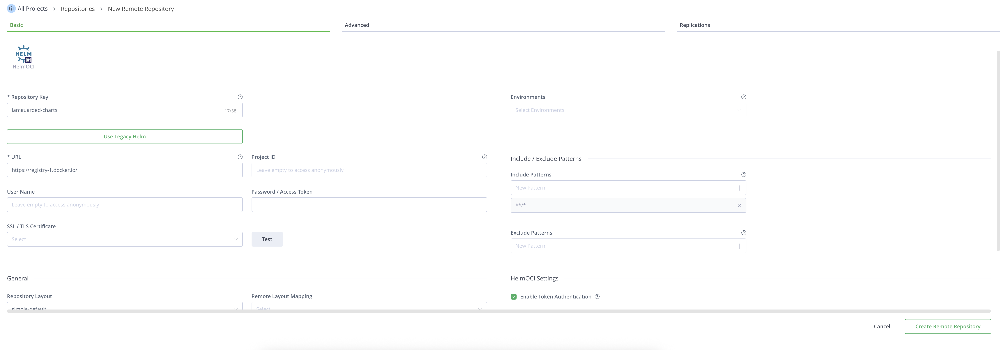
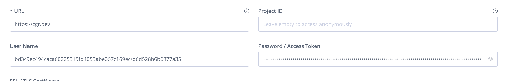
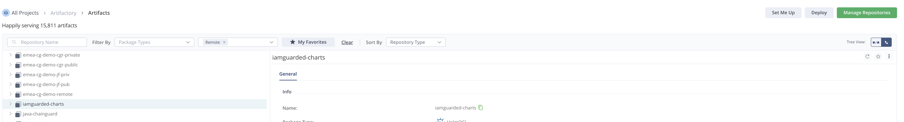

This page will walk you through the process of setting up and using Chainguard Helm Charts with Artifactory via remote Helm OCI repositories.

## Create and configure Helm OCI repository in Artifactory

From the administration panel within Artifactory, create a remote repository, picking Helm as the repo type. we'll call it `iamguarded-charts`



To determine values for the `User Name` and `Password / Access Token` fields, run the following command:

```bash
$ORGANIZATION=YOUR-ORGANIZATION
chainctl auth configure-docker --pull-token --save --parent $ORGANIZATION
```

Set $ORGANIZATION to be the organization name you're pulling Helm Charts from. Output will look like this:

```bash
To use this pull token in another environment, run this command:

    docker login "cgr.dev" --username "bd3c9ec494caca60225319fd4053abe067c169ec/5037f83cdd0fbdcd" --password "eyJhbGciOiJSUzI1NiJ9.eyJhdWQiOiJodHRwczovL2lzc..." # Token truncated
```

Set these values in the console. Note that the URL should be `https://cgr.dev`



Once created, the next step is to configure Helm to pull from the mirrored repository. We can then test that it works by pulling the Helm Chart from the repository.

## Configure Helm to pull from the mirrored repository and install

> **NOTE:** In the following example, $JFROG_USERNAME and $JFROG_TOKEN refer to the Artifactory username and token used to gain access to the newly created Helm repository. For testing purposes, a quick way to generate this against any repository is by using the "Set Me Up" button in the top right corner of the UI.



```bash
JFROG_USERNAME= # Your username, i.e. zachary.yonash@chainguard.dev
JFROG_TOKEN= # Your token
helm registry login -u $JFROG_USERNAME -p $JFROG_TOKEN chainguard.jfrog.io
Login Succeeded
helm pull oci://chainguard.jfrog.io/iamguarded-charts/zachary.yonash/iamguarded-charts/kafka
Pulled: chainguard.jfrog.io/iamguarded-charts/zachary.yonash/iamguarded-charts/kafka:32.2.18
Digest: sha256:8cc051f049fbd75cfc84306bf11adf0ef4ea0d19bc3a1d3ae46284b3aab5b083
```

Finally, we'll create a Kubernetes Secret that will be used to pull the `kafka-iamguarded` image from Artifactory and then run the `helm install` process.

> **NOTE:** Similar to the Helm example, `$JFROG_USERNAME` and `$JFROG_TOKEN` refer to the Artifactory username and token used to gain access to your existing remote repository used to mirror Chainguard images from your organization. This may be different than the credentials used to gain access to your remote Helm repository.

```bash
JFROG_USERNAME= # Your username, i.e. zachary.yonash@chainguard.dev
JFROG_TOKEN= # Your token
ORGANIZATION= # Your organization, i.e. zachary.yonash - you may already have this set from a previous example
kubectl create secret docker-registry chainguard-pull-secret \
    --docker-server=chainguard.jfrog.io \
    --docker-username=$JFROG_USERNAME \
    --docker-password=$JFROG_TOKEN

secret/chainguard-pull-secret created

helm install kafka oci://chainguard.jfrog.io/iamguarded-charts/zachary.yonash/iamguarded-charts/kafka \
    --set image.registry=chainguard.jfrog.io \
    --set image.repository=iamguarded-charts/zachary.yonash/iamguarded-charts/kafka \
    --set "global.org=$ORGANIZATION" \
    --set "global.imagePullSecrets[0].name=chainguard-pull-secret"

    Pulled: chainguard.jfrog.io/iamguarded-charts/zachary.yonash/iamguarded-charts/kafka:32.2.18
    Digest: sha256:8cc051f049fbd75cfc84306bf11adf0ef4ea0d19bc3a1d3ae46284b3aab5b083
    NAME: kafka
    LAST DEPLOYED: Fri Jul 11 15:10:56 2025
    NAMESPACE: default
    STATUS: deployed
    REVISION: 1
    TEST SUITE: None
    NOTES:
    CHART NAME: kafka
    CHART VERSION: 32.2.18
    APP VERSION: 4.0.0
```

A few things to note regarding the above values:

- The `global.org` value is set to the organization name you're pulling Helm Charts from.  This is specific to the Chainguard variant of the Helm Chart.
- The `global.imagePullSecrets[0].name` value is set to the name of the Kubernetes Secret that will be used to pull the `kafka-iamguarded` image from Artifactory (or whichever registry images are being pulled from, for non-Artifactory setups).
