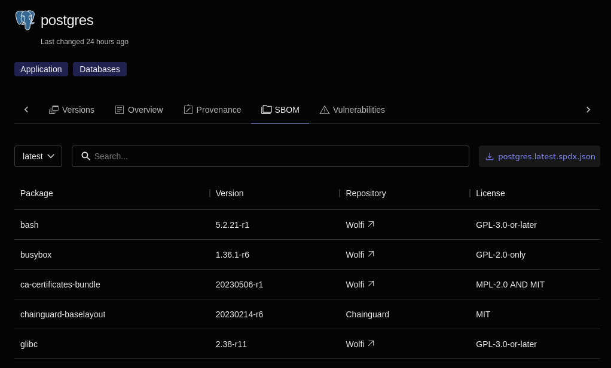

Chainguard provides a Software Bill of Materials (SBOM) with every container image, enabling complete transparency about package contents and dependencies for security and compliance requirements. These SBOMs are cryptographically signed and attached as attestations, making them retrievable and verifiable. By including only the minimum packages needed, Chainguard Containers reduce attack surface while the SBOM ensures you can verify exactly what's in each image.

Even though they contain the minimum number of packages, there may come a time when you want to know exactly what's running inside of a certain Chainguard Container. For this reason, Chainguard includes a signed SBOM with each image in the form of a [software attestation](https://slsa.dev/attestation-model), allowing you to verify the contents and meet compliance requirements. Chainguard publishes several different types of attestations; see the options under the [Available attestation types](#available-attestation-types) section on this page.

## Retrieve a container image's attestation

You can retrieve a container image's attestation in two ways:
- [Using Cosign](#retrieve-a-container-image-attestation-via-cosign)
    - [Cosign](/open-source/sigstore/cosign/an-introduction-to-cosign/) — a part of the Sigstore project — supports software artifact signing, verification, and storage in an [OCI (Open Container Initiative)](/open-source/oci/what-is-the-oci/) registry, as well as the retrieval of said artifacts.
- [In the Chainguard Console](#retrieve-a-container-image-attestation-in-the-chainguard-console)

### Prerequisites

To retrieve an attestation via Cosign, you'll need the following installed on your local machine:

* **Cosign**: Follow [our guide on installing Cosign](/open-source/sigstore/cosign/how-to-install-cosign/) to configure it.
* **jq**: Follow instructions on the [jq downloads page](https://jqlang.github.io/jq/download/) to set it up.


### Retrieve a container image attestation via Cosign

Cosign includes a `download attestation` command that allows you to retrieve a Chainguard Container's attestation over the command line. Different types of attestations are referenced by their **predicate type**. To authenticate these statements and verify the authenticity of the software producer, you can use [`cosign verify-attestation`](/open-source/sigstore/cosign/how-to-verify-file-signatures-with-cosign/). 

This example command downloads the SPDX attestation for Chainguard's [php image](https://images.chainguard.dev/directory/image/php/overview?utm_source=cg-academy&utm_medium=referral&utm_campaign=dev-enablement&utm_content=edu-content-chainguard-chainguard-images-working-with-images-retrieve-image-sboms):

```shell
cosign download attestation \
  --platform linux/amd64 \
  --predicate-type https://spdx.dev/Document \
  cgr.dev/chainguard/php | jq -r '.payload' | base64 -d | jq -r '.predicate'
```

Cosign returns the attestation in a signed envelope, with the SBOM stored as a base64-encoded payload. The command pipes the output through jq to extract the payload, decodes it with base64, and then uses jq again to print the attestation’s predicate, which contains the SBOM.

You can include the following flags when retrieving attestations:
* The `--platform` flag, which selects the target platform for the image, such as `linux/amd64` or `linux/arm64`. 
    * This flag requires Cosign version 2.2.1 or newer.
* The `--predicate-type` flag, required to specify which type of attestation to retrieve. You can use the full URI or the shorthand version as the value of the flag. See the [Available attestation types](#available-attestation-types) section for a list of options.


### Retrieve a container image attestation in the Chainguard Console

You can also find container image SBOMs in the [Chainguard Console](https://console.chainguard.dev). After signing in to the Console and clicking either the **Public images** or, if available, **Organization images** you'll be presented with a list of images. Clicking on any of these will take you to the image's landing page. There, you can click on the [**SBOM** tab](/chainguard/chainguard-images/how-to-use/images-directory/#sbom-tab) to find and download the SBOM for the given image. 

The following example shows the **SBOM** tab for the `postgres` image.



You can use the drop-down menu above the table to select which version and architecture of the image you want to view. You can also use the search box to find specific packages in the SBOM or use the button to the right of the search box to download the SBOM to your machine.

Check out our guide on [using the Chainguard Containers Directory](/chainguard/chainguard-images/how-to-use/images-directory/) for more details.

## Available attestation types

Chainguard publishes several different types of attestations. Not every image will have every predicate type; availability depends on the image and its build process. Available predicate types include:

| Attestation Type  | Description  | Availability  |
| ----------------- | ------------ | ------------  |
| `https://slsa.dev/provenance/v1` (`slsaprovenance1`)  	| The [SLSA 1.0](https://slsa.dev/spec/v1.0/provenance) provenance attestation contains information about the image build environment. | Available on all images. |
| `https://apko.dev/image-configuration` | Contains the configuration used by that particular image build, including direct dependencies, user accounts, and entry point.   	| Available on all images. |
| `https://spdx.dev/Document` (`spdx`,`spdxjson`)   	| Contains the image SBOM in SPDX format. | Available on all images.                                                            	|
| `https://chainguard.dev/end-of-life`   	| End-of-life status. | Only available on EOL images in grace period. |
| `https://cyclonedx.org/bom` (`cyclonedx`) |   Contains the image SBOM in CycloneDX format. 	| Only available to customers, on new builds or rebuilds after January 29, 2026. |
| `https://chainguard.dev/helm-values/v1`   	| Contains Helm values for images with vetted upstream Helm charts. | Only images that are tested with Helm and have a corresponding upstream Helm chart have this attestation. |  
| `https://chainguard.dev/attestation/chart-lock/v1`   	| Contains Helm chart-lock data for relevant images. | Only present for images where Helm chart locking is relevant. |
| `https://chainguard.dev/attestation/syft/v1` |  Contains Syft-based SBOM attestation. 	| Not available on all images; this predicate is less common. |

## License Information and Source Code references

The SBOM downloaded using either Cosign or Console methods described previously contain identical information. It lists binary packages present in the image, their licensing information using [SPDX license](https://spdx.org/licenses/) and [exceptions lists](https://spdx.org/licenses/exceptions-index.html), and external source code references.

These source code references are encoded in the [external references](https://spdx.github.io/spdx-spec/v2.3/package-information/#721-external-reference-field) field, using [external repository identifiers](https://spdx.github.io/spdx-spec/v2.3/external-repository-identifiers/#f35-purl) in the package URL (purl) format. The [purl specification](https://github.com/package-url/purl-spec/blob/master/PURL-SPECIFICATION.rst) allows for various different schemes and types. 

The following purls are used in Chainguard SPDX SBOM:

* `pkg:apk` denotes binary package origin, name, full version number with epoch, and architecture:

```
pkg:apk/wolfi/ca-certificates-bundle@20240315-r4?arch=x86_64
```

* `pkg:github` is used for upstream source code reference for packages built from GitHub repositories. These purls always include a fixed commit hash and, when available, also include a tag-version:

```
pkg:github/openssl/openssl.git@openssl-3.3.1
pkg:github/openssl/openssl.git@db2ac4f6ebd8f3d7b2a60882992fbea1269114e2
```

* Note that `pkg:github` is also used to reference melange packaging files from Wolfi and Chainguard. These are provided with a subpath component and a fixed commit hash:

```
pkg:github/wolfi-dev/os@f18ff825f94b9177cf603c6e3d72936683a504d2#glibc.yaml
```

* `pkg:generic` is used to reference any other upstream download locations, most commonly tarballs:

```
pkg:generic/gcc@13.2.0?
checksum=sha256%3A8cb4be3796651976f94b9356fa08d833524f62420d6292c5033a9a26af315078&
download_url=https%3A%2F%2Fftp.gnu.org%2Fgnu%2Fgcc%2Fgcc-13.2.0%2Fgcc-13.2.0.tar.gz
```

* Also note that `pkg:generic` is used to reference upstream git repositories, outside of GitHub:

```
pkg:generic/ca-certificates@20240315?
vcs_url=git%2Bhttps%3A%2F%2Fgitlab.alpinelinux.org%2Falpine%2Fca-certificates%4009e5e43336e532ec8217ae3bfc912bcb7048f65a
```

purls are human-readable, but various programming and scripting languages have [implementations](https://github.com/package-url/purl-spec?tab=readme-ov-file#known-implementations) that can parse them.

Because SPDX SBOMs are distributed within the Chainguard Containers repository alongside each image hash, you can achieve source code access compliance by ensuring all attestations are mirrored together with each image.

As an example, a snippet of a binary package SPDX stanza with license, version, and source code references is shown here:

```json
    {
      "SPDXID": "SPDXRef-Package-glibc-locale-posix-2.39-r6",
      "externalRefs": [
        {
          "referenceCategory": "PACKAGE_MANAGER",
          "referenceLocator": "pkg:apk/wolfi/glibc-locale-posix@2.39-r6?arch=x86_64",
          "referenceType": "purl"
        },
        {
          "referenceCategory": "PACKAGE_MANAGER",
          "referenceLocator": "pkg:generic/glibc@2.39?checksum=sha256%3Af77bd47cf8170c57365ae7bf86696c118adb3b120d3259c64c502d3dc1e2d926&download_url=http%3A%2F%2Fftp.gnu.org%2Fgnu%2Flibc%2Fglibc-2.39.tar.xz",
          "referenceType": "purl"
        },
        {
          "referenceCategory": "PACKAGE_MANAGER",
          "referenceLocator": "pkg:github/wolfi-dev/os@f18ff825f94b9177cf603c6e3d72936683a504d2#glibc.yaml",
          "referenceType": "purl"
        }
      ],
      "licenseDeclared": "LGPL-2.1-or-later",
      "name": "glibc-locale-posix",
      "originator": "Organization: Wolfi",
      "supplier": "Organization: Wolfi",
      "versionInfo": "2.39-r6"
    }
```

This snippet shows that the `glibc-locale-posix` binary package is distributed under LGPL license, built from the `glibc-2.39.tar.xz` upstream tarball, using the `glibc.yaml` file from the `wolfi-dev/os` repository.

## Learn more

We provide provenance information for every Chainguard Container in their respective [details pages](https://images.chainguard.dev/directory?utm_source=cg-academy&utm_medium=referral&utm_campaign=dev-enablement&utm_content=edu-content-chainguard-chainguard-images-working-with-images-retrieve-image-sboms). After reaching the **Overview** for the image of your choice, navigate to the **Provenance** tab for information on how to retrieve the image's attestations, as well as how to verify the image's attestations and signatures.

For example, if you're looking for the provenance information of the Python image, you can navigate to the [Python provenance information page](https://images.chainguard.dev/directory/image/python/provenance?utm_source=cg-academy&utm_medium=referral&utm_campaign=dev-enablement&utm_content=edu-content-chainguard-chainguard-images-working-with-images-retrieve-image-sboms).
