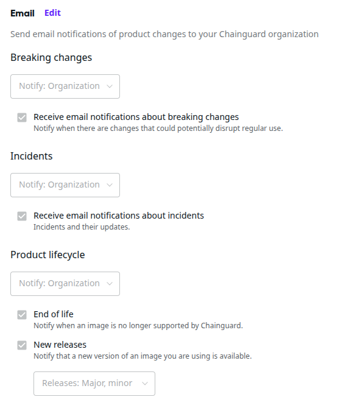
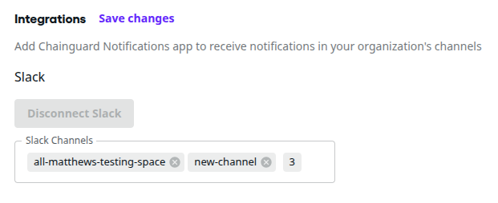

You can use the [Chainguard Console](/chainguard/chainguard-images/how-to-use/images-directory) to configure how Chainguard is permitted to send notifications about things like breaking changes to users in your organization. The feature is rolling out with options to allow notifications to be sent in-app to the user’s Overview page in the Chainguard Console, via email, and using Slack.

These notifications are different from [Chainguard Events](/chainguard/administration/cloudevents/) as Chainguard Notifications are sent by Chainguard’s customer success representatives.

## Prerequisites and limitations

This feature is currently in private beta. If you would like to participate, please [reach out to our Customer Support team](https://www.chainguard.dev/contact?utm=docs). To use the feature:

- You must use a user account for the Chainguard Console that is configured with the *owner* role for your organization.
- There are two feature flags which must be turned on, `notificationsBeta` and `emailNotifications`. These flags are not available to you until Chainguard enables your access.

Notifications are currently limited to messages related to breaking changes. In the future, this will expand to include notifications about topics like incidents, new releases, and end of life for specific images.

The in-app and email notifications can be set up for you by Chainguard when you opt in to enabling the notifications feature, but you have control over which email notifications are sent. You are also able to set one or more additional email addresses to receive notifications for your organizations; these are called forwarding addresses.

Slack requires you to establish the connection between our Chainguard Notifications Slack app and your company Slack workspace by completing the Slack OAuth flow.

## Manage email notifications

To perform this task, you must use a user account for the Chainguard Console that is configured with the *owner* role for the organization. Then, follow these steps:

1. In the Chainguard Console, open **Settings \> Notifications**.

1. Next to the **Email** section heading, click **Edit**.
  You can then change settings for what notification topics will be sent and to whom, either an individual or perhaps to an email alias for a group.

1. When you are done, click **Save changes**.

 Notifications page." style="width:700px;">

  

## Set up Slack for Chainguard Notifications

Make sure you are logged into both the console and to your Slack workspace on the same machine before you begin. To perform this task, you must use a user account for the Chainguard Console that is configured with the *owner* role for the organization and a Slack account that can add apps to your Slack workspace and which has access to the Slack channels you plan to use.

> For example, when you are trying to add the Chainguard Notifications app to Slack channels, the Slack account you are using will only be shown a list of public and private Slack channels the app has access to and your Slack user account is a member of. If you have a specific channel in mind for these notifications, make sure the Slack user establishing the connection has access to and is a member of that channel.

In the Chainguard Console, open **Settings \> Notifications**.

Next to the **Integrations** section heading, click **Edit**.

Under the **Slack** subheading, click **Connect Slack**.

A pop-up window from Slack will appear asking you to allow the **Chainguard Notifications** app to access Slack.

In the **Workspace** dropdown, select the Slack workspace in which you want to have your users receive Chainguard Notifications.

Click **Allow**.

Click into the **Slack Channels** box under the **Slack** subheading on the **Notifications** page in the console. You will be shown the list of channels available for the Chainguard Notifications app to use. Select the channel(s) where you want these notifications to be posted.

 Notifications page." style="width:700px;">

 
