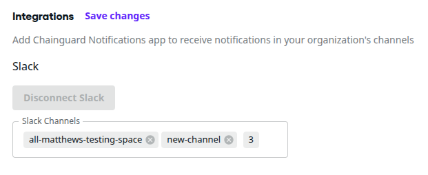
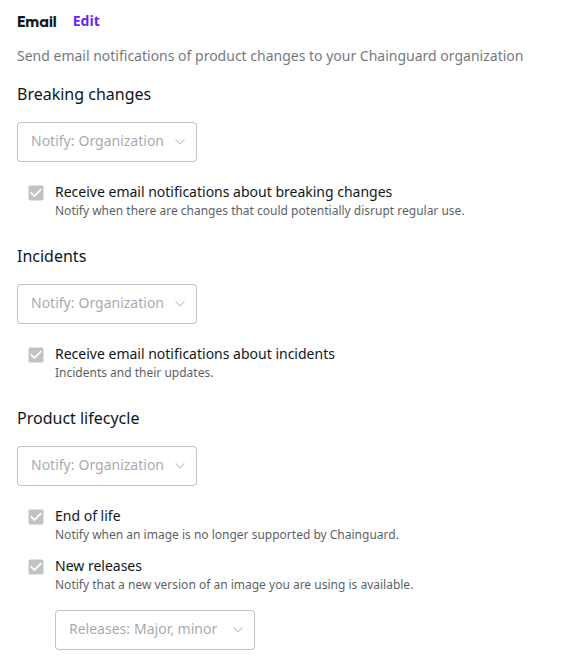

You can use the [Chainguard Console](/chainguard/chainguard-images/how-to-use/images-directory) to configure how **Chainguard** is permitted to send notifications about things like breaking changes to users in your organization. The feature includes options to allow notifications to be sent in-app to the **Activity Center** on the user’s Overview page in the Chainguard Console, via Slack, and for customers who are opted in, via email.

These notifications are different from [Chainguard Events](/chainguard/administration/cloudevents/) as Chainguard Notifications are sent by Chainguard’s customer success representatives.

## Prerequisites and limitations

This feature is currently in beta.

Notifications are currently limited to messages related to a small set of topics like breaking changes, incidents, and product lifecycle changes like end-of-life (EOL) and new releases.

The in-app notifications are set up automatically and currently have no configuration options.

Slack requires you to establish the connection between our Chainguard Notifications Slack app and your company Slack workspace by completing the Slack OAuth flow that initiates when you connect Slack the first time.

Some customers have access to email notifications. When enabled, you have control over which email notifications are sent. You are also able to set one or more additional email addresses to receive notifications for your organizations; these are called forwarding addresses.

## Set up Slack for Chainguard Notifications

Make sure you are logged into both the console and to your Slack workspace on the same machine before you begin. To perform this task, you must use a user account for the Chainguard Console that is configured with the *owner* role for the organization and a Slack account that can add apps to your Slack workspace and which has access to the Slack channels you plan to use.

> For example, when you are trying to add the Chainguard Notifications app to Slack channels, the Slack account you are using will only be shown a list of public and private Slack channels the app has access to and your Slack user account is a member of. If you have a specific channel in mind for these notifications, make sure the Slack user establishing the connection has access to and is a member of that channel.

To set this up, follow these steps:

1. In the Chainguard Console, open **Settings \> Activity Center**.

1. Next to the **Integrations** section heading, click **Edit**.

1. Under the **Slack** subheading, click **Connect Slack**.
  A pop-up window from Slack will appear asking you to allow the **Chainguard Notifications** app to access Slack.

1. In the **Workspace** dropdown, select the Slack workspace in which you want to have your users receive Chainguard Notifications.

1. Click **Allow**.

Follow the directions in one or more of the following sections to enable notifications in public and private channels.

### Preliminary step to set up notifications in a private channel

If you want to provide Chainguard Notifications in a private Slack channel, then at this point you must add the app to the private channel. In Slack:

1. Enter the private channel with your Slack user.

1. Click on the channel members icon to open the list.

1. Click to open the **Integrations** tab.

1. Click the **Add an App** button to display a list of available apps in your workspace.

1. Find **Chainguard Notifications** in the list and click the **Add** button.

Include the private channel in your actions in the next section.

### Set up notifications in a public or private channel

1. Click into the **Slack Channels** box under the **Slack** subheading on the **Notifications** page in the console. You will be shown the list of channels available for the Chainguard Notifications app to use. Select the channel(s) where you want these notifications to be posted.

> NOTE: Private channels will not appear here unless you first complete the preliminary step in the previous section.

 Notifications page." style="width:700px;">

 

## Manage email notifications

Email notifications are not yet available to all customers.

To perform this task, you must use a user account for the Chainguard Console that is configured with the *owner* role for the organization. Then, follow these steps:

1. In the Chainguard Console, open **Settings \> Activity Center**.

1. Next to the **Email** section heading, click **Edit**.
  You can then change settings for what notification topics will be sent and to whom, either an individual or perhaps to an email alias for a group.

1. When you are done, click **Save changes**.

 Notifications page." style="width:700px;">

 

## Notification categories

Notifications fall into one of multiple categories based on content. Here's a list of the currently available categories:

- **Breaking changes** - Changes that could disrupt regular use
- **Incidents** - Reports and updates
- **Product lifecycle** - Has two sub-categories:
  - **End of life**
  - **New releases**

## Troubleshooting FAQ - setting up Slack

### Channel seems to be missing

**Q:** I connected Slack successfully, but the channel I want to use doesn't appear in the "Slack Channels" dropdown. Other channels show up fine — why is this one missing?

The most common cause is that the channel is private. The Chainguard Notifications Slack app can only see public channels by default. To make a private channel selectable:

1. In Slack, open the private channel.
1. Click the channel members icon, then open the **Integrations** tab.
1. Click **Add an App**, find **Chainguard Notifications**, and click **Add**.
1. Return to the Chainguard Console and refresh the **Settings > Activity Center** page. The private channel should now appear in the dropdown.

### Channel still seems to be missing

**Q:** My channel is public, I'm a member of it, and I even added the Chainguard Notifications app to it — but it still doesn't show up. What's wrong?

This usually means the email address you used to sign in to the Chainguard Console doesn't match the email address associated with your account in your company's Slack workspace.

The Slack app uses your Console email to look up your Slack user ID — if it can't find a matching user in your workspace, it can't determine which channels you have access to, and the channel list comes back empty (or partial).

A common version of this scenario is signing in to the Console with your Github profile linked to your personal Gmail (e.g. you@gmail.com) while your corporate Slack workspace knows you as you@company.com.

To fix it:

1. In the Console, disconnect the Slack integration in **Settings > Activity Center > Integrations > Edit**.
1. Sign out of the Chainguard Console.
1. Sign back in using the email address that matches your corporate Slack workspace identity.
1. Re-connect Slack and complete the OAuth flow again.

### I still cannot find the channel

**Q:** I disconnected and reconnected Slack with the correct email, but the channel I want still isn't appearing. Now what?

After reconnecting, the channel list can get stuck on a stale cached version from the previous session.

A hard refresh of the Console tab almost always resolves it. On Mac use `Cmd + Shift + R` or on Windows and Linux use `Ctrl + Shift + R` to refresh.

Then reopen **Settings > Activity Center** and check the channel dropdown again. If the channel still doesn't appear after a hard refresh, contact your Chainguard Customer Success representative — they can verify on the backend that your Slack user ID was successfully linked to the Notifications service.
