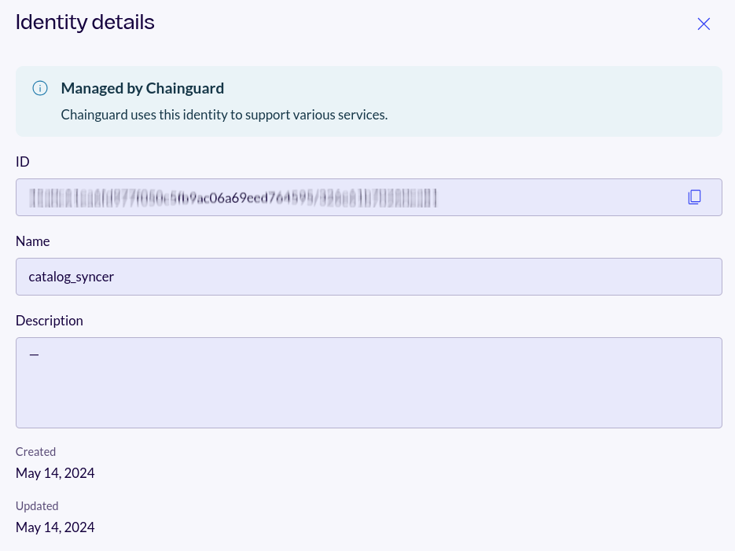

All Chainguard Containers contain verifiable signatures and attestations such as SBOMs (software bills of materials) which enable users to confirm the origin of each image built and have a detailed list of everything that is packed within.

This guide outlines how you can use Cosign to download and verify container image signatures and attestations.

## Prerequisites

The following examples require [Cosign](/open-source/sigstore/cosign/how-to-install-cosign/) and [jq](https://stedolan.github.io/jq/) to be installed on your machine in order to download and verify image attestations. 

## Registry and Tags for Chainguard Containers

Attestations are provided per image build, so you'll need to specify the correct tag and registry when pulling attestations from an image with `cosign`. This guide works with Chainguard's public and private registries: 

- `cgr.dev/chainguard`: The public registry contains Chainguard's **Starter container images**, which typically comprise the `:latest` versions of an image.
- `cgr.dev/YOUR-ORGANIZATION`: A private/dedicated registry contains your organization's **Production container images**, which include all versioned tags of an image and special images that are not available in the public registry (including FIPS images and other custom builds).

The commands listed on this page will default to the `:latest` tag, but you can specify a different tag to fetch attestations for.


## Chainguard's Signing Identities

Chainguard uses an identity associated with its official GitHub account to sign images in the public registry that contains the free tier of Starter images.

For private images, Chainguard signs all images in your private registry with one of two different identities in your organization:

* The `catalog_syncer` identity is used to sign images that have been imported directly from the Chainguard Containers catalog. 
* The `apko_builder` identity is used to sign any images that have been customized for your organization, such as those built with [Custom Assembly](/chainguard/chainguard-images/features/ca-docs/custom-assembly/).

These identities are created and added to every [verified Chainguard organization](/chainguard/administration/iam-organizations/verified-orgs/) automatically. 

To follow along with the **Private Registry** examples in this guide, you will need the *unique identifier paths* (UIDPs) of these Chainguard identities. To this end, create a few environment variables, the first of which should point to the name of your Chainguard organization:

```shell
PARENT=your-organization
```

Next, create two more variables to hold the UIDPs of your organization's `catalog_syncer` and `apko_builder` identities, respectively:

```shell
CATALOG_SYNCER=$(chainctl iam account-associations describe $PARENT -o json | jq -r '.[].chainguard.service_bindings.CATALOG_SYNCER')
APKO_BUILDER=$(chainctl iam account-associations describe $PARENT -o json | jq -r '.[].chainguard.service_bindings.APKO_BUILDER')
```

The **Private Registry** examples in this guide will include these environment variables, allowing you to verify that they were used to sign the given image. 

Be aware that you can also find these values in the Chainguard Console. After logging in, click on **Settings**, and then **Users**. From there, scroll or search for either `catalog_syncer` or `apko_builder` and click on its row to find the identity's UIDP:

<center></center>
<br /> 


## Verifying Container Image Signatures

Chainguard Containers are signed using Sigstore and you can check the included signatures using `cosign`. The `cosign verify` command will pull detailed information about all signatures found for the provided image. 

### Public Registry

```shell
IMAGE=go
cosign verify \
  --certificate-oidc-issuer=https://token.actions.githubusercontent.com \
  --certificate-identity=https://github.com/chainguard-images/images/.github/workflows/release.yaml@refs/heads/main \
  cgr.dev/chainguard/${IMAGE} | jq
```

### Private/Dedicated Registry

```shell
IMAGE=go
cosign verify \
  --certificate-oidc-issuer=https://issuer.enforce.dev \
  --certificate-identity-regexp="https://issuer.enforce.dev/(${CATALOG_SYNCER}|${APKO_BUILDER})" \
  cgr.dev/${PARENT}/${IMAGE} | jq
```

Be aware that you will need to change the `IMAGE` environment variable to reflect a container image your organization is entitled to.

> **Note**: The environment variables used in this command (other than `$(IMAGE)`) were created in the previous section.

By default, this command will fetch signatures for the `:latest` tag. If you'd like, you can specify the tag you want to fetch signatures for:

```shell
IMAGE=go
TAG=1.23.8
cosign verify \
  --certificate-oidc-issuer=https://issuer.enforce.dev \
  --certificate-identity-regexp="https://issuer.enforce.dev/(${CATALOG_SYNCER}|${APKO_BUILDER})" \
  cgr.dev/${PARENT}/${IMAGE}:$(TAG) | jq
```

## Downloading Container Attestations

Attestations are signed metadata about the artifact, which can include SBOMs, vulnerability scans, or other custom predicates.

The [attestations](https://slsa.dev/attestation-model) for a container image can be obtained and verified using Cosign. These are a few of the existing types:

| Attestation Type  | Description  |
| ----------------- | ------------ |
| `https://slsa.dev/provenance/v1`   	| The [SLSA 1.0](https://slsa.dev/spec/v1.0/provenance) provenance attestation contains information about the image build environment. |
| `https://apko.dev/image-configuration` | Contains the configuration used by that particular image build, including direct dependencies, user accounts, and entry point.   	|
| `https://spdx.dev/Document`   	| Contains the image SBOM in SPDX format.                                                             	|

To download an attestation, use the `cosign download attestation` command and provide both the `predicate-type` and the build `platform`. By default, this command will fetch the SBOM assigned to the `latest` tag. You can also specify the tag you want to fetch the attestation from.

To download a different attestation, replace the `--predicate-type` parameter value with the desired attestation URL identifier. To illustrate, the following examples will obtain the SBOM for the requested image for the `linux/amd64` platform.

### Public Registry

```shell
IMAGE=go
cosign download attestation \
  --predicate-type=https://spdx.dev/Document \
  --platform=linux/amd64 \
  cgr.dev/chainguard/${IMAGE} | jq -r .payload | base64 -d | jq .predicate
```

### Private/Dedicated Registry

```shell
IMAGE=go
cosign download attestation \
  --predicate-type=https://spdx.dev/Document \
  --platform=linux/amd64 \
  cgr.dev/${PARENT}/${IMAGE} | jq -r .payload | base64 -d | jq .predicate
```

## Verifying Image Attestations

You can use the `cosign verify-attestation` command to check the signatures of the desired container image [attestations](https://slsa.dev/attestation-model):

### Public Registry

```shell
IMAGE=go
cosign verify-attestation \
  --type https://spdx.dev/Document \
  --certificate-oidc-issuer=https://token.actions.githubusercontent.com \
  --certificate-identity=https://github.com/chainguard-images/images/.github/workflows/release.yaml@refs/heads/main \
  cgr.dev/chainguard/${IMAGE} | jq
```

This will pull in the signature for the attestation specified by the `--type` parameter, which in this case is the SPDX attestation for SBOMs. You will receive get output that verifies the SBOM attestation signature in Cosign's transparency log:

```shell
Verification for cgr.dev/chainguard/go --
The following checks were performed on each of these signatures:
- The cosign claims were validated
- Existence of the claims in the transparency log was verified offline
- The code-signing certificate was verified using trusted certificate authority certificates
Certificate subject:  https://github.com/chainguard-images/images/.github/workflows/release.yaml@refs/heads/main
Certificate issuer URL:  https://token.actions.githubusercontent.com
GitHub Workflow Trigger: schedule
GitHub Workflow SHA: da283c26829d46c2d2883de5ff98bee672428696
GitHub Workflow Name: .github/workflows/release.yaml
GitHub Workflow Trigger chainguard-images/images
GitHub Workflow Ref: refs/heads/main
...
```


### Private/Dedicated Registry

```shell
IMAGE=go
cosign verify-attestation \
  --type https://spdx.dev/Document \
  --certificate-oidc-issuer=https://issuer.enforce.dev \
  --certificate-identity-regexp="https://issuer.enforce.dev/(${CATALOG_SYNCER}|${APKO_BUILDER})" \
  cgr.dev/${PARENT}/${IMAGE} | jq
```


## Learn more

To get up to speed with Sigstore, you can review the [Sigstore](/open-source/sigstore/) section of Chainguard Academy, visit the upstream [Sigstore Docs](https://docs.sigstore.dev/) site, and check out the [Sigstore organization on GitHub](https://github.com/sigstore). You can learn more about verifying software artifacts with Cosign by reading [How to Verify File Signatures with Cosign](/open-source/sigstore/cosign/how-to-verify-file-signatures-with-cosign/).

Navigate to our [container images](/chainguard/chainguard-images/) landing page or [Getting Started Guides](https://edu.chainguard.dev/chainguard/chainguard-images/getting-started/) to understand more about Chainguard Containers and how they offer low-to-zero CVEs.
