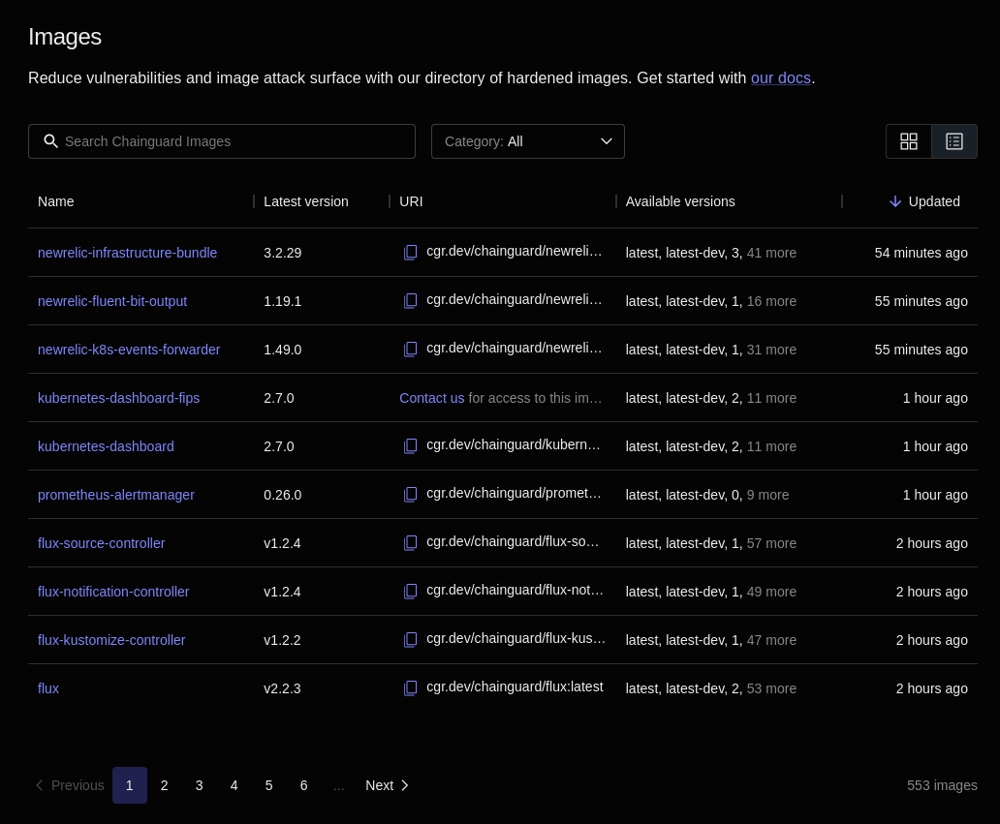

There are hundreds of Chainguard Images available for use. To help users explore and better understand all of these Images, we've developed the Chainguard Images Directory. This guide serves as a walkthrough of the Directory, including how to access it and get the most out of its features.

## Accessing the Images Directory

This guide is framed around the Images Directory found in the Chainguard Console. The Console is accessible to anyone, including users who aren't Chainguard customers. To access the Console, you'll first need to [create an account and sign in](https://console.enforce.dev/auth/login).

If you're not ready to create a Chainguard account, you can also follow along with the public [Chainguard Images Directory](https://images.chainguard.dev/). As of this writing, there are some differences between the two directories, but both should provide a similar experience for users.

## The Images Directory

After signing in to the Chainguard Console, your browser will take you to a landing page like the following.

Click **Public Images** in the left-hand navigation to be taken to the Public Images Directory. There, you'll be presented with a list of all of Chainguard's Developer Images.

> **Note**: If you are part of an organization, you may have access to resources in the **Organization images** tab. If so, you explore the images there as you would with the Public Images Directory.

You can toggle between a table view and a card-based view by clicking to the upper right of the Images directory.

Let's continue using the tabular view for now, as this contains some more information than the card view.

The table view has five columns:

* **Name**: the name of each given Image.
* **Latest version**: the latest available version of the Image. Note that this column's value could be a version number or it may read `latest`. In the former case, this means that the latest version Chainguard offers is a different, later version than the one the publicly available Image tagged with `:latest`.
* **URI**: the registry URI you can use in a `docker pull` command to download the Image. Production Images, which are not publicly available, will instead have a message reading "Contact us for access to this image" with a link to Chainguard's [contact form](https://www.chainguard.dev/contact?utm_source=docs).
* **Available versions**: a list of what versions are available for this Image. Each Image will have a `latest` version, and most will also have a `latest-dev` version. 
* **Updated**: how long it's been since the Image was last updated. 

You can click on any of these column names to sort the list of Images in ascending or descending order based on the values in these columns.

Above the table is a search box you can use to find specific Images by their name or latest version number. To the right of this box is a drop-down menu labeled **Category**. You can use this to filter the Images listed based on what category they belong to.

## Image information

Next, let's inspect an individual Image. Click on any Image you'd like. This example shows the page for the `postgres` Image.

Each Image page has five tabs that provide information about various facets of the given Image.

### Versions Tab

The default page for each Image is the **Versions** tab which contains information about the versions available for each Image. This contains a table with columns:

* **Version**: this column lists each version tag available for the Image.
* **Pull URL**: The URL you can use to download each version of the Image. As with the main Images Directory page, Production Images will have a message reading "Contact us for access to this image" with a link to Chainguard's [contact form](https://www.chainguard.dev/contact?utm_source=docs).
* **Last changed**: when each version of the Image was last updated.

Above the table is a search box which you can use to filter the different versions available for the Image. There is also a **Category** box you can use to filter out Production or Developer Images.

### Overview Tab

The **Overview** tab contains the Image's README. Typically, this will include instructions on how to download the Image, any relevant compatibility notes, and instructions on how to get started with using the Image.

### Provenance Tab

All Chainguard Images contain verifiable signatures and high-quality [software bills of materials](/open-source/sbom/what-is-an-sbom/) (SBOMs). These features allow you to confirm the origin of each Image and provide you with a detailed list of everything included in the Image.

The **Provenance** tab outlines how you can verify Image Signatures and download and verify Image Attestations, all with examples using [`cosign`](/open-source/sigstore/cosign/an-introduction-to-cosign/).

### SBOM Tab

The **SBOM** tab contains a list of packages in the Image. Chainguard Images are built so that everything contained in the Image is a package, meaning that this package list gives a complete view of what's in the Image. You won't find anything hidden in the Image that isn't listed in its SBOM tab.

The table listing an Image's packages has four columns.

* **Package**: the name of each package included in the Image's SBOM.
* **Version**: the version of the listed package.
* **Repository**: every package found in Chainguard Images is either built and managed by the Chainguard team or sourced from [Wolfi](/open-source/wolfi/overview/). For packages falling into the latter category, this column will include a link to the Wolfi GitHub repository showing the package source.
* **License**: the license under which each package is published.

Above the table is a search box you can use to find and filter the packages listed. To the left of this search box is a drop-down menu you can use to select which version of the Image you want to find the SBOM for. By default, this will show the `:latest` tag.

Finally, to the right of the search box is a button labeled with the Image's name, the tag selected with the drop-down menu, followed by **spdx.json**. You can click this button to download the SBOM (in the SPDX format) to your machine.

Note that Chainguard began generating SBOMs for its Images on November 15, 2023. For this reason, any versions of a given Image that were released before that date will not have any SBOM data to show. 

### Vulnerabilities Tab

The last tab is the **Vulnerabilities** tab. This tab contains a list of every CVE one can find within the Image.

As with the SBOMs tab, the Vulnerabilities tab has a search box you can use to find and filter specific vulnerabilities within the Image. There is also a drop-down menu to the left allowing you to select different versions of the Image.

Below these is a table listing the vulnerabilities. However, most Chainguard Images won't show any vulnerabilities for the `latest` version. This isn't an error, as we aim to remove vulnerabilities from Images as soon as they arise.

To illustrate how this table appears when vulnerabilities are actually present, you can select different versions in the drop-down until you find one with a vulnerability. This example shows version `16.1-dev` of the `postgres` Image.

The Vulnerabilities table has four columns.

* **CVE ID**: the official identification number of each vulnerability present in the table.
* **Severity**: the severity of each given vulnerability. This can either read **Critical**, **High**, **Medium**, **Low**, or **Unknown**
* **Package**: showing the package where the vulnerability was found
* **Version**: the version of the package containing the vulnerability

To the left of each row in the table is down-pointing chevron (**˅**). If you click on this symbol, more information about the given vulnerability will appear below the vulnerability's row.

Specifically, this will highlight the **Package** name and **Version** number of the package associated with the Vulnerability. It also shows the **Fixed version** of the package, a brief **Description** of the vulnerability, and one or more **References** you can review to learn more about the vulnerability.

Please be aware that, as with SBOM data, Chainguard began generating vulnerability information for its Images on November 15, 2023. For this reason, any versions of a given Image that were released before that date will not have any vulnerability data to show. 

## Learn More

The Chainguard Images Directory is a useful tool for understanding what Chainguard Images are available. To better understand how to work with individual Images, you can see if we have a [getting started guide](/chainguard/chainguard-images/getting-started/) available or review our [Image Reference resources](/chainguard/chainguard-images/reference/). We also provide a guide on [how to view security advisories](/chainguard/chainguard-images/security-advisories/) through our [self-service public Security Advisories page](https://images.chainguard.dev/security).