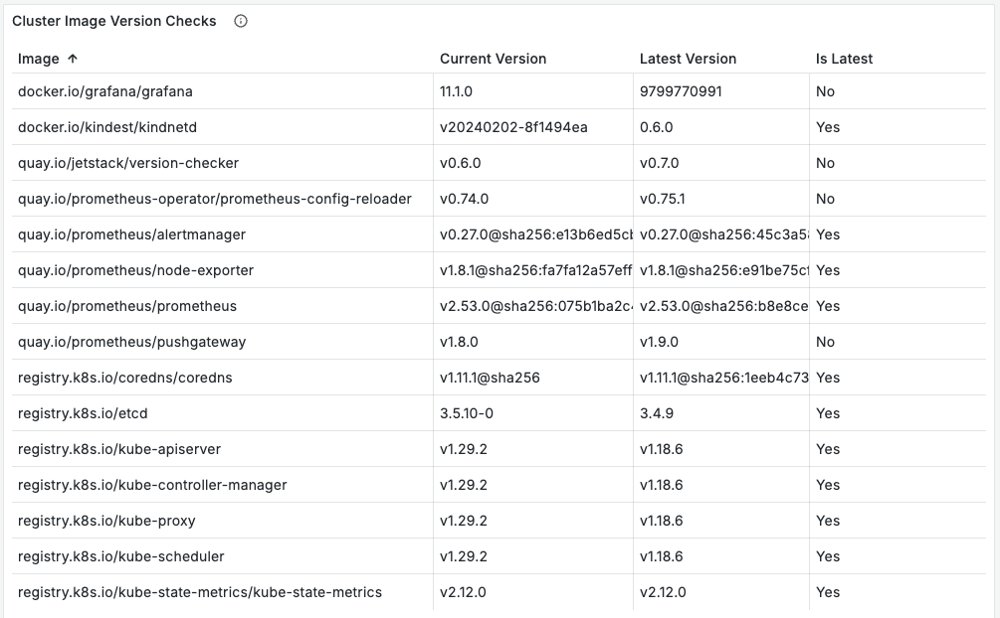

When it comes to keeping a system secure, one of the most important measures you can take is to regularly apply updates. In modern, containerized infrastructures this normally means updating containers to use only the latest container images that are still maintained. A casual observer might expect such a standard and important task to have agreed-on best practices and standardized tooling, but they might be surprised by the wide variety of different solutions and opinions on this problem.

This conceptual article will delve into some of the options and offer guidance on which might work best for readers.This article assumes that you are familiar with [semantic versioning](https://semver.org/) (SemVer) and image tagging. If you aren't acquainted with these concepts, please check out this guide on [Considerations for Keeping Images Up to Date](/chainguard/chainguard-images/recommended-practices/considerations-for-image-updates/).
 

## Updating Means Risk

The core issue with applying updates is that it's a fundamentally risky endeavor; any update to software risks a change to behavior and system breakages. It's a common practice to avoid major updates for weeks or even months in order to ensure bugs have been worked out before upgrading.

Larger software projects (like PostgreSQL, Java, and Node.js) often have multiple versions of their project in support at the same time. This means that users can stay on an older version and avoid the more risky updates while still getting security patches. Although this approach is helpful to operations teams, it is only practical on large projects with paid maintainers that can spend time backporting fixes. Smaller projects will often struggle with just keeping the main version up to date.


## Not Updating Means More Risk

End of Life (EOL) software [presents a host of security risks](https://www.chainguard.dev/unchained/why-end-of-life-software-means-400-cves-per-year). Upgrading may require a great deal of work and proper testing to be in place, but it's a small price to pay to keep your systems from being at risk and accruing technical debt.

If your application has an automated test suite with good coverage, you can be confident that any breakages caused by upgrades will be caught before deployment to production. Of course, whenever a test failure occurs, there will be work required to address it. Putting off that work by delaying upgrades will only mean that more work is required in the future as further changes pile up.

Another way organizations test and reduce the risk of breaking changes introduced by updates is through the use of staging environments where changes are tried out before being pushed to production. An alternative approach to this is "[*testing in production*](https://increment.com/testing/i-test-in-production/)" which typically involves using techniques like [*feature flags*](https://www.honeycomb.io/blog/what-is-a-feature-flag-best-practices-and-use-cases) and staged updates to verify the effects of changes before they impact the majority of users.


## Knowing When Updates are Available

The primary way of knowing when a new image is available is through the registry itself. Many registries will offer a webhook callback service ([Docker Hub](https://docs.docker.com/docker-hub/webhooks/), for example), but this is typically only for your own repositories. If you want to get notified when a public repository is updated, you'll typically have to use a third-party service like [*NewReleases*](https://newreleases.io/).

If you're trying to find out how outdated the images in your Kubernetes cluster are, you might find the [*version-checker*](https://github.com/jetstack/version-checker) project to be useful. This is a Kubernetes utility that will create an inventory of your current images and produce a chart showing how out of date they are. The dashboard can form part of a full solution with notifications for outdated software being sent to cluster administrators for mitigation.

<center></center>
<br />


## Updating Solutions

This section outlines some commonly employed solutions for keeping images up to date. We'll only consider solutions that involve automation — you could argue that `kubectl set image` is an updating solution, but it would only be scalable as part of an automated pipeline.

### Using `latest` or major version tags

One common strategy is to only use the `latest` tag or major version tags. This means having something like the following in your Dockerfile:

``` Dockerfile
FROM cgr.dev/chainguard/redis:3
```

Or, if you're using a  Kubernetes manifest, you might have a line like this:

``` Kubernetes
image: cgr.dev/chainguard/redis:latest
```

The tag used will determine the jump in the updated version; `latest` will jump major versions so typically a major or minor tag is chosen to limit the size of changes.

The goal for this strategy is that the image will be updated whenever it is rebuilt or redeployed. However, the reality is that it is still dependent on caching and configuration (especially the [image pull policyhttps://kubernetes.io/docs/concepts/containers/images/#image-pull-policy)) and it may involve a considerable time to redeployment.

One major issue with this approach is you lack control and reproducibility over the images that will be deployed. In Kubernetes you can end up with different pods in the same deployment running different versions of the application because nodes pulled the image at slightly different times. Debugging can become difficult as you can't easily recreate the system. You can't even say for sure what is running in the cluster, which will be a big problem when you need to respond to a security situation.

The advantage is that it is relatively simple, requires little maintenance and will keep up to date with changes over time, meaning it's often appropriate for simple projects, or example code. However, it's recommended that you don't deploy the `latest` tag  to production, as doing so can present its own risks.


### Keel

[*Keel*](https://keel.sh/) is a Kubernetes Operator that will automatically update Kubernetes manifests and Helm charts. It has multiple options for finding updates — typically using webhooks from registries and falling back to polling for new versions. Updates are controlled through [*policies*](https://keel.sh/docs/#policies) which cover the typical cases.


### GitOps: Flux and ArgoCD

[*GitOps*](https://medium.com/weaveworks/what-is-gitops-really-e77329f23416) is a set of practices that leverage Git as a single source of truth for infrastructure automation. The two leading GitOps solutions for updating images are Flux and ArgoCD (though there are also newer solutions gaining traction including [*fleet*](https://github.com/rancher/fleet) and [*kluctl*](https://kluctl.io/)).

#### Flux

[*Flux*](https://fluxcd.io/flux/guides/image-update/) uses an [*`ImageRepository` custom
resource*](https://fluxcd.io/flux/components/image/imagerepositories/) that polls repositories for updates. There is also support for webhooks via the [*Notification Controller*](https://fluxcd.io/flux/components/notification/). An [*`ImagePolicy` custom
resource*](https://fluxcd.io/flux/components/image/imagepolicies/) defines what tags we're interested in — typically you will use a SemVer policy, such as `range: 5.0.x`, to get minor updates.

An [*`ImageUpdateAutomation` resource*](https://fluxcd.io/flux/components/image/imageupdateautomations/) then defines how to handle updates, such as by checking an update commit directly or committing to a new branch and opening a GitHub pull request for manual approval. There is also support for reverting updates and suspending automation to support incident response.

#### ArgoCD

ArgoCD has a separate [*Image Updater*](https://github.com/argoproj-labs/argocd-image-updater) project that can be used to automate updates. Rather than creating new resources, ArgoCD relies on annotations being added to existing manifests. Update strategies are similar to Flux, with support for SemVer and regular expressions to filter tags. Unlike Flux, there is currently no support for webhooks, but this could change in the future.
 

### ImageStreams

OpenShift has the concept of [*ImageStreams*](https://docs.openshift.com/container-platform/4.15/openshift_images/image-streams-manage.html) for handling updates. ImageStreams are a "virtual view" over the top of images. Deployments and builds can listen for ImageStream notifications to automatically update for new versions.

The underlying data for an ImageStream comes from registries, but decoupling this data means it is possible to have different versions in the ImageStream and on the registry. This in turn allows for processes such as rolling back a deployment without retagging images on the registry. The ImageStream itself is represented as a custom resource which contains a history of previous digests, ensuring that rollbacks are possible even when tags are overwritten (assuming the image isn't deleted).


### Frizbee and digestabot

A best practice in supply chain security is to specify GitHub actions and container images by their *digest*. The digest is a content-based SHA of the image that is guaranteed to always refer to exactly the same version of the action or code, and it is also guaranteed to not have changed. In other words, digests are *immutable*, meaning that they can't be changed to point to something else. The disadvantages are that digests aren't human-readable and you need to keep updating them to stay up to date.

However, It is possible to get something human-readable as well as immutable. The following are valid image references which specify both a meaningful tag and an immutable digest:

``` 
cgr.dev/chainguard/wolfi-base:latest@sha256:3eff851ab805966c768d2a8107545a96218426cee1e5cc805865505edbe6ce92
```

``` 
redis:7@sha256:01afb31d6d633451d84475ff3eb95f8c48bf0ee59ec9c948b161adb4da882053
```

[*Frizbee*](https://github.com/stacklok/frizbee), a tool from Stacklok, will update image references to the most up-to-date digest. For the above example, it will ask the registry for the digest of the `cgr.dev/chainguard/wolfi-base:latest` image and update it if it doesn't match.

At Chainguard we take a similar approach with the [*digestabot*](https://www.chainguard.dev/unchained/keep-your-chainguard-images-up-to-date-with-digestabot?utm_source=blog&utm_medium=website&utm_campaign=FY25-EC-Blog_sourced) tool. [*Digestabot is a GitHub action*](https://github.com/chainguard-dev/digestabot) that will look up digests in the above format and open a PR to update them.

### Dependabot

Dependabot is GitHub's tool for monitoring dependencies. It can be used with GitHub, but [can also be self-hosted](https://github.com/dependabot/dependabot-core?tab=readme-ov-file#how-to-run-dependabot).

Dependabot is designed to work with a variety of different package ecosystems, as well as container images referenced in Dockerfiles and Kubernetes manifests. Dependabot runs on a schedule and will open pull requests to update dependencies when it finds outdated versions.

### Renovate

[*Renovate*](https://github.com/renovatebot/renovate) is a similar solution to Dependabot and will open PRs to update out-of-date dependencies. The major difference is that Renovate is a self-hosted application that supports multiple repositories, like GitLab, Azure, and Bitbucket, instead of just GitHub.


## Conclusion

Something as important as keeping packages up to date has more approaches and tooling than one might expect. This article has shied away from offering any clear recommendations, but this is a matter where every organization will need to choose a solution that suits its own needs. 

We encourage you to check out each of the solutions listed in this article and judge them on their own merits. We also suggest you read our other articles on handling EOL software, including [Considerations for Keeping Images Up to Date](/chainguard/chainguard-images/recommended-practices/considerations-for-image-updates/).
