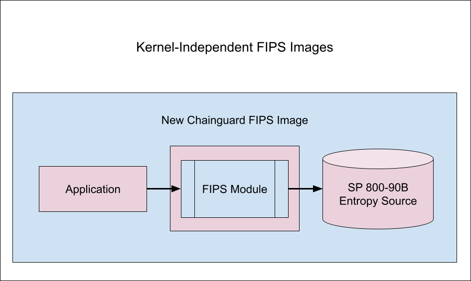

Many frequently asked questions revolve around how organizations are meant to stay on top of the changing landscape for FedRAMP, PMOS, Revisions, and Certificates. This article outlines various considerations and risk factors that organizations should keep in mind when working to become and stay FedRAMP authorized.

## Important Considerations for PMO Revision Trends

There are a number of things one should keep in mind when analyzing revision trends from the FedRAMP Program Management Office (PMO) — which oversees the development of the FedRAMP program — and the changes in [FIPS 140-3](https://csrc.nist.gov/projects/fips-140-3-transition-effort). The following are of particular importance:

* FedRAMP authorization has tended to only include external customer communication under scope. Now, though, the FedRAMP PMO is expecting both external and internal communications in scope.
* Customers will be now be required to provide an authorization boundary diagram with an associated network diagram that shows all FIPS encrypted flows:
    * Anything that isn’t encrypted needs to be explicitly highlighted.
    * Auditors will ask that these diagrams and flows not just show this but, in some cases, to prove this during the audit with observed testing scenarios.
* Notable Revision 5 Changes ([Rev 5 - appendix queue](https://www.fedramp.gov/blog/2023-05-30-rev-5-baselines-have-been-approved-and-released/)):
    * Customers must list every client and server communication in the infrastructure and which FIPS module is being used.
    * DoD Security Technical Implementation Guides (STIGs) can be required, although CIS Level 2 benchmarks are accepted if a STIG does not exist, marking a change from Revision 4 which only required CIS Level 1 benchmarks.
* In order to get FIPS validated, libraries need to be assessed by one of thirteen authorized labs:
    * National Institute of Standards and Technology ([NIST](https://www.nist.gov/)) labs are overwhelmed, as there is a large influx of 140-2 demand but limited supply for approval on certification.

While FIPS 140-3 is not immediately on the horizon for 2025, it will become the law of the land in 2026. As organizations begin analyzing their requirements and architecture constraints this year, it will be crucial to review and plan for the upcoming changes that are outlined in this section.

## Ongoing FIPS Maintenance Risks (and How Chainguard Can Help)

An organization's upfront FIPS configuration is important, but the real difficulties often come later on. While organizations frequently pass an audit with their initial configuration, there is a high level of risk associated with ongoing maintenance. This section highlights some of the risks associated with ongoing FIPS maintenance and how Chainguard can resolve them.

### Initial configuration vs continued maintenance risk

The need to maintain FIPS across updates and versions with the dynamically changing nature of applications built on open source software within containers places a heavy burden on engineers. Likewise, the need to continuously validate cryptographic operations across various base images can pose significant risk to applications breaking or products going down across version updates and new releases. Additionally, certificates often expire and it is difficult to keep track of this at scale and update FIPS modules accordingly, presenting a heavy workload for compliance teams.

Critical vulnerabilities often present themselves in the critical path for the organizations requiring a detailed Plan of Action and Milestones (POAM) and remediation efforts beyond the initial FIPS configuration. With Chainguard, there is a single partner to hold accountable, as we offer enterprise SLAS that can take the place of expensive and costly operations to do this manually. This includes 7 days for Critical, and 14 days for High, Medium, Low. This allows the initial CVE count to remain close to 0 during auditing events, but also accounts for any future CVEs that might show up within the ATO boundary. 

### FIPS expertise and resource challenges

Typically, an organization must oversee several key resources with advanced expertise to manage the ongoing configuration and maintenance of a FIPS or FedRAMP Authorization to Operate (ATO). However, this is not always translated across developers, application owners, and security teams. This problem scales with more images and boundaries under consideration. For a fixed fee per image, Chainguard will solve this problem by being directly responsible for the build and maintenance of all FIPS images in use, leveraging in-house expertise across a broad set of domains

### Quality testing for immediate use of Chainguard-provided FIPS images

One of the hardest things to consider when moving an images program to leverage a CMVP-certified FIPS module is to accommodate all of the differences across programming languages and image types.

To solve this, Chainguard provides not only the initial configuration, but the ongoing quality and functional testing across programming languages and application specific requirements for FIPS, to ensure that organizations only have to worry about running their services on these images. This includes a broad test suite across version updates while balancing the trade-offs between CVE fixes and limiting breaking changes to the running applications. 

### Application-specific open source software

While FIPS modules can be easier to implement within the base layer of an image, application-specific projects within the open source community are entirely maintained by the respective community maintainers and project owners. This means that FIPS considerations vary dramatically across these projects. Building these application images on top of existing FIPS-base images presents significant risk and additional cost associated with ensuring it is compliant through FTE efforts.

Furthermore, many open source projects, such as Cassandra, cannot even support FIPS validation in their current state until they change the architecture and source code to be able to support this. Knowing which projects can support FIPS and which cannot is very useful in analyzing images within scope. Since Chainguard’s catalog consists of 100s of FIPS validated images, we have done the heavy lifting of this analysis, and continue to do so for new requests from our customers.

## Revision 5 Key Requirements Solved with Chainguard Container Images

Using Chainguard Images eliminates the manual toil of container security hassles. Hardened and low CVE Images save you time and money by making sure you always meet the security standards needed for government work.

The following table highlights the features of Chainguard Images as mapped to FedRAMP Revision 5's baselines:

  

Additionally, Chainguard helps support CM-6 configuration settings requirements. Chainguard announced the release of a STIG for the General Purpose Operating System (GPOS) SRG which specifies security requirements for general purpose operating systems running in a network. The goal for this STIG is that it will help customers confidently and securely integrate Chainguard Images into their workflows. Please refer to our [STIGS Overview](https://edu.chainguard.dev/chainguard/chainguard-images/working-with-images/image-stigs/#how-stigs-can-be-used-to-harden-images) for more information.

## Kernel-Independent FIPS Images

Cryptographic protection relies on the secure implementation of a trusted algorithm and a random bit generator that cannot be reasonably predicted at any greater accuracy than random chance. To certify these implementations, NIST operates a cryptographic certification program called the Cryptographic Module Validation Program ([CMVP](https://csrc.nist.gov/projects/cryptographic-module-validation-program)). CMVP validates that implementation is compliant with the relevant standards:
* For algorithm implementation, CMVP requires strict compliance with [FIPS standards](https://csrc.nist.gov/publications/fips). Thus FIPS modules must sit inside a self-verified cryptographic boundary. 
* For random bit generators, CMVP requires strict compliance with [SP 800-90B](https://csrc.nist.gov/pubs/sp/800/90/b/final) recommendations and permits entropy sources to sit either inside or outside the FIPS cryptographic boundary.
Traditionally, to meet these compliance requirements, containers would access an SP 800-90B compliant entropy source provided by a certified kernel, as in this diagram:

  

This architecture drives significant friction for vendors delivering FIPS compliant workloads for  modern cloud-native applications. First, very few versions of the Linux Kernel are certified. Second, Linux Kernel certification timelines are often long and arduous. 
Ultimately, this results in a very limited choice of certified runtimes and compatible underlying hardware for developers to build on. In practice, it means that a certified kernel from a given vendor might be over 5 years old. Outdated kernels typically lack support and optimizations for the latest generation of hardware, and are often incompatible with the latest cloud instance types. It also means when sticking to the same vendor, the application runtimes are equally as out of date and vulnerable.
Chainguard's solution has the FIPS module and the SP 800-90B entropy source co-located in the container image userspace. This eliminates the need for a certified Linux kernel for the majority of workloads and streamlines engineering effort for workload deployments. This is why Chainguard FIPS images now ship with a certified userspace SP 800-90B entropy source, as in this design:

  

This means that the entropy source is now independent of the hardware or cloud environment. Essentially, you can have FIPS on any host OS, kernel, and hardware. You can even have FIPS on managed cloud kubernetes platforms like GKE, EKS, and AKS. Note that this solution has been tested by two NIST labs and [certified with its own CMVP](https://csrc.nist.gov/projects/cryptographic-module-validation-program/entropy-validations/certificate/191).

For more information, please refer to the CVMP entries for Chainguard's FIPS Modules and entropy source:

* OpenSSL FIPS 3.0 Provider Module (CVMP #4856)
* Bouncy Castle FIPS Java API (CMVP #4743 [historical: CMVP #4616])
* Chainguard CPU Time Jitter RNG Entropy Source ([ESV Entropy Certificate #E191](https://csrc.nist.gov/projects/cryptographic-module-validation-program/entropy-validations/certificate/191))

Additionally, check out our blog post on [Kernel-Independent FIPS Images](https://www.chainguard.dev/unchained/kernel-independent-fips-images).

## Conclusion

While FIPS 140-2 has become relatively familiar to organizations, it still presents a set of complex challenges for those trying to achieve FedRAMP authorization. With the broad adoption of open source development on container images across development teams beginning to accelerate, the problem of configuring and maintaining FIPS modules within a broad suite of images becomes nearly intractable. Skill gaps and resource shortages further exacerbate the ability to keep up with this demand; and this problem will only get worse when 140-3 becomes the law of the land in 2026. 

The Rev-5 changes signal a continued trend in the market: as PMOs get better at understanding the state of modernized applications running on containers, and how the architectures interact with the services running, requirements are only becoming more granular.  As a result, further documentation and proof will be required by organizations who are seeking to implement FIPS within their container environments. This puts pressure on organizations to fill skill gaps, increase the spend going towards FedRAMP programs, and de-risk ongoing assessments to maintain compliance. 

Chainguard offers an off-the-shelf solution for customers to run their applications on preconfigured and continuously maintained FIPS validated images so that they do not have to incur these costs or associated risks. As a result, Chainguard has helped customers achieve Moderate and High impact levels with very low engineering lift. With this comes the peace of mind knowing that you have a single partner responsible for building and supplying the key images needed to be successful in FedRAMP endeavours. 