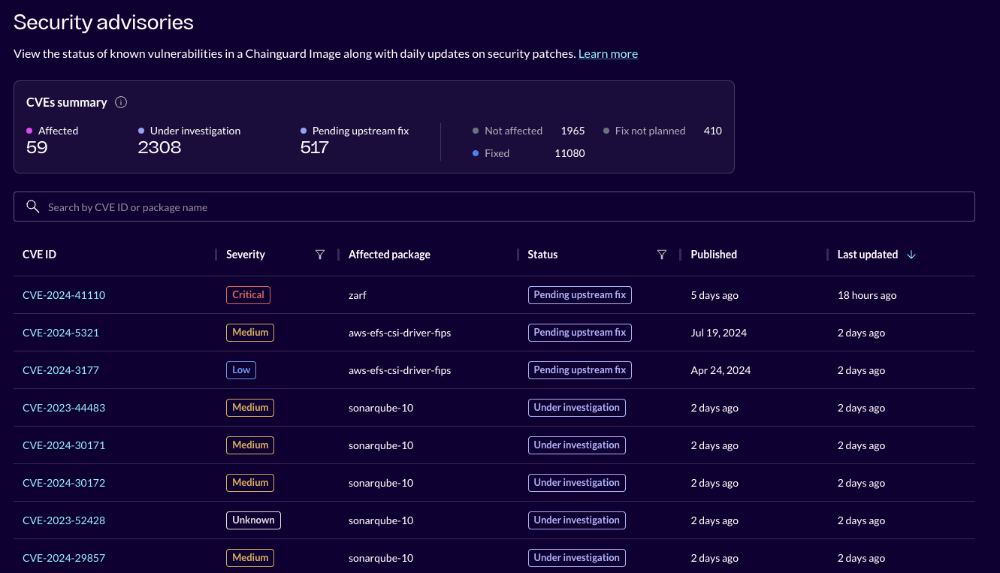
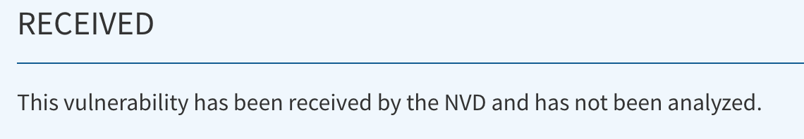

When you scan a newly-built Chainguard Image with a vulnerability scanner, typically, no CVEs will be reported. However, as software packages age, more vulnerabilities are reported and CVEs will begin to accumulate in images. When this happens, Chainguard releases security advisories to communicate these vulnerabilities to downstream Images users.

Chainguard publishes its security advisories to a dedicated [Security Advisories page](https://images.chainguard.dev/security/?utm_source=cg-academy&utm_medium=website&utm_campaign=dev-enablement&utm_content=edu-content-chainguard-chainguard-images-working-with-images-security-advisories-how-chainguard-issues) on its Images Directory. There, you can find a complete listing of CVEs found in various Chainguard Images, including their CVE ID, affected packages, and vulnerability status. Each advisory is built from the metadata associated with a security vulnerability.

You can also find consumable Alpine-style `secdb` security advisory feeds at the following URLs:

- [Wolfi OS](https://github.com/wolfi-dev/os) feed: [packages.wolfi.dev/os/security.json](https://packages.wolfi.dev/os/security.json)
- Chainguard Enterprise feed: [packages.cgr.dev/chainguard/security.json](https://packages.cgr.dev/chainguard/security.json)

You can find more information regarding these security feeds at our [foundational concepts overview page](https://github.com/chainguard-dev/vulnerability-scanner-support/blob/main/docs/foundational_concepts.md) in our [vulnerability scanner support](https://github.com/chainguard-dev/vulnerability-scanner-support/tree/main) GitHub repository.

If you’re wondering how these security advisories are made, you’re in the right place! In this article, we will walk through the life of a security advisory, starting from a CVE’s disclosure, all the way to its remediation. We’ll also explore what happens after an advisory is released and how its record may be updated over time.

## Stages of a Security Advisory

### Stage 1: A CVE is Disclosed

All security advisories begin with the disclosure of a security vulnerability. The [CVE Project](https://www.cve.org/) coordinates the processing of reported vulnerabilities through a network of CVE Numbering Authorities (CNAs). CNAs assign CVE IDs to new entries, and they are then added to a CVE Catalog. Each catalog entry contains information such as what packages or components are affected by the vulnerability, their versions, and remediation procedures, if applicable.

### Stage 2: Scanners Detect the CVE

The [National Vulnerability Database (NVD)](https://nvd.nist.gov/), the U.S. government vulnerability repository, will pick up these CVE records and review them further. During this secondary review process, the CVE entry is enriched with details that scanners later use to identify affected software. This process can take some time, so there will be issued CVEs that have not yet been analyzed by the NVD. These CVEs pending review will be marked as such by the NVD, as shown in the following image.

In addition to the NVD, vulnerability scanners also reference other databases such as the [GitHub Advisory Database](https://github.com/advisories) (GHSA) and the [Go Vulnerability Database](https://vuln.go.dev/).

### Stage 3: Advisory is Issued

Once a CVE has been reviewed by the NVD, it will be picked up by vulnerability scanners and reported in any affected container images. Chainguard uses [Grype](https://github.com/anchore/grype), an open-source vulnerability scanner from Anchore, as its primary tool for vulnerability detection.

The newly detected CVE is then moved into the next phase where it waits for a team member to assess it. A security advisory will be issued with the status of "Under Investigation" to alert downstream users that Chainguard is aware of its presence. Security advisories are issued per package, as one CVE may impact different packages in different ways. From there, this security advisory will be updated over time.

### Stage 4: Advisory is Updated

With an advisory issued for the package, further investigation is often needed to determine the impact of the CVE. In some cases, it will be determined that the CVE is not truly present in the package, therefore making it a [false positive](/chainguard/chainguard-images/recommended-practices/false-results/). The associated security advisory would have its status updated to "Not Affected", and further updates to the advisory would not occur.

If the vulnerability is a true positive finding, then it is present in the package and further action must be taken. When an  upstream fix is available, such as a newer package version which remediates the CVE, then this update will be made and the advisory modified to state the vulnerability is now "Fixed".

Chainguard may even proactively bump a vulnerable dependency to its newer, patched version before upstream projects have done so themselves. Or, patches issued outside of the upstream repository may be applied to remediate the vulnerability when a new package version is not yet available. Note that an end user would need to pull the new version of the container image with the updated fix for the CVE as older versions of the image would still be vulnerable.

In some cases, a fix for the CVE may not yet be available. A package will be marked as having the "Pending upstream fix" status in this situation. Once an upstream fix is released, then it will be applied to the package and the advisory status updated to "Fixed".

Sometimes, a vulnerability may be present in a piece of software, but remediation is not planned. This could be because the package is no longer supported, such as in the case of an outdated package version or because the software is reaching the end of its life. If this is the case, then the security advisory status will be marked as "Fix not planned".

Rarely, a vulnerability is found in a package but there is no current status update on whether it can be remediated, or if plans exist to remediate it. In these few situations, the package is simply marked as being "Affected" by the vulnerability. This status is likely to be updated soon as the next steps towards remediation are established.

### Summary of Advisory Statuses
<table>
<thead>
<th>Status</th>
<th>Description</th>
<th>Metadata</th>
</thead>
<tr>
<td>Under investigation</td>
<td>A vulnerability has been detected for the package and is awaiting further investigation to determine its impact.</td>
<td>detection</td>
</tr>
<tr>
<td>Affected</td>
<td>A vulnerability finding has been determined to be present and affect the package.</td>
<td>true-positive-determination</td>
</tr>
<tr>
<td>Not affected</td>
<td>The vulnerability was determined to not impact the package, making it a false positive finding.</td>
<td>false-positive-determination</td>
</tr>
<tr>
<td>Pending upstream fix</td>
<td>Remediating the vulnerability is not possible until an upstream fix is made available.</td>
<td>pending-upstream-fix</td>
</tr>
<tr>
<td>Fixed</td>
<td>A patch has been applied to the affected package and the vulnerability is no longer present.</td>
<td>fixed</td>
</tr>
<tr>
<td>Fix not planned</td>
<td>There are no plans to address the vulnerability in the package at this time.</td>
<td>fix-not-planned</td>
</tr>
</table>

## Further Reading

Chainguard’s Security Advisory feed is a helpful tool to have at hand when scanning your containers for the presence of vulnerabilities. Though you won’t need it often thanks to the low CVE counts of our Images, it is a useful reference when working with your scans, giving you insight into how you can approach and fix any vulnerabilities which pop up.

For more information on how to use Chainguard’s Security Advisories page to inform your vulnerability remediation, consider reading our article on [How to Use Chainguard Security Advisories](
/chainguard/chainguard-images/staying-secure/security-advisories/how-to-use/).

If you are using Chainguard Images at your organization or want to learn more about advisories for enterprise Images, please [contact us!](https://www.chainguard.dev/contact)
