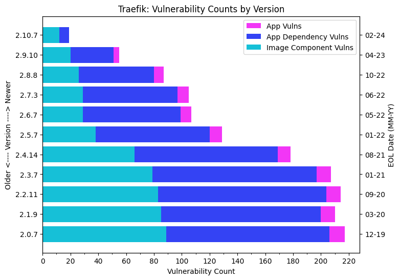

Typically, specific versions of software receive updates on a schedule for a set amount of time. Eventually, though, every version of software will stop receiving support. When project maintainers stop providing updates, it's known as the *End-of-Life* (EOL) stage.

Because it's no longer being actively maintained, software begins to collect vulnerabilities when it reaches EOL. This problem can become compounded when using container images, as they often come with extra components from underlying base images which are all prone to accruing vulnerabilities. This can lead to images with hundreds of components, each collecting vulnerabilities and forming part of the attack surface.

This conceptual article highlights the risk involved with using end-of-life software by outlining how EOL images accrue vulnerabilities and where they accumulate.

## Findings

Chainguard's internal research team came to the following conclusions after scanning a set of official Docker images that had reached EOL:

- **Takeaway 1**: The longer a project has been EOL, the more vulnerabilities that image will have. On average, an EOL image will accumulate 218 vulnerabilities every six months.
- **Takeaway 2**: 98.4% of these vulnerabilities accumulate within a given image's components, 1.4% in the application dependencies, and only 0.2% of vulnerability accumulation every six months are directly within the application.

With these takeaways in mind, it's clear that images with EOL software can quickly develop serious security risks. Not only does the target application accumulate vulnerabilities, but so do the dependencies and additional image components, and at a much faster pace.

When a vulnerability appears directly in the source code of the application, that application isn’t going to receive a patch from upstream. This means you'll be forced to update the software or even move on from EOL projects or risk compromising your application's security.

## Vulnerability accumulation in EOL images

To perform this analysis, Chainguard's researchers reviewed a set of software projects listed on [endoflife.date](https://endoflife.date/), a website that keeps track of when products are no longer supported. We matched these projects directly with their official Docker Hub images, finding 38 projects across 237 EOL version releases from 2020–2024. This included popular images such as Traefik, nginx, Rust, and Python. Each version is the last within the project lifecycle right before the EOL date, representing the final updates to the project before it goes EOL. We then used [Grype](https://github.com/anchore/grype) to scan each release to determine where vulnerabilities are appearing in the projects.

When scanning an image for vulnerabilities, our researchers would classify a vulnerability as being in one of three locations:

- **Application:** The core software intended for execution, fulfilling the container's primary purpose. Think of images such as Traefik, Consul, or nginx.
- **Application dependencies:** Software or libraries the application requires to function and are dependent on the core application source code. For example, Traefik [depends on a TOML parser for Golang](https://github.com/traefik/traefik/blob/master/go.mod#L6C2-L6C28).
- **Image components:** Additional packages or libraries included within the image, often influenced by the base image. For example, Traefik uses the base Alpine image and thus includes many of its packages.

Within this dataset, the support lifespan for these projects was almost two years, with the median support duration being one year. By aggregating vulnerability counts in six-month intervals based on the EOL date, we calculated the average number of vulnerabilities per project. We noted these versions as the last version prior to the EOL date, representing the final updates for that project lifecycle.

The number of vulnerabilities between older EOL versions and recent EOL versions drastically differ, as shown in the following diagram. For example, the average number of vulnerabilities of an image that went EOL in early 2020 contained 2,065 by 2024, compared to images that reached EOL in 2024 containing 323 vulnerabilities. On average, this equates to an accumulation rate of 218 vulnerabilities every six months in EOL images.

 

## Where are the vulnerabilities?

| Time since EOL | Application Vulns | Application Dependency Vulns | Image Component Vulns |
|:----------|---------:|----------:|----------:|
| 0-6 months | <1 CVE | 3 CVEs | 351 CVEs |
| 6-12 months | 1 CVE | 11 CVEs | 542 CVEs |
| 12+ months | 3 CVEs | 33 CVEs | 1,601 CVEs |

### Application vulnerabilities

Less than 1% of vulnerability accumulation occurs directly in an image's application, and we found that only 14% of versions that contained a vulnerability included a vulnerability directly within the application in the first six months post-EOL.

Project maintainers won't patch these CVEs, and updating to a newer version or patching it yourself in the source code are the only options for addressing these vulnerabilities.

### Dependency vulnerabilities

In the first six months after an image reaches the EOL stage, 40% of versions contain a vulnerability in the application dependencies. The following table outlines how many vulnerabilities, on average, a dependency will accumulate over time:

| Time span | Number of CVEs |
|----------|----------|
| 0-6 months | 3 |
| 6-12 months | 11 |
| 12+ months | 32 |

Fixing these would involve upgrading dependencies and rebuilding the target application, a difficult and labor-intensive task.

### Image component vulnerabilities

As mentioned previously, more than 98% of vulnerability accumulation occurs within the components of the image:

| Time span | Number of CVEs |
|----------|----------|
| 0-6 months | 340 |
| 6-12 months | 501 |
| 12+ months | 1,552 |

Ninety-seven percent of these vulnerabilities are within Debian packages. Per [this blog post](https://www.chainguard.dev/unchained/the-zero-cve-challenge-can-official-docker-hub-images-pass-the-test?utm_source=docs) many of these vulnerabilities are found in the latest stable versions of these Debian packages, meaning that you can't make them go away with just an `apt upgrade`.

## A deeper look at Traefik

 

When scanning the official [Alpine-based image for Traefik](https://github.com/traefik/traefik-library-image/tree/master/tmpl/alpine) with Grype, Chainguard's researchers found that the image versions generally accumulated fewer vulnerabilities than typical, with an average of 25 vulnerabilities identified every six months, as shown in the previous table.

Take version 2.9 of Traefik as an example. It was released on October 3, 2022, with security support provided until April 24, 2023, which is roughly six months. The final update for this version, 2.9.10, was made available on April 6, 2023, just three weeks before the end of its support lifecycle.

Following the release of version 2.9.10, 55 vulnerabilities were reported: four within Traefik itself, 31 associated with its application dependencies, and 20 related to the Docker image components. Below are example CVEs within the various locations of 2.9.10 of the official Traefik Docker image.

### Example CVE within Traefik

- ‍[CVE-2023-47633](https://github.com/advisories/GHSA-6fwg-jrfw-ff7p): Traefik docker container using 100% CPU. This issue was addressed in versions 2.10.6 and 3.0.0-beta5. There are no known workarounds for this vulnerability; your only option is to upgrade.

### Example CVE within a dependency (Docker) of Traefik

- ‍[CVE-2023-28840](https://github.com/advisories/GHSA-232p-vwff-86mp): Docker Swarm encrypted overlay network may be unauthenticated. The affected project is `github.com/docker/docker`, a [dependency](https://github.com/traefik/traefik/blob/v2.10/go.mod#L18) of Traefik. We [fixed this vulnerability](https://github.com/wolfi-dev/os/pull/1779/commits/024b165f14ddad03290ef504c3c46730e596668c) in the Chainguard Image of the Traefik 2.10 cycle.

### Example CVE within an image component of Traefik

- ‍[CVE-2023-5363](https://nvd.nist.gov/vuln/detail/CVE-2023-5363): An out-of-bounds write within OpenSSL, a dependency of the base image [Alpine 3.17](https://github.com/traefik/traefik-library-image/blob/v2.9.10/alpine/Dockerfile#L1) used by Traefik (impacts `libcrypto3` and `libssl3`). The Chainguard Image of Trafeik uses the [wolfi-base image](https://github.com/chainguard-images/images/tree/main/images/wolfi-base), which runs the updated versions of libcrypto3 and libssl3.

## Learn More

End-of-life software represents a significant security risk. This issue becomes particularly critical when vulnerabilities are found directly in the target application of the image.

The only option when that occurs is to update. However, the vast majority of vulnerabilities that appear in an EOL image will come from its additional components, meaning that updating just the application software may not significantly reduce the overall number of vulnerabilities. Thus the best option is to have a plan to keep your software updated to the latest versions promptly. 

To learn more about keeping container images up to date, we encourage you to check out our article on [Considerations for Keeping Images Up to Date](/chainguard/chainguard-images/recommended-practices/considerations-for-image-updates/) as well as our overview of [Strategies and Tooling for Updating Container Images](/chainguard/chainguard-images/recommended-practices/strategies-tools-updating-images/).

