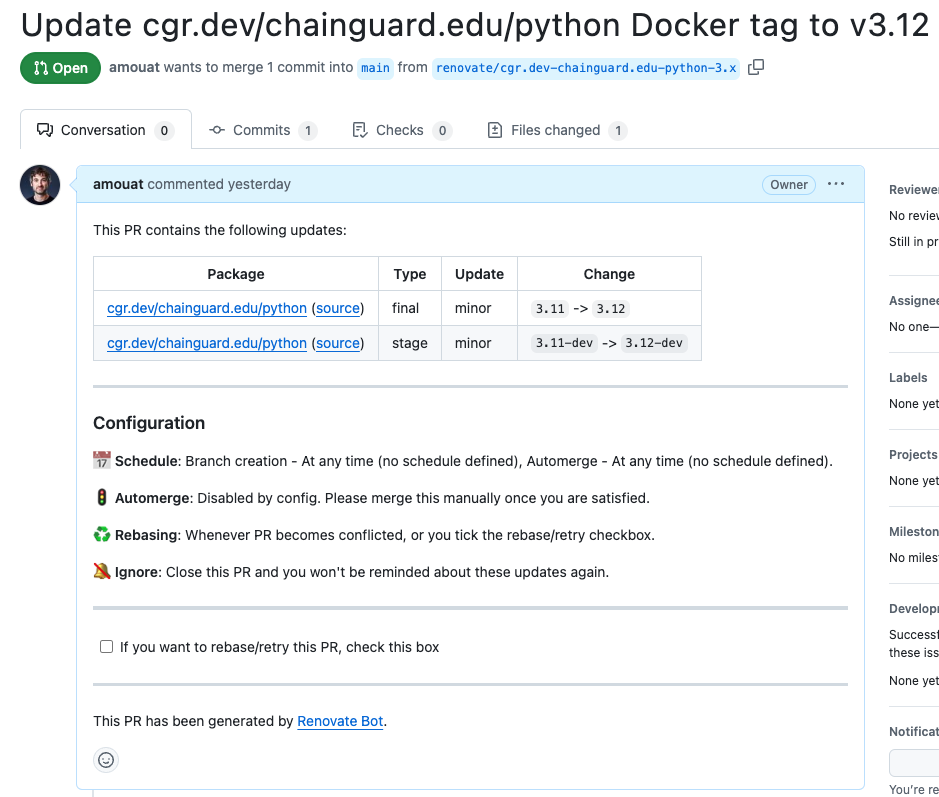
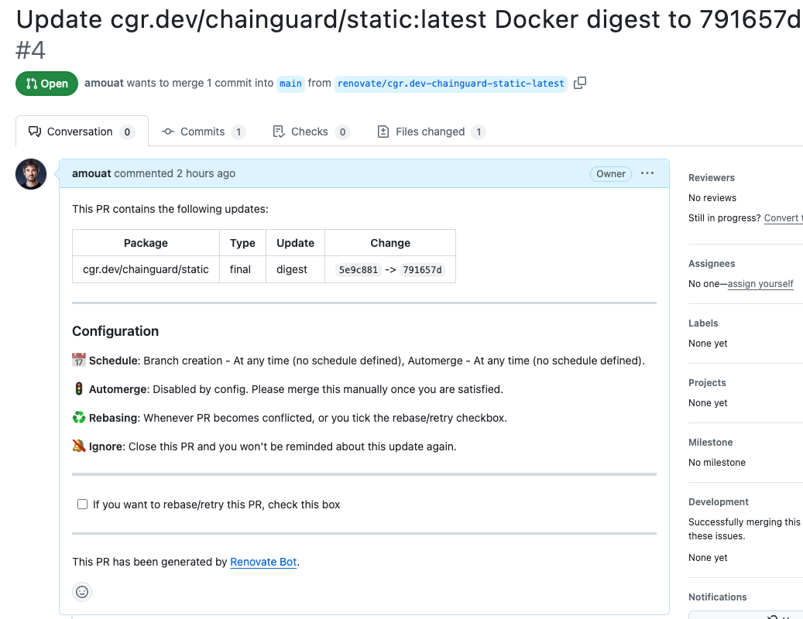

[Renovate](https://github.com/renovatebot/renovate) can be used to alert on updates to Chainguard Containers. This can be an effective way to keep your images up-to-date and CVE free. This article will explain how to configure Renovate to support Chainguard Containers.

> **NOTE*: This article describes using Renovate to alert on new versions of Chainguard Containers. It is not about alerts for Wolfi packages (which is unsupported at the time of writing).


## Prerequisites

This guide assumes you have successfully installed and configured Renovate. If you haven't already set this up, please refer to the [installation instructions](https://docs.renovatebot.com/getting-started/installing-onboarding/).


## Setting up Credentials for Renovate

In order to support versioned images from a private repository, you will need to provide Renovate with credentials to access the Chainguard registry at `cgr.dev`. You can do this by creating a token with `chainctl`, as in this example:

```shell
chainctl auth configure-docker --pull-token
```

This will respond with output such as:

```shell
To use this pull token in another environment, run this command:

    docker login "cgr.dev" --username "<USERNAME>" --password "<PASSWORD>"
```

By default, this credential is good for 30 days.

You can now configure `hostRules` in Renovate to support our registry. Depending on how Renovate was set up, you can add this to `renovate.json` or `config.json` with a setting such as:

```json
{
...
   "hostRules": [
    {
      "hostType": "docker",
      "matchHost": "cgr.dev",
      "username": "<USERNAME>",
      "password": "<PASSWORD>"
     }]
}
```

Be aware that you **SHOULD NOT** check this file into source control with the exposed secret. Instead, you can use environment variables which you pass in at runtime if you use a `config.js` file:

```json
module.exports = {
...
   "hostRules": [
    {
      "hostType": "docker",
      "matchHost": "cgr.dev",
      "username": process.env.CGR_USERNAME,
      "password": process.env.CGR_PASSWORD,
     }]
};
```

But an even more secure solution would be to create a script which automatically updates the configuration with the correct values by calling `chainctl`. If you do this, you should also set the credential lifetime to a much shorter period with the `–ttl` flag:

```shell
chainctl auth configure-docker --pull-token –ttl 10m
```

This will set the lifetime to 10 minutes, which limits the risk posed if the token should leak. You can also set the lifetime to a longer period for more manual configurations.


## Updating Versioned Container Images

By default, Renovate will now open PRs for any out-of-date versions of images it finds. For example, you can run Renovate by pushing the following Dockerfile to a repository overseen by Renovate:

```
FROM cgr.dev/chainguard.edu/python:3.11-dev AS builder
...

FROM cgr.dev/chainguard.edu/python:3.11
...
```

At the time of writing, version 3.12 was the current version of the Python image, so the following PR was opened by Renovate:



Not all images use semantic versioning. Refer to the [Renovate documentation](https://docs.renovatebot.com/) for details on how to support different schemes.

Ideally, image references should also be pinned to a digest, as shown in the following section.

## Updating `:latest` Container Images

Renovate also supports updating image references that are pinned to digests. This allows you to keep floating tags such as `:latest` in sync with the most up-to-date version.

As an example, for the following Dockerfile Renovate opened two similar pull requests:

```
FROM cgr.dev/chainguard/go:latest-dev@sha256:ff187ecd4bb5b45b65d680550eed302545e69ec4ed45f276f385e1b4ff0c6231 AS builder

WORKDIR /work

COPY go.mod /work/
COPY cmd /work/cmd
COPY internal /work/internal

RUN CGO_ENABLED=0 go build -o hello ./cmd/server

FROM cgr.dev/chainguard/static:latest@sha256:5e9c88174a28c259c349f308dd661a6ec61ed5f8c72ecfaefb46cceb811b55a1
COPY --from=builder /work/hello /hello

ENTRYPOINT ["/hello"]
```

The following screenshot shows the PR to update the static image:



## Pinning Digests

The `pinDigests` option configures Renovate to add digests to image references
that don't contain them.

Here is an example `renovate.json` that sets this.

```json
{
  "$schema": "https://docs.renovatebot.com/renovate-schema.json",
  "extends": [
    "config:recommended"
  ],
  "packageRules": [
    {
      "matchDatasources": ["docker"],
      "pinDigests": true
    }
  ]
}
```

This configures Renovate to open PRs that will pin a reference like
`cgr.dev/chainguard/python:3.12` to a digest like
`cgr.dev/chainguard/python:3.12@sha256:e3b524a97c37c32ba590aae0ebcebe3a983c1f69a5093b670fdba980f97a09b3`.

## Disabling Non-Digest Updates

You can use the `matchUpdateTypes` option to disable updates for any update
types other than `digest`.

Here is an example `renovate.json` that does this.

```json
{
  "$schema": "https://docs.renovatebot.com/renovate-schema.json",
  "extends": [
    "config:recommended"
  ],
  "packageRules": [
    {
      "matchDatasources": ["docker"],
      "matchUpdateTypes": [
        "major",
        "minor",
        "patch"
      ],
      "enabled": false
    }
  ]
}
```

This will configure Renovate to update the digest for a reference like
`cgr.dev/chainguard/python:3.12@sha256:e3b524a97c37c32ba590aae0ebcebe3a983c1f69a5093b670fdba980f97a09b3`
but not the tag.

The benefit of this approach is that it allows you to define your update
strategy for each image reference by the use of a mutable tag, rather than having
separate rules for different images in your Renovate configuration. Similar to
Chainguard's [Digestabot](https://github.com/chainguard-dev/digestabot)
Github Action.

## Running Renovate in Github Actions

You can use
[`renovatebot/github-action`](https://github.com/renovatebot/github-action) to
run Renovate from a GitHub Actions workflow. This can be combined with an
[assumable identity](/chainguard/administration/assumable-ids/assumable-ids/) to
authenticate to `cgr.dev` and update references to Chainguard images in your
repository.

To follow these steps, you must have:
- `chainctl` — the Chainguard command line interface tool — installed on your
  local machine. Follow our guide on [How to Install `chainctl`](/chainguard/chainctl-usage/how-to-install-chainctl/)
  to set this up.
- Access to an account with permissions to create identities in your Chainguard
  organization. For instance, the `owner` role.

First, create a `renovate.json` file at the root of your GitHub repository.
Refer to the [official documentation](https://docs.renovatebot.com/configuration-options/)
for all the supported options.

This is an example of the most minimal configuration:

```json
{
  "$schema": "https://docs.renovatebot.com/renovate-schema.json"
}
```

Push this file to the `main` branch.

Next, create an assumable identity for your GitHub repository.

```shell
chainctl iam identities create github <identity-name> \
  --github-repo=<github-org>/<github-repo-name> \
  --github-ref=refs/heads/main \
  --role=registry.pull
```

Then, create `.github/workflows/renovate.yaml` with this
content. Replace `<identity-id>` with the ID returned by the previous command.

```yaml
name: Renovate

on:
  workflow_dispatch:
  schedule:
    - cron: "0 3 * * *"

permissions:
  contents: read

jobs:
  renovate:
    name: Renovate
    runs-on: ubuntu-latest

    permissions:
      contents: write
      pull-requests: write
      issues: write
      id-token: write

    steps:
    # Install chainctl and log in as the assumed identity
    - uses: chainguard-dev/setup-chainctl@be0acd273acf04bfdf91f51198327e719f6af978 # v0.4.0
      with:
        identity: "<identity-id>"

    # Export a short lived token for cgr.dev as RENOVATE_DOCKER_CGR_DEV_PASSWORD
    - shell: bash
      run: |
        RENOVATE_DOCKER_CGR_DEV_PASSWORD=$(chainctl auth token --audience=cgr.dev)
        echo "::add-mask::$RENOVATE_DOCKER_CGR_DEV_PASSWORD"
        echo "RENOVATE_DOCKER_CGR_DEV_PASSWORD=$RENOVATE_DOCKER_CGR_DEV_PASSWORD" >> $GITHUB_ENV

    # Run renovate with RENOVATE_DETECT_HOST_RULES_FROM_ENV=true so that it will
    # use the password exported by the previous step
    - name: Run Renovate
      uses: renovatebot/github-action@6927a58a017ee9ac468a34a5b0d2a9a9bd45cac3 # v43.0.11
      env:
        RENOVATE_TOKEN: ${{ secrets.GITHUB_TOKEN }}
        RENOVATE_REPOSITORIES: ${{ github.repository }}
        RENOVATE_DETECT_HOST_RULES_FROM_ENV: "true"
        RENOVATE_DOCKER_CGR_DEV_USERNAME: "_token"
```

Push this file to the `main` branch.

This workflow is scheduled to run every morning at 3 AM. You can trigger it
manually by navigating to **Actions > Renovate** and selecting **Run workflow**.

Once the workflow has ran successfully, you should see pull requests in your
repository for any image references that need to be updated.

## Running Renovate with Docker

Chainguard provide [an image for
Renovate](https://images.chainguard.dev/directory/image/renovate/overview). This
is an example of how you can run this image to keep references to Chainguard
images up to date in a GitHub repository.

To follow these steps, you must have:
- `chainctl` — the Chainguard command line interface tool — installed on your
  local machine. Follow our guide on [How to Install `chainctl`](/chainguard/chainctl-usage/how-to-install-chainctl/)
  to set this up.
- Access to an account with permissions to pull Chainguard container images
  from your organization’s repository within the Chainguard registry.
- The `renovate` image present in your Chainguard registry.

Firstly, if you don't already have one, generate a Personal Access Token for
your GitHub user as described in Renovate's [official
documentation](https://docs.renovatebot.com/modules/platform/github/#authentication).

Export the token as `RENOVATE_TOKEN` for use in subsequent steps.

```shell
export RENOVATE_TOKEN=ghp_XXXXXXXXXXXXXXXXXX
```

Next, create a `renovate.json` file at the root of any GitHub repositories you
want to target with Renovate. Refer to the [official documentation](https://docs.renovatebot.com/configuration-options/)
for all the supported options.

This is an example of the most minimal configuration:

```json
{
  "$schema": "https://docs.renovatebot.com/renovate-schema.json"
}
```

Then, login with `chainctl`.

```shell
chainctl auth login
```

Finally, run Renovate. Substitute `<org-name>` with the name of your Chainguard
organization and provide any GitHub repositories that you want to target as
arguments in the form `<github-org>/<github-repo-name>`.

```shell
docker run \
  -it \
  --rm \
  -e RENOVATE_TOKEN="${RENOVATE_TOKEN}" \
  -e RENOVATE_DETECT_HOST_RULES_FROM_ENV=true \
  -e RENOVATE_DOCKER_CGR_DEV_USERNAME=_token \
  -e RENOVATE_DOCKER_CGR_DEV_PASSWORD=$(chainctl auth token --audience cgr.dev) \
  cgr.dev/<org-name>/renovate \
  <github-org>/<github-repo-name>
```

This example passes a short-lived token for `cgr.dev` via the
`RENOVATE_DOCKER_CGR_DEV_PASSWORD` environment variable.

## Troubleshooting

### Validate Renovate configuration

If Renovate isn't working as expected, try running it in debug mode and/or dumping the resolved configuration.

For example:
```
LOG_LEVEL=debug renovate --print-config
...
       "hostRules": [
         {
           "hostType": "docker",
           "matchHost": "cgr.dev",
           "username": "<Organizations ID>/<pull token ID>",
           "password": "***********",
           "resolvedHost": "cgr.dev"
         },
         {"matchHost": null, "hostType": "local"}
       ]
...
DEBUG: hostRules: basic auth for https://cgr.dev (repository=local)
DEBUG: getLabels(https://cgr.dev, ORGANIZATION/static, latest) (repository=local)
DEBUG: getManifestResponse(https://cgr.dev, ORGANIZATION/static, latest, get) (repository=local)
DEBUG: getManifestResponse(https://cgr.dev, ORGANIZATION/static, sha256:76d71eb53b1b44ec955529ece91c6da222a54fed660ca6b25124935bdd96e133, get) (repository=local)
DEBUG: found labels in manifest (repository=local)
       "labels": {
         "dev.chainguard.package.main": "static",
         "org.opencontainers.image.authors": "Chainguard Team https://www.chainguard.dev/",
         "org.opencontainers.image.created": "2024-12-04T19:55:37Z",
         "org.opencontainers.image.source": "https://github.com/chainguard-images/images-private/tree/main/images/static",
         "org.opencontainers.image.url": "https://images.chainguard.dev/directory/image/static/overview?utm_source=cg-academy&utm_medium=referral&utm_campaign=dev-enablement&utm_content=edu-content-chainguard-chainguard-images-working-with-images-renovate",
         "org.opencontainers.image.vendor": "Chainguard"
       }
```

### Connection Errors

If you have problems getting Renovate to monitor `cgr.dev`, please double check the connection details. Make sure the token is still valid (you can verify with `chainctl iam identities list`) and it has access to the repository you are referring to. You can test these credentials by running a `docker login` and `docker pull` in a clean environment.

### getReleaseList error

You may encounter errors such as the following:

```
DEBUG: getReleaseList error (repository=chainguard-images/images-private, branch=renovate/cgr.dev-chainguard.edu-python-3.x)
       "type": "github",
       "apiBaseUrl": "https://api.github.com/",
       "err": {
         "message": "`chainguard-images` forbids access via a personal access token (classic). Please use a GitHub App, OAuth App, or a personal access token with fine-grained permissions.",
         "stack": "Error: `chainguard-images` forbids access via a personal access token (classic). Please use a GitHub App, OAuth App, or a personal access token with fine-grained permissions.\n    at
…
```

These can be safely ignored. They are caused by Renovate using the `org.opencontainers.image.source` label on our images to look for a changelog. As this source is set to the private `images-private` GitHub repository, this request fails.
